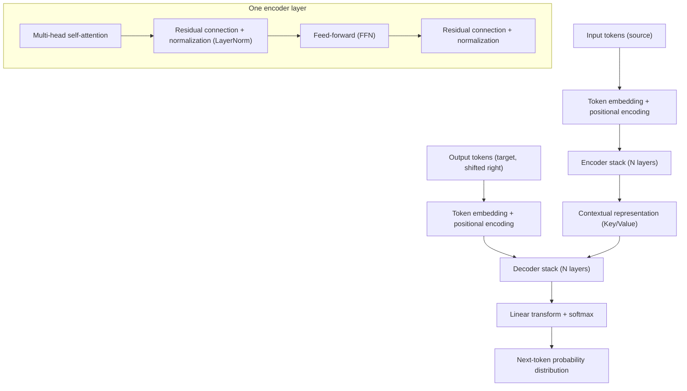
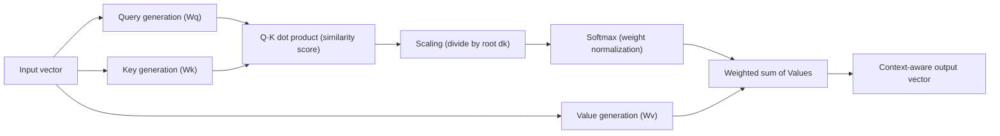

# Transformer and the Attention Mechanism

## 1. Overview

> **Definition**: The Transformer is a deep learning architecture that computes the relationships among all tokens in an input sequence in parallel using only **Attention** operations, without recurrent (RNN) or convolutional (CNN) structures; since it was proposed in Google's 2017 paper "Attention Is All You Need," it has become the de facto standard structure of modern large-scale AI models spanning natural language processing, vision, and speech.

The background to the Transformer's emergence lies in two structural limitations of existing recurrent neural networks (RNN, LSTM).
The first is **the impossibility of parallelization due to sequential processing**.
Because an RNN needs the state at t-1 before it can compute the hidden state at time t, it has no choice but to compute sequentially in proportion to sequence length; this fails to exploit the massive parallel computing capability of GPUs and bottlenecked large-scale training.
The second is **the loss of long-range dependencies**.
For information from the beginning of a sentence to reach the end, it must flow through many time steps carried in the hidden state, and in the process vanishing gradients occur, blurring the relationships between distant words.

The Transformer solves both problems simultaneously with a single principle: attention.
Because attention lets each token look at **all** tokens of the sequence at once and directly compute relevance (weights), sequential dependence disappears, enabling fully parallel processing, and no matter how far apart two tokens are, the path length stays constant (O(1)), so long-range relationships are reflected without loss.
Thanks to this parallelism and scalability, the Transformer realized the **scaling law**, whereby performance improves predictably as data and parameters grow, and became the common foundation of large language models (LLMs) such as GPT, BERT, and T5.
In an answer, it is appropriate to describe the Transformer not as merely one neural network but as a **paradigm shift** that simultaneously achieved three values: "parallelism, long-range dependency, and scalability."

## 2. Overall Transformer Architecture

The Transformer's basic form is an encoder-decoder structure that stacks N (six in the original paper) **Encoders** that understand the input and N **Decoders** that generate the output.
The concept diagram below shows the overall skeleton in which input tokens pass through embedding and positional encoding, then through the encoder and decoder stacks, and are converted into a final probability distribution.

In the **embedding and positional encoding** stage, each token is converted into a real-valued vector of fixed dimension (e.g., 512 dimensions).
However, attention is a set operation and does not by itself know the order of tokens, so "which position it is" must be added to the vector.
The original paper used **sinusoidal positional encoding**, which encodes position with sine and cosine functions of different frequencies; later, learned positional embeddings and RoPE (rotary positional encoding) and ALiBi, which reflect relative position, emerged and are widely used for long-context processing.
Without positional information, "the dog bit the man" and "the man bit the dog" cannot be distinguished, so positional encoding is essential in languages where order determines meaning.

The **Encoder** has two pillars, self-attention and a feed-forward neural network, and applies a **residual connection** and **layer normalization (LayerNorm)** to each sublayer.
The residual connection adds the input directly to the output so that gradients propagate to deep layers without vanishing, and layer normalization stabilizes the input distribution of each layer to smooth training.
Without these two devices, training a deep Transformer stacked dozens of layers high would be practically impossible.

## 3. Principle of the Attention Mechanism

The heart of the Transformer is attention, and its core operation is **Scaled Dot-Product Attention**.
The diagram below expresses as a process how one token creates a Query, measures its similarity with the Keys of all other tokens, and takes a weighted sum of the Values using those weights.

### A. Intuition of Query, Key, and Value

Attention is easy to understand by analogy with information retrieval.
**Query** means "the information I am looking for now," **Key** means "an index of the information each token can provide," and **Value** means "the actual content."
Taking the dot product of one token's Query with the Keys of all other tokens yields relevance scores; these scores are normalized with softmax into weights between 0 and 1, and the Values are then summed with those weights.
As a result, each token's output vector contains much of the information from tokens highly related to it.
For example, in "The animal didn't cross the street because it was too tired," the Query of "it" has high similarity with the Key of "animal," so the model resolves by itself, from context, what "it" refers to.

### B. Scaling and Softmax

The reason the dot-product scores are divided by the square root of the key dimension (√dk) rather than fed directly into softmax is numerical stability.
As the dimension grows, the variance of the dot products increases, causing softmax to concentrate extremely on specific tokens; in that region gradients approach zero and training stalls.
Dividing by √dk flattens the score distribution so attention can be distributed evenly across multiple tokens, and gradients are stabilized as well.
The fact that a single small scaling constant determines the convergence of deep learning shows the precision of the Transformer's design.

### C. Multi-Head Attention

Whereas single attention captures only one kind of relationship, **multi-head attention** splits Q, K, and V into several (eight in the original paper) low-dimensional subspaces, performs attention in parallel, and then concatenates the results.
Each head differentiates to learn **relationships from different perspectives**, such as grammatical relations, coreference resolution, and semantic similarity.
This can be likened to several experts simultaneously interpreting one sentence from different perspectives (syntax, semantics, co-occurrence) and synthesizing the results, and it greatly increases expressive power.
The table below is supplementary material summarizing the uses of the three kinds of attention.

| Category | Location | Query Source | Key/Value Source | Role |
|------|------|-----------|----------------|------|
| Encoder self-attention | Encoder | Input | Input | Captures mutual relationships within the source context |
| Masked self-attention | Decoder | Output (generated part) | Output | Blocks future tokens, autoregressive generation |
| Encoder-decoder attention | Decoder | Output | Encoder representation | Aligns source and target (translation correspondence) |

### D. Masking and Autoregressive Generation

The decoder's self-attention applies **masking** so that each position cannot see tokens after it (the future).
At generation time the later words do not yet exist, so referring to the future during training would be cheating and would be inconsistent with actual inference.
The scores of masked positions are set to negative infinity so that their weights become 0 after softmax; through this the decoder operates in an **autoregressive** manner, generating one token at a time from left to right.
The GPT family took only this decoder structure and specialized in next-word prediction, while the BERT family took only the encoder and specialized in bidirectional context understanding.

## 4. Type Comparison and Industry Application Cases

Transformers branch into three families according to their purpose, and the difference stems from which blocks are taken and how attention is constrained.
**Encoder-only (BERT, RoBERTa)** uses bidirectional context fully and is strong at tasks where "understanding" matters, such as classification, named entity recognition, and search embeddings.
**Decoder-only (GPT, LLaMA)** specializes in generation by predicting the next token with masked attention, and is the foundation for dialogue, summarization, and code generation.
**Encoder-decoder (T5, BART)** is suited to translation and summarization, which understand the input and transform it into another form.
The choice among these three families depends on the nature of the task: "is it enough to just understand the input, must something new be generated, or must it be transformed?"

Industry application cases are extensive.
In machine translation, BLEU scores improved greatly over earlier RNN-based systems after the Transformer's introduction, and today most commercial translation services are Transformer-based.
In vision, **ViT (Vision Transformer)**, which splits images into patches and treats them like tokens, outperformed CNNs on large-scale data and is used in medical image reading and autonomous driving perception.
In life sciences, AlphaFold2, which learned protein sequences like language, made major progress on the structure prediction problem, and in speech, Whisper unified multilingual speech recognition.
In this way, the fundamental reason for the Transformer's broad spread is that it is a general-purpose sequence model that does not depend on domain-specific structure.

The table below compares the principled differences among RNN, CNN, and the Transformer.

| Item | RNN/LSTM | CNN | Transformer |
|------|----------|-----|-----------|
| Processing method | Sequential | Local parallel | Global parallel |
| Long-range dependency | Weak (vanishing) | Limited (receptive field) | Strong (O(1) path) |
| Parallelization | Impossible (time-step dependency) | Possible | Fully possible |
| Computational complexity | O(n) | O(n·k) | O(n²·d) |
| Representative limitation | Vanishing gradients | Lack of global context | Cost quadratic in sequence length |

## 5. Deep Dive: Recent Trends and Efficiency Research

The Transformer's greatest weakness is that self-attention has **O(n²)** computation and memory cost with respect to sequence length n.
Because it computes relationships for all token pairs, the cost explodes quadratically as context grows longer, becoming a bottleneck when handling long documents or conversations.
Research to alleviate this is active.
**Sparse Attention** computes only certain patterns (local windows + global tokens) rather than all pairs, reducing cost to sub-quadratic (Longformer, BigBird), while **linear attention** approximates softmax to achieve O(n) complexity.
From a systems optimization perspective, **FlashAttention**, which minimizes GPU memory access, greatly improved speed and memory efficiency without loss of accuracy, making long-context training practical.

At the inference stage, the **KV cache**, which reuses already computed Keys and Values, is a key technique for reducing the repeated computation of autoregressive generation, and memory management of this cache (PagedAttention, etc.) determines the efficiency of large-scale serving.
In addition, as techniques improving positional encoding to relative/rotary forms (RoPE) and extending the context window have advanced, context length has grown from a few hundred tokens initially to hundreds of thousands of tokens.
Architecturally, the **Mixture of Experts (MoE)** structure, which activates only the needed expert sub-networks to curb computation, is emerging as an efficient way to scale very large models.
However, these efficiency techniques generally involve a trade-off between accuracy and cost, so they must be chosen to fit the task's context length, latency requirements, and budget.

## 6. Considerations and Implications

From a Professional Engineer's perspective, the application and spread of Transformers require comprehensive consideration of the following.

- **Trade-off between compute/memory cost and scale**: Performance is proportional to the scale of parameters, data, and compute, but the O(n²) cost and GPU resource burden grow along with it. Context length requirements, latency and throughput targets, and infrastructure budget should be quantified, and efficiency strategies such as sparse/linear attention, KV cache, and quantization/distillation should be selectively combined.
- **Data quality, bias, and hallucination**: Biases and errors inherent in large-scale pre-training data are learned by the model as-is, and autoregressive generation produces hallucinations that plausibly fabricate untrue content. Reliability should be reinforced through data cleansing, grounded responses via RAG, output validation, and alignment with human feedback (RLHF/DPO).
- **Application strategy and development approach**: Rather than training a very large model from scratch, it is realistic for most organizations to fine-tune or apply PEFT (LoRA) to publicly available pre-trained models, or to use them via RAG and prompting. Choosing among the encoder, decoder, and encoder-decoder families depending on whether the task is understanding-type or generation-type is the starting point.
- **Security, privacy, and governance**: Training and inference data may contain personal or confidential information, and novel threats such as prompt injection and model theft exist. Along with data minimization, access control, and input/output filtering, governance from the perspective of AI trustworthiness and explainability (XAI) must be established.
- **Outlook and related technologies**: Transformers are expanding into multimodal (integrated text, image, and speech), agents, and on-device lightweighting, and combined with MoE, long-context, and efficient attention research, they are evolving the balance between performance and cost. Meanwhile, alternative structures such as state space models (SSM, Mamba, etc.) are emerging, so the possibility of architectural diversification beyond Transformer dominance should also be watched.

---

> **In one line**: The Transformer is an architecture that secures both long-range dependency and scalability by computing the relationships across an entire sequence in parallel using only Query/Key/Value-based self-attention, without recurrence or convolution; through multi-head attention, positional encoding, and the encoder/decoder structure it has become the common foundation of modern LLMs and multimodal AI, and making its O(n²) cost efficient while securing reliability and governance are the key practical challenges.
