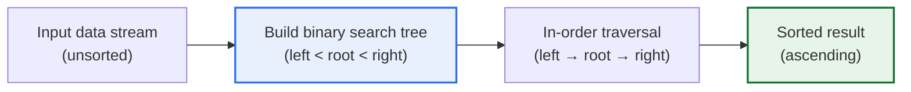
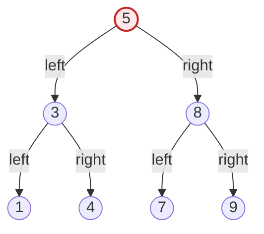

# Tree Sort

## 1. Overview

### A. Definition
> Tree sort is a **comparison-based sorting algorithm that inserts the data to be sorted one by one into a Binary Search Tree (BST) and then reads it out via In-order Traversal to obtain an ascending (or descending) sort**. It borrows the binary search tree's invariant, "left subtree < root < right subtree," directly for sorting.

The core principle of tree sort lies in the property that "**in-order traversal of a binary search tree automatically yields sorted order**." A binary search tree is a data structure organized so that, relative to any node, only smaller values go in the left subtree and only larger values go in the right subtree. Because this property holds recursively at every node, performing an in-order traversal that visits the whole tree in "left → root → right" order streams the values out in ascending order from smallest to largest. That is, instead of explicitly designing separate comparison and swap logic as in bubble or quick sort to achieve sorting, the act of inserting data into the tree itself becomes a "hidden sort" that places each element in the position matching its magnitude order, and traversal is merely the process of unfolding and reading that result linearly.

This approach is interesting because it reveals that sorting algorithms and data structures are effectively two sides of the same coin. The process by which quick sort divides the left and right around a pivot via divide and conquer is structurally isomorphic to the process by which tree sort creates left and right subtrees around a root. In fact, following the insertion order of tree sort on random data shows a statistically identical distribution of comparison counts to quick sort choosing random pivots. For this reason, tree sort is also called "quick sort expressed as a data structure."

### B. Background and Necessity
Traditional sorting algorithms (bubble, insertion, selection, quick, merge, etc.) generally assume static (batch) sorting that "sorts an entire given array at once." In practice, however, there are many dynamic (online) situations where data keeps arriving like a stream and must be queryable and traversable in sorted state at any time. Examples include real-time leaderboards, maintaining event logs in chronological order, and task queues whose priorities change. Re-sorting the entire array in O(n log n) every time a new element arrives is wasteful. Tree sort handles each insertion in O(log n) (when balanced) while the tree itself always stays in a "sortable state," so it naturally fits dynamic environments with repeated insertions and deletions.

Tree sort also has the practical value of yielding, as a by-product, not only the sorted result but **various queries over the sorted order**. Maintaining the tree allows retrieving the minimum and maximum in O(log n) as the leftmost and rightmost nodes respectively, searching for the existence of a specific value in O(log n), and immediately finding the next (successor) or previous (predecessor) element of any value by following the tree structure. If only a "sorted array" is needed, quick or merge sort is better, but if one must "keep the sorted state maintained while also handling queries," a tree-based approach is advantageous — this is why tree sort is studied separately.

## 2. Operating Principle and Procedure

### A. Overall Structure
Tree sort is broadly divided into two phases: the "insertion phase" and the "traversal phase." In the insertion phase, n elements each find their place in the tree through magnitude comparisons, and in the traversal phase, the completed tree is traversed in order to output the sorted result linearly.



### B. Insertion Phase — Finding a Place in the Tree
Insertion starts at the root and, at each node, repeats "go left if the value to insert is smaller than the current node, right if larger" until it reaches an empty spot, where it attaches a new node. The insertion cost of each element is proportional to the tree's height at that moment. For a well-balanced tree, the height is about log₂n, so each insertion is O(log n), and all n are O(n log n) in total. Conversely, if the tree leans to one side, the height approaches n, and a single insertion degrades to O(n) and the total to O(n²). Therefore, the performance of the insertion phase depends entirely on "how balanced the input order makes the tree."

As a concrete example, consider the input `[5, 3, 8, 1, 4, 7, 9]`. 5 becomes the root; 3 is smaller than 5 so it goes left; 8 is larger so it goes right; 1 is smaller than 5 and 3 so it goes to 3's left; 4 is smaller than 5 but larger than 3 so it goes to 3's right; 7 is larger than 5 but smaller than 8 so it goes to 8's left; and 9 is larger than 8 so it goes to 8's right. The result is a relatively balanced tree of height 2. On the other hand, if the input is the already sorted `[1, 3, 4, 5, 7, 8, 9]`, every element attaches only to the right of the preceding node, forming a "skewed tree" stretched long to the right; this is no different from a linked list, and the height becomes n−1.

### C. In-order Traversal Phase — Reading the Sorted Result
Once insertion is complete, the tree is traversed in order. In-order traversal recursively performs, at each node, "visit the entire left subtree → output itself → visit the entire right subtree." Traversing the example tree above in order outputs `1, 3, 4, 5, 7, 8, 9` in sequence, completing the sort. Traversal visits every node exactly once, so it is always O(n), regardless of whether the tree is balanced. Therefore, the performance bottleneck of tree sort is not traversal but the insertion phase.



In the structure above, one can confirm that the visiting order of the in-order traversal (1→3→4→5→7→8→9) is exactly the ascending sort result. If descending order is needed, perform a reverse in-order traversal in "right → root → left" order.

### D. Implementation Example (Pseudocode)
Tree sort is concisely expressed with two functions: an insertion function and an in-order traversal function. The pseudocode below assumes a binary search tree in which each node has a value (key) and left/right child pointers. Insertion recursively descends to find the spot, and sorting accumulates the in-order traversal result into a list.

```text
function insert(node, key):
    if node is NULL:
        return new Node(key)          # create a new node at the empty spot
    if key < node.key:
        node.left  = insert(node.left, key)   # go left if smaller
    else:
        node.right = insert(node.right, key)  # go right if greater or equal
    return node

function inorder(node, result):
    if node is NULL: return
    inorder(node.left, result)         # 1) left subtree
    result.append(node.key)            # 2) output self
    inorder(node.right, result)        # 3) right subtree

function treeSort(array):
    root = NULL
    for key in array:
        root = insert(root, key)       # insert all: average O(n log n)
    result = []
    inorder(root, result)              # in-order traversal: O(n)
    return result                      # sorted result
```

As the pseudocode shows, the logical complexity of tree sort is very low. Sorting is completed solely by combining two standard tree operations, "insertion" and "traversal," without separate swap or merge logic, and this simplicity is why tree sort is widely used as an educational example teaching the relationship between data structures and algorithms. However, this pure implementation does not guarantee balance, so in practice `insert` is replaced with a balanced insertion that includes the rotations of AVL or red-black trees to prevent the worst case.

### E. Handling Duplicate Values and Stability
Real-world data may contain multiple identical keys. In this case, a consistent rule for handling equal values must be set, such as "left if smaller, right if greater or equal"; otherwise the insertion position of duplicate keys becomes ambiguous. Moreover, tree sort is not a stable sort by default. That is, there is no guarantee that the original input order of elements with the same key is preserved after sorting. If stability is needed, each node should also store the "insertion time (sequence number)" as a secondary key and be extended to compare by sequence number as a tie-breaker when keys are equal. Such details are not revealed by tables alone and are design items that must be decided in an actual implementation.

## 3. Complexity Analysis

The time and space complexity of tree sort varies greatly depending on the tree's balance state, and understanding this precisely is the core of this algorithm.

| Category | Time Complexity | Condition | Notes |
|---|---|---|---|
| **Average (random input)** | O(n log n) | Data is randomly shuffled and near-balanced | Insertion n×O(log n) + traversal O(n) |
| **Best** | O(n log n) | Insertion order close to perfectly balanced | Comparable to quick sort's best case |
| **Worst (skewed tree)** | O(n²) | Already sorted or reverse-sorted input | Skewed tree → insertion degrades to O(n) |
| **Space** | O(n) | Always | Stores n nodes (not in-place) |

The decisive variable in tree sort performance is "**how balanced the input makes the tree**." With randomly shuffled data, elements distribute evenly left and right, keeping the tree height statistically around 1.39·log₂n and yielding an average of O(n log n). However, feeding in data already sorted in ascending or descending order makes every element attach in only one direction, forming a skewed tree of height n−1; inserting the i-th element requires i−1 comparisons, so the total number of comparisons degrades to 1+2+…+(n−1) ≈ n²/2, i.e., O(n²). For example, if 10,000 elements are already sorted, insertion comparisons that would take about 130,000 (≈ n·log₂n) for random data explode to about 50 million (≈ n²/2). This is why tree sort in its pure form is rarely used in practice and is always discussed together with balanced trees.

In terms of space, tree sort is an out-of-place sort requiring separate tree storage space O(n) proportional to the input size. This is a disadvantage compared with heap sort's O(1) additional space or quick sort's O(log n) (recursion stack), and it can be a burden in memory-constrained embedded environments.

## 4. Comparison with Other Sorts and Data Structures

To properly understand tree sort, one must grasp even "the reasons the differences arise" relative to similar algorithms. The table below is the starting point for comparison, and the background of each difference is elaborated in prose.

| Algorithm | Average Time | Worst Time | Space | Stability | Characteristics |
|---|---|---|---|---|---|
| **Tree sort** | O(n log n) | O(n²) | O(n) | Unstable (possible with extension) | Advantageous for dynamic insertion/queries |
| **Quick sort** | O(n log n) | O(n²) | O(log n) | Unstable | Cache-efficient in-place sort |
| **Merge sort** | O(n log n) | O(n log n) | O(n) | Stable | Stable performance even in the worst case |
| **Heap sort** | O(n log n) | O(n log n) | O(1) | Unstable | Tree (heap) structure but in-place |

Tree sort and heap sort both use tree structures, but their purpose and implementation differ. Heap sort implicitly represents a heap in the form of a "complete binary tree" on top of an array and sorts in place with O(1) additional space, guaranteeing O(n log n) even in the worst case. Tree sort, by contrast, builds an explicit pointer-based binary search tree in separate memory, using O(n) space, and can degrade to O(n²) if balance breaks. In exchange, tree sort retains the tree after sorting so that successor/predecessor queries and range searches can continue, whereas a heap can only quickly extract the maximum (or minimum) and is unsuitable for arbitrary element queries. This yields the practical implication that for "sort once and done," heap or quick sort is better, while for "maintaining sorted state and continuing queries," a tree-based approach is better.

The reason tree sort and quick sort, despite identical average and worst-case complexities, differ in practical preference lies in cache locality and memory access patterns. Quick sort handles the array in place in contiguous memory with a high CPU cache hit rate, whereas tree sort follows nodes scattered by pointers, causing frequent cache misses, so even at the same O(n log n) its measured speed is often slower. The fact that practical performance diverges due to constant factors and memory access characteristics even when theoretical complexity is the same must be considered when selecting an algorithm.

## 5. Deep Dive — Avoiding the Worst Case with Balanced Binary Search Trees and Applications

The way to fundamentally solve tree sort's O(n²) worst case is to use a **self-balancing binary search tree (self-balancing BST)**. Representative examples are the AVL tree and the Red-Black tree. An AVL tree maintains balance with rotation operations on every insertion and deletion so that the height difference between the left and right subtrees at every node is strictly at most 1. As a result, the tree height is always guaranteed to be O(log n) regardless of the input order, so even inserting already sorted data keeps insertion at O(log n), making the whole O(n log n). A red-black tree relaxes the balance condition somewhat (based on color rules) to reduce the number of rotations while managing the height upper bound at 2·log₂(n+1); it has lower rebalancing costs than AVL when insertions and deletions are frequent, and is therefore more widely used in practice.

In fact, the sorted containers of many standard libraries use this principle. For example, C++ STL's `std::map` and `std::set` and Java's `TreeMap` and `TreeSet` are internally implemented as red-black trees, always maintaining sorted state in O(log n) merely by inserting elements. Iterating over these containers automatically yields sorted order, which is precisely the practical form of "tree sort stabilized with a balanced tree." In other words, tree sort does not remain a mere learning algorithm but lives on as the theoretical foundation of the sorted data structures we use every day.

Another advanced application is indexes in databases and file systems. B-trees and B+trees are multi-way (not binary) balanced search trees optimized for disk block-level access. They too extend tree sort's core idea — "insertion maintains sorted order, traversal yields sorted results, and range searches are accelerated" — to the disk environment. The fact that applying `ORDER BY` on an indexed column in a relational database obtains the sorted result merely by traversing the index without a separate sort is based on the same principle. In this way, the idea of tree sort has broadly extended from algorithm theory to indexing throughout system software.

## 6. Considerations and Implications

From the perspective of a Professional Engineer (Information Management), tree sort should be approached not merely in terms of a single algorithm's performance, but as a case illustrating the principle that "the choice of data structure determines algorithm performance."

1. **Eliminate the worst case at the design stage with balanced trees.** Pure tree sort is vulnerable to O(n²) on sorted and reverse-sorted input, so practical application must take self-balancing trees such as AVL or red-black trees as the default premise to guarantee O(n log n). If it cannot be predicted whether input data is pre-sorted, adopting a balanced tree is not optional but mandatory.
2. **Choose a sorting strategy that fits workload characteristics.** If "the sorted result is needed only once," quick sort with high cache efficiency or merge sort with a stable worst case is advantageous; if "the sorted state is continuously maintained with repeated insertions, deletions, and queries," a balanced binary search tree-based approach is advantageous. Trade-offs should weigh not only time complexity but also space, stability, and the range of supported queries together.
3. **Consider memory and cache constraints together.** Tree sort incurs the costs of O(n) additional space and cache misses due to pointer chasing. In environments with limited memory and cache, such as embedded and mobile, in-place sorts (heap, quick) or array-based data structures may be more suitable, so decisions should reflect the physical constraints of the execution environment, not just theoretical complexity.
4. **Define stability requirements in advance.** For work that requires preserving the original order of equal keys after sorting (stability) (e.g., multi-level sorting, tie handling), tree sort needs an extension with a sequence-number secondary key. If stability and duplicate-key handling rules are not clarified at the requirements analysis stage, subtle sorting errors may result after implementation.
5. **Understand the connection to system software.** The idea of tree sort extends to the sorted containers of STL/JCF, database B+tree indexes, and file system indexing. Rather than ending it as a simple algorithm problem, thinking of it from the perspective of "a data structure that maintains order" and connecting it to index and query optimization design is the approach at the Professional Engineer level.

---

> **In one line**: Tree sort is an algorithm that *sorts by inserting into a binary search tree and then traversing in order*; it averages O(n log n) but degrades to O(n²) with a skewed tree on sorted input, so the worst case is eliminated with self-balancing trees such as AVL and red-black trees, and its idea lives on in dynamic data environments that must maintain sorted state while handling queries (STL map, DB B+tree indexes).
