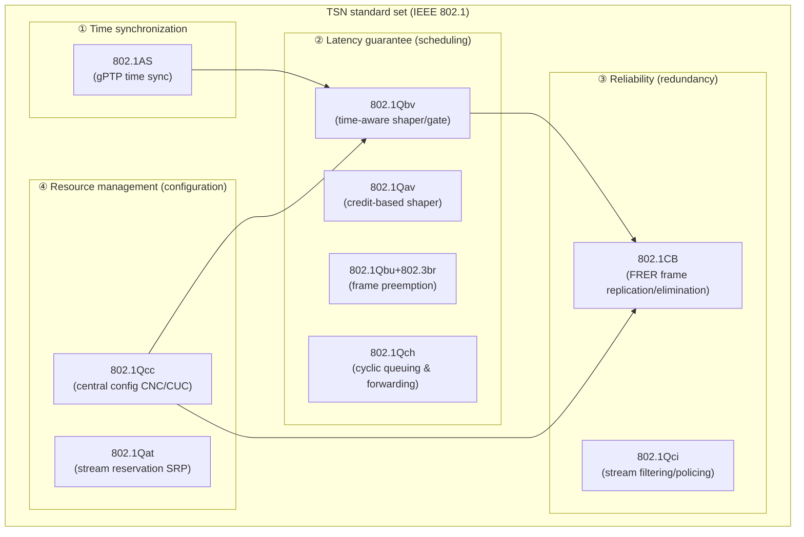
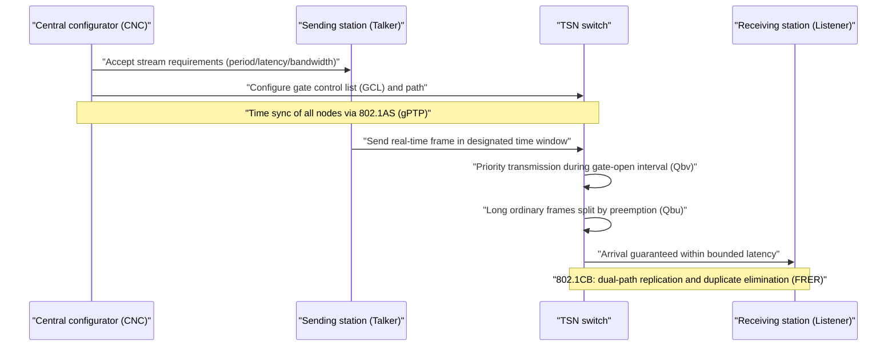

# Time-Sensitive Networking (TSN)

## 1. Overview

### A. Definition
> **TSN (Time-Sensitive Networking)** is a **set of deterministic Ethernet technologies** standardized by the IEEE 802.1 working group that, on top of standard Ethernet (IEEE 802.3), **guarantees that frames arrive within a defined time (bounded low latency)**, **suppresses latency variation (jitter) to the microsecond (µs) level**, and even provides **lossless redundancy**. If conventional Ethernet means "it will arrive eventually (best-effort)," TSN guarantees "**it arrives at the promised time**."

To understand the essence of TSN, one must first address the limitations of traditional Ethernet. Standard Ethernet started from CSMA/CD and evolved through switching and full duplex, dramatically increasing bandwidth, but it still **does not guarantee frame delivery times.** When multiple traffic flows pile up in a switch's internal queue, lower-priority frames are pushed back (head-of-line blocking), making latency erratic, and the upper bound of worst-case latency cannot be mathematically guaranteed. For office data (file transfer, web), latency variations of tens of ms are not a problem, but they are fatal in the real-time control domain, such as **robot motion control, automotive steering, and power system protective relays**, where failure of a command to arrive within a few hundred µs leads to accidents.

For this reason, industrial sites have long used **vendor-specific Industrial Ethernet** such as PROFINET IRT, EtherCAT, and SERCOS III. However, these are not mutually compatible and cannot be mixed with standard IT equipment, resulting in dual networks within factories where the control network (OT) and information network (IT) are physically separated. TSN starts from the idea of solving exactly this problem by having **real-time control traffic and general IT traffic coexist (convergence) on the same cable with a single international standard Ethernet**.

### B. Background and Necessity
The decisive background for the rise of TSN is the demand of **smart factories, Industry 4.0, and IT/OT convergence**. As manufacturing sites evolve with digital twins, AI predictive maintenance, and cloud analytics, economy and management efficiency are secured only when the real-time control data generated by field sensors, PLCs, and robots and the large volumes of information data required by upper-level analysis systems **flow over a single network**. However, vendor-dependent industrial Ethernet was disconnected from the IT network, so moving data upward had to pass through the bottleneck of gateways and protocol conversion. TSN breaks down this wall by adding determinism while retaining the openness, low cost, and rich ecosystem of standard Ethernet.

The second driver is **automotive (In-Vehicle Network) and autonomous driving**. Inside vehicles, heterogeneous buses such as CAN, LIN, and FlexRay proliferated, making wiring (harness) weight and bandwidth limits serious, and carrying gigabit-class data from autonomous driving sensors (cameras, lidar) in real time required a deterministic high-bandwidth backbone. In fact, TSN's origin is **AVB (Audio Video Bridging)**, a real-time audio/video transmission standard begun in 2005; driven by the demands of the automotive and pro audio industries, the working group name was expanded to TSN in 2012, broadening the scope of application to industrial control in general. Third, the fact that fields requiring µs synchronization and bounded latency — such as **5G fronthaul, power grid protection and control (IEC 61850), and pro audio** — needed a common foundation accelerated standardization.

In short, the necessity of TSN converges on three trends: **① unification of heterogeneous real-time networks** (vendor-specific industrial Ethernet into one standard), **② IT/OT convergence** (physical unification of control and information networks), and **③ coexistence of high volume and real time** (applications like autonomous driving and 5G that simultaneously demand large bandwidth and strict latency). Because conventional best-effort Ethernet could not meet these three requirements together merely by increasing bandwidth, the approach of "introducing time into Ethernet" became the inevitable choice.

## 2. TSN's Four Functional Pillars and Overall Structure

TSN is not a single standard but a **bundle of several sub-standards (amendments)** of IEEE 802.1, functionally divided into four pillars: **① time synchronization, ② latency guarantee (scheduling/shaping), ③ reliability (redundancy), and ④ resource management (configuration)**. The figure below is an overall structural diagram showing the relationship between these four pillars and the representative standards.

**Time synchronization (802.1AS, gPTP)** is the most fundamental foundation of TSN. Deterministic scheduling holds only when all switches and end stations in the network share **the same time (a common clock)**. 802.1AS is gPTP (generalized Precision Time Protocol), a profile of IEEE 1588 PTP adapted for the Ethernet environment, which builds a time distribution tree with a grandmaster at the apex to achieve **synchronization precision below 1 µs (typically within 1µs)**. Each node measures and corrects link delay and residence time, so errors do not accumulate even across multiple hops. If time drifts, the subsequent timetable (gate schedule) collapses, so 802.1AS also secures the reliability of synchronization itself through grandmaster redundancy (hot-standby) and BMCA (Best Master Clock Algorithm).

**Latency guarantee (scheduling/shaping)** is the heart of TSN. The core, **802.1Qbv (Time-Aware Shaper, TAS)**, places a **time-based gate** in front of each queue at a switch output port and opens and closes the gates according to a **Gate Control List (GCL)** composed in line with gPTP time. For example, during a specific interval of the cycle, only the control traffic queue is opened and the others are closed, so that during that time window (protected window) only real-time frames monopolize the line. This mathematically fixes the upper bound of worst-case latency by the schedule. As a supplement, **802.1Qav (Credit-Based Shaper, CBS)**, a technique from AVB, smooths traffic (guaranteeing average bandwidth) by consuming and replenishing credits so that a specific stream cannot monopolize bandwidth. **802.1Qbu/802.3br (Frame Preemption)** chops up a long ordinary frame already being transmitted and inserts urgent (express) frames in between, reducing the "guard band waste" and waiting delay caused by a large frame straddling the moment just before a gate closes.

### A. Flow of Deterministic Traffic (Detailed Process Diagram)
The figure below is a detailed process diagram showing the procedure by which a single real-time stream passes through the switch according to the timetable from the sending end station until it arrives at the receiving end station.

As a simpler alternative, **802.1Qch (Cyclic Queuing and Forwarding, CQF)** is also widely used. CQF divides time into cycles of equal length and alternates between two queues, even and odd, so that frames arriving in one cycle are always sent out in the next cycle. As a result, frame latency is **deterministically calculated** as number of hops × cycle length, making design and verification simpler than Qbv, which requires a precisely composed GCL per stream. In exchange, since buffering is aligned to cycle boundaries, there is a trade-off in which the minimum latency becomes somewhat larger; thus motion control requiring ultra-low latency chooses Qbv, while large networks that must handle many streams simply and predictably choose CQF.

To get a quantitative feel, sending a single 1,500-byte maximum frame on a 1Gbps link takes about 12µs. Without preemption (Qbu), if this large frame begins transmission just before a gate opens, an urgent frame must wait up to an additional 12µs, and if such delays accumulate at every hop, meeting the bound becomes difficult. Frame preemption slices this 12µs-class blocking into units of a few µs, greatly lowering worst-case latency. In this way, each TSN shaper is a technique addressing how to allocate the latency budget on top of the physical lower bound of "the transmission time of one frame."

**Reliability and redundancy (802.1CB, FRER)** is an essential element of control networks requiring losslessness. FRER (Frame Replication and Elimination for Reliability) attaches sequence numbers to frames at the sender, **replicates and transmits them over two or more different paths**, and at the receiver **takes only the first one to arrive and eliminates duplicates**. Because frames from the other path arrive even if one path is cut, **seamless redundancy** is realized without waiting for retransmission even during failures. Used together with it, **802.1Qci (Per-Stream Filtering and Policing)** monitors time and bandwidth per stream and blocks malfunctioning or maliciously flooding traffic (babbling idiot) at the ingress so it cannot wreck the timetable. For example, in a power plant protective relay system, the loss of even a single frame of the trip signal linking the relay and circuit breaker leads directly to an accident, so it is replicated via FRER over two geographically separated paths, securing losslessness even upon ring cuts or switch failures. This bypasses, via the spatial redundancy of "replicating in advance," the fundamental constraint that the TCP approach of recovering losses by retransmission cannot be used in real-time control due to latency.

**Resource management and configuration (802.1Qcc)** deals with how all of the above functions are set up and deployed. A deterministic schedule can be computed only by knowing the whole picture of which end station requires a stream with what period, latency, and bandwidth, so 802.1Qcc defines a **centralized model (CNC: Centralized Network Configuration + CUC: Centralized User Configuration)**. The CUC collects the end stations' requirements (Talker/Listener), and the CNC computes and distributes the GCL and paths for each switch based on the network topology. This aligns with the SDN concept of a central controller, connecting naturally to the trend of managing TSN with SDN and NETCONF/YANG. 802.1Qcc also defines a **fully distributed model**, in which each node exchanges requirements with its neighbors and reserves resources by itself, and a **hybrid model** that compromises between distributed reservation and central computation. In practice, the centralized model tends to be adopted as the mainstream in industrial automation due to schedule optimization quality and global visibility, but for simple, small networks the distributed model has a lower deployment burden.

## 3. Summary of Key Standards (Supplementary Table)

The standards explained above are organized by functional pillar as follows. The table is a supplementary tool for comparison and organization, and "why each standard is needed" should be understood from the descriptions in the main text above.

| Functional Pillar | Standard (Amendment) | Role | Key Concept |
|---|---|---|---|
| ① Time synchronization | 802.1AS (gPTP) | Distribute common time to all nodes | Grandmaster, residence time correction, sub-µs sync |
| ② Latency guarantee | 802.1Qbv (TAS) | Time-based gate schedule | GCL, protected window |
| ② Latency guarantee | 802.1Qav (CBS) | Bandwidth smoothing | Credit charge/discharge |
| ② Latency guarantee | 802.1Qbu/802.3br | Frame preemption | express/preemptable, guard band reduction |
| ② Latency guarantee | 802.1Qch (CQF) | Cyclic queuing and forwarding | Deterministic latency, simplified implementation |
| ③ Reliability | 802.1CB (FRER) | Lossless redundancy | Replication, sequence numbers, duplicate elimination |
| ③ Reliability | 802.1Qci (PSFP) | Stream filtering/policing | Blocks flooding traffic at ingress |
| ④ Resource management | 802.1Qcc | Central configuration | CNC/CUC, YANG model |
| ④ Resource management | 802.1Qat (SRP) | Stream reservation | Advance bandwidth reservation |

An important practical implication here is that **"adopting TSN" does not mean "turning on all nine standards."** Since the combination of required standards differs by industry, **profiles** such as IEC/IEEE 60802 (industrial automation), IEEE 802.1DG (automotive), and IEEE 802.1BA (audio/video) specify the subset of standards and parameters suited to each application. For example, the automotive profile emphasizes gPTP, CBS, and FRER, while the industrial automation profile takes Qbv, Qbu, and Qcc as its core.

## 4. Comparison with Similar Technologies — Why the Differences Arise

Comparing TSN with existing real-time networks clarifies its position. The comparison below is not a simple list of items but also examines **why such differences arise and what they mean in practice**.

| Category | Standard Ethernet | Industrial Ethernet (EtherCAT, etc.) | TSN |
|---|---|---|---|
| Determinism | None (best-effort) | Yes (vendor-proprietary) | Yes (international standard) |
| Latency guarantee | No upper bound | Tens of µs | µs to hundreds of µs bound |
| Standardization/compatibility | Open, general-purpose | Vendor lock-in | Open, general-purpose (IEEE) |
| IT/OT convergence | Difficult (no determinism) | Difficult (closed) | Easy (designed for coexistence) |
| Ecosystem/price | Very rich, low cost | Limited, high cost | Leverages Ethernet ecosystem |

One point to note is that TSN does not so much "replace" industrial Ethernet as **absorb its lower layers into a standardized common layer**. PROFINET, EtherNet/IP, and others are evolving in the direction of porting only the transport layer to TSN while retaining their upper-level application and object models, so users gain the benefits of determinism and IT convergence while using familiar upper-layer protocols. This is the practical incentive accelerating TSN adoption.

The fundamental difference from standard Ethernet is **"the presence or absence of a concept of time."** A standard Ethernet switch simply puts arriving frames into a queue and sends them out in order, without knowing "what µs it is now." A TSN switch, by contrast, knows the common time via gPTP and opens and closes gates in line with that time, so the worst-case latency bound of real-time frames does not waver even when queue contention occurs. This difference leads directly to the practical outcome of "whether general IT traffic and control traffic can be safely mixed on the same line."

The difference from industrial Ethernet (EtherCAT, PROFINET IRT, etc.) lies in **"openness."** These also provide determinism, but because they are vendor-specific they cannot communicate with each other, and a gateway is needed to interoperate with upper-level IT infrastructure. Because TSN **incorporated this deterministic functionality into IEEE standard Ethernet**, TSN equipment from different vendors interoperates and forms a single network with ordinary switches and servers. In fact, upper-level industrial protocols such as PROFINET, EtherNet/IP, and OPC UA are also converging toward moving their lower transport layers onto TSN (e.g., OPC UA over TSN).

### Concrete Application Cases
First, the **automotive Zonal architecture**. The latest SDVs (Software-Defined Vehicles) consolidate dozens of ECUs into a few zone controllers and connect them with a gigabit Ethernet backbone, carrying large streams from cameras and lidar and safety control signals for steering and braking over a single TSN backbone. Combined with 100BASE-T1/1000BASE-T1 automotive Ethernet, it reduces wiring weight while guaranteeing bounded latency for safety signals. Second, **smart factory motion control**: if the synchronization error of a multi-axis robot exceeds a few µs, machining precision collapses, so the gPTP+Qbv combination is used to align cycle synchronization. Third, **5G fronthaul**: TSN bridges meet the strict latency and synchronization requirements between the wireless base station's distributed unit (DU) and radio unit (RU) (eCPRI), helping carriers consolidate fronthaul on Ethernet.

Fourth, the **pro audio and broadcast (AV)** field. AVB, the root of TSN, was used to transmit hundreds of channels of audio with µs synchronization in large concert halls and studios; since the sound image blurs if multiple speakers are even slightly misaligned, gPTP synchronization and CBS bandwidth guarantees play a decisive role. This case shows that TSN is common infrastructure not only for industrial control but for every field where "precise timing" determines quality.

## 5. Deep Dive — Standardization Trends and Connections with SDN and OT Security

The most noteworthy recent trend in the TSN ecosystem is **the establishment of application-specific profiles and the convergence of upper-layer protocols**. In industrial automation, the **IEC/IEEE 60802 TSN profile for industrial automation**, jointly developed by the IEC and IEEE, is taking hold, and testing and certification schemes (Avnu Alliance, etc.) that verify interoperability among equipment from different vendors are maturing. In particular, **OPC UA over TSN** combines an upper-level information model (OPC UA) with lower-level deterministic transport (TSN), emerging as the de facto standard communication stack of Industry 4.0 that lets data flow under a single semantic framework from the field level to the cloud.

The second advanced point is **the combination with SDN and central configuration (CNC)**. 802.1Qcc's centralized model is conceptually the same as an SDN controller in that the CNC oversees the entire network and computes and distributes schedules, and standardization is in fact underway to remotely configure TSN switches with NETCONF/RESTCONF and YANG data models. This evolves TSN from a static configuration technology into an **intelligent deterministic network that dynamically adds streams and recomputes**. However, schedule computation (GCL derivation) is an NP-hard problem that becomes combinatorially explosive as the number of streams grows, so research on scheduling using heuristics, ILP, and more recently reinforcement learning is active.

Third, **the connection with OT security** is becoming important. As TSN merges IT and OT into a single network, control networks that were previously physically isolated (air-gapped) become exposed to IT threats. Spoofing and delay attacks targeting time synchronization (gPTP) can collapse the entire gate schedule, so 802.1Qci stream policing, MACsec (802.1AE) layer encryption, and combination with IEC 62443 and Zero Trust principles are treated as essential design elements. In other words, TSN design has now reached a stage where "securing determinism" and "built-in security" cannot be separated.

Fourth, **maturity of the hardware and silicon ecosystem** is key to its spread. Performing Qbv gate opening and closing without µs error requires hardware timestamping and gate logic at the switch ASIC/FPGA level, and end stations (NICs) also need gPTP hardware support. Initially, such TSN-capable silicon was limited to a few vendors and was expensive, but as major switch and SoC manufacturers incorporate TSN features into their standard lineups, the barrier to entry is falling. However, since software switching (virtual switches) alone struggles to deliver hardware-grade precision, extending determinism to cloud and container environments remains an area of ongoing research and standardization.

## 6. Considerations and Implications (Professional Engineer's Perspective)

- **Application strategy — gradual convergence, not wholesale replacement**: TSN adoption is not a matter of ripping out existing control networks all at once; a **brownfield strategy** of deploying TSN switches starting from the backbone and core cells and spreading while absorbing legacy industrial Ethernet through gateways is realistic. Initially, partial application — protecting only streams that truly need determinism with Qbv and leaving the rest as best-effort — is advantageous in terms of risk and cost.

- **Trade-off — determinism vs. flexibility/utilization**: Timetable (GCL)-based scheduling guarantees bounded latency at the cost of not being able to place other traffic in the protected window, which lowers line utilization and imposes a heavy recomputation burden when streams change. Conversely, loosening the schedule window raises utilization but reduces the determinism margin. The key design judgment is to select the appropriate shaper among Qbv (strict), CBS (smoothing), and CQF (simple) according to the application's real-time class (hard/soft real-time).

- **Standards and interoperability risk**: Since TSN is a combination of many standards, the subset of standards supported by vendors and their profile conformance may vary. At adoption, **profile (60802/802.1DG, etc.) conformance and interoperability certification** should be specified in procurement requirements, and mixed use of heterogeneous vendors should be verified with a PoC to prevent vendor lock-in.

- **Securing operation and verification systems**: Determinism does not end with design; it must be maintained during operation as well. Orchestration that recomputes and deploys GCLs without disruption whenever streams are added or changed, monitoring that continuously measures real-time latency, jitter, and synchronization error, and **advance verification based on network calculus and simulation** to confirm that schedules meet their bounds before deployment must all be in place together. This means TSN is not a simple equipment purchase but an engineering capability spanning design, verification, and operation.

- **Outlook and related technologies**: TSN is expected to expand into **the common foundation of deterministic infrastructure** as it combines with the wired segments of 5G URLLC, real-time data pipelines for digital twins, and edge AI inference requiring time-division determinism. Integrated design capability with SDN, OPC UA, MACsec, and IEC 62443 will become a core competitive advantage for future smart manufacturing and autonomous driving architects.

## References
- IEEE 802.1 Time-Sensitive Networking (TSN) Task Group — https://1.ieee802.org/tsn/
- Avnu Alliance, TSN overview and certification — https://avnu.org/
- IEC/IEEE 60802 TSN Profile for Industrial Automation (overview) — https://1.ieee802.org/tsn/60802/

---
> **In one line**: TSN is a set of deterministic Ethernet technologies that adds time synchronization (802.1AS), time-aware scheduling (802.1Qbv), lossless redundancy (802.1CB), and central configuration (802.1Qcc) on top of standard Ethernet to guarantee bounded latency and low jitter, becoming the real-time communication foundation for IT/OT convergence, autonomous driving, and smart factories.
