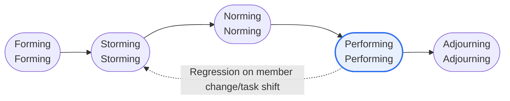

# Tuckman Ladder Model — Team Development and Characteristics of Each Stage

## 1. Overview

### A. Definition
> A **team development stage model** proposed by Bruce W. Tuckman (1965), a theory that likens the process a team goes through from formation to delivering results to climbing a ladder. It is cited as a team growth theory in the resource management (Develop Team) area of the **PMBOK**.

The core insight of the Tuckman model is that "a team does not deliver results the moment it is formed." Collaboration does not happen immediately just because individuals have gathered; a team necessarily goes through **a certain developmental process** of exploring one another, experiencing conflict, and establishing norms. Because each stage differs markedly in team emotion and productivity, the leader can promote growth only by diagnosing which stage the team is currently in and intervening accordingly.

### B. Background and Necessity
Tuckman synthesized research on various groups to organize the common pattern of team development into four initial stages (Forming to Performing), and in 1977, together with Mary Ann Jensen, added **Adjourning** after task completion, expanding it to five stages. The reason this model matters in practice is that the characteristics of each stage and the way the leader intervenes differ. In particular, if the Storming stage, where conflict peaks, is neglected, the team cannot reach the performance stage, so the model has great practical value in providing the prescription of **stage diagnosis → tailored leadership**.

## 2. Five Stages of Team Development (Ladder Diagram)



Development basically **ascends sequentially** like climbing a ladder, but real teams do not necessarily progress in only one direction. When new members join, the task changes significantly, or buried conflicts resurface, the team may **regress** to an earlier stage and go through Storming again. Therefore, the leader should not let go of management upon reaching Performing, and should continuously check the team's state on the premise that regression is possible.

### Trends in Conflict and Productivity by Stage

```chart
{
  "type": "line",
  "data": {
    "labels": ["Forming", "Storming", "Norming", "Performing", "Adjourning"],
    "datasets": [
      { "label": "Conflict level", "data": [2, 5, 3, 1.5, 1], "borderColor": "#e11d48", "backgroundColor": "rgba(225,29,72,0.12)", "tension": 0.35, "fill": true },
      { "label": "Productivity", "data": [1, 2, 3.5, 5, 3], "borderColor": "#2f6fed", "backgroundColor": "rgba(47,111,237,0.12)", "tension": 0.35, "fill": true }
    ]
  },
  "options": {
    "plugins": { "legend": { "position": "bottom" } },
    "scales": { "y": { "min": 0, "max": 6, "title": { "display": true, "text": "Relative level" } } }
  }
}
```

> Conflict peaks in Storming, and once past it, productivity reaches its highest point in Performing. (Values are examples showing relative trends)

The key message of this graph is that **conflict and productivity are not inversely proportional**. Only by passing through the Storming stage, where conflict is at its peak, in a healthy way rather than avoiding it do trust and norms become established, and on top of them productivity rises explosively in Performing. In other words, Storming is not a problem to be eliminated but a gateway that must be passed for growth.

## 3. Characteristics of Each Stage

Each stage differs in team members' psychological state, levels of conflict and productivity, and the leadership that fits it. **Forming** is a period of cautious mutual exploration in which roles and goals are ambiguous, so the leader reduces uncertainty by clearly presenting direction and rules in a **directive** style. **Storming** is the most difficult phase, in which conflicts over leadership and ways of working surface, and the leader resolves them constructively by mediating and listening in a **coaching** style rather than suppressing conflict. By **Norming**, trust and norms are established and collaboration takes root, so the leader grants autonomy in a **supporting** style, and **Performing** is the self-organizing stage in which the team solves problems on its own, so the leader hands over authority in a **delegating** style. In **Adjourning**, the leader recognizes achievements and helps with emotional closure.

| Stage | Key Characteristics | Conflict / Productivity | Leadership (Situational) |
|---|---|---|---|
| **Forming**<br>Forming | Mutual exploration, ambiguous roles/goals, polite and independent behavior | Low conflict / low productivity | **Directive** — present clear goals, roles, and rules |
| **Storming**<br>Storming | Clashes of opinion, power struggles, conflicts over roles/priorities surface | Highest conflict / poor productivity | **Coaching** — mediate and coordinate conflict, listen |
| **Norming**<br>Norming | Trust, norms, and roles established; collaboration and cohesion formed | Conflict eases / productivity rises | **Supporting** — encourage participation, grant autonomy |
| **Performing**<br>Performing | Interdependence, self-organization, solving problems independently | Low conflict / highest productivity | **Delegating** — delegate authority, manage performance |
| **Adjourning**<br>Adjourning | Disbanding after task completion, performance retrospective, emotional closure | Reflection/closure | **Recognition & support** — recognize achievements, support transition |

## 4. Management Strategies by Stage

The key to management strategy is **intervention that does not go against the characteristics of each stage**. In Forming, reduce uncertainty through a kickoff meeting and sharing ground rules; in Storming, acknowledge conflict as a natural growth process and help the team settle early. Managing Storming in particular is the watershed that determines the team's success or failure. In Norming, document and standardize the established norms to stabilize collaboration; in Performing, refrain from excessive intervention while raising goals to sustain performance. In Adjourning, organize the retrospective and Lessons Learned and recognize team members' contributions.

- **Forming**: Reduce uncertainty with a kickoff meeting and sharing of goals, R&R, and ground rules
- **Storming**: Acknowledge conflict as a natural process; support for early settlement determines team success or failure
- **Norming**: Document and embed established norms; standardize collaboration tools and processes
- **Performing**: Refrain from excessive intervention; sustain performance by raising goals and giving continuous feedback
- **Adjourning**: Retrospective, organize deliverables and lessons learned, recognize team members' contributions

## 5. Considerations and Implications (Professional Engineer's Perspective)

1. **Link with Situational Leadership** — Switching leadership style by stage, directive → coaching → supporting → delegating, is the practical core of the model. A single standardized leadership style can actually be counterproductive at certain stages.
2. **Managing Storming is the key** — If this stage is not overcome, the team will never reach the performance stage. The goal is not conflict avoidance but healthy expression and resolution.
3. **Assume the possibility of regression** — Regard the recurrence of lower stages as natural when personnel change or tasks shift, and keep the management system flexible.
4. **Alignment with Agile** — Scrum's self-organizing team is in line with aiming for the Performing stage, and sprint retrospectives become a tool for stage diagnosis and improvement.
5. It is well suited for use in answers in the context of PMBOK's Develop Team and motivation theories.

---

> **In one line**: A team climbs the ladder of *Forming → Storming → Norming → Performing (→ Adjourning)*, and performance takes off only after healthily passing through Storming, where conflict peaks; therefore the leader intervenes with **situational leadership (directive → coaching → supporting → delegating)** suited to each stage to promote reaching the performance stage.
