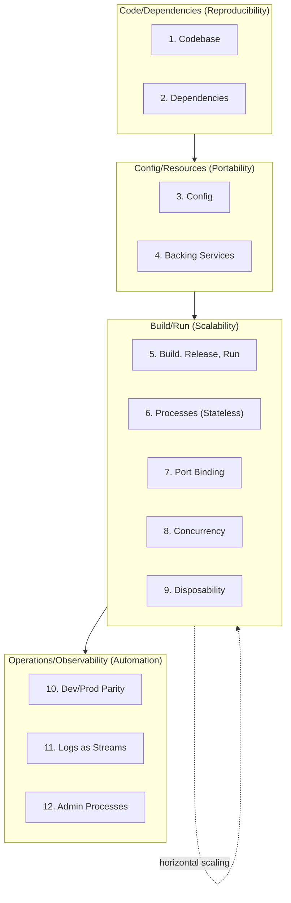
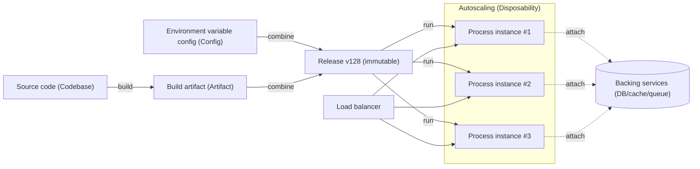

# The Twelve-Factor App

## 1. Overview

> **Definition**: The Twelve-Factor App is a set of twelve design principles for structuring SaaS (Software as a Service)-type applications to suit declarative configuration, loose coupling with the execution environment, stateless processes, and continuous deployment; it is a methodology for guaranteeing portability, scalability, and operational automation at the code level.

The Twelve-Factor App is a methodology published in 2011 by engineers at the cloud platform Heroku, who distilled their operational experience with countless SaaS applications.
At the time, many applications were tightly bound to a specific server's file paths, manually edited configuration files, and deployment procedures performed by hand, which frequently caused the so-called "environment divergence" problem, in which the same code behaved differently in development, staging, and production.
The Twelve-Factor App aims to break these couplings so that an application behaves identically in any execution environment, new instances can be added or discarded within seconds, and code changes are deployed repeatably through automated pipelines.

The key lies in separating the application from its execution environment.
In traditional deployment, the application depends on the state of a specific machine (sessions on local disk, configuration baked into the server, manually installed packages), so the machine effectively becomes part of the application.
Twelve-Factor, by contrast, defines the application as "a self-contained bundle of code that assumes nothing about its execution environment," and injects everything that varies by environment (connection information, secrets, resource locations) from the outside.
This shift in perspective became the conceptual foundation for the later rise of containers, orchestration, immutable infrastructure, and GitOps, and has become the basic grammar of cloud-native application design today.

Memorizing the twelve factors as a mere checklist is a failed understanding from the Professional Engineer's perspective.
Each factor is not an independent rule but a device that enforces the common goals of "statelessness, portability, and automation" from different angles, forming a mutually reinforcing structure in which adhering to one factor makes it easier to adhere to others.
For example, externalizing configuration into environment variables (Factor 3) makes it easier to deploy the same build artifact to multiple environments (Factor 5), which in turn enables disposable stateless processes (Factors 6 and 9) and horizontal scaling (Factor 8).

### 1.1 Background and Necessity

First, the operational paradigm that in cloud environments instances are "cattle, not pets" spread.
In the past, each server was given a name and carefully managed, but as autoscaling and spot instances became commonplace, instances became replaceable resources that can be created and discarded at any time.
If an application depends on the local state of a particular instance, data loss and failures occur in such an environment, so stateless design became essential.

Second, deployment frequency rose sharply.
As yearly and monthly releases gave way to daily and hourly deployments, manual deployment procedures involving human intervention became both a bottleneck and a cause of incidents.
Only by strictly separating build, release, and run (Factor 5) and detaching configuration from code (Factor 3) can an automated deployment pipeline that enables rollback and reproducibility be built.

Third, the gap between development and production environments caused incidents.
Many of the problems that work fine on a developer's laptop but fail in production stem from mismatches in backing services, libraries, and runtime versions.
Twelve-Factor establishes dev/prod parity (Factor 10) as an explicit principle, suppressing environment divergence at the design stage.

### 1.2 Goals and Scope

The first goal of Twelve-Factor is **portability**.
By pushing configuration, resource, and execution environment dependencies outward, the same code behaves identically whether on local Docker, on-premises Kubernetes, or public cloud managed services.
The second goal is **scalability**, absorbing load by replicating instances horizontally through stateless processes and port binding.
The third goal is **operational automation and observability**, making deployment and operation reproducible code by treating logs as event streams (Factor 11) and running administrative tasks as one-off processes (Factor 12).
However, it must also be understood that Twelve-Factor is not a design guide for stateful backing services themselves, such as databases and message brokers, and that it is difficult to apply as-is to stateful workloads or batch pipelines.

## 2. Overall Structure of the Twelve Factors

The twelve factors look like individual rules, but in fact they can be arranged along the flow of the application lifecycle: "codebase → dependencies → configuration → execution/deployment → operations/observability."
The structural diagram below classifies the twelve factors into four groups by nature, showing how each group contributes to the common goals of portability, scalability, and automation.

Beyond simply adhering to each factor, it is important to understand how the factors reinforce one another within this flow.
For example, to produce multiple deploys from a single codebase (Factor 1), the differences among those deploys must be expressed solely through configuration (Factor 3).
If configuration is hardcoded in the code, the code forks with each deploy, which breaks the separation of build, release, and run (Factor 5).

### 2.1 Codebase and Dependencies (Foundation of Reproducibility)

**Factor 1 (Codebase)** requires a 1:N correspondence between one version-controlled codebase and many deploys.
Multiple deploys — development, staging, and production — derive from the same codebase, and differences between deploys must be expressed only through configuration, not code.
If production and development code live in different repositories, that is not one app but a distributed system of multiple apps, and each repository must follow Twelve-Factor on its own.
In a microservices environment, each service has its own codebase, and shared code is recommended to be separated into a separate library pulled in as a dependency.

**Factor 2 (Dependencies)** requires that all dependencies be explicitly declared and isolated.
Implicitly depending on system-wide installed packages causes the "it works on my machine" problem when the execution environment changes.
Pinning dependency versions with manifests such as `package.json`, `requirements.txt`, `pom.xml`, and `go.mod`, and isolating them with virtual environments or containers, reproduces the same set of libraries on any machine.
In fact, the 2016 incident in which the deletion of npm's `left-pad` package broke countless builds is a representative case showing how fragile it is to pull dependencies remotely at execution time without explicitly pinning (locking) them.

### 2.2 Config and Backing Services (Core of Portability)

**Factor 3 (Config)** requires that every value that varies by environment be separated from the code and injected via environment variables.
If values that vary by deploy — database connection strings, external API keys, credentials — are placed in code or configuration files, those values may be accidentally committed to the repository and leaked, or the code forks per environment.
Twelve-Factor's litmus test is clear — "Could this codebase be made open source right now without leaking secrets?" — and if the answer is "no," configuration has not been sufficiently separated.
However, the environment variable approach has been criticized as hard to group when managing hundreds of settings, so today it has evolved into a form used in parallel with secret management services such as Vault and AWS Secrets Manager or Kubernetes ConfigMap/Secret.

**Factor 4 (Backing Services)** requires that all resources accessed over the network — databases, caches, message queues, mail servers, etc. — be treated as "attached resources."
That is, whether local MySQL or managed RDS, the application code must be abstracted so that only a URL-style configuration needs to change, and resources must be swappable and re-attachable without code changes.
Thanks to this principle, replacing a failed database with a replica or switching a local cache in the development environment to a managed Redis in production becomes possible with only a configuration change.

### 2.3 Processes and Scaling (Realizing Scalability)

**Factor 5 (Build, Release, Run)** strictly separates the process of turning code into an executable artifact into three stages.
Build converts code and dependencies into an executable bundle; release combines that build with the configuration of the target environment and assigns a unique identifier (e.g., v128); and run launches that release in the runtime.
Every release is immutable and has a unique ID, so if a problem arises it can be immediately rolled back to a previous release.
Modifying code directly in the running stage in production (editing a hotfix directly on the server) is a head-on violation of this principle, and changes made that way are lost at the next deployment.

**Factor 6 (Processes)** and **Factor 9 (Disposability)** require that the application run statelessly and be able to start and stop quickly at any time.
A process leaves no request as persistent state in local memory or on disk, and all state that must persist is pushed out to backing services.
Only then is data not lost even if an instance dies, and the autoscaler can freely add and reclaim instances.
Disposability particularly includes fast startup (starting within a few seconds) and graceful shutdown (upon receiving SIGTERM, finishing in-progress requests before exiting), which is the prerequisite for zero-downtime operation in situations such as Kubernetes pod rescheduling or spot instance reclamation.

**Factor 7 (Port Binding)** requires that the application not run by being hosted in an external web server (Apache, Nginx), but open a port itself and provide its service in a self-contained manner.
**Factor 8 (Concurrency)** requires that load handling be scaled via the process model — not vertical scaling that makes one process heavier, but distributing load by horizontally replicating (scale-out) role-specific processes such as web and worker.
The deployment flow diagram below shows how Factors 5, 6, 8, and 9 mesh together to produce zero-downtime deployment and horizontal scaling.

### 2.4 Dev/Prod Parity and Observability (Completing Automation)

**Factor 10 (Dev/Prod Parity)** requires minimizing the time gap, personnel gap, and tools gap between development, staging, and production.
In the past, code written by developers was reflected in production only days to weeks later (time gap), developers and operators were separate (personnel gap), and different backends were used, such as SQLite in development and Oracle in production (tools gap).
Twelve-Factor recommends reducing the time gap with continuous deployment, the personnel gap with DevOps culture, and using the same backends in all environments with containers.

**Factor 11 (Logs)** requires that logs be treated not as something the application manages directly as files, but as event streams flowing in time order.
The application merely streams logs to standard output (stdout), and collection, routing, storage, and analysis are handled by the execution environment (e.g., Fluentd, Loki, ELK).
Thanks to this separation, the application need not worry about log storage locations or rotation, and logs are preserved in the central system even if instances are discarded.

**Factor 12 (Admin Processes)** requires that administrative tasks such as database migrations and one-off scripts be run as one-off processes in the same codebase, configuration, and release environment as the app.
Performing administrative tasks with separate tools or a different version of the code causes production code and admin code to diverge, creating inconsistencies, so they must always be run as one-off processes attached to the same release (e.g., `rails db:migrate`, Kubernetes Job).

## 3. Comparison of Violation Cases and Compliance Approaches by Factor

To properly understand Twelve-Factor, one must also look at "what happens when it is not followed."
The table below summarizes representative violation patterns, the practical problems they cause, and compliance approaches.
Each row of the table is not a simple contrast but captures the causality of why the violation breaks scalability and portability.

| Factor | Common Violation | Resulting Problem | Compliance Approach |
|---|---|---|---|
| 3. Config | Hardcoding DB password in code/config files | Credential leakage when repo is made public, code branching per environment | Inject via environment variables/Secret Manager |
| 6. Processes | Storing sessions in local memory | Logins lost on instance restart, horizontal scaling impossible | Separate sessions into an external store such as Redis |
| 8. Concurrency | Relying only on vertical scaling of a single process | Physical limits reached, single point of failure | Horizontal replication of role-specific processes |
| 9. Disposability | Ignoring termination signals, slow startup | Lost requests during deployment/scaling | graceful shutdown + fast startup |
| 11. Logs | App writes and rotates local files directly | Logs lost when instances are discarded, hard to analyze | stdout stream → central collection |

Session state handling (Factor 6) in particular is the point most frequently violated in practice.
A typical case is storing sessions in application memory for convenience at first, then experiencing the failure "logins keep getting dropped" the moment instances are added due to increased traffic.
Sticky sessions can be used as a temporary workaround, but because they pin users to specific instances, state is still lost when an instance is discarded and load balancing is distorted — the fundamental solution is to separate sessions into an external store.

## 4. Deep Dive: Twelve-Factor in the Container and Kubernetes Era and Its Extension (Beyond 12-Factor)

In 2011, when Twelve-Factor was published, container orchestration was not yet commonplace, but today's container and Kubernetes ecosystem effectively implements Twelve-Factor at the infrastructure level.
Container images guarantee dependency isolation (Factor 2) and dev/prod parity (Factor 10) at the image level; Kubernetes ConfigMap/Secret automates config externalization (Factor 3), the Service object automates backing service attachment (Factor 4), and Deployment rolling updates automate build/release/run separation (Factor 5) and disposability (Factor 9).
In other words, Twelve-Factor was not discarded in the container era but evolved into a form in which it defines the contract the application must uphold and the platform fulfills that contract on its behalf.

Meanwhile, Kevin Hoffman, an engineer at Cloud Foundry, in his 2016 book *Beyond the Twelve-Factor App*, reinterpreted the original twelve factors for the microservices and cloud-native era and proposed fifteen factors by adding three.
The first added factor is **API First**, which defines the API contract before building a service, enabling parallel development across teams and consumer-driven contract testing.
The second is **Telemetry**, which requires collecting not just logs but application performance metrics (APM), domain metrics, and health checks together as observability data.
The third is **Authentication & Authorization**, emphasizing that security be built in from the early design stage (OAuth2, OIDC, RBAC) rather than added afterward.

These extensions complement the limitations of Twelve-Factor.
Because the original twelve factors presuppose stateless web applications, they are difficult to apply as-is to databases, stream processing, and machine learning training workloads that must maintain state.
In addition, in microservices environments where services grow to hundreds, inter-service communication, observability, security, and contract management become key challenges, so design must go hand in hand with complementary technologies such as service meshes, API gateways, and distributed tracing.
In practice, large SaaS companies such as Netflix and Spotify take Twelve-Factor principles as a baseline but extend and operate them to fit their environments by combining chaos engineering, circuit breakers, and platform engineering.

## 5. Considerations and Implications

**First, it must be made clear that Twelve-Factor is a means, not an end.**
The mere fact of adhering to all twelve items does not guarantee a good architecture.
For example, microservices with poorly defined service boundaries suffer from distributed transactions and communication costs no matter how faithfully they follow Twelve-Factor.
From the Professional Engineer's perspective, Twelve-Factor should be positioned as "a tool for achieving the goals of portability, scalability, and automation," and judgment is needed to apply it selectively according to the nature of the system (stateless web vs. stateful batch).

**Second, the trade-off between the stateless principle and state management must be understood.**
Making processes stateless makes scaling easier, but to the extent that state is pushed to external stores, the performance and availability of backing services (DB, cache, queue) become the bottleneck and single point of failure of the entire system.
Therefore, when adopting stateless design, redundancy, sharding, and replication of backing services and cache consistency strategies must be designed together, and it must be recognized that making things stateless does not eliminate the state problem but relocates it.

**Third, the security level of config externalization and secret management must be raised together.**
The original Twelve-Factor approach of injecting configuration via environment variables is convenient, but process environment variables risk being inherited by child processes or exposed in crash dumps and process listings.
From a Zero Trust perspective, it is desirable to dynamically retrieve sensitive credentials at runtime from a dedicated secret management system such as Vault or Secrets Manager instead of environment variables, and to apply short-lived tokens and automatic rotation.

**Fourth, it is effective only when accompanied by organizational and process change.**
Dev/prod parity (Factor 10) and continuous deployment are not achieved by technology alone; a DevOps culture in which development and operations collaborate, IaC that manages infrastructure as code, and pipeline automation must be in place together.
If Twelve-Factor is applied only to code while deployment and operational processes remain manual, its effect is limited, so organizational capabilities must mature together toward providing self-service deployment environments through platform engineering.

**Fifth, as a future outlook, Twelve-Factor is being absorbed into serverless and platform standards.**
Serverless (FaaS) and managed container platforms are designed so that the runtime enforces principles such as statelessness, disposability, and port binding, making developers follow Twelve-Factor without being conscious of it.
Going forward, platforms are expected to automatically verify and enforce whether applications comply with the Twelve-Factor contract, and developers' attention is expected to shift from compliance with individual factors to domain design and defining service boundaries.

## References

- The Twelve-Factor App (original): https://12factor.net/
- Kevin Hoffman, "Beyond the Twelve-Factor App", O'Reilly, 2016
- CNCF Cloud Native Glossary: https://glossary.cncf.io/
- Kubernetes Documentation — ConfigMaps and Secrets: https://kubernetes.io/docs/concepts/configuration/

---

> **In one line**: The Twelve-Factor App is a SaaS design methodology that guarantees portability, scalability, and operational automation by separating configuration, resources, and the execution environment from code and designing processes to be stateless and disposable, and it is being inherited and extended by cloud-native architecture in the era of containers, Kubernetes, and serverless.
