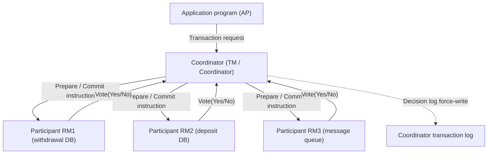
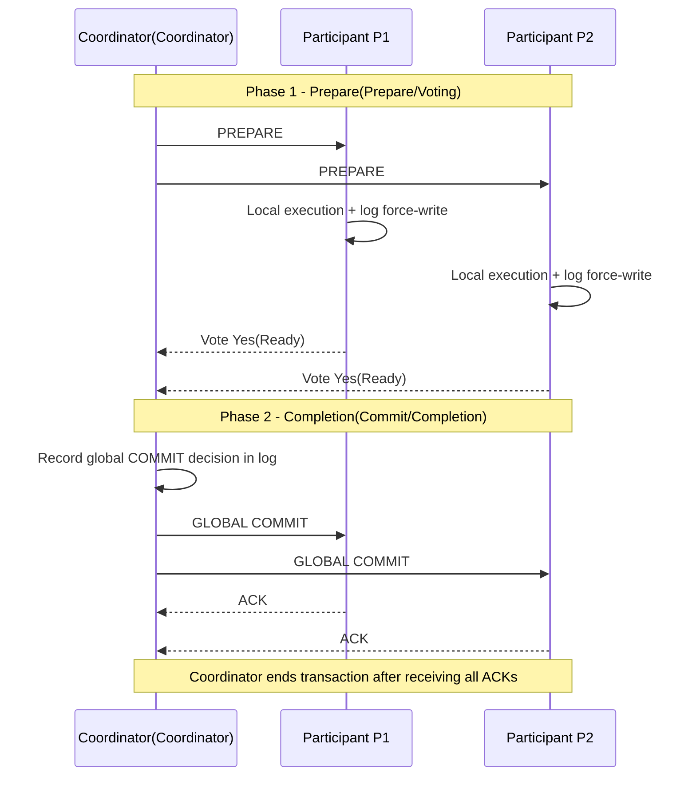
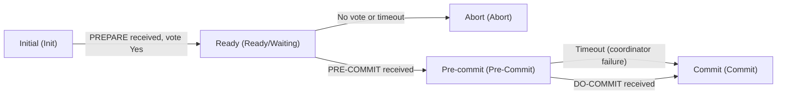

# Two-Phase Commit (2PC) and Three-Phase Commit (3PC) Protocols

## 1. Overview

> **Definition**: An Atomic Commit Protocol (ACP) is an agreement procedure that guarantees that the multiple distributed nodes participating in a single transaction either **all commit (Commit) or all abort (Abort)** the final outcome of that transaction; Two-Phase Commit (2PC) is its representative implementation, and Three-Phase Commit (3PC) is an extension intended to mitigate the blocking limitation of 2PC.

The inherent difficulty of distributed transactions starts from the fact that a single logical operation is performed across physically distinct Resource Managers (RMs). For example, a bank account transfer applies updates to two independent stores — the withdrawal DB and the deposit DB — and if only one side is reflected, a fatal consistency collapse occurs in which money disappears or is duplicated. In a single-node transaction, ACID's Atomicity can be guaranteed with logs and rollback alone, but in a distributed environment each node independently experiences failures, delays, and network disconnections, so whether "everything succeeded" **cannot be decided with a single command**. At this point, a two-phase structure becomes necessary: first ask for the participants' intent (vote), and notify the final decision only when all are ready.

This need for atomic commit was standardized with the emergence of distributed databases and transaction processing monitors (TP Monitors) in the 1980s. The DTP (Distributed Transaction Processing) model and XA interface defined by X/Open are representative, and even today 2PC is used in practice in JTA/JTS (Java Transaction API), transactional bridges of message queues, and integration between heterogeneous DBs. However, in microservices and cloud-native environments, the synchronous locking and blocking characteristics of 2PC hinder scalability, so it is being largely replaced by the Saga and event-based eventual consistency models discussed later. Nevertheless, 2PC/3PC is the reference point for explaining "why strong consistency is expensive" and the theoretical foundation directly tied to CAP and the FLP impossibility theorem, so it must be understood precisely from the Professional Engineer's perspective.

It is also important to view atomic commit as a special form of the consensus problem. It resembles consensus in that each participant proposes Yes/No and all must reach the same final decision (commit/abort), but it is a harder problem with the added constraint that "if there is even a single No, it must abort." For this reason, it has been theoretically proven that if even one node can die in an asynchronous network, a non-blocking atomic commit that "always terminates and is always correct" cannot exist. 2PC accepting blocking and 3PC accepting consistency risk are the results of evading this impossibility in different ways, and all the trade-offs of the two protocols derive from this fundamental limit.

- **Guarantee of atomicity**: Fundamentally blocks partial commit through either all participants committing or all aborting.
- **Separation of roles**: Clear division of responsibilities between the Coordinator (TM) and Participants (RMs).
- **Log-based recovery**: Each node **force-writes** its decision before responding, enabling resumption after failure.

## 2. Overall Structure and Participating Entities

The commit of a distributed transaction has a star-shaped control flow in which a single coordinator directs multiple participants. The structural diagram below shows the skeleton of the X/Open DTP model, in which an application program (AP) binds multiple resource managers (RM = participants) through a transaction manager (TM = coordinator). The coordinator governs the start and end of the transaction and tallies votes, while participants handle actual data updates and local log management. The key point in this structure is that **decision authority is concentrated in a single coordinator**, which is both the advantage that guarantees consistent results and the root of the weakness that the coordinator becomes a single point of failure (SPOF).

In this star structure, the coordinator role may be taken by a separate transaction manager process, or one of the participating nodes may double as it. Either way, the coordinator issues a transaction identifier (XID) so that all participants refer to the same transaction, and manages the participant list and vote results. When participants are added dynamically (when a new resource is registered mid-transaction), the coordinator must incorporate it into the participant set, and this registration information must also be stably preserved before the decision so that, after a restart, the decision can be notified to everyone without omission. In short, the coordinator is the single point of authority responsible for both membership — "who belongs to this transaction" — and outcome — "what was decided."

The coordinator and participants each record their own state in a log on stable storage. This log is the pillar that upholds the reliability of the protocol. Before voting "Yes," a participant must **first force-write to disk** all changes it can commit as REDO/UNDO logs, so that even if a failure occurs after voting, it can complete commit or abort according to the coordinator's final decision upon restart. Likewise, the coordinator notifies participants only after force-writing the final decision (global commit/abort) to its log. If this WAL (Write-Ahead Logging) principle of "record first, notify later" is not upheld, each node reaches a different conclusion after a failure, breaking atomicity.

Meanwhile, the interval from the moment a participant votes "Yes" until it receives the final notification is called the **in-doubt (uncertain) state**. A participant in this state cannot decide on its own whether to commit or abort and must wait solely for the coordinator's instruction, continuing to hold locks on the relevant resources in the meantime. The existence of this uncertain interval is the direct cause of 2PC's blocking problem and performance degradation, and it is also the target that 3PC attempts to address.

From a message complexity perspective, with N participants, standard 2PC requires at least `3N` messages from the coordinator's standpoint (Prepare N + Decision N + ACK N), along with one forced log write by the coordinator and two by each participant. These synchronous round trips and disk I/O define the lower bound of latency, so the more participants there are or the more geographically distributed they are, the more commit latency grows, beyond linearly. This is why optimizations such as presumed abort aim to reduce this cost, and at large-scale distribution it becomes advantageous to change the protocol itself to a consensus-based one.

## 3. Procedure of Two-Phase Commit (2PC)

As its name implies, 2PC consists of two rounds: the **Voting/Prepare Phase** and the **Completion/Commit Phase**. In the first phase, the coordinator sends `PREPARE` to all participants asking "are you ready to commit?", and each participant executes and validates the transaction locally, force-writes its log, and responds with `Yes(Ready)` or `No(Abort)`. In the second phase, the coordinator tallies the votes and decides **global abort if even one is No or there is no response**, or global commit if all are Yes, records this in its log, and then notifies all participants. Participants finalize commit/abort as notified and reply with `ACK`, and the coordinator ends the transaction once it receives all ACKs.

The sequence diagram below shows the normal commit path step by step. Each arrow is a network round trip, and it should be noted that with N participants, at least two broadcast round trips and numerous forced log writes occur. These synchronous round trips define the latency and throughput limits of 2PC.

**A. Meaning of the prepare phase and lock retention.** A participant voting `Yes` is not a mere response but a contract stating "I guarantee that I can commit this transaction under any circumstances thereafter." Therefore, before voting, it must validate all conditions that determine commit success — integrity constraints, triggers, free disk space, etc. — and securely hold the changes and locks. From this point on, the participant holds exclusive locks on the related records until the final notification, so other transactions must wait for those resources. The structure in which a single distributed transaction holds locks on multiple nodes for a long time significantly reduces throughput; in practice it is common for a single 2PC to cause lock hold times of tens to hundreds of milliseconds, becoming a bottleneck in high-TPS services.

Because of this contractual nature, the prepare phase must effectively be a state in which "execution is finished but only confirmation is deferred." If a participant votes `Yes` and then falls into a situation where it actually cannot commit (lock release, session termination, resource reclamation), atomicity collapses, so resource managers take special care to protect transactions after a Yes vote (isolation of the prepared state). For this reason, the prepare phase consumes significant resources, and if the coordinator does not respond for a long time, prepared transactions accumulate and eat into resources as a side effect. Operators should monitor such in-doubt transactions and establish a policy that allows administrator intervention (heuristic decision) only as a last resort.

**B. Completion phase and optimizations (Presumed Abort/Commit).** Standard 2PC requires numerous log I/Os, including recording the decision log, notification, collecting ACKs, and recording the end log. To reduce these, **Presumed Abort** and **Presumed Commit** optimizations are widely used. Presumed Abort exploits the property that it is safe for the coordinator to answer "aborted" to an inquiry about a transaction whose information it has lost (not in the log), omitting log records and ACKs on abort. Most commercial DBMSs (e.g., Oracle's distributed transactions, X/Open XA implementations) adopt Presumed Abort by default, minimizing overhead on the normal commit path. This design philosophy of "making the frequent path cheap" is a common principle across transaction systems.

**C. Failure scenarios and the blocking problem.** 2PC's fatal weakness is revealed **when the coordinator dies after Phase 1**. If the coordinator goes down right after all participants have voted `Yes` and entered the uncertain state, participants have no way of knowing whether the final decision is commit or abort. If they commit on their own, there is a risk the coordinator decided to abort, and if they abort on their own, the reverse risk exists, so participants must **wait indefinitely (blocking) until the coordinator recovers** while continuing to hold locks. This blocking is a fundamental availability flaw in which a single node failure halts the progress of the entire system. Some situations (where someone has already been notified of the decision) can be resolved with a **cooperative termination protocol**, in which participants ask one another, but if everyone is in the uncertain state they still have no choice but to wait.

**D. Recovery rules by failure point.** The robustness of the protocol comes from "converging to the correct conclusion after restart no matter when a node dies." The table below summarizes recovery rules according to where the failure occurs, all grounded in the forced log write (WAL) principle explained earlier. If a participant dies before voting, there is no trace in its log, so it is safely considered aborted; if it dies after voting (uncertain state), it re-inquires the coordinator about the final decision based on the Ready record in its log. If the coordinator dies before leaving a decision log, the result is abort; if it dies after, it re-propagates the decision in its log.

| Failure Location | Log State | Handling After Restart |
|-----------|-----------|----------------|
| Participant, before voting | No Prepare record | Considered aborted (presumed abort) |
| Participant, after voting (uncertain) | Ready record exists | Re-inquire coordinator for decision, hold locks until then |
| Coordinator, before decision | No global decision record | Global abort |
| Coordinator, after decision | Commit/Abort record exists | Re-propagate that decision to participants |

As this table shows, 2PC's consistency is never broken under any combination of failures. However, the item "wait for re-inquiry while holding locks in the uncertain state" is precisely the substance of the blocking pointed out earlier, reconfirming the fundamental tension between availability and consistency.

## 4. Procedure of Three-Phase Commit (3PC) and Comparison

3PC is a protocol that splits the completion phase once more with a **Pre-Commit** phase to mitigate 2PC's blocking. The core idea is to "first propagate to everyone the very fact that all are ready to commit, before finalizing the commit." When the coordinator confirms all `Yes` votes, it does not commit immediately but broadcasts `PRE-COMMIT` so participants recognize that "it will be committed soon," and only after receiving the participants' ACKs does it send `DO-COMMIT`. This way, even if the coordinator dies, the surviving participants can **autonomously infer** the final decision based on whether they received Pre-Commit. If anyone received Pre-Commit, it means everyone voted Yes, so they terminate with commit; if no one received it, they terminate with abort.

The point of the state transition diagram above is the rule that **if a timeout occurs in the pre-commit state, it proceeds to commit, not abort**. This "timeout-based autonomous termination" makes 3PC **non-blocking**. That is, even if the coordinator does not respond, participants can terminate on their own according to fixed rules instead of waiting indefinitely. However, this non-blocking property holds only under the premise that **there are no network partitions, only node failures** (synchronous network assumption). If a network partition actually occurs, the two partitioned groups may make different timeout judgments, causing an **inconsistency (split-brain)** in which one side commits and the other aborts. For this reason, despite its theoretical elegance, 3PC is rarely adopted in commercial systems, and instead the consensus-based (Paxos/Raft) approach discussed in the deep dive below has become the practical standard.

The difference between the two protocols lies not simply in the number of phases but in **which property is given up under which failure assumptions**. The table below summarizes that trade-off, and the "reason" for each item is based on the descriptions in the main text above.

| Category | Two-Phase Commit (2PC) | Three-Phase Commit (3PC) |
|------|----------------|----------------|
| Number of rounds | 2 phases (Prepare→Commit) | 3 phases (Prepare→Pre-Commit→Commit) |
| On coordinator failure | Blocking (indefinite wait) occurs | Non-blocking termination via timeout |
| Network partition | Safe (consistency maintained, but waits) | Risk of inconsistency (split-brain) |
| Messages/latency | Fewer (2 round trips) | More (3 round trips, increased latency) |
| Practical adoption | Widespread (XA, JTA, DBMS) | Rare (mainly theory/education) |

The practical implication here is clear. 2PC **sacrifices availability (Liveness) for consistency (Safety)**, while 3PC gains availability under a specific failure model at the cost of **consistency risk during partitions** and increased latency. Ultimately, the shadow of the FLP (Fischer-Lynch-Paterson) impossibility theorem — that "achieving perfect atomic commit in a non-blocking way is impossible in an asynchronous network" — hangs over both protocols.

Looking more concretely at why 3PC has been shunned in practice: first, the increased latency from the additional round is hard to tolerate for most workloads; second, the assumption under which 3PC's non-blocking property holds — "synchronous network, only node failures" — diverges from real data centers (variable latency, timeout misjudgments, partial partitions); and third, for the same effort, replicating the coordinator with Paxos/Raft is a better solution that achieves high availability while preserving consistency even during partitions. That is, it is accurate to understand 3PC as "a transitional idea between 2PC and consensus-based commit."

## 5. Deep Dive: Practical Application and Alternatives — XA, Saga, Consensus-Based Commit

**A. XA/DTP and integration of heterogeneous resources.** The area where 2PC is most clearly alive in practice is the integration of heterogeneous resources via the X/Open XA interface. For example, when a relational DB update and a JMS message publication in order processing must be bound into a single atomic unit, a JTA transaction manager (e.g., Narayana, Atomikos) registers the two resources via XA and commits them with 2PC. This approach provides strong consistency, but has the constraints that lock hold times are long and that the whole scheme fails if even one resource manager does not support XA. Hence, in payment and order domains requiring high performance, there are increasing cases of bypassing XA with the **Outbox pattern + CDC, which incorporates message publication into the DB transaction**.

A part that requires particular care in XA operations is the **heuristic outcome**. If the coordinator's response is delayed for a long time, a resource manager may forcibly commit/roll back a prepared transaction through administrator intervention or its own policy, and if this diverges from the coordinator's final decision, a consistency violation called `heuristic mixed/hazard` is recorded. Since this is a data inconsistency that is not automatically recovered, operational standards must include the conditions under which heuristic decisions are permitted, alerts upon occurrence, and post-hoc manual consistency reconciliation procedures. In other words, one must recognize that adopting 2PC is a decision that takes on not only "strong consistency on the normal path" but also "the operational burden of the exception path."

**B. Saga and eventual consistency.** Because of the "database-per-service" principle, in which each service owns its DB, 2PC's global locking is fundamentally ill-suited to microservices. The widely used alternative is the Saga pattern, which divides one business transaction into a chain of local transactions and reverts them with **compensating transactions** on failure. Sagas scale well because they do not hold locks for long, but they must accept **eventual consistency**, in which intermediate states are exposed externally, and their weak isolation requires application-level supplements such as semaphores and version checks. That is, the strong consistency of 2PC and the high availability of Saga are a matter of choice from the CAP perspective, and should be decided by the level of consistency the domain requires.

For a concrete comparison, suppose an e-commerce payment flow that must process thousands of orders per second. If the three services — payment approval, inventory deduction, and point accrual — are bound with 2PC (XA), locks on three nodes are held for tens to hundreds of ms per transaction, causing effective throughput to plummet due to lock contention, and a momentary failure in any one service blocks all payments. On the other hand, if the same flow is structured as an orchestration saga, each service immediately commits and releases its local transaction, improving throughput several-fold, but the design must let users and settlement logic tolerate intermediate inconsistent intervals such as "payment approved but inventory deduction failed → payment cancellation compensation." The throughput and consistency gap when implementing the same requirement in the two ways shows that protocol selection is itself an architectural decision.

**C. Consensus-based atomic commit.** The approach that fundamentally solved 3PC's partition vulnerability is **Paxos Commit** and Raft-based commit. The idea is to have the coordinator's decision made by a replicated consensus group rather than a single node, absorbing coordinator failure into the consensus protocol's leader election. Google Spanner is the representative case implementing this principle at scale: it layers 2PC on top of each shard (Paxos group) but replicates the state of both the coordinator and participants, eliminating blocking and SPOF simultaneously, and guarantees even external consistency with TrueTime (atomic clocks + GPS). This is regarded as the modern standard combining "the atomicity of 2PC + the high availability of consensus." In this way, the industry has evolved not by abandoning 2PC but by reinforcing its weakness — coordinator reliability — with consensus.

**D. Expected exam direction and answer structuring strategy.** In the Professional Engineer exam, this topic tends to appear not as a standalone question but as the core argument for higher-level questions such as "methods for guaranteeing atomicity of distributed transactions," "data consistency in MSA," and "comparison of CAP/BASE and strong consistency." Therefore, an answer structured to (1) accurately present the 2PC procedure and logging principles with a sequence diagram, (2) clearly point out the blocking problem, and (3) connect to 3PC's limitations and the Saga and Paxos Commit alternatives, concluding with the narrative of "why strong consistency is expensive and how industry compromises," is advantageous for a high score. If it appears as a short-answer question (Period 1), present the essence — "2PC = atomicity guarantee, drawback = blocking, alternatives = 3PC/Saga" — concisely with a table.

## 6. Considerations and Implications

Atomic commit protocols are the topic that most vividly illustrates the proposition that "strong consistency in a distributed environment is not free." From the Professional Engineer's perspective, going beyond simply memorizing procedures, the fact that protocol selection is itself an architectural decision about availability, performance, and operational complexity can be summarized as follows.

- **Explicit choice of the consistency-availability trade-off (application strategy)**: Domain-specific consistency requirements should be defined first and the protocol selected afterward — e.g., 2PC/XA for finance and inventory domains that absolutely require strong atomicity, and Saga and event-based eventual consistency for user-facing services where scale and availability come first. "2PC across all segments" is an anti-pattern that harms scalability.
- **Securing coordinator high availability (trade-off management)**: The coordinator SPOF, 2PC's greatest risk, should be mitigated through replication of the coordinator log, standby coordinators, and further, Paxos/Raft-based coordinator replication. Simply introducing 3PC brings new problems — increased latency and consistency risk during partitions — so caution is required.
- **Lock hold time and performance observation (operations)**: Lock hold times of distributed transactions, the number of in-doubt transactions, and coordinator log I/O should be continuously monitored, and timeout and automatic resolution (heuristic decision) policies should be clearly specified. Since heuristic commit/rollback can break consistency, audit logs and post-hoc consistency verification must always accompany them.
- **Standards/technology integration and outlook (related technologies)**: XA/JTA, Outbox+CDC, saga orchestration, and Spanner-style consensus-based commit are not mutually exclusive but are combined hierarchically. Going forward, with external consistency guarantees based on TrueTime and Hybrid Logical Clocks (HLC) and the proliferation of cloud-managed distributed DBs (NewSQL), abstraction is expected to advance in the direction of applications delegating rather than directly handling commit protocols.
- **Architectural decision principles (design judgment)**: Protocol selection should be a risk-based judgment that weighs together the cost of consistency violations in the domain (financial loss, regulation, trust) and latency/availability requirements, rather than being decided by a single performance figure. Applying 2PC locally only to the core ledger where strong consistency is essential, and separating surrounding domains with Sagas — "setting consistency boundaries" — is the practical standard.
- **Testing and verification strategy (quality assurance)**: Defects in distributed commit surface not on the normal path but under combinations of failures, so chaos tests that inject forced termination at each phase of the coordinator/participants and automation of post-failure consistency re-verification (reconciliation) should be incorporated into CI. Verification that "it works fine under normal conditions" alone cannot establish trust in the atomicity guarantee.

## References

- X/Open, "Distributed Transaction Processing: The XA Specification" — https://pubs.opengroup.org/onlinepubs/009680699/toc.pdf
- Gray, J. & Lamport, L., "Consensus on Transaction Commit(Paxos Commit)", ACM TODS — https://lamport.azurewebsites.net/pubs/pubs.html#consensus-on-transaction-commit
- Google, "Spanner: Google's Globally-Distributed Database", OSDI 2012 — https://research.google/pubs/pub39966/
- Microsoft Docs, "Two-Phase Commit / Distributed Transactions" — https://learn.microsoft.com/en-us/windows/win32/cossdk/two-phase-commit-protocol

---

> **In one line**: 2PC guarantees the atomicity of distributed transactions through two-phase prepare/complete voting but has the weakness of blocking when the coordinator fails; 3PC adds a pre-commit phase aiming for non-blocking behavior but is vulnerable to network partitions, so industry balances consistency and availability to suit the domain with XA, Saga, and Paxos/Raft-based consensus commit.
