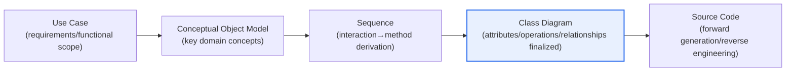
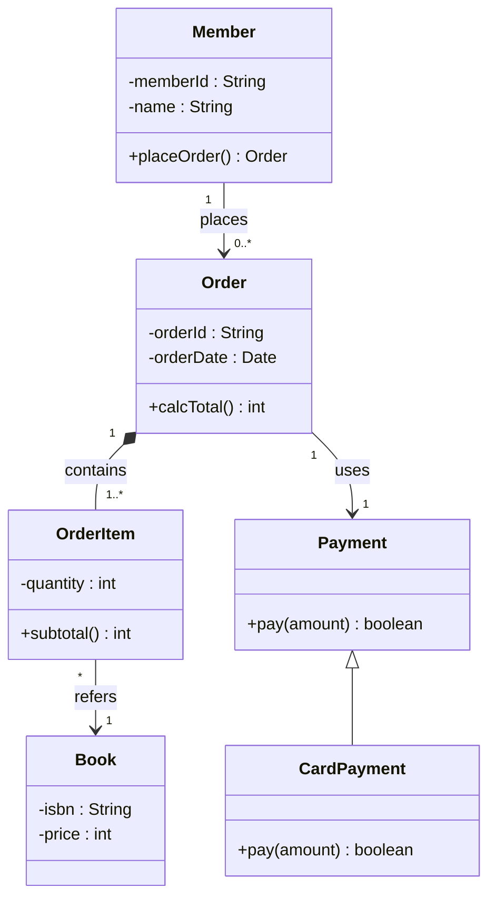

# UML Class Diagrams and Object Modeling

## 1. Overview

### A. Definition
> A **Class Diagram** is UML's representative structural (static) diagram that **expresses the classes composing a system, their attributes and operations, and the relationships between classes (association, aggregation, composition, generalization, dependency)**. It is the final deliverable of object-oriented analysis and design (OOAD) and the design blueprint that leads directly into source code.

The class diagram sits at the center of object-oriented design because it "**captures the skeleton (structure) of a system on a single page**." UML's various diagrams express different viewpoints. If the use case diagram shows "what the system does (requirements and functional scope)" and sequence/collaboration diagrams show "how things flow (dynamic interaction)," the class diagram shows "what the system is made of (static structure)." Object-oriented development refines itself incrementally by moving back and forth among these three viewpoints, and the point where they converge is the class diagram.

The typical flow of object-oriented analysis and design is as follows. First, key concepts (nouns) are extracted from the problem area (domain) to build a **conceptual object model (domain model)**, and scenario-specific interactions are concretized with **sequence diagrams**. At this stage, the messages exchanged between objects are promoted into methods (operations) of the receiving objects. Finally, these are synthesized into a **class diagram** in which attributes, operations, and relationships are finalized. For an online bookstore, for example, "Member, Book, Order, Shopping Cart" become conceptual objects; interactions such as "place an order, pay, deduct inventory" become methods; and their relationships (one order has many order items; a member places many orders) are organized as associations and multiplicities in the class diagram. In other words, the class diagram is the final convergence point of analysis and design activities, and the link that connects implementation and documentation.

### B. Background and Need
In the era of structured methodologies, data (ERD) and functions (DFD) were modeled separately, but data and the behavior (operations) that manipulated that data drifted apart, making systems fragile to change. Object orientation solved this problem by **encapsulating data and operations into a single object (class)**, and the UML class diagram is the visual standardization of that structure. UML emerged from the unification of the Booch, Rumbaugh (OMT), and Jacobson (OOSE) methods and was standardized by the OMG (currently UML 2.x). Among its diagrams, the class diagram is the most practical, as it connects directly to code generation and reverse engineering. The more complex a system becomes, the more it needs a common language for sharing and verifying its structure, and the class diagram is essential as a communication tool through which developers, designers, and stakeholders agree on structure.

### C. Modeling Flow at a Glance

## 2. Components of the Class Diagram

### A. Class Notation and Visibility
A class is drawn as a rectangle divided into three compartments. The top compartment holds the **class name**, the middle holds the **attributes**, and the bottom holds the **operations**. Attributes and operations are prefixed with a **visibility** symbol that specifies the access scope: `+` is public (exposed externally), `-` is private (only within the class itself), `#` is protected (access allowed through inheritance), and `~` is package (within the same package). For example, `- balance : int` means the balance is a hidden attribute that cannot be accessed directly from outside, while `+ withdraw(amount : int) : boolean` means a withdrawal operation that external code can call. Visibility is not merely notation; it is a mechanism that enforces the object-oriented principles of **encapsulation and information hiding** at the diagram level. If attributes are hidden as private and access is permitted only through public methods, the external contract (interface) is preserved even when the internal implementation changes, reducing the ripple effect of change.

### B. Types and Meanings of Relationships
The real expressive power of the class diagram lies in the **relationships between classes**. Relationships are divided into several kinds according to the strength and meaning of the coupling, and the choice of relationship directly determines design quality.

**Association** is a relationship in which two classes are structurally connected and know and reference each other. It is drawn as a solid line with **multiplicity (e.g., 1, 0..1, 1..\*, \*)** marked at both ends. For example, "one member places zero or more orders" is expressed as Member `1` — Order `0..*`. Navigability arrows can specify which side references which.

**Aggregation and Composition** are both "whole-part (has-a)" relationships but differ in coupling strength. Aggregation (hollow diamond) denotes loose ownership in which the part can exist independently of the whole (e.g., a department and its employees — employees still exist even if the department disappears), while composition (filled diamond) denotes strong ownership in which the part is bound to the lifecycle of the whole (e.g., an order and its order items — when the order is deleted, the order items disappear with it). This subtle difference determines, in implementation, the responsibility for object creation and destruction and the way references are managed.

**Generalization** is an inheritance (is-a) relationship, drawn as a hollow triangle arrow pointing to the parent (superclass). The child inherits and specializes the parent's attributes and operations (e.g., "Payment" as the parent with "Card Payment, Bank Transfer, Simple Payment" as children). **Realization** is the relationship between an interface and its implementing class (dashed line + triangle), and **Dependency** is a weak relationship in which one class temporarily uses another (as a parameter or local variable), drawn as a dashed arrow.

| Relationship | Notation | Meaning | Coupling |
|---|---|---|---|
| **Association** | Solid line + multiplicity | Structural reference | Medium |
| **Aggregation** | Hollow diamond | Whole-part (independent existence) | Weak |
| **Composition** | Filled diamond | Whole-part (lifecycle-dependent) | Strong |
| **Generalization** | Hollow triangle | Inheritance (is-a) | Strong |
| **Realization** | Dashed line + triangle | Interface implementation | Medium |
| **Dependency** | Dashed arrow | Temporary use | Weak |

### C. Structural Example Diagram
Below is an abbreviated class structure for an online bookstore domain, showing association, multiplicity, composition, and generalization together.

This diagram conveys structure far more compactly than a textual specification. The filled diamond (`*--`) connecting `Order` and `OrderItem` shows at a glance that this is a composition in which order items disappear together with the order, and the triangle (`<|--`) connecting `Payment` and `CardPayment` shows that card payment is a kind of payment.

## 3. Linkage with the Conceptual Object Model and Sequence Diagrams

The **conceptual object model (domain model)** is a pre-design stage that identifies only the key concepts (domain objects) of the problem area and their relationships. At this stage, implementation details (method signatures, visibility, data types) are not yet finalized; only "what concepts exist in this domain and how they are intertwined" is drawn. This makes it easier to communicate with stakeholders in the domain language (ubiquitous language) and allows the team to focus on the essence of the problem without technical bias.

Next, when messages between objects are defined along a specific scenario in a **sequence diagram**, those messages are promoted into **operations (methods)** of the receiving objects. For example, if the design says "the Order object sends a pay(amount) message to the Payment object," the Payment class gains a `pay(amount)` operation. The design is refined by reflecting operations derived from the dynamic model (sequence) into the static model (class), and conversely, the class structure verifies the feasibility of the sequence. The two models circulate complementarily and converge. [[uml-sequence]]

| Model | Viewpoint | Main Deliverables | Decisions Made |
|---|---|---|---|
| **Conceptual Object Model** | Domain concepts (static) | Key objects and relationships | What exists |
| **Sequence** | Dynamic interaction | Message→method | Who calls what |
| **Class** | Static structure (finalized) | Attributes, operations, relationships | What structure to implement |

The most important aspect of this linkage is **Responsibility Assignment**. Deciding well which object handles which message (i.e., in which class to place a method) yields a design with high cohesion and low coupling; deciding poorly produces a "God Class" in which responsibilities pile up in one class. The GRASP patterns (Information Expert, Creator, Controller, etc.) systematize these principles, and the class diagram is the container that holds the result.

## 4. Advanced — Design Patterns, Code Linkage, and Practical Application

The class diagram is also used as a **standard language for expressing and communicating design patterns**. The GoF design patterns (Strategy, Observer, Factory, Decorator, etc.) all have their structures defined with class diagrams. For example, the Strategy pattern is expressed as a structure in which a `Context` depends on a `Strategy` interface and concrete strategies realize it. This allows a design intent such as "let's separate payment methods with the Strategy pattern" to be agreed upon with a single diagram.

In practice, class diagrams connect bidirectionally with code through **Forward Engineering and Reverse Engineering**. Tools such as Enterprise Architect, Visual Paradigm, and the UML plugins for IntelliJ/Eclipse automatically generate class skeleton code from class diagrams (forward), or extract class structures from legacy source and visualize them as diagrams (reverse). The latter is especially useful for understanding poorly documented legacy systems or analyzing the impact of maintenance changes. Recently, as a code-first culture has spread, more teams are writing diagrams as text with **PlantUML and Mermaid** instead of heavy CASE tools and version-controlling them in the code repository (diagram-as-code). This lets design documents evolve together with code and reduces the "documentation-implementation mismatch" problem. However, in systems with complex domains, the practical approach is not to try to capture everything in a single class diagram but to divide it by Domain-Driven Design (DDD) bounded contexts to maintain highly cohesive models.

## 5. Considerations and Implications (Professional Engineer's Perspective)

1. **Maintaining consistency between models**: Use case → conceptual object → sequence → class must connect consistently. In particular, if the messages in sequence diagrams and the operations in classes, or the relationships in the conceptual model and the associations in classes, diverge, the reliability of the design collapses. Consistency must be continuously verified through the consistency checks of CASE tools or reviews of diagram-as-code.

2. **Appropriate abstraction level and evolutionary elaboration**: Classes at the analysis stage should be kept simple and domain-centric, with visibility, data types, and implementation details gradually added during design. Being overly detailed from the start causes maintenance and modification costs to explode when requirements change. Stepwise refinement of "analysis class → design class → implementation class" is desirable.

3. **Trade-offs between coupling/cohesion and relationship choice**: Which of aggregation/composition/generalization/dependency is used determines coupling strength. Inheritance (generalization) provides strong reuse, but changes to the parent ripple through all children, so following the principle "Favor composition over inheritance," judgment is needed to lower coupling with composition and interfaces where flexibility is required.

4. **Code generation/reverse engineering and documentation-implementation consistency**: Because class diagrams can be converted bidirectionally with code, they are strong for maintaining design-implementation consistency and understanding legacy systems. However, auto-generated code provides only a skeleton and should not be blindly trusted; an operational strategy of keeping diagrams in the repository as diagram-as-code (Mermaid/PlantUML) so they evolve with the code is effective.

5. **Model partitioning in large-scale domains**: As a system grows, a single class diagram loses readability. Maintainability and extensibility are secured by dividing it into packages and subsystems and applying DDD's bounded context and aggregate concepts to establish highly cohesive model boundaries.

## References
- OMG, Unified Modeling Language (UML) 2.5.1 specification: https://www.omg.org/spec/UML/
- IBM Developer, "UML basics: The class diagram": https://developer.ibm.com/articles/the-class-diagram/
- Mermaid, Class diagram documentation: https://mermaid.js.org/syntax/classDiagram.html
- Refactoring Guru, GoF design patterns (structural diagrams): https://refactoring.guru/design-patterns

---

> **In one line**: The class diagram is *a UML static model that expresses classes with their attributes and operations and the association, aggregation, composition, generalization, and dependency relationships among them*; it is the convergence point of object-oriented design flowing from conceptual object model → sequence (message→method) → class, a blueprint connected bidirectionally with code, and inter-model consistency, appropriate abstraction, and relationship choice (coupling) are the keys to design quality.
