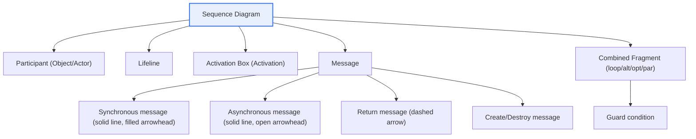

# UML Sequence Diagram

## 1. Overview

### A. Purpose and Concept
> A **Sequence Diagram** is a UML dynamic (behavioral) diagram that **expresses the messages exchanged between objects in chronological order**, showing how objects interact and collaborate in a specific scenario. In UML 2.x, it is classified as the representative diagram for expressing Interactions.

The essence of the sequence diagram is that it "**draws who requests what from whom, and when, along a timeline**." If the class diagram shows the static structure of a system (what exists, structural), the sequence diagram shows dynamic behavior (how it operates, behavioral). For example, in the scenario "a member logs in," the process in which messages flow sequentially from user → screen → authentication server → DB and responses return is drawn along a time axis from top to bottom. This reveals the internal processing flow of a use case, the distribution of responsibilities among objects, and the order of method calls at a glance, making it useful for design verification and communication.

In particular, the sequence diagram serves as a bridge that concretizes how a single use case is actually realized through object collaboration. If the use case diagram describes the external requirement of the system — "what it does" — the sequence diagram unpacks "how" that use case is processed through object collaboration. Because the responsibilities (methods) each object must have emerge naturally in this process, the sequence diagram is also used as a design tool for discovering and verifying the operations of the class diagram.

### B. Background and Need
In object-oriented design, static structure (classes) alone makes it difficult to verify how a system actually "behaves." The class diagram only says "these classes and methods exist"; it cannot show in what order those methods collaborate to complete a function. The gap that arises here becomes a breeding ground for design errors. Problems such as an object being called even though it holds none of the needed information, a request being fired asynchronously where a response should have been awaited, or responsibilities piling up excessively on a particular object (God Object) do not surface by looking at static structure alone.

By explicitly laying out this dynamic flow on a time axis, the sequence diagram helps designers verify the validity of collaborations before implementation begins. It also lowers communication costs by letting developers, planners, and QA understand a scenario through the same picture. Given that the earlier a defect is found in the requirements or design stage, the more exponentially its correction cost falls (the economics of early defect detection), the sequence diagram is a cost-efficient means of design verification.

### C. Relationship with the Collaboration (Communication) Diagram
The sequence diagram and the **collaboration (communication) diagram** are twins that express the same interaction from different viewpoints. The sequence diagram emphasizes **chronological order** (vertical time axis), focusing on "when," while the collaboration diagram emphasizes the **connections (links)** between objects, focusing on "how they are connected." The information the two diagrams contain is essentially the same, so they can be converted into each other. The sequence diagram is more suitable for scenarios where the flow of time matters (e.g., transaction processing order), and the collaboration diagram is more suitable where structural connections between objects matter.

## 2. Overall Structure and Components

The structure diagram below conceptually organizes how the elements that make up a sequence diagram relate to one another.



The following is an example of an actual login scenario expressed in sequence diagram syntax. Synchronous requests are drawn with solid arrows (`->>`) and returns with dashed arrows (`-->>`), and activation periods and conditional branching (alt) are shown together.

```mermaid
sequenceDiagram
  actor U as User
  participant S as Screen (Controller)
  participant A as Auth Server
  participant DB as Member DB
  U->>S: Login request (id, pw)
  activate S
  S->>A: Verify authentication (id, pw)
  activate A
  A->>DB: Look up member (id)
  activate DB
  DB-->>A: Return member info
  deactivate DB
  alt Password matches
    A-->>S: Authentication success (token)
    S-->>U: Display main screen
  else Mismatch
    A-->>S: Authentication failure
    S-->>U: Display error message
  end
  deactivate A
  deactivate S
```

### A. Participants and Lifelines
Entities participating in the interaction are placed at the top as rectangles (objects) or actor symbols, and the **vertical dashed line** extending downward from each participant is the lifeline. The lifeline is both the axis representing the flow of time (top → bottom) and an indication that the object exists during the interaction. Object notation is usually written in the form `objectName:ClassName` (underlined), and when emphasizing only the role rather than a specific instance, only the object name or class name may be written. Because how lifelines are arranged (choice and placement of participants) greatly affects the diagram's readability, it is best to select only the key collaborating objects and arrange them so the flow direction (left → right) feels natural.

### B. Activation Bar
The thin vertical rectangle drawn over a lifeline is the activation box (execution specification), representing **the period during which the object actually performs processing (an operation)**. Activation boxes reveal which object holds control from when to when and whether calls are nested. For example, in the example above, the activation box of the Screen (S) wraps the call to the Auth Server (A), and A's activation box in turn wraps the DB call, showing a nested structure. If this nesting becomes excessively deep, it may signal that control is overly bound to a particular flow, providing a clue for design refactoring.

### C. Types of Messages
Messages are the substantive content of a sequence diagram, and the shape of the arrow and the line type distinguish their meanings. A **synchronous message** (solid line + filled triangular arrowhead) is a request in which the caller waits until it receives a response, corresponding to an ordinary method call. An **asynchronous message** (solid line + open arrowhead) is a request that passes control without waiting for a response, used when the next task proceeds immediately after the call, such as publishing to a message queue or sending an event. A **return message** (dashed arrow) is the response to a call; it can be omitted, but it is better to show it to clarify the flow of result values. In addition, there are the **create message** that makes a new object (placing the target object at that point in time), the **destroy message** that removes an object (an X at the end of the lifeline), and the **self message**, in which an object calls itself (a looping arrow).

The distinction between synchronous and asynchronous is not merely a notational matter; it determines system characteristics. For example, it is advantageous for performance and responsiveness to design flows whose results must be confirmed, such as payment approval, as synchronous, and flows that need not wait for results, such as sending notifications or loading logs, as asynchronous. The sequence diagram makes this decision explicit through the arrow shape, imprinting the design intent in the documentation.

### D. Combined Fragments and Guards
Simple sequential flow alone cannot express control structures such as conditional branching and repetition. UML 2.0 introduced **combined fragments** for this purpose. Representative operators include conditional branching **alt** (one of several alternatives), optional execution **opt** (only when a condition is met), repetition **loop**, parallel execution **par**, and critical region **critical**. Each fragment is enclosed in a rectangular frame with the operator in the upper-left corner, and each branch is annotated with a **Guard condition** `[condition]`. The `alt [password matches] / else` in the login example above is a typical expression of conditional branching. Using fragments appropriately allows both the normal flow and exception flows to be captured in a single diagram, expressing them more cohesively than drawing several separate diagrams per scenario.

| Component | Description | Notation |
|---|---|---|
| **Object/Actor** | Entity participating in interaction | Rectangle or actor symbol at top |
| **Lifeline** | Object existence period / time axis | Vertical dashed line |
| **Activation Box** | Period of performing processing (operation) | Thin rectangle over lifeline |
| **Synchronous message** | Call that waits for response | Solid line, filled arrowhead |
| **Asynchronous message** | Call that does not wait for response | Solid line, open arrowhead |
| **Return message** | Response to a call | Dashed arrow |
| **Combined fragment** | Conditional, loop, parallel control | Frame (alt/opt/loop/par) |
| **Guard** | Condition for message execution | `[condition]` |

## 3. Drawing Procedure

A sequence diagram can be drawn without omissions by following the order below. Each step uses the output of the previous step as input and is refined incrementally.

| Step | Description | Key Points |
|---|---|---|
| **① Select scenario** | Decide the use case/scenario to express | Prioritize normal and major exception flows |
| **② Identify objects** | Place participating objects at top, lifelines | Select only key collaborating objects |
| **③ Arrange messages** | Place messages top→bottom in time order | Make request-response pairs clear |
| **④ Mark activation** | Activation boxes on processing periods | Check nesting depth |
| **⑤ Add conditions/loops** | alt, loop, opt, par fragments | Include exception and branch flows |
| **⑥ Review/check consistency** | Compare with class and use case | Method existence, validity of responsibility |

Object identification in step ② and consistency checking in step ⑥ in particular determine quality. The receiving object of a message must be an object that has the responsibility (method) to handle that message and the necessary information (Information Expert pattern), and through this check, which operations must be added to the class diagram is confirmed.

## 4. Comparison — Sequence vs. Collaboration vs. State vs. Activity Diagrams

There are several kinds of dynamic diagrams, and one must choose according to purpose. A common mistake is to force every flow into a single sequence diagram, which creates a mismatch in expressive power. The sequence diagram is strong in expressing **the chronological order of interactions between objects**, but it is unsuitable for expressing how a single object changes state in response to events (state diagram) or the overall flow of a business procedure including conditions and parallelism (activity diagram).

| Category | Emphasis | Suitable Situation | Limitation |
|---|---|---|---|
| **Sequence** | Chronological order of messages between objects | Collaboration within use case, call order | Hard to read with many objects/complex flows |
| **Collaboration (Communication)** | Connections between objects | Emphasizing structural links | Hard to grasp chronological order |
| **State** | State transitions of one object | Event-driven state changes | Unsuitable for multi-object collaboration |
| **Activity** | Processing flow, branching, parallelism | Business processes, workflows | Weak at expressing per-object responsibility |

The fundamental reason for these differences is that each diagram aims to capture a different "axis." Sequence takes time, state takes the lifetime of a single object, and activity takes control flow as its primary dimension. In practice, when understanding a function, teams draw use case (requirements) → activity (business procedure) → sequence (object collaboration) → state (lifetime of key objects) complementarily and verify from multiple angles.

## 5. Advanced — Practical Use and Expected Exam Directions

In practice, sequence diagrams are used in many contexts beyond design documentation. First, **API and microservice interaction design**. When the flow in which service A synchronously calls B and B in turn publishes an asynchronous event to C via a message queue is drawn as a sequence diagram, the synchronous/asynchronous boundaries and failure propagation points (e.g., A's timeout when B's response is delayed) become clear, leading to resilience design (circuit breakers, timeouts). Second, **explaining authentication and security protocols**. For protocols whose core is multi-party message exchange, such as the OAuth 2.0 authorization code flow or SAML-based SSO, the sequence diagram is the de facto standard means of explanation. Third, **defect analysis and review**. Reconstructing actual logs (call traces) as sequence diagrams makes it possible to visually pinpoint in which segment an unexpected call occurred.

In terms of tooling, too, the sequence diagram is highly accessible. Text-based tools such as PlantUML and Mermaid allow diagrams to be managed as code (diagram-as-code) for version control and review, and this study notes site also renders diagrams using Mermaid's `sequenceDiagram` syntax. This is advantageous for keeping diagrams up to date in agile environments where requirements and designs change frequently.

From the perspective of the Professional Engineer exam, the sequence diagram is frequently tested together with "types and comparison of UML dynamic diagrams," "use case realization," and "object-oriented design procedures." An answer strategy that secures depth is to ① position the sequence diagram within the static vs. dynamic diagram framework, ② present the components along with an example diagram, ③ discuss "when to use what" through comparison with collaboration, state, and activity diagrams, and ④ conclude with practical uses such as APIs and security protocols.

## 6. Considerations and Implications

1. **Leverage its value as a dynamic design verification tool.** The sequence diagram concretizes the internal processing flow of use cases and the distribution of responsibilities among objects, and is used to verify the completeness and validity of a design early and to discover class operations. Its utility is greatest when used as a tool for design thinking rather than as documentation decoration.
2. **The appropriate level of abstraction determines readability.** Drawing every message makes the diagram complex and actually hinders understanding. Focus on key scenarios and major interactions, and manage the information density of each diagram by separating details into other diagrams or delegating them with reference (ref) fragments.
3. **Maintain consistency with other UML diagrams.** In the chain of use case (what) → sequence (how it flows) → class (with what structure), the messages in the sequence diagram must correspond 1:1 with class methods. If consistency breaks, trust in the entire set of design documents collapses.
4. **Recognize that the synchronous/asynchronous choice is an architectural decision.** A single arrow shape affects responsiveness, coupling, and failure propagation. Because the sequence diagram makes this decision explicit, it should be chosen carefully in light of performance and resilience requirements, and the rationale should be documented.
5. **Maintain it as a living document (diagram-as-code).** Diagrams retain their value only if they are updated when the code changes. Codifying diagrams with Mermaid or PlantUML and including them in version control makes it easy to keep them current and benefits review and collaboration.

## References
- OMG, Unified Modeling Language (UML) Specification: https://www.omg.org/spec/UML/
- Mermaid Sequence Diagram documentation: https://mermaid.js.org/syntax/sequenceDiagram.html

---

> **In one line**: The sequence diagram is a UML dynamic diagram that *expresses messages between objects in chronological order*, composed of objects, lifelines, activation boxes, messages (synchronous/asynchronous/return), combined fragments (alt/loop/opt/par), and guards; it is a dynamic design tool that concretizes the internal collaboration flow of use cases to verify object responsibilities and synchronous/asynchronous boundaries early.
