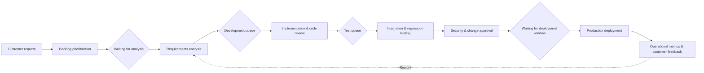
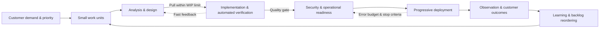

# Lean and DevOps Process Improvement Based on Value Stream Mapping (VSM)

## 1. Overview

### A. Definition

> **Value Stream Mapping (VSM)** is a Lean-based analysis technique that visualizes the entire flow from the moment a customer demand is received until value is delivered, together with work, information, waiting and quality data, and improves lead time and delivery performance by eliminating waste and bottlenecks.

VSM differs from a simple workflow diagram or organization chart.
A workflow diagram focuses on showing which activities run in which order, whereas VSM also looks at waiting time, rework, queues, approval delays, batch sizes and defect rates between activities.
It can therefore separate the time that actually creates value for the customer from the time that does not, and explain why total lead time becomes long.

The value stream in VSM is not a particular team's internal procedure but the end-to-end path by which a customer demand is converted into a result.
For a software service, one flow might span from idea/request intake through requirements analysis, development, testing, security review, deployment and operational feedback.
For manufacturing, it connects ordering, material procurement, production, inspection, shipping and customer delivery.
If the scope is too narrow, upstream and downstream bottlenecks are missed; if too broad, data collection and improvement prioritization become difficult.

### B. Background and Need

First, functional optimization does not guarantee overall performance.
Even if the development team achieves high development productivity, the time at which customers receive features does not improve if the test team's queue grows.
Even if the purchasing department lowers unit prices through bulk purchasing, the total lead time from order to delivery can actually lengthen if inventory and inspection delays increase.
VSM targets the entire flow for improvement, not team-level efficiency.

Second, the flow of knowledge work is hard to see.
Software requirements, code reviews, approvals, deployment permissions and test environments do not pile up like physical work-in-process, but they stagnate in the form of tickets, branches, pending approvals and release queues.
VSM expresses such waiting and handoffs as work data, revealing invisible Work in Process (WIP).

Third, in digital transformation and DevOps, automation alone does not eliminate bottlenecks.
Even if builds and deployments are automated, overall delivery speed is limited if requirements approval, environment access requests, manual regression testing and a change advisory board meet only weekly.
Introducing tools without first identifying the constraints of the flow merely creates automated queues.

Fourth, customer value and internal activities need to be linked on the same basis.
Measuring only activity volume — such as workload, lines of code, or number of meetings — can miss the outcomes customers actually receive.
VSM looks at the arrival rate of customer demand, throughput, lead time, quality and feedback cycles together, linking service performance with operational metrics.

### C. Core Purposes and Scope of Application

The first purpose of VSM is to draw the Current State based on facts.
A current state map shows not the ideal procedure but the path that recent representative work items actually traversed.
Not only the normal path but also bypass flows such as rejections, rework, exception approvals and urgent requests must be included to find the causes of bottlenecks.

The second purpose is designing the Future State.
The future state is not a declaration to eliminate all waiting, but an operational hypothesis that reduces waiting that does not contribute to customer value and stabilizes flow.
Each improvement item is given an owner, measurement metric, experiment period and stop criteria, turning it into an executable backlog.

The third purpose is establishing a continuous improvement loop.
Simply storing a map once made in a document repository produces no results.
Lead time, throughput, defect escape and rework ratios before and after changes must be compared, and policies and automation adjusted according to the results.

The scope of application can extend to feature development for a single product, customer support tickets, data pipelines, infrastructure changes, security vulnerability handling, and manufacturing and logistics flows.
However, for areas where outcomes and paths vary greatly, such as emergency response or creative research, the repeatable parts should be selected first.
Rather than mapping the entire enterprise at once, it is more effective to start with a flow that has a clear customer outcome and a high need for improvement.

## 2. VSM Components and Measurement Metrics

### A. Basic Elements of Flow

VSM consists of customers and suppliers, process boxes, inventory (WIP) between processes, information flow, material or work flow, and data boxes.
In software, the customer can be seen as an internal user or API consumer, and the material flow interpreted as the flow of digital work items such as tickets, commits, builds and releases.
More important than the notation symbols themselves is that participants agree on the same meaning for the start and end points, units of work, and the boundaries of the flow.

The arrival rate of customer demand means the number of work items flowing in over a given period.
Throughput is the number of work items completed and delivered to customers in the same period.
If the arrival rate persistently exceeds throughput, WIP and waiting time increase; even if throughput is higher, large demand variation can cause idleness and overload to alternate.

Process boxes record the responsible role, work time, waiting time, batch size, utilization, First Pass Yield (FPY) and rework rate.
Work time is the time actually spent hands-on processing, while waiting time is the time spent waiting for the next step or for approval, environments or information.
Mixing the two makes it hard to distinguish work to be automated from waiting to be eliminated through policy.

Information flow shows how requirement priorities, approval criteria, test results, change policies and operational feedback are communicated.
If information exists only in verbal meetings or personal messengers, the reproducibility of the flow drops and it stalls when the responsible person is absent.
Therefore, VSM also records the source, delivery cycle, quality and decision authority of information.

### B. Lead Time and Process Time

Total Lead Time is the elapsed time from when the customer makes a request until the customer receives the result.
Process Time is the sum of time actually spent on work at each step.
A large difference between the two may mean that waiting, handoffs, approvals and rework dominate the flow rather than the work itself being slow.

For example, suppose a feature request starts development 10 days later, waits 5 days in the test queue after 2 days of development, undergoes 1 day of security review, and then waits 7 days until the next deployment window.
Actual work time is 3 days, but customer lead time is 25 days.
In this case, merely increasing developers' coding speed has little overall effect; reducing waiting in the test queue and deployment policy is the priority.

Little's Law \(L = \lambda W\) states that in a stable system, the average number of work items in the system \(L\) equals the average throughput \(\lambda\) times the average time in system \(W\).
At the same throughput, reducing WIP creates room to lower average time in system, and at the same WIP, increasing throughput can reduce time in system.
However, in highly variable environments, rather than simply increasing WIP to maintain throughput, queue variability and the protective capacity of the bottleneck must be managed together.

### C. Key Metrics Table

| Metric | Meaning | Caution in Interpretation |
|---|---|---|
| Lead time | Time from request to customer delivery | Check P85/P95 and the distribution, not just the mean |
| Process time | Time actually spent on processing | Clearly define measurement rules on whether meetings/rework are included |
| WIP | Amount of work started but not completed | Track across the whole flow, not as per-team totals |
| Throughput | Number of items completed per unit time | Work size and definition of done must be consistent |
| FPY | Ratio passing to the next step without rework | Affected by changes in quality-gate strictness |
| Wait ratio | Waiting time / total lead time | Judge whether waiting is controlled or valuable rather than eliminating it unconditionally |
| Deployment frequency | Number of production releases in a period | Check that raising frequency does not increase failure rate |

The metrics in the table are not independent targets.
Skipping verification just to raise deployment frequency can worsen change failure rate and recovery time.
Conversely, bundling all changes into large batches for the sake of quality increases waiting time and change risk.
Therefore, flow metrics and quality/safety metrics are viewed together to confirm that improving one metric does not damage another.

## 3. VSM Procedure and Conceptual Diagrams

### A. Preparation and Scoping

The first step is to clearly define the customer outcome to be improved.
Rather than broad expressions like "improve the development process," define start and end events such as "shorten the time from receipt of a payment error fix request until a verified fix is applied in production."
Roles that actually create the flow — customer, product owner, development, testing, security, operations, support — must participate.

The size of the unit of work must also be fixed.
An epic and a single defect fix differ in processing time and approval path, so mixing them in one map makes averages meaningless.
Initially, choose one of features, defects or operational changes, and set common completion criteria and a time range.

During the observation period, system records and interviews are used together.
Extract ticket creation and status-change times, code review times, CI results, deployment approvals and monitoring alerts, while supplementing unrecorded verbal waiting and task switching through interviews.
If timestamps from different sources do not match, first agree on which record serves as the reference.

### B. Drawing the Current State Map

The current state is not about neatly drawing the ideal sequence.
Select representative work items, follow the path they actually traversed, and mark each step's work time, waiting time, WIP, quality and exceptions.
Ask front-line staff "why do you wait here?" and explore causes in policies, permissions, dependencies and capacity rather than individual attitudes.

The flow below is a simplified typical current state of a software change.
More important than the number of arrows in the diagram is in front of which step each queue exists and where information is delayed.

Do not write only per-step averages on the current state map; record the observed ranges and variance.
For example, even if average code review wait is 1 day, urgent changes may take 20 minutes and Friday-afternoon changes 4 days.
If P95 is sharply high, tail delays such as capacity shortage, priority conflicts and dependence on specific individuals must be analyzed separately.

### C. Designing the Future State

The future state includes shifting from a push model that forces customer demand in all at once to a pull model that draws work in line with available capacity.
WIP limits are set per step, and new work is pulled only when work is completed and space opens in the next step.
This approach encourages finishing blocked work first rather than increasing work that merely looks busy.

In the future state, the definition of done is extended to the entire flow.
If development done means a code merge and production deployment is another team's goal, features remain WIP until actual customer value occurs.
Defining completion criteria that include verification, security, documentation and operational monitoring reduces the illusion of partial completion.

Improvement items are not executed many at once.
Select the one constraint that creates the longest wait or the greatest variation, and validate the causal hypothesis with a small experiment.
For example, to reduce WIP in the test queue, introduce risk-based regression testing and automated parallel execution, and compare P85 lead time and defect escape rate before and after.

### D. Execution and Learning

In the execution phase, bottlenecks marked on the map are converted into an improvement backlog.
Each item records the problem statement, causal hypothesis, expected effect, owner, prerequisites, measurement metric and experiment period.
Rather than a solution like "automate it," scope should be written measurably, such as "approve 60% of low-risk changes — among changes waiting an average of 3 days for manual approval — after automated verification."

Even if an experiment succeeds, things revert to the old way unless standardized.
Reflect changes in pipeline configuration, permissions, runbooks, work templates, training materials and dashboards, and update the map and metrics again after a set period.
Even failed experiments become assets that narrow the search space for the next improvement if their causes and learnings are recorded.

## 4. Linkage with Lean, DevOps and Agile

### A. Relationship with Lean Principles

VSM makes concrete, as a visual analysis procedure, Lean's perspectives of value, value stream, flow, pull and continuous improvement.
Approval waiting, duplicate data entry, unnecessary transport, excess features and defect fixes — for which customers have no reason to pay — become waste candidates.
However, activities essential for customers and organizations to reduce risk, such as regulatory evidence or safety verification, must not simply be deleted as non-value activities.

The Lean perspective reduces waste while building quality into the process.
Reducing defect inflow through clear upstream completion criteria, automated tests, small batches and fast feedback is better for flow stability than strengthening downstream inspection to catch defects.
VSM shows at which step applying this principle has the greatest effect.

### B. Relationship with Agile

Agile emphasizes short iterations and customer feedback, while VSM measures the end-to-end flow through which iterations lead to actual customer delivery.
Even if many stories are development-complete within a sprint, customer value has not yet occurred if testing and production deployment slip to the next sprint.
Therefore, sprint velocity cannot replace VSM's throughput or customer lead time.

Agile teams can use VSM to identify waiting and handoffs that cross sprint boundaries.
Looking together at delays in product backlog prioritization, UX and security reviews, operational readiness and customer feedback reveals system constraints not visible in internal team retrospectives.
However, using it as a leaderboard for comparing teams induces data concealment and work splitting, so it must be used for flow improvement.

### C. Relationship with DevOps

DevOps automation, collaboration and continuous delivery are key means of implementing VSM's future state.
CI brings integration feedback forward, automated tests reduce manual waiting, and continuous and progressive deployment lower deployment batch size and risk.
Observability allows customer outcomes to be checked quickly after deployment, extending the endpoint of the flow to operational data.

However, connecting tools alone does not create a value stream.
If each team maintains different definitions of done and priorities, or the pipeline is automated but production access approval is manual, the bottleneck simply moves to the next step.
VSM compares total lead time and waiting distribution before and after tool adoption to verify whether automation actually improved customer outcomes.

## 5. Comparison and Cases

### A. Comparison of Process Flowchart, SIPOC and VSM

A process flowchart makes activities and branch structures easy to understand and is useful for training or controlling standard operating procedures.
SIPOC aligns suppliers, inputs, process, outputs and customers at a high level to quickly agree on scope.
VSM adds time, WIP, quality, and the flow of information and materials to set improvement priorities.

It is more appropriate to view the three techniques as hierarchically complementary than as substitutes.
First agree on customer outcomes and boundaries with SIPOC, detail normal and exception procedures with a flowchart, then quantify actual waiting and performance with VSM.
Conversely, making VSM a giant enterprise-wide map from the start reduces execution power due to scope disputes and lack of data.

| Category | Process Flowchart | SIPOC | VSM |
|---|---|---|---|
| Key question | In what order is it processed? | Who exchanges what with whom? | Where is value delayed? |
| Main concern | Activities, branches, responsibilities | Boundaries, inputs/outputs, customers | Time, WIP, quality, flow |
| Time data | Optional | Almost none | Core |
| Improvement use | Procedure standardization | Scope and stakeholder alignment | Bottleneck removal, lead time reduction |
| Suitable timing | Operational procedure design | Initial problem definition | Current-state diagnosis and continuous improvement |

### B. Software Deployment Case

Suppose a financial services organization performed VSM to reduce the lead time for mobile payment error fixes.
The average from request receipt to production release was 18 days, but actual development and testing work was only 4 days; the rest occurred in priority waiting, the security review queue and a once-a-week deployment window.
In particular, low-urgency defects showed tail delays longer than average because owner confirmation was late.

The first improvement was classifying defect types and risk levels to create an automated verification path for small changes.
The second improvement was not placing the security team only as the final approver, but providing threat model templates and pipeline check rules upstream.
The third improvement was eliminating the deployment window and instead establishing progressive deployment and automated rollback criteria to reduce waiting days for low-risk changes.

Performance was not judged by a single average.
P85 lead time, deployment failure rate, mean time to recovery, production escape of defects and number of security exceptions were viewed together to confirm that speed improvement did not lead to weakened controls.
The key to this case was not making developers work faster, but reducing waiting and large batches not directly connected to customer value.

### C. Manufacturing and Data Pipeline Cases

On the manufacturing floor, approvals and replanning can repeat while an order change is propagated to production planning, material preparation, machining, inspection and shipping.
Marking cycle time and waiting inventory per process with VSM makes it possible not only to raise the utilization of the bottleneck equipment but also to adjust batch sizes and transfer rules of upstream and downstream processes.
If inspection failures are handled only downstream, rework and delivery delays accumulate, so improvements that bring feedback to the causal process forward are needed.

In a data pipeline, the flow can be viewed from data request, schema review, ingestion, transformation, quality validation and catalog registration to model/report delivery.
Even if transformation is automated, the lead time of data products does not decrease if schema change approvals and privacy reviews pile up in an email queue.
Integrating contract-based schemas, automated quality validation and sensitive-data policy checks into the pipeline reduces waiting while leaving evidence of control.

## 6. Advanced Topic: Digital VSM and Flow-Based Operations

### A. Connecting Tool Data

Digital VSM links events from ticket systems, Git, CI/CD, test management, change management and observability systems through a common work identifier.
Because each tool's status names differ, normalization rules for "start," "waiting," "in progress," "verification," "deployment" and "done" must be defined first.
If identifiers are broken or work is arbitrarily split into multiple tickets, lead time and throughput are distorted.

Automated collection is convenient, but data is not the same as reality.
Work handled in messengers without status changes, emergency bypass deployments, manual approvals and retries after failure may be only partially recorded in system logs.
Dashboards should show the grounds for manual corrections and the data quality status rather than hiding outliers.

### B. Value Stream Management and Product-Centric Operations

When an organization shifts to product and platform teams, the boundaries of VSM can be reset to continuous product outcomes rather than project completion.
Rather than receiving a request and delivering once, a circular flow is managed that observes usage, incidents, customer satisfaction and cost and links them to the next improvement.
The key here is whether operational feedback is actually reflected in the backlog and priorities.

Flow-based operations aim not to maximize team workload but to deliver customer value stably.
Idle capacity can therefore be not waste but buffer capacity that absorbs urgent work and variation.
Forcing 100% utilization against plan makes queues explode even with small variations, and quality, learning and improvement activities are the first to be sacrificed.

## 7. Considerations and Implications

### A. Controlling Scope and Customer Value

The start and end points of VSM must be defined by customer outcomes, not organizational convenience.
Improving only intra-departmental throughput can move the bottleneck to other departments or customer touchpoints.
A phased approach — selecting one representative customer journey at first, then expanding to surrounding flows after improvement — is desirable.

### B. Measurement System and Data Quality

The definitions of lead time, throughput and WIP and the timestamp criteria must be documented.
Reporting only averages misses long delays and variability, so median, P85/P95, distributions and stratified analysis are used together.
Automatically collected data should be checked for omissions, duplicates and status-change errors, and access rights and retention policies established so that it is not misused for personal data or performance evaluation.

### C. Balancing Speed and Control

Unconditionally deleting approval steps is not improvement.
Classify regulatory, safety and security risks; apply automated verification and post-hoc monitoring to low-risk changes, and retain human judgment and evidence for high-risk changes.
A risk-based design that reduces waiting and repeated input while preserving the purpose of control is needed.

### D. Organizational and Behavioral Change

Using VSM for team productivity evaluations or ranking competitions produces side effects such as splitting work into tiny pieces or manipulating statuses.
The subject of metrics is the system, not individuals, and causes of delay should be treated as objects of learning and structural improvement rather than blame.
Silos can be reduced when product, development, operations, security and quality jointly own common metrics and the improvement backlog.

### E. Sustainability and Governance

A future state map is not a design document completed once but a management artifact updated according to changes in the operating environment and demand.
Review the flow quarterly or after significant organizational, tooling or regulatory changes, and confirm that the effects of improvement items are sustained.
Linking architecture decisions, service level objectives, change policies and audit evidence with VSM enables speed improvement and governance to be managed together.

### F. Implications from a Professional Engineer's Perspective

A Professional Engineer should use VSM not as simple field diagramming but as an enterprise improvement framework connecting business strategy, processes, applications, data and infrastructure.
Analyzing the flow of customer value together with system architecture dependencies makes it possible to distinguish whether a bottleneck stems from organizational rules, capacity or technical debt.
Improvement proposals must include not only expected effects but also investment cost, operational risk, transition order and rollback conditions to be usable for executive decision-making.

## 8. In One Line

---

> **In one line**: Value stream mapping is a core Lean/DevOps technique that makes time, waiting, WIP and quality from customer demand to delivery visible together, improving end-to-end flow bottlenecks on a risk basis rather than optimizing individual teams.
