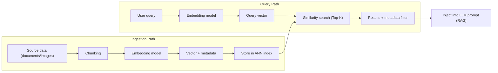
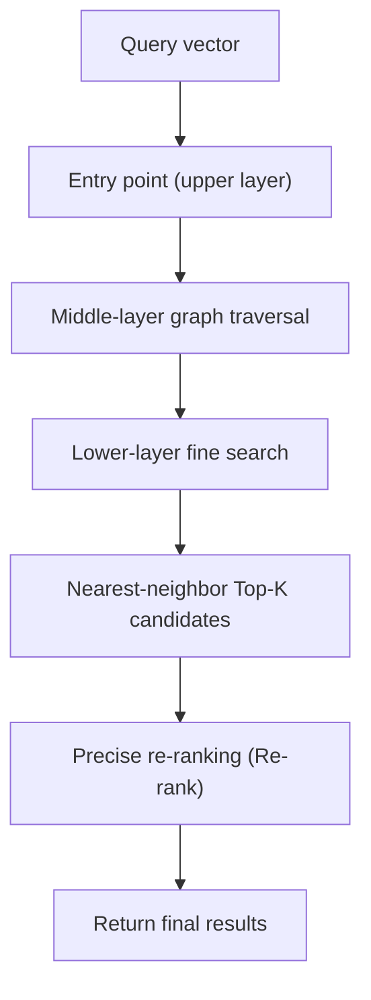

# Vector Database

## 1. Overview

> A **vector database** is a data management system that stores high-dimensional vectors produced by converting unstructured data such as text, images, and audio with an Embedding model, and quickly finds and returns vectors with high **semantic Similarity** to a query vector using Approximate Nearest Neighbor (ANN) search.

Traditional relational databases are optimized for **Exact Match** on values and range conditions, so they cannot process queries such as "find documents whose meaning is similar to this sentence." However, as generative AI and Retrieval-Augmented Generation (RAG) have spread, demand has surged for retrieving knowledge close to the *meaning* of a natural-language question in real time and injecting it into an LLM's prompt. When documents and images are represented as vectors with hundreds to thousands of dimensions, "close in meaning" becomes "close in distance in vector space," creating the need for a high-speed similarity search engine over large-scale vectors. The vector database emerged precisely to fill this gap.

The core value of a vector database is threefold. First, **semantic search** finds contextually relevant results even when keywords do not match exactly. Second, it balances accuracy and latency through **ANN indexes** so that it responds in milliseconds even over hundreds of millions of vectors. Third, it serves as the **Knowledge Store** for diverse AI pipelines such as RAG, recommendation, anomaly detection, and deduplication.

## 2. Operating Principles and Overall Structure

A vector database is divided into an **Ingestion** path that turns source data into embeddings, and a **Query** path that vectorizes queries and finds similar vectors. In the ingestion stage, documents are split into appropriately sized pieces (Chunking), vectorized with an embedding model, and the vectors are stored in the index together with the original text and metadata. In the query stage, the user query is vectorized with the same embedding model and the ANN index is searched to retrieve the top K (Top-K) similar vectors.

An important principle here is that **the same embedding model must be used for ingestion and query**. Vectors produced by different models have different coordinate systems, making distance comparisons meaningless. Therefore, replacing the embedding model requires recomputing all stored vectors (Re-indexing), which becomes a major operational cost factor.

### A. Similarity Measures

Similarity is defined as the distance between vectors. Representative measures include **cosine similarity**, which looks at the cosine of the angle between two vectors; the **Dot Product**, which uses the inner product of the vectors directly; and **Euclidean distance (L2)**, which looks at the straight-line distance between coordinates. Cosine similarity is widely used when the direction (meaning) of vectors matters and one wants to reduce the influence of magnitude (document length), as in document search. When embeddings are normalized, cosine similarity and dot product become effectively identical, so large-scale services sometimes prefer the computationally simpler dot product.

| Measure | Computation Concept | Main Use | Characteristics |
|---|---|---|---|
| Cosine similarity | Angle of vector direction | Document/sentence search | Excludes magnitude, emphasizes direction |
| Dot product | Vector inner product | Recommendation, normalized embeddings | Simple computation, reflects magnitude |
| Euclidean (L2) | Straight-line distance | Images/coordinates | Sensitive to absolute distance |

### B. ANN Index Algorithms

Brute-force search, which compares all of hundreds of millions of vectors, is accurate but slow. Therefore, ANN indexes are used that sacrifice a little accuracy in exchange for dramatically higher speed. Representative algorithms are the graph-based **HNSW (Hierarchical Navigable Small World)**, the cluster-partitioning-based **IVF (Inverted File)**, and **PQ (Product Quantization)**, which compresses vectors to save memory. HNSW explores neighbors along a hierarchical graph, achieving both high recall and low latency, and has become the de facto industry standard, though it has the drawback of high memory usage. IVF divides the vector space into multiple cells and searches only the few cells close to the query, making it advantageous for large volumes; combined with PQ (IVF-PQ), it can greatly reduce memory, so it is preferred by very large-scale services.

Here, accuracy (recall) and speed/memory are in a trade-off relationship. Increasing HNSW's `ef_search` (search breadth) raises recall but increases latency, and the same holds for increasing the number of cells probed in IVF (`nprobe`). In practice, a target SLA (e.g., p99 50ms, 95% recall) is set and parameters are tuned accordingly.

### C. Metadata Filtering and Hybrid Search

Real services need to combine vector similarity with structured conditions, such as "semantically similar documents in the security category written after 2024." To do this, **Pre/Post-filtering** is performed using the metadata stored with the vectors. Furthermore, **hybrid search**, which combines **sparse search (BM25, etc.)**, strong at exact keyword matching, with **dense vector search**, strong at semantic search, has recently become the standard, because keyword search compensates for areas where embeddings are weak, such as proper nouns, code, and numbers.

## 3. Comparison of Deployment Types

Vector search can be built as a separate dedicated engine or implemented as an extension of an existing database. Dedicated vector DBs (e.g., Pinecone, Milvus, Weaviate, Qdrant) excel at large-scale processing and diverse index and filter features, but they add another system and increase operational complexity. Conversely, relational DB extensions (such as PostgreSQL's pgvector) allow transactions and joins with existing data, lowering the adoption barrier, but may fall behind dedicated engines under very large-scale, ultra-low-latency requirements. Therefore, the choice must consider data scale, the existing stack, and team capability together.

| Category | Dedicated Vector DB | RDB Extension (pgvector, etc.) | Search Engine Integration (Elasticsearch, etc.) |
|---|---|---|---|
| Strengths | Very large scale, diverse ANN | Integration/joins with existing data | Keyword + vector hybrid |
| Weaknesses | Separate operational burden | Performance limits at very large scale | Vector features relatively late |
| Suitable Situation | AI services with hundreds of millions of vectors | Small-to-medium scale, alongside transactions | Reusing existing search assets |

For example, for a RAG chatbot over tens of thousands of internal policy documents, it is reasonable to start with pgvector to simplify operations, whereas for commerce recommendations handling hundreds of millions of products and reviews, it is better to control memory and latency with an IVF-PQ-based dedicated engine.

## 4. Advanced — RAG Quality and Recent Trends

The success or failure of a vector database translates directly into RAG answer quality. If retrieval is poor, the LLM generates unfounded answers (hallucination), so the combination of chunking strategy (splitting by paragraph or semantic unit), embedding model choice (domain fit), the Top-K count, and a **Re-ranking** model that reorders retrieved candidates is important. Recently, to address the problem of a single vector compressing multiple sentences and losing information, **ColBERT-style Late Interaction** techniques that increase precision with token-level multi-vectors, and multi-stage retrieval strategies that search with summaries and return the original text, have drawn attention. In addition, **Matryoshka embeddings**, which truncate embedding dimensions as circumstances require, are spreading as a means of flexibly adjusting storage cost and accuracy. In terms of standardization, there is a clear trend of pgvector establishing itself as the de facto open standard and being widely included in the major cloud managed DBs.

## 5. Considerations and Implications

From a Professional Engineer's perspective, adopting a vector database is not a simple storage choice but a decision that coordinates trade-offs across the entire AI service architecture.

- **Accuracy-performance-cost triangle trade-off**: HNSW/IVF parameters, vector dimensions, and quantization level simultaneously determine recall, latency, and memory. It is desirable to define the target SLA and budget first and work backward through benchmarks.
- **Embedding model dependency and re-indexing strategy**: Replacing a model triggers recomputation of all vectors, so zero-downtime re-indexing (Blue-Green Index) and a version management system must be designed in advance.
- **Data governance and security**: Original text and embeddings may contain personal information, and there is a risk that original text can be partially recovered via Embedding Inversion, so access control, encryption, and masking must be extended down to the vector layer.
- **Combine hybrid search and re-ranking**: Pure vector search alone is weak on proper nouns and numbers, so RAG quality is secured by combining keyword search and re-ranking models.
- **Operational observability**: Recall, latency, and index Freshness should be turned into metrics and continuously monitored through an observability system, along with sharding and horizontal scaling strategies in preparation for data growth.

In the future, vector search is expected to be absorbed into RDBs and search engines as a basic function, maturing from a "special system" into a "universal feature," and its importance will grow further with the spread of multimodal embeddings and agentic search.

## References
- pgvector project, https://github.com/pgvector/pgvector
- Malkov & Yashunin, "Efficient and robust approximate nearest neighbor search using HNSW", https://arxiv.org/abs/1603.09320

---
> **In one line**: A vector database performs high-speed similarity search over embedded high-dimensional vectors using ANN indexes, serving as the semantics-based knowledge store for RAG, recommendation, and anomaly detection, with the coordination of accuracy, performance, and cost trade-offs at its core.
