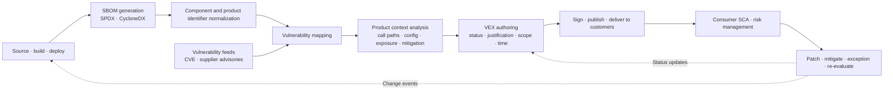
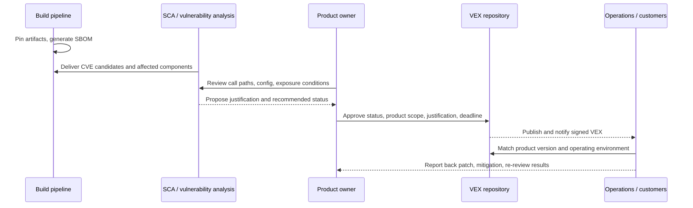

# VEX (Vulnerability Exploitability eXchange)-Based SBOM Vulnerability Impact Analysis and Supply Chain Response

## 1. Overview

### A. Definition

> VEX (Vulnerability Exploitability eXchange) is a security advisory format in which a supplier declares the relationship between a specific software product and a vulnerability using machine-readable status values and justifications, conveying whether the vulnerability affects the product and what action is required.

In modern software, external components such as operating systems, open-source libraries, container images, build plugins, and model runtimes often make up a larger share than directly written code. When a new CVE is published, SCA tools compare the SBOM with vulnerability databases to generate potential alerts. However, the fact that a component is present is different from the fact that the vulnerable code path is actually executed in the product.

For example, even if a product includes an image conversion library, the vulnerable parser may be disabled, or it may be used only in a server-side function that attackers cannot reach. Conversely, if runtime configuration causes a normally invisible plugin to process external input, the version number alone is insufficient for judgment. VEX extends this gap from "is the component present?" to "what is the status of the vulnerability in this product context?"

CISA describes VEX as a security advisory indicating whether a product is affected by known vulnerabilities, and suggests that using it together with SBOM enables faster assessment of the actual impact of vulnerabilities ([CISA SBOM](https://www.cisa.gov/sbom)). Therefore, VEX is not a list that replaces the SBOM, but an impact judgment layer connecting the SBOM, vulnerability information, and product analysis results.

### B. Background and Necessity

First, the scale of vulnerability alerts has exceeded manual review capacity. When a single product has hundreds of transitive dependencies, a single published vulnerability appears as repeated alerts across multiple versions and distributions. If all alerts are handled with the same urgency, the security team spends more time on non-exploitable alerts than on vulnerabilities actually exposed to the internet.

Second, the software supply chain extends beyond the boundary of a single organization. Even if an open-source project knows of a vulnerability in its library, it is hard for it to know the actual call paths of end products that include the library. Since product suppliers can analyze their own builds, configurations, and call structures, they must explain, at the product level, how vulnerabilities in subcomponents affect the finished product.

Third, customers need "how should we operate our product right now?" rather than a list saying "there is a CVE." If affected, a patch or mitigation is needed; if not affected, the justification for that judgment and the conditions for re-review are needed. VEX conveys this decision simultaneously as a human-readable explanation and as status values processed by tools.

### C. Goals and Non-Goals

The goal of VEX is to express the product impact status per vulnerability with trustworthy identifiers and justifications, so that suppliers, operators, and auditors reuse the same facts. To achieve this, the product version range, vulnerability identifier, time of status change, author, and investigation justification must be mutually traceable.

On the other hand, VEX is not a free pass for hiding the existence of vulnerabilities. To mark "NOT AFFECTED," there must be justification such as product composition, reachability, and mitigating controls, and if that justification changes, the status must be re-evaluated. In addition, VEX does not automatically replace patch management systems or risk acceptance approvals.

## 2. Core Concepts and Overall Structure

### A. Relationship among SBOM, Vulnerability Information, and VEX

The SBOM describes the components and dependencies that make up the product. Vulnerability data describes the fact that a known defect exists in a specific component or code, its severity, and the affected and fixed versions. VEX applies these two pieces of information to the product's actual build, configuration, and execution context, and then declares the product-level impact status.

Separating these three layers clarifies responsibilities. Without an SBOM, you do not know what to evaluate; if vulnerability information is outdated, risk signals are delayed. Without VEX analysis, all potential alerts look the same, and without VEX justification, consumers cannot verify the supplier's declaration.

| Layer | Key question | Representative outputs | Primary responsibility |
|---|---|---|---|
| Composition transparency | What is in the product? | SBOM, dependencies, hashes | Build / product supplier |
| Vulnerability knowledge | Which defect exists in which version? | CVE, CWE, CVSS, fixed version | Vulnerability authorities / suppliers |
| Impact judgment | Is this product actually affected? | VEX statement, status justification | Product supplier / operator |
| Response execution | What will be done, and when? | Tickets, patches, mitigations, exception approvals | Service operations / risk owner |

In this relationship, VEX should not be seen merely as "a filter on the vulnerability list." A filter can delete alerts, but VEX records why an alert was reduced and to which product scope it applies. Thus, VEX functions as evidence for vulnerability management and as a supply chain communication contract.

### B. VEX Reference Architecture

The center of this structure is product context analysis. A simple join of SBOM and vulnerability data only produces "possible candidates," and the actual VEX status must be determined after verifying the product's code paths and deployment conditions. Even with the same library version, the impact can differ depending on feature flags, compile options, operating system patches, and network exposure.

### C. Statements Expressing the Relationship between Products and Vulnerabilities

The basic unit of VEX is the combination of a specific product, a specific vulnerability, a status, and the author and time that produced the judgment. A product should not be written only by name but with identifiers that allow consumers to find the same target, such as version, package URL (PURL), hash, and supplier identifier. Vulnerabilities also need not rely only on CVE; supplier advisory IDs or other standard identifiers can be used together.

One document can contain multiple statements, but the scope of each statement must not be ambiguous. Rather than broad sentences like "the entire product is safe," it is better for verification and automation to specify the intersection of product, version, and vulnerability, as in "CVE-XXXX is NOT AFFECTED in a specific configuration of product 4.2.1."

Timeliness is as important as status in a statement. If the product is rebuilt or its configuration changes, a previous NOT AFFECTED judgment may no longer hold. Therefore, the document issue date, revision date, validity scope of the status, and next re-review conditions must be managed, so that consumers can determine which is the latest document for a given product.

## 3. Status Semantics and Data Model

### A. Four Core Statuses

The representative statuses defined by CISA are NOT AFFECTED, AFFECTED, FIXED, and UNDER INVESTIGATION ([CISA VEX Use Cases](https://www.cisa.gov/sites/default/files/publications/VEX_Use_Cases_Document_508c.pdf)). Rather than just storing the spelling of the status names, organizations should define which actions their tools link each status to.

| Status | Meaning | Default action | Misuse |
|---|---|---|---|
| NOT AFFECTED | The product is not affected by the vulnerability in its context | Close the alert but preserve justification and re-evaluation conditions | Deleting alerts without justification |
| AFFECTED | The vulnerability affects the product and action is required | Patch, upgrade, mitigate, block exposure | Asserting product impact from CVSS alone |
| FIXED | The fix is included in the product version or build | Deploy the fixed version and retire previous versions | Fixing source only without verifying deliverables |
| UNDER INVESTIGATION | Impact has not yet been determined | Set investigation deadline, interim mitigation, tracking ticket | Using the investigating status as a long-term closure |

NOT AFFECTED differs from "the vulnerability does not exist." It may mean that although the vulnerable component exists in the SBOM, the product does not use the relevant function or vulnerable path. Conversely, AFFECTED does not necessarily mean remote code execution has been confirmed, but is a judgment that impact is possible under the product's conditions and a response is needed.

FIXED is also not a guarantee that the product is safe forever. The fixed version may contain new vulnerabilities, and customers may keep deploying vulnerable previous images or caches. Therefore, the fixed status must be linked to the product release identifier and deployment verification results.

UNDER INVESTIGATION is not a status that hides risk but one that makes uncertainty explicit. When consumers encounter this status, they should apply interim mitigation or isolation based on severity, external exposure, and signs of exploitation. Suppliers should present a target investigation completion date and conditions for issuing follow-up documents.

### B. Justifying NOT AFFECTED

The quality of NOT AFFECTED depends more on the justification than on the status name. Whether the vulnerable code was not included in the product, the product was built only with unaffected versions, the vulnerable feature was excluded at compile time or by configuration, or the code is structurally unreachable, each case requires different controls and re-review conditions.

Representative justification perspectives are as follows.

1. **Component not present**: The vulnerable component is not in the actual deployed artifacts of the product SBOM.
2. **Vulnerable feature not used**: The component exists, but the vulnerable function, module, or protocol is not used at build time or runtime.
3. **Unreachable**: Privileges, network, and call structure are restricted so that attackers cannot deliver input to the vulnerable code path.
4. **Mitigation applied**: Even without a patch, controls such as configuration, sandboxing, input validation, and isolation eliminate the vulnerability's impact or reduce it to an acceptable level.
5. **Impact scope mismatch**: The operating system, architecture, or build options required by the vulnerability differ from the product environment.

Justification should not end at "a developer checked it," but should reference evidence such as the analysis tool version, test results, code paths, configuration files, and product version. In addition, a NOT AFFECTED that relies on mitigation should be linked to events so that it is automatically re-reviewed when the mitigating control is removed or the configuration changes.

### C. Minimum Data Elements

CISA's 2023 minimum requirements document defines document metadata, product information, vulnerability information, and product status independently of VEX format and implementation ([CISA Minimum Requirements for VEX](https://www.cisa.gov/sites/default/files/2023-04/minimum-requirements-for-vex-508c.pdf)). Organizations may add internal control, signature, and justification fields to these minimum elements, but should not arbitrarily change the core semantics for the sake of interoperability.

Document metadata includes the format identifier, document identifier, author and role, timestamp, and document version. Product information includes not only supplier, product name, and version but, where possible, PURL, CPE, hash, product family, and subcomponent identifiers to reduce target ambiguity.

Vulnerability information includes the CVE or supplier vulnerability ID, vulnerability description, and related references. Product status includes one of the four statuses and the product scope to which the status applies; the justification for the status and the recommended action should accompany it so that consumers can perform both automation and human review.

| Data area | Question that must be answered | Information to add operationally |
|---|---|---|
| Document metadata | Who created which document, and when? | Signature, tool version, document revocation/supersession relations |
| Product | To which product, version, and build does it apply? | PURL, hash, distribution channel, environment profile |
| Vulnerability | Which defect was evaluated? | CVE, supplier ID, CVSS, exploitation info |
| Status | Is it affected, has it been fixed? | Justification, mitigation, SLA, re-review conditions |
| Traceability | On what basis was the judgment made? | Tests, code analysis, approval tickets, audit logs |

## 4. Formats, Standards, and Interoperability

### A. Format Is a Representation; Semantics Must Be Separated

VEX does not refer to a single file format. The same product impact status can be expressed in the CSAF VEX profile, OpenVEX, CycloneDX, SPDX Security Profile, and others. Therefore, before becoming dependent on a particular tool's JSON schema, organizations should define internally a semantic model of product, vulnerability, status, and justification.

OpenVEX is a lightweight, embeddable implementation designed to meet the VEX minimum requirements, treating a statement as a combination of product, vulnerability, and status ([OpenVEX specification](https://github.com/openvex/spec/blob/main/OPENVEX-SPEC.md)). However, as the official repository states, it should be adopted as an operating standard only after checking the specification's maturity and the extent of tool support.

CycloneDX provides VEX capabilities within an extensible model that expresses SBOM and supply chain information together, focusing on conveying whether a vulnerability is actually exploitable in a specific product context ([CycloneDX VEX](https://cyclonedx.org/capabilities/vex/)). The SPDX 3 family can express the impact and fix relationships between vulnerabilities and products in its Security Profile, so organizations seeking to integrate existing SPDX assets with VEX can consider it ([SPDX Security](https://spdx.dev/learn/areas-of-interest/security/)).

CSAF provides a standardized document structure and profiles for exchanging security advisories, and is suitable when suppliers distribute vulnerability notices and product statuses between enterprises. Whichever format is chosen, the key is whether supplier and consumer tools use the same product identifiers and status semantics, and whether justification or time information is lost during conversion.

### B. VEX Generation and Consumption Pipeline

In the generation stage, the hash of the build artifacts and the SBOM must be pinned together. If VEX is written by looking only at dependency declarations in the source repository, the package manager's resolution results, build flags, container layers, and operating system packages may be missed. In the consumption stage, the product identifier to which the VEX applies must first be matched with the currently deployed version, and documents that do not match must not be applied arbitrarily.

A signature helps confirm that a document was issued by a specific supplier and was not tampered with in transit. However, a signature does not guarantee the correctness of the status judgment. Along with signature verification, consumers must evaluate the trust policy for the issuer, document freshness, sufficiency of justification, and product version range.

### C. Conflicts and Precedence

For a single product, the open-source project, operating system supplier, and application supplier may issue different VEX documents. In this case, unconditionally prioritizing the broadest "NOT AFFECTED" is dangerous. If the product supplier knows the final build and configuration, the final product advisory should take priority, but the justifications and status change history of lower-tier suppliers should also be preserved.

Organizations must set, as policy, document precedence, conditions for product identifier matching, freshness judgment, and manual review procedures when conflicts occur. For example, a supplier signature with a matching product hash can be treated as the highest trust level, while external declarations matching only the version string can be treated as candidate information.

## 5. Operating Process and Implementation Strategy

### A. From Detection to Status Decision

1. **Establish the asset baseline**: Identify products, versions, deployment images, and configuration profiles currently in operation.
2. **Obtain the SBOM**: Link the SBOM generated at build time to the artifact hash, including transitive dependencies and operating system packages.
3. **Generate vulnerability candidates**: Collect CVEs, supplier advisories, signs of exploitation, and internal test results as candidates.
4. **Map impact scope**: Confirm whether the vulnerable component is actually included in the product and its version range.
5. **Analyze product context**: Review vulnerable function calls, input reachability, privileges, network exposure, and mitigating controls.
6. **Decide status and action**: Select one of the four statuses and decide on patch, mitigation, and investigation deadlines.
7. **Approve and publish**: The product security owner reviews the justification and publishes a signable VEX.
8. **Notify consumers and re-evaluate**: Deliver to customers and operating systems, and re-evaluate when new builds, configurations, or vulnerability information arrive.

Only by linking the outputs of each step can you explain in an audit "why was this vulnerability closed?" In particular, if the deployed version of the product is not pinned before the status decision, the tested code and the code customers run may differ. From a Professional Engineer's perspective, the key is to design VEX not as a documentation task but as a DevSecOps decision flow.

### B. Division between Automation and Human Review

Areas well suited to automation are SBOM generation, PURL normalization, vulnerability candidate matching, distribution of the same document, signature verification, and status change notification. On the other hand, the real reachability of call paths, business impact, compensating controls, and risk acceptance are hard to confirm from static analysis results alone and require human review.

Do not immediately decide NOT AFFECTED just because a tool marked code as "unused"; check bypass paths such as runtime plugins, reflection, dynamic loading, and script extensions. Automation should not remove the decision-maker, but should reduce repetitive work so the decision-maker can focus on the parts that need justification.

The operating platform should display the VEX status as evidence on vulnerability tickets while also retaining the original document and signature verification results. Policies can also be designed so that a patch ticket is automatically created when the status changes to FIXED, and a NOT AFFECTED is reverted to UNDER INVESTIGATION when its justification expires.

### C. Metrics and Service Levels

Evaluating VEX adoption only by the number of documents published may merely increase formality. It is appropriate to manage the following metrics together with product risk.

| Metric | Meaning | Caveats in interpretation |
|---|---|---|
| Time from alert to status decision | Speed of investigation and judgment | Closing all alerts quickly is not the goal |
| Ratio of statuses with justification | Explainability of declarations | Check validity of evidence links rather than template copying |
| Applicable product identification success rate | Degree to which consumers auto-match documents | Matching by version name alone may cause false positives |
| AFFECTED remediation completion rate | Actual risk reduction | Check whether only mitigation is done while patches are delayed |
| Ratio of stale UNDER INVESTIGATION | Accumulation of uncertainty | Deadlines, owners, and interim controls must be linked |
| VEX update omission rate | Level of response to change events | Cross-check against release, configuration, and new CVE events |

Service levels are differentiated by vulnerability severity and external exposure. An internet-exposed authentication bypass vulnerability is given short investigation and mitigation targets, while a low-risk item accessible only in internal batch jobs can be allowed a certain processing time as long as the analysis justification is recorded. What matters is that status values lead to response priorities and actual tickets.

## 6. Comparison and Application Cases

### A. Comparison of SBOM, VEX, SCA, and CSAF

SBOM centers on composition transparency, SCA on automatic matching of components and vulnerabilities, VEX on impact status in the product context, and CSAF on the structure for exchanging security advisories. If they are positioned as substitutes for each other, a deficiency in one layer cannot be filled by another.

| Category | SBOM | SCA | VEX | CSAF |
|---|---|---|---|---|
| Main purpose | Disclose components and relationships | Detect and prioritize candidate vulnerabilities | Convey product impact status and justification | Standard for exchanging advisory documents |
| Question | What is in it? | Which vulnerabilities match? | Does it actually affect the product? | How to distribute and interpret advisories? |
| Main outputs | SPDX / CycloneDX documents | Alerts, tickets, reports | Status statements | CSAF documents / profiles |
| Limitations | Cannot assert impact | Lacks code reachability and business context | Requires accurate SBOM and justification | Does not perform product analysis itself |

For example, when SCA discovers a Log4j CVE, it creates an alert, while VEX explains whether the product does not use the relevant JNDI feature or is a patched distribution. Conversely, when VEX issues AFFECTED, the priority of the SCA alert and the patch ticket must lead to actual action.

### B. Case 1: Commercial SaaS Supplier

Assume a commercial SaaS supplier builds container images every week. It stores the image digest and SBOM for each build, and when a new CVE appears, SCA finds the images and packages that may be affected. The product security team verifies operating configuration, network paths, and invocation tests, writes the VEX, and publishes the latest document on the customer portal.

Here, customers must match VEX based on the digest and product release identifier rather than the image tag. If image tags are reused, a "FIXED" document may be wrongly applied to a previous image. When a new image is deployed, the supplier must end the applicable scope of the previous VEX and notify customers of what to replace and the deadline.

### C. Case 2: A Financial Institution's Internal Open-Source Platform

Suppose a financial institution distributes a common Java platform to services of multiple affiliates. Even when using the same library, each service differs in public APIs, network paths, and enabled modules. If the central security team forces a single VEX on all services, it may miss the actual exposure of a particular service.

Therefore, a layered model is appropriate in which the central platform provides common component and patch information and baseline analysis, and each service owner writes additional statements for its own execution profile. "Unreachable" justifications must be automatically re-evaluated when a service's API specification or firewall/permission settings change.

### D. Case 3: Embedded and Medical Device Products

For embedded products, versions installed in the field remain in use for a long time, and updates may be tied to regulatory approval or safety testing. In such cases, even if an AFFECTED vulnerability is found, replacing the entire firmware immediately is difficult. VEX becomes a means to distinguish affected models and firmware versions and to convey mitigations such as disabling, network isolation, and user guidance until a patch is available.

In medical devices and industrial equipment, even a NOT AFFECTED judgment can interact with safety functions, so approvals from product safety, quality, and regulatory personnel should be included rather than relying on the security team alone. Status documents must be maintained throughout the product lifecycle, and security information customers need must not be deleted just because a model is discontinued.

## 7. Advanced: Latest Trends and Exam Links

### A. From SBOM Consumption to Evidence-Based Risk Management

CISA's SBOM materials explain that the SBOM provides a list of components and VEX complements that list with vulnerability impact context ([CISA SBOM FAQ](https://www.cisa.gov/sites/default/files/2024-07/SBOM%20FAQ%202024.pdf)). The recent direction in practice is moving beyond merely submitting SBOMs toward suppliers and consumers automatically exchanging the same identifiers, statuses, and justifications.

NIST's software supply chain guidance also suggests the direction that suppliers should be able to provide vulnerability impact information in an automated, machine-readable advisory format ([NIST Software Security in Supply Chains](https://www.nist.gov/itl/executive-order-14028-improving-nations-cybersecurity/software-supply-chain-security-guidance-23)). Therefore, a Professional Engineer can describe VEX not as a feature of a single tool but as a governance element linking procurement requirements, product security policy, incident response, and supplier contracts.

### B. Expected Answer Structure and Related Topics

In an exam answer, writing only the contrast "SBOM is a list, VEX is an impact status" is shallow. A good answer presents, in order, the limitations of composition transparency, product context analysis, status justification, format interoperability, signatures and auditing, and the boundary between automation and human review. Finally, it should connect, from a Professional Engineer's perspective, the supply chain risks when VEX is wrong or updated late and the execution strategies that reduce them.

Related topics include SBOM, SCA, DevSecOps, CSAF, zero trust, software supply chain security, vulnerability management, and procurement security. In particular, emphasizing that VEX does not duplicate the SBOM but is a layer that transforms the SBOM's "composition facts" into the product's "impact judgments" makes the relationships between concepts clear.

## 8. Considerations and Implications

### A. Identifier Consistency

Since product names and version strings may be written differently across organizations, PURL, hash, CPE, and supplier identifiers should be managed together. If identifiers do not match, even a correct VEX will not match the consumer's SCA, leaving alerts open or closing them wrongly. Identifier standardization is not a technical problem but part of supplier contracts and release management policy.

### B. Justification and Explainability

Justification is especially important for NOT AFFECTED and FIXED. Keep code analysis results, test cases, configurations, patch commits, and deployment image digests as auditable links, and establish a retention policy so the justification does not disappear. Automatically closing statuses without justification improves short-term metrics but damages long-term trust.

### C. Freshness and Lifecycle

Even after publication, VEX can change according to product releases, configurations, new exploitation information, and vulnerability corrections. Manage not only the document's issue and revision dates but also the applicable product scope, superseding documents, and expiry conditions, and automatically alert on stale UNDER INVESTIGATION items. For discontinued products, document retention and notification must also be designed according to support contracts and regulatory requirements.

### D. Separation of Supplier and Consumer Responsibilities

The supplier is responsible for product-context analysis and accurate status declaration, and the consumer is responsible for its own deployment configuration and exposure conditions. Even if a supplier's VEX says NOT AFFECTED, the judgment cannot be extended as is if the consumer has added other vulnerable packages or custom configurations. The contract should specify the document format, submission timing, status change notification, and scope of cooperation in incidents.

### E. Security and Trust

The VEX repository is a key asset of supply chain security, so it must be defended against document tampering, replay attacks, and privilege abuse. Apply signatures, transport encryption, access control, document versioning, revocation/supersession history, and audit logs, while not exposing unnecessary internal paths and sensitive operational information in public VEX.

### F. Limits of Automation

Passing static analysis does not guarantee safety with respect to dynamic loading, reflection, plugins, and operator configuration. Use automation primarily for candidate generation and repetitive matching, and supplement the product's business context and attack reachability with reviews by security, development, and operations personnel. Policies that automatically close statuses should have exception conditions and periodic sample audits.

### G. Risk-Based Prioritization

Determining response order by CVSS score alone may miss asset criticality and actual exposure. Evaluate internet exposure, whether authentication is required, public availability of exploit code, data sensitivity, mitigability, and recovery cost together, and link VEX status to ticket priority. VEX is not a document that eliminates risk but decision material that enables more accurate allocation of limited response resources.

### H. Transition Strategy

Rather than demanding perfect VEX for all products from the start, create a baseline beginning with internet-exposed products and the core supply chain. Automatically generate SBOMs in the build pipeline, pilot-publish justified VEX for high-severity alerts, and then standardize format, identifiers, approval, and SLAs. Subsequently linking to procurement, customer portals, and incident response turns the documents into real operational value.

## References

1. [CISA Software Bill of Materials (SBOM)](https://www.cisa.gov/sbom)
2. [CISA Minimum Requirements for Vulnerability Exploitability eXchange (VEX)](https://www.cisa.gov/sites/default/files/2023-04/minimum-requirements-for-vex-508c.pdf)
3. [CISA Vulnerability Exploitability eXchange (VEX) – Use Cases](https://www.cisa.gov/sites/default/files/publications/VEX_Use_Cases_Document_508c.pdf)
4. [CISA SBOM FAQ 2024](https://www.cisa.gov/sites/default/files/2024-07/SBOM%20FAQ%202024.pdf)
5. [NIST Software Security in Supply Chains](https://www.nist.gov/itl/executive-order-14028-improving-nations-cybersecurity/software-supply-chain-security-guidance-23)
6. [OpenVEX Specification](https://github.com/openvex/spec/blob/main/OPENVEX-SPEC.md)
7. [CycloneDX VEX Capabilities](https://cyclonedx.org/capabilities/vex/)
8. [SPDX Security Profile](https://spdx.dev/learn/areas-of-interest/security/)

---

> **In one line**: VEX is a machine-readable security advisory that applies vulnerability candidates found via the SBOM to the product, version, and execution context, conveys them as NOT AFFECTED, AFFECTED, FIXED, or UNDER INVESTIGATION statuses with justification, and links detection, judgment, response, and re-evaluation across the supply chain.
