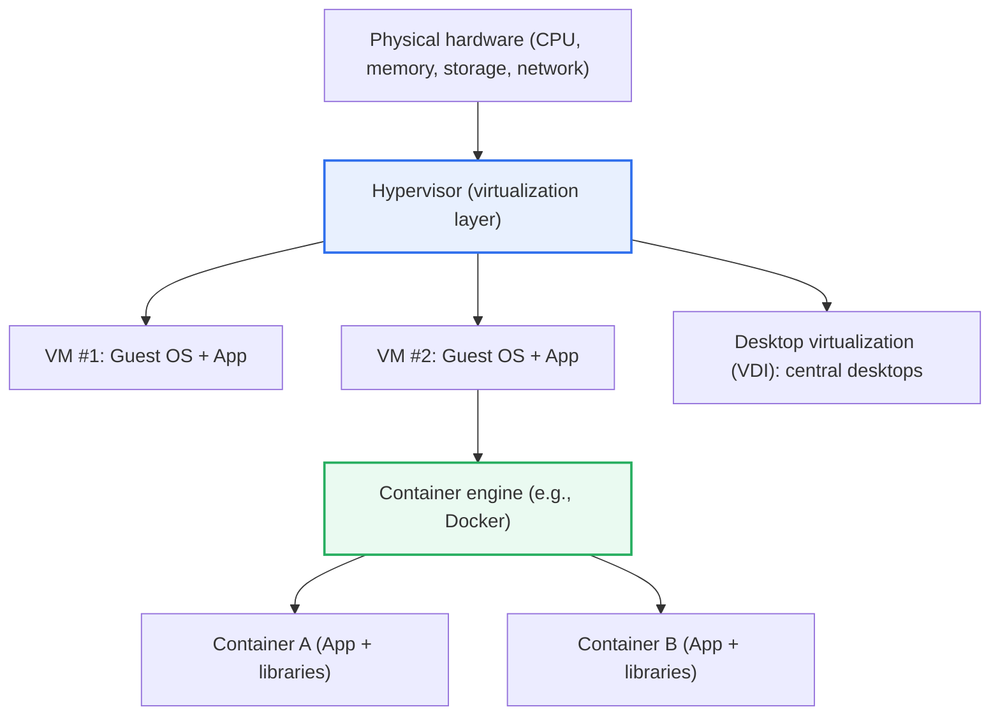
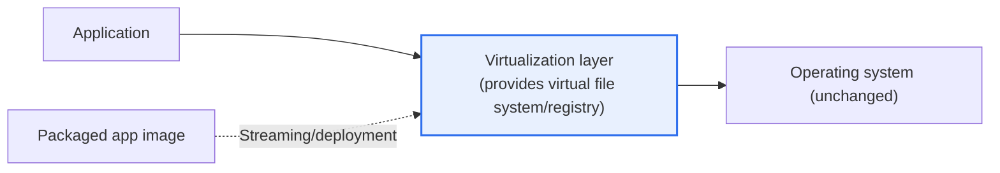

# Virtualization

## 1. Overview

### A. Definition

> **Virtualization** is a technology that **logically abstracts physical resources (CPU, memory, storage, network, OS, applications) so that one physical resource can be divided and used as many, or many physical resources can be combined and used as one**. It raises resource utilization and enables flexible operations in which resources can be instantly scaled up or moved as needed.

The essence of virtualization is "**decoupling the physical entity from its logical use**." In traditional environments, applications were tightly bound to a specific server and OS, and running one service per server was the norm. In that case, most servers normally used only about 10–20% of their resources while the rest sat idle, and it was difficult to move workloads to another server in the event of failure. Virtualization breaks this physical dependency: it places multiple virtual servers (VMs) on one physical server so that idle resources are shared efficiently, and it allows resources to be instantly reallocated or moved to another physical server (live migration) as needed.

This abstraction is not limited to servers. It occurs in different ways across multiple layers of the IT stack, including applications, desktops, networks, and storage. For example, application virtualization runs programs in an isolated execution environment rather than installing them directly on the OS, so they run anywhere without installation conflicts; network virtualization (SDN, NFV) overlays a software-defined logical network on top of the physical network. Virtualization matters because it is **the foundational technology of cloud computing**. The elasticity of the cloud — "use only as much as needed, and flexibly expand and move according to load" — fundamentally originates from virtualization's ability to partition and move resources.

### B. Background and Need

Several structural factors lie behind the rise of virtualization. First is **the problem of resource waste**. The one-service-per-server approach is stable, but resource utilization is extremely low, and as data centers grew, power, space, and management costs rose exponentially. Virtualization reduces this waste by densely consolidating multiple workloads onto one physical server.

Second is **the demand for agility**. As business environments changed rapidly, the need grew to prepare new servers and environments within minutes rather than weeks. Physical servers take time to procure and install, but virtual servers can be created and deleted instantly by cloning images, dramatically increasing provisioning speed.

Third is **the problem of environmental dependency and installation conflicts**. When a program is tightly bound to a specific OS environment, portability problems like "it works on my PC but not on that PC" arise constantly. Application virtualization and containers solve this problem by packaging the execution environment itself together with the application, which became the foundation of the DevOps and cloud-native movements.

### C. How Programs Run on a Conventional Operating System

To understand the advantages of virtualization, it is first necessary to contrast how programs run on a conventional OS. On a conventional OS, a program is directly connected during installation to resources managed by the OS (CPU, memory, file system, registry, libraries), and it plants configuration files and shared libraries throughout the system. This approach is direct in terms of performance, but it produces the fundamental limitation that the program is tightly coupled to the OS environment.

As a result, several problems arise. Conflicts occur when different programs require different versions of the same shared library (so-called "DLL hell"); installing or removing one program affects the operation of others; and programs become dependent on an environment, working only on a specific OS version or configuration, which makes porting difficult. In addition, registry and configuration residue remains even after uninstallation, gradually cluttering the system. Virtualization-family technologies evolved precisely to break this "tight coupling" and provide isolation, portability, and conflict-free operation.

## 2. Virtualization Layer Structure and Types

The best framework for understanding virtualization is "which layer is being abstracted." The overall structure diagram below shows at a glance the representative layers (server, desktop, application, container) at which virtualization is applied on top of physical hardware.

In the structure above, the hypervisor is the core layer that divides physical hardware among multiple VMs, and each VM has an independent guest OS. Containers sit above that, as lighter isolation units that share the OS kernel. Thus, the strength and weight of isolation vary depending on "up to which layer is abstracted." The table below summarizes the representative types.

| Type | Abstraction Target | Description | Representative Examples |
|---|---|---|---|
| **Server virtualization** | Hardware/OS | Runs multiple VMs on a physical server via a hypervisor | VMware ESXi, KVM, Hyper-V |
| **Desktop virtualization (VDI)** | Desktop environment | Creates desktops on a central server and delivers them to terminals | Citrix, VMware Horizon |
| **Application virtualization** | Application | Runs programs in an isolated environment without installation | App-V, ThinApp |
| **Container** | OS user space | Shares the OS kernel, packages apps with lightweight isolation | Docker, containerd |

### A. Server Virtualization and the Hypervisor

Server virtualization is the archetype of virtualization and its most widely used form. Its core element, the **hypervisor (VMM, Virtual Machine Monitor)**, sits between the physical hardware and guest OSes, distributing and isolating CPU, memory, and I/O among multiple VMs. Hypervisors fall into two broad categories. **Type-1 (bare-metal)**, which runs directly on hardware, offers superior performance and stability and is used in servers and data centers (e.g., ESXi, Xen, KVM), while **Type-2 (hosted)**, which runs like an application on top of an existing OS, is used mainly for convenience in desktop environments for development and testing (e.g., VirtualBox, VMware Workstation).

The practical value of server virtualization is "efficiency through consolidation." Consolidating multiple low-load servers as VMs onto a small number of high-performance physical servers reduces the number of physical servers, greatly cutting power, space, cooling, and management costs. In fact, in data center consolidation projects, VM consolidation ratios of several to more than a dozen times relative to physical servers are common, the result of raising resource utilization from the normal 10–20% range to much higher levels.

Server virtualization also greatly increases operational flexibility. Because VMs exist as files (images), their state at a particular point in time can be saved and restored with snapshots, moved to another physical server without service interruption via live migration, and automatically restarted on another node in the event of failure (HA). These capabilities form the foundation of the cloud's auto-scaling and self-healing functions.

### B. Application Virtualization

Application virtualization places a **virtualization layer (isolated execution environment)** between the program and the OS, so that the program runs inside this layer rather than being installed directly on the OS. The detailed process diagram below shows its operating principle.

The key to its operation is that "the virtual layer stands in for the OS." Because the virtualization layer virtually provides the files, registry entries, and settings the program requires, the actual OS is not changed at all. As a result, there are no installation conflicts with other programs, a single package can run on multiple PCs without installation, and no residue remains in the OS when the program is removed. When distributed via streaming, which downloads and runs only the needed parts, it also becomes easy for large organizations to manage software distribution and updates centrally in batches.

The practical implications of this technology are "reduced management costs" and "standardization." For an enterprise operating thousands of business PCs, individually installing and patching each application is enormously expensive. With application virtualization, standardized packages can be distributed and withdrawn centrally, simplifying management, and different versions of a program can even be run simultaneously on one PC without conflict. The table below compares it with the conventional approach.

| Category | Conventional Approach | Application Virtualization |
|---|---|---|
| **Installation** | Installed directly on the OS | Runs in isolated environment (no installation) |
| **Conflicts** | Library/configuration conflicts (DLL hell) | No conflicts due to isolation |
| **Portability** | Environment-dependent | Runs anywhere |
| **Management** | Individual installation/patching | Central distribution/withdrawal, standardization |

### C. Desktop Virtualization (VDI) and Remote Desktop Protocols

Desktop virtualization (VDI, Virtual Desktop Infrastructure) creates the user's desktop environment not on a personal PC but on servers in a central data center, and transmits its screen to the user's terminal. Because all actual computation and data reside centrally and the terminal handles only screen input/output, data is not leaked even if the terminal is lost or stolen, and OS and security patches can be applied centrally in batches, providing major security and management advantages. With the spread of work-from-home and remote work, the use of VDI has grown significantly.

What determines the VDI user experience is the **remote desktop protocol**. Responsiveness and image quality vary depending on how efficiently the central server's screen is compressed and transmitted, so choosing a protocol that fits the use case (office work, graphics work) and bandwidth conditions is important. For example, protocols strong in bandwidth optimization are advantageous at low-bandwidth remote sites, while protocols strong in pixel-level transmission are advantageous for high-quality graphics work.

| Protocol | Characteristics |
|---|---|
| **RDP** | Microsoft standard, widely used in Windows environments |
| **PCoIP** | Pixel-level transmission, strong for high-quality and graphics work |
| **HDX / ICA** | Citrix-based, strong in bandwidth optimization |
| **SPICE** | Open source (KVM family), Linux virtualization environments |

## 3. Comparison — VMs and Containers

The comparison that comes up most often when discussing virtualization is VMs versus containers. Both provide "isolated execution environments," but because the layer of isolation differs, their characters diverge greatly. **A VM virtualizes hardware through a hypervisor so that each VM has an independent guest OS**, whereas **a container shares a single host OS kernel and isolates only the user space**. This structural difference produces all the differences in weight, startup speed, isolation strength, and portability.

| Category | Virtual Machine (VM) | Container |
|---|---|---|
| **Isolation unit** | Includes guest OS (hypervisor) | Process level (kernel shared) |
| **Weight/startup** | Heavy, startup in tens of seconds or more | Lightweight, startup within seconds |
| **Isolation strength** | Strong (full isolation per OS) | Relatively weak (kernel shared) |
| **Density** | Dozens per physical server | Hundreds to thousands per physical server |
| **Portability** | Large, heavy images | Small images, easy to port |

The reason for these differences lies in "how much is replicated." Because a VM carries the entire OS with it, it is heavy, but even the kernel is separated, so isolation is strong, and different OSes (Linux, Windows) can run simultaneously on one physical server. Because containers share the kernel and do not carry duplicate OSes, they are light and fast, but since they share the kernel, their isolation is weaker than a VM's and they must use a kernel of the same family as the host.

The practical implication is to "choose according to purpose, or use them together." VMs are suitable when strong isolation and heterogeneous OSes are needed, and containers are suitable for microservices that require high density and rapid deployment and scaling. In real clouds, hybrid configurations that place containers on top of VMs for security isolation are widely used (e.g., managed Kubernetes operating containers on VM nodes), and recently, lightweight micro-VM technologies (e.g., the Firecracker family), which combine the convenience of containers with the isolation of VMs, have also been used in serverless infrastructure.

### D. Full Virtualization and Para-Virtualization

Looking more deeply at server virtualization, it divides into Full Virtualization and Para-Virtualization according to how the guest OS accesses the hardware. This distinction is useful for understanding the trade-off of "whether to prioritize performance or compatibility."

In full virtualization, the hypervisor fully emulates the hardware, so guest OSes can be run as-is without modification, providing excellent compatibility. However, overhead can arise in the process by which the hypervisor intercepts and handles privileged instructions (trap and emulation). In para-virtualization, the guest OS is partially modified to be aware that it is in a virtual environment and reduces overhead by making requests directly to the hypervisor (hypercalls), but it has the constraint of requiring modification of the guest OS.

Today, **hardware-assisted virtualization** such as Intel VT-x and AMD-V has become commonplace, with the CPU directly assisting virtualization and greatly reducing the overhead of full virtualization. As a result, high performance can be achieved without modifying the guest OS, and the practical boundary between full virtualization and para-virtualization has faded considerably. This is a representative case of the center of gravity shifting from "software emulation" to "hardware-level support," and it has become a key driver of virtualization performance improvement.

## 4. Advanced — The Evolution of Virtualization in the Cloud and Container Era

Virtualization has evolved less as an end in itself than as a foundation supporting "higher-level operating models." The first trend is **cloud computing**. As server virtualization enabled the partitioning, movement, and automation of resources, users came to rent as much computing as needed without owning physical servers (IaaS) and to operate elastically, automatically scaling up and down according to load (auto scaling). The cloud's pay-as-you-go model, self-service, and elasticity are all built on virtualization's resource abstraction capabilities.

The second trend is **containers and orchestration**. As containers packaged applications together with their execution environments into standard images, the problem of inconsistency between "development–test–production" environments was resolved, and the orchestrator for deploying, scaling, and recovering them at scale (Kubernetes) became the de facto standard. This combination made microservice architecture and DevOps/CI/CD practically possible. In other words, understanding the chain of evolution from virtualization → cloud → containers → cloud native is key.

The third trend is **the expansion of virtualization (widening of layers)**. Going beyond early server virtualization, it expanded to SDN and NFV, which define networks in software, and software-defined storage (SDS), which abstracts storage, evolving into the concept of the SDDC (Software-Defined Data Center), which defines and automates the entire data center in software. With the addition of lightweight micro-VMs that balance isolation and convenience, and serverless (FaaS), which abstracts server management itself, the spectrum of "what to abstract and to what extent" continues to widen. In an exam answer, describing this evolutionary context together with a contrast of "the trade-offs of VMs, containers, and serverless (isolation, density, operational burden)" demonstrates depth.

## 5. Considerations and Implications (Professional Engineer's Perspective)

1. **Choose based on the trade-off between isolation level and density.** VMs provide strong isolation but are heavy, while containers are light and dense but have weaker isolation. A mixed strategy tailored to requirements is realistic, such as placing workloads with high regulatory and security demands on VMs (or micro-VMs) and stateless services requiring rapid scaling on containers.

2. **Approach it holistically as the foundational technology of cloud and DevOps.** Virtualization is not a standalone technology but the foundation running through cloud elasticity, container-based deployment (Kubernetes), and CI/CD automation. When adopting it, the effect is maximized by designing from the perspective of the entire "automated operations pipeline" rather than individual technologies.

3. **Manage performance overhead and resource contention.** The virtualization layer offers management convenience at the cost of performance overhead, and over-consolidating workloads on one physical server can destabilize performance due to resource contention (noisy neighbor). Balance must be struck through overcommit ratio settings, performance monitoring, and resource isolation policies.

4. **Consider new attack surfaces and security isolation.** Threats unique to virtualization exist, such as hypervisor escape (VM escape), isolation weaknesses due to containers sharing the kernel, and image supply chain vulnerabilities. Multi-layered security must be applied in parallel, including least privilege, image scanning, network separation/micro-segmentation, and kernel hardening.

5. **Strategically manage licensing, cost, and lock-in.** Considering the licensing costs of commercial hypervisors and VDI and the risk of dependence on a particular vendor, it is advantageous in the long run to combine open source (KVM, container standards) and commercial solutions in balance and to mitigate vendor lock-in by adopting highly portable container standards.

## References

- Red Hat, "What is virtualization?": https://www.redhat.com/en/topics/virtualization/what-is-virtualization
- VMware Glossary, "Hypervisor": https://www.vmware.com/topics/glossary/content/hypervisor.html
- Docker, "Docker overview": https://docs.docker.com/get-started/docker-overview/
- Kubernetes Documentation, "Concepts": https://kubernetes.io/docs/concepts/

---

> **In one line**: Virtualization is a technology that *logically abstracts physical resources* to increase resource utilization and flexibility; its layers extend across server virtualization (hypervisor), application virtualization (no installation, no conflicts), desktop virtualization (VDI), and containers, and centered on the isolation-density trade-off between VMs and containers, it forms the foundation of cloud, DevOps, and cloud native.
