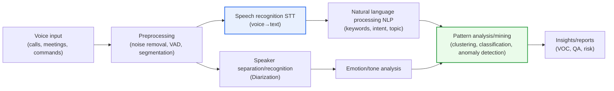
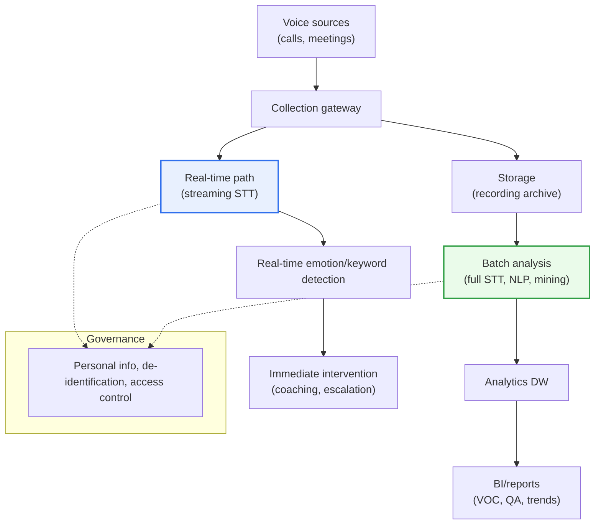

# Voice/Speech Data Mining

## 1. Overview

### A. Definition
> **Voice data mining** is a data mining technique that **automatically extracts useful information and patterns — text, emotion, speaker, intent, topic, and more — from unstructured voice data** such as phone calls, consultations, meetings, and voice commands. Its distinguishing feature is that it is a **multi-stage pipeline** that combines natural language processing (NLP) and statistical/machine-learning-based pattern analysis on top of speech recognition (STT, Speech-to-Text).

Voice data mining emerged because **massive amounts of voice data accumulate every day** in call centers, voice assistants, meetings, consultations, and field radio communications, **yet most of it has been left buried without analysis**. Text data is easy to search, aggregate, and analyze, but voice is a **sequential, unstructured medium** whose content cannot be known "until it is played back and listened to in full," making it fundamentally difficult to exploit. For example, in a call center receiving tens of thousands of calls a day, it is physically impossible for people to listen to every call and assess quality, so in practice only about 1–3% of calls have been sampled for QA. Voice data mining breaks through this limitation head-on. By converting voice to text (STT) and automatically analyzing the meaning, emotion, topic, and speaker contained within, it **transforms dormant voice assets into a tool for quantifiable insight**.

Its core value lies in a "**shift in scale**." What people could only sample, machines analyze in full (100%). As a result, it becomes possible to **statistically capture signals that sampling missed**, such as recurring customer complaints, signs of churn, degradation in consultation quality, and statements that violate regulations. In other words, voice data mining goes beyond simple recording and allows the medium of voice to be handled "like structured data that can be searched, aggregated, and used for prediction."

Its relationship with text mining also becomes clear here. After passing through the gateway of STT, voice data mining reuses much of the methodology of text mining and NLP, but it is broader in that it **also handles "acoustic information absent from text," such as speaker, tone, intonation, and silence**. Another difference is that the input is not always perfect text but "text that may contain errors" produced by STT, so an analysis design that is robust to noise is required.

### B. Characteristics
The nature of voice data mining can be summarized as follows.

- **Multi-stage pipeline:** A serial structure of preprocessing → STT → speaker/emotion recognition → NLP → pattern analysis, in which errors in earlier stages propagate downstream.
- **Acoustic + linguistic combination:** Uses not only textual meaning but also acoustic features such as pitch, intensity, and speech rate.
- **Full-population analysis:** Goes beyond the limits of sampling to automatically analyze 100% of calls and capture statistical signals.
- **Unstructured → structured conversion:** Turns sequential, unstructured voice into structured data that can be searched and aggregated.
- **Handling of biometric information:** Deals with sensitive information such as voiceprints and private conversations, making personal information and ethical controls essential.

### B. Purpose
The main purposes are **Voice of Customer (VOC) analysis, consultation quality assurance (QA), financial risk and compliance monitoring, and service automation**. The aim is to quantify the unstructured information scattered throughout calls and use it as the basis for decision-making and business improvement. For example, if the frequency of expressions like "why is my bill so high" surges right after the launch of a particular rate plan, this serves as an **early signal** pointing to a flaw in the product design or the guidance process.

## 2. Key Technologies and Pipeline Structure

Voice data mining is not a single algorithm but **a pipeline in which multiple signal processing and AI technologies are connected in series**. Because the output of an earlier stage becomes the input of a later stage, an error in any one stage propagates downstream (error propagation). In particular, **the accuracy of STT, the first gateway, determines the quality of the overall result**. If STT mistranscribes "refund" as "re-fund" or a similar-sounding word, the subsequent emotion analysis, intent classification, and aggregation all go wrong.

**A. Preprocessing and Speech Recognition (STT).** This is the starting point of the pipeline. First, preprocessing is performed, such as noise removal, Voice Activity Detection (VAD) to filter out silent segments, and segmentation into utterance units. Then voice is converted into text through acoustic and language models (or an end-to-end neural network). The difficulty of STT is **the diversity of real-world environments**. Background noise, dialects and accents, domain terminology (medical drug names, financial product names), and overlapping speech in which two people talk at once all reduce accuracy. Therefore, domain-specific vocabulary dictionaries and customized training are the key to securing accuracy.

**B. Speaker Diarization and Recognition.** This is the stage that determines "**who** spoke when." Speaker diarization distinguishes the utterances of the agent and the customer within a call to reconstruct the dialogue structure, and speaker recognition identifies a specific individual from the voiceprint features of the voice. This information enables **analysis based on role and sequence**, such as "how did the agent respond after the customer got angry?" Speaker recognition is also used for voiceprint authentication in the financial sector, but as powerful biometric information it simultaneously raises personal information issues.

**C. Emotion/Sentiment Analysis.** This estimates the speaker's emotional state using not only the words of the text but also **the acoustic features unique to voice (pitch, intensity, speech rate, tremor)**. Even the same "It's fine" can signal satisfaction or sarcasm depending on intonation, so voice-based emotion analysis provides richer signals than sentiment analysis based on text alone. In call centers, it is used to escalate to a supervisor in real time when a customer's anger exceeds a threshold.

**D. NLP and Pattern Analysis/Mining.** Keywords, topics, intents, and named entities are extracted from the transcribed text through natural language processing, and traditional data mining techniques (clustering, classification, association rules, anomaly detection) are applied on top to derive insights. For example, call reasons are automatically classified to aggregate volume by type, and unusual surge patterns are caught with anomaly detection. This stage is the essence that distinguishes "recording" from "mining": it **goes beyond understanding individual calls to discover patterns and trends across the entire population**.

| Technology | Role | Practical Difficulties |
|---|---|---|
| **Preprocessing/STT** | Voice→text conversion | Noise, dialects, terminology, overlapping speech |
| **Speaker diarization/recognition** | Distinguishing/identifying speakers | Short utterances, similar timbres |
| **Emotion/tone analysis** | Estimating emotion from acoustics + text | Irony, context dependence |
| **NLP** | Extracting keywords, intent, topics | Colloquialisms, ungrammatical sentences, domain vocabulary |
| **Pattern analysis** | Clustering, classification, anomaly detection | Lack of labels, class imbalance |

## 3. Processing Modes: Batch Analysis and Real-Time Analysis

Voice data mining is divided into batch (post-hoc) analysis and real-time (in-call) analysis according to "when the analysis is performed," and the two serve different purposes. Batch analysis collects completed calls and processes them in bulk, such as overnight, excelling at extracting **trends, patterns, and quality statistics**. Real-time analysis, by contrast, instantly detects emotions and keywords while a call is in progress, enabling **immediate intervention such as agent assistance and escalation**.

The two modes have different requirements. Batch prioritizes accuracy and in-depth analysis, so heavy models can be used, whereas real-time requires responses within a few hundred milliseconds and accepts a trade-off between latency and accuracy. In practice, a hybrid configuration is usually chosen that **responds immediately in real time and aggregates full-population quality and trends in batch**. Below is a detailed structure diagram that combines the two paths into a single architecture.

| Category | Batch (Post-hoc) Analysis | Real-Time (In-Call) Analysis |
|---|---|---|
| **Purpose** | Trend, quality, VOC statistics | Immediate intervention, agent assistance |
| **Priority requirement** | Accuracy, depth | Low latency (hundreds of ms) |
| **Typical uses** | Full-population QA, churn prediction | Emotion escalation, real-time coaching |

This distinction also directly affects infrastructure design. Real-time pipelines require streaming STT and low-latency messaging, while batch pipelines hinge on large-volume storage and distributed processing, so the common design ties the two paths into a single architecture while operating them with separate resources and models.

## 4. Application Areas and Cases

The value of voice data mining becomes concrete when combined with industry-specific problems. Each area in the table below applies the common advantage of "full-population analysis" to different purposes.

| Area | Use | Key Effect |
|---|---|---|
| **Call center/CS** | Consultation QA, VOC analysis, real-time coaching | Sample→full-population quality management, churn prediction |
| **Finance/compliance** | Detecting mis-selling and risky statements, voiceprint authentication | Automatic detection of regulatory violations |
| **Healthcare** | Automatic documentation of clinical conversations, disease screening via voice features | Reduced documentation burden |
| **Voice assistants/IoT** | Intent recognition, service automation | Unattended response |

**A. Call Centers and Customer Service.** This is the most mature area. All calls are automatically analyzed to assess consultation quality across the full population, and when specific keywords (cancellation, complaint, competitor names) appear, agents are assisted in real time or supervisors are alerted. The "shift in scale" is most evident here, as QA that used to sample only 1–3% of calls is raised to 100%. Furthermore, it is used to aggregate recurring inquiry types to improve FAQs and automated responses (IVR), or to **predict customer churn in advance** from trends in call reasons and emotions.

**B. Finance and Compliance.** Because this is a heavily regulated industry, the value of application is high. It **automatically detects mis-selling**, such as failure to disclose risks during the sales process, lowering compliance risk, and sometimes combines voiceprint authentication with calls subject to mandatory recording. Specific prohibited expressions or exaggerated, advertising-like statements are continuously monitored with rules and models to proactively manage the risk of later disputes or sanctions.

**C. Healthcare.** Doctor–patient conversations are automatically organized into medical records (ambient clinical documentation), reducing the documentation burden on medical staff. Research is also underway to detect early signs of certain diseases from subtle acoustic features of the voice. However, the clinical accuracy in this area is still at the validation stage, so it should be **used cautiously as an auxiliary indicator** rather than as a substitute for diagnosis, and medical information protection regulations must be strictly observed.

**D. Voice Assistants and IoT.** In smart speakers, vehicles, and home appliances, the intent of the user's utterance is identified to automate services without human involvement. Here, real-time performance and accurate intent classification for short commands are the keys, and a virtuous cycle arises in which accumulated voice command logs are mined to analyze frequently used functions and failure patterns and improve products.

## 5. Advanced: The Leap to Foundation Models and Generative AI

Voice data mining has recently undergone a qualitative leap through the combination of **large-scale speech foundation models** and **generative AI (LLMs)**. In the past, STT, emotion, and intent analysis each had to be built and tuned as separate models, but with the emergence of general-purpose STT models pretrained on massive amounts of speech (e.g., the Whisper family), **recognition accuracy in multilingual and noisy environments and ease of application have improved greatly**.

Combining these with LLMs makes it possible to perform **call summarization, identification of key issues, automatic generation of follow-up actions, and call classification** with natural-language instructions alone, going beyond simple keyword extraction and dramatically increasing the flexibility and speed of analysis. For example, in the past, "call reason classification" required training a dedicated classifier on thousands of labeled examples, but now similar results can be obtained simply by presenting the classification criteria to an LLM as a prompt, greatly shortening the lead time for adding new types or changing criteria.

The technology trend can be summarized in three directions.

- **Real-time and edge processing:** Moving from batch analysis after a call ends toward detecting emotion and churn risk in real time during the call and intervening immediately.
- **Multimodal expansion:** Analyzing not only voice but also text chats, video, and screen sharing together to understand the customer experience holistically.
- **From analysis to action:** Evolving in an "agentic" direction that goes beyond deriving insights to automating summaries, response drafts, and even knowledge base updates.

However, as such automation grows, governance to control factual errors (hallucinations) in generated results and exposure of personal information is required as well. How the balance between convenience and control is designed is the key to mature adoption.

## 6. Considerations and Implications

1. **STT accuracy sets the upper bound of overall quality.** Because errors in the first stage of the pipeline propagate downstream, domain customization that raises recognition rates in environments with noise, dialects, terminology, and overlapping speakers is the first gateway to business success. Accuracy metrics (WER, Word Error Rate) must be managed continuously.
2. **Voice is itself sensitive biometric personal information.** Because voice contains voiceprints that can identify the speaker as well as private conversations, consent for collection and use, purpose limitation, de-identification/pseudonymization, retention periods, and access control must be applied together. In particular, speaker recognition (voiceprints) is unchangeable biometric information, so damage from a leak is permanent.
3. **Combining generative AI expands the scope and speed of use, but reliability management is a prerequisite.** LLM-based automatic summarization and insight generation are powerful but carry risks of factual errors, bias, and hallucination, so for important decisions, traceability to evidence (original utterances) and verification procedures must be designed in as well.
4. **Evaluation bias and labor/ethical issues must be considered.** Full-population emotion and quality analysis can slide into excessive surveillance of agents, and emotion recognition models embed biases due to cultural and individual differences. Designing metrics as tools for "coaching and improvement" rather than "surveillance," and establishing transparency and appeal procedures, are conditions for sustainability.
5. **Adoption strategy from the Professional Engineer's perspective.** A phased approach is desirable: pilot to validate STT accuracy → prove results in a few use cases (e.g., cancellation defense, mis-selling detection) → expand to real-time and multimodal. Data governance and personal information protection must be embedded in the initial architecture (privacy by design) to reduce later risks.

## References
- OpenAI, "Introducing Whisper" (large-scale speech recognition model): https://openai.com/index/whisper/
- Personal Information Protection Commission (Korea), Personal Information Protection Act (legal basis for processing sensitive information including biometric data): https://www.pipc.go.kr

---

> **In one line**: Voice data mining is a pipeline of *preprocessing, STT, speaker/emotion recognition, NLP, and pattern analysis* that extracts information and patterns from unstructured voice across the full population for use in call centers, finance, and healthcare; it is leaping forward with speech foundation models and generative AI, while STT accuracy and the protection of voice biometric personal information remain the key challenges.
