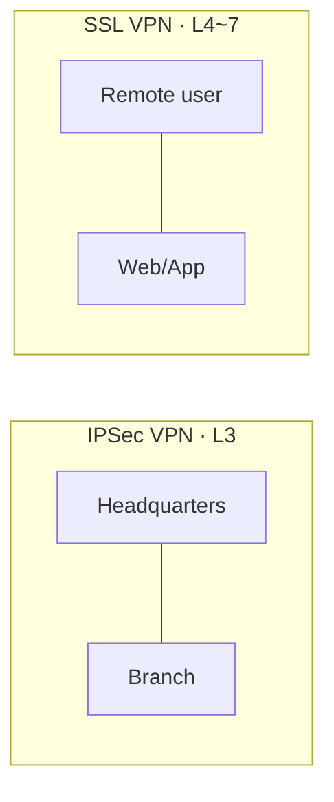

# VPN (Virtual Private Network)

## 1. Overview

### A. Definition
> A technology that builds an **encrypted virtual private communication path (tunnel)** over a public network (the Internet), so that data physically traverses the public network but is logically transmitted and received as securely as over a private network.

### B. Background and Need
Laying physical **Leased Lines** for inter-branch communication or for remote workers' access to the corporate network is secure, but the cost explodes in proportion to region and distance. The Internet is already deployed worldwide and is inexpensive, but it is an open network where anyone can snoop on packets, so using it as-is carries high risks of eavesdropping, tampering, and impersonation. VPN takes only the advantages of both, **overlaying a tunnel with encryption, authentication, and integrity on top of the inexpensive Internet**, thereby achieving leased-line-level security at a far lower cost. As remote work has spread and cloud usage has increased, demand for "secure access anytime, anywhere" has grown, and VPN has become a basic component of enterprise networks.

## 2. IPSec VPN vs SSL VPN

The difference between the two approaches stems from **at which layer of the network stack the tunnel is built**, and that choice determines their use. **IPSec VPN** encrypts IP packets themselves at the network layer (L3), so once the tunnel is established, all application traffic above it is transparently protected. Because the entire network is connected without users needing to be aware of it, it is suitable for **always-on branch-to-headquarters connections (Site-to-Site)**, but it requires installing and configuring a dedicated client. **SSL VPN**, on the other hand, provides protection with TLS at the transport-to-application layers (L4~7) and can be accessed with only a web browser, offering installation-free convenience. In exchange, it opens access on a per-application basis, making fine-grained access control easy, and is suitable for **remote users (Remote Access)** connecting from unspecified locations. In short, the selection criterion is "whether to attach the entire network (IPSec) or open only the needed apps (SSL)."

| Category | IPSec VPN | SSL VPN |
|---|---|---|
| **Operating layer** | Network (L3) | Transport~Application (L4~7) |
| **Access method** | Dedicated client required | Web browser (no installation) |
| **Main use** | Always-on inter-branch connection (Site-to-Site) | Remote user access (Remote Access) |
| **Access scope** | Entire network | Per specific application |
| **Security protocols** | ESP/AH, IKE | TLS/SSL |
| **Advantages** | Broad, transparent connectivity | Fine-grained access control, convenience |

## 3. VPN Technical Elements

VPN security holds only when five elements interlock like a chain. **Tunneling** is the backbone that wraps (encapsulates) the original packet in a new header to pass it through the public network, using L2TP, PPTP, IPSec's ESP/AH, or SSL/TLS. Since encapsulation alone leaves content visible, **encryption** handles data confidentiality, concealing the payload with symmetric keys such as AES. However, if the counterpart is an impersonating attacker, encryption is meaningless, so **authentication** verifies both ends of the communication with IKE, digital signatures, and certificates. Whether bits have been manipulated in transit is detected by **integrity** using HMAC and hashes. Finally, without **key management** to securely share symmetric keys and change them periodically, everything above collapses, so IKE (Internet Key Exchange) securely exchanges and renews session keys.

| Element | Description | Representative Technologies |
|---|---|---|
| **Tunneling** | Encapsulation of the original packet | L2TP, PPTP, IPSec (ESP/AH), SSL/TLS |
| **Encryption (Confidentiality)** | Data confidentiality | Symmetric keys (AES, etc.) |
| **Authentication** | Identity verification of both ends | IKE, digital signatures, certificates |
| **Integrity** | Detection of forgery/tampering | HMAC, hashes |
| **Key management** | Session key exchange/renewal | IKE |

IPSec has two encapsulation **modes**. **Transport mode** encrypts only the payload and keeps the original IP header, and is used for end-to-end communication; **Tunnel mode** encrypts the entire packet, including the original IP header, and wraps it in a new header, and is used for gateway-to-gateway Site-to-Site connections.

## 4. Considerations and Implications
- **Balancing performance and security**: Encryption and decryption incur CPU overhead, so instead of sending all traffic through the tunnel, a **split tunneling** policy that tunnels only corporate destinations and lets general Internet traffic go out directly strikes a compromise between performance and security.
- **Limits of perimeter-based trust**: Traditional VPN follows a model of "once inside the tunnel, trusted as an insider," so if a single account is compromised, the entire internal network is exposed. Because of this limitation, it is evolving into **ZTNA (Zero Trust Network Access)**, which continuously verifies each resource at the time of access.
- **Combining least privilege and continuous verification**: Even when retaining VPN, it should be operated in combination with Zero Trust principles that evaluate the user, device, and context at every access, breaking the equation of connection = trust.

---

> **In one line**: VPN is a low-cost security technology that *builds a virtual private network over a public network with encrypted tunnels*; it is divided into network-layer IPSec (inter-branch) and application-layer SSL (remote access), has tunneling, encryption, authentication, integrity, and key management as its core elements, and is evolving into ZTNA to overcome the limits of perimeter trust.
