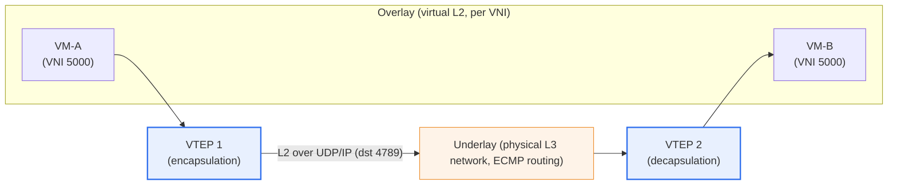
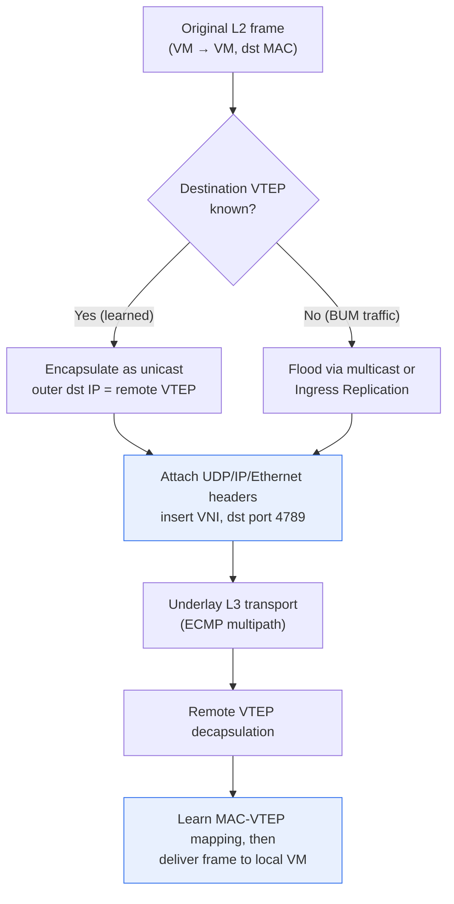

# VXLAN (Virtual eXtensible LAN)

## 1. Overview

### A. Definition
> **VXLAN (Virtual eXtensible LAN)** is a MAC-in-UDP tunneling technology that builds a **virtual L2 overlay network** on top of a physical (L3) network. It encapsulates L2 Ethernet frames inside UDP/IP packets to carry them across a routable L3 network, and it provides about 16 million (2²⁴) logical networks through a 24-bit **VNI (VXLAN Network Identifier)**, overcoming the scalability limits of VLAN. The standard is defined in IETF **RFC 7348** (2014).

The fundamental background to the emergence of VXLAN is "**the 4,094 limit of VLANs and the constraint of physical location**." In traditional VLANs, the VLAN ID in the IEEE 802.1Q tag is 12 bits, so theoretically only 4,096 (4,094 usable after excluding reserved values) can be created. This number is sufficient for small campus networks, but woefully inadequate for public clouds and large data centers that must isolate the networks of tens of thousands to hundreds of thousands of customers (tenants) from one another. When multiple providers within a single data center each require hundreds of segments, the 12-bit space is quickly exhausted.

Another background factor is **the explosive spread of server virtualization**. As dozens of virtual machines (VMs) came to run on a single physical server, the number of MAC addresses and segments the network had to manage surged. In particular, **live migration** of a VM to another rack or another data center requires the original L2 domain (the same broadcast domain) to be stretched to the destination, but geographically extending a pure L2 network causes bandwidth waste due to the Spanning Tree Protocol (STP) and the risk of large-scale failure propagation. VXLAN solves this problem by "encapsulating L2 frames inside L3 (UDP) packets," thereby **separating the underlay (physical network) from the overlay (logical network)**. Because the logical network is detached from the physical topology, large-scale isolated networks can be created regardless of physical location, and VMs can be moved freely.

### B. Need and Characteristics
Cloud infrastructure must securely isolate the networks of many tenants while allowing workloads to be flexibly placed and moved across the entire data center. VXLAN is the de facto standard for network virtualization that realizes this **multi-tenancy** and **workload mobility** without physical network constraints. The underlay makes maximum use of bandwidth with proven L3 routing (ECMP-based multipath), and the overlay provides logical L2 services on top, enabling large-scale expansion without STP.

Its characteristics can be summarized as follows. First, **scalability**: the 24-bit VNI expands the number of segments from about 4,000 to 16 million. Second, **location independence**: because it is an overlay on L3, it maintains the same L2 domain across subnet boundaries. Third, **underlay utilization**: L3 ECMP distributes traffic across multiple paths, making it more efficient than pure L2 networks in which STP blocks half the links. Fourth, **hardware/software flexibility**: VTEPs can be placed in the hypervisor (software) or in ToR switches (hardware).

## 2. Overall Structure — Overlay/Underlay and VTEP

The core component of VXLAN is the **VTEP (VXLAN Tunnel End Point)**. A VTEP is a tunnel endpoint that stands at the boundary between overlay and underlay and handles encapsulation and decapsulation. The source VTEP receives the original L2 Ethernet frame sent by a local VM, prepends an 8-byte **VXLAN header** (including the VNI), and then successively prepends a **UDP header** (destination port 4789), an **outer IP header** (IPs of the source and destination VTEPs), and an **outer Ethernet header**. The resulting UDP packet is routed through the underlay like ordinary IP traffic, and the destination VTEP strips the headers (decapsulation) and delivers the original frame to the destination VM. From the VM's point of view, it appears to be attached to the same switch, but in reality it has communicated across an L3 network.

The **VNI (24 bits)** identifies which virtual network the frame belongs to. Even if different tenants happen to use the same private IP and the same VLAN ID, they are completely isolated if their VNIs differ. This is the foundation of multi-tenant isolation.

**Separation of underlay and overlay** is the core of VXLAN thinking. The underlay only needs to carry packets between VTEP IPs quickly and reliably (it need not know that the overlay exists), and the overlay provides logical L2 services without concern for the physical topology of the underlay. Thanks to this separation of concerns, modern data center design became possible in which the physical network is standardized as a simple routed leaf-spine fabric, and all service diversity is handled in software at the overlay layer.

The main components are summarized below.

| Element | Role | Notes |
|---|---|---|
| **VTEP** | Encapsulation/decapsulation endpoint (tunnel end) | Hypervisor (software) or ToR switch (hardware) |
| **VNI** | 24-bit virtual network identifier | About 16 million, tenant/segment isolation |
| **VXLAN header** | 8 bytes, includes VNI and flags | RFC 7348 |
| **UDP** | Destination port **4789** (IANA assigned) | Source port = hash of inner flow → ECMP distribution |
| **Overlay** | Virtual L2 network | Segment recognized by VMs/containers |
| **Underlay** | Physical L3 routing network | ECMP, leaf-spine fabric |

## 3. Encapsulation Process and Data Plane Details

A detailed look, item by item, at how VXLAN processes actual packets is as follows.

**A. Encapsulation Overhead and MTU.** VXLAN adds a total of **50 bytes** of headers in front of the original frame: outer Ethernet (14) + outer IP (20) + UDP (8) + VXLAN (8) (based on IPv4 and untagged). Therefore, if the underlay has the default MTU of 1,500 bytes, the moment a 1,500-byte frame is sent on the overlay it becomes 1,550 bytes in total, causing fragmentation or drops. In practice, this problem is prevented by raising the underlay MTU to **9,000 bytes (jumbo frames)** or setting it to at least 1,550 bytes. MTU mismatch is the most common cause of performance and connectivity failures in the field during early VXLAN adoption, so consistently aligning MTU across the entire fabric is a virtually mandatory prerequisite.

**B. Source UDP Port and ECMP.** VXLAN fixes the destination port of the outer UDP at 4789, but **creates the source port by hashing the headers of the inner (original) frame.** This gives different inner flows different source ports, so when the underlay's ECMP routers choose paths using a 5-tuple hash, overlay flows are evenly distributed across multiple physical paths. From the underlay's perspective, load can be distributed with the UDP 5-tuple alone without looking inside VXLAN, making maximum use of the leaf-spine fabric's bandwidth.

**C. BUM Traffic and MAC Learning.** Early VXLAN (the data-plane learning approach of RFC 7348) handled **BUM (Broadcast, Unknown unicast, Multicast)** traffic, which occurs when the destination MAC is unknown, by flooding it to an underlay **multicast group** (a group mapped per VNI). Remote VTEPs receive this flood and learn the "MAC ↔ VTEP" mapping by pairing the source MAC of the original frame with the source of the outer IP (the remote VTEP). However, since operating and managing underlay multicast at scale is cumbersome, the **Ingress Replication (Head-End Replication)** approach, which replicates and sends individual unicasts to each remote VTEP instead of multicast, and the approach of distributing MAC information via a control plane altogether (EVPN, Section 5) came into wide use.

For example, in a telecom operator's cloud, when VM-A (server rack 1) in VNI 5000 first communicates with VM-B (server rack 20) in the same VNI, VTEP1 does not know VM-B's location, so it floods as BUM; the moment VM-B responds, VTEP1 learns that "VM-B's MAC is behind VTEP2" and thereafter encapsulates directly as unicast. The fact that this learning and flooding load grows in proportion to scale is the fundamental limitation of the data-plane learning approach.

## 4. Comparison with VLAN and Other Overlays

VXLAN and VLAN share the same goal of isolating network segments, but they differ fundamentally in **where and how isolation is achieved**. VLAN distinguishes frames with tags within a single L2 broadcast domain, so the scope of isolation is confined to the physical L2 domain. VXLAN, by contrast, wraps L2 frames in L3 packets and can send them anywhere on a routable network, so the scope of isolation becomes independent of physical location. Because of this difference, VLAN is suitable for small, fixed-placement environments, and VXLAN for large, dynamic cloud environments.

| Category | VLAN | VXLAN |
|---|---|---|
| **Identifier** | 12 bits (4,094) | 24 bits (about 16 million) |
| **Encapsulation** | 802.1Q tag (4 bytes) | MAC-in-UDP (about 50 bytes overhead) |
| **Transport layer** | L2 local | Overlay on L3 (location-independent) |
| **Multipath** | STP blocks half the links | Uses all paths via underlay ECMP |
| **Mobility** | Constrained by physical location | Free movement of VMs/containers |
| **Suitable scale** | Small campus | Large cloud/data center |

Since the table alone does not reveal "why the differences arise," the practical implications are added here. The reason VLAN leaves half the links idle with STP is that without a loop prevention mechanism at L2, broadcast storms occur. VXLAN places the underlay at L3 and hands this problem over to IP routing (TTL, ECMP), so it has no loops while using all physical links. The price, however, is encapsulation overhead (50 bytes) and processing burden on VTEPs. In other words, VXLAN is a trade-off that pays "overhead and complexity" in exchange for "scalability, mobility, and bandwidth utilization."

It is also compared with similar overlay technologies. **NVGRE** (led by Microsoft, GRE-based) and **STT** competed with VXLAN, but because VXLAN is UDP-based, it fits well with existing ECMP and load balancer infrastructure and gained broad vendor support, becoming the de facto market standard. Recently, **Geneve** (RFC 8926), which can carry service metadata, has been emerging as the next-generation general-purpose overlay, and VMware NSX-T and others have adopted it as their default encapsulation.

## 5. Advanced — BGP EVPN Control Plane and Practical Application

The most important change in the evolution of VXLAN is **the introduction of a control plane**. The pure data-plane learning (flood-and-learn) approach of RFC 7348 had the limitation that BUM traffic and the multicast operational burden surged as scale increased. To solve this, **BGP EVPN (Ethernet VPN, RFC 7432 / RFC 8365 for the VXLAN data plane)** became established as the standard control plane.

The core idea of EVPN is "instead of learning MAC and IP information through flooding, **advertise it explicitly with MP-BGP**." Each VTEP distributes the MAC/IP of the local VMs it has learned to other VTEPs as BGP EVPN routes (Type-2, etc.). Remote VTEPs then know the "MAC ↔ VTEP" mapping from the start, so unknown unicast flooding nearly disappears, and ARP can also be suppressed with proxy responses. In addition, EVPN supports a **distributed anycast gateway**, in which all leaf switches share the same gateway IP/MAC, so a VM is routed along the optimal path no matter which rack it moves to. This is the practical completion of VM mobility.

Practical applications are wide-ranging. Most large cloud and telecom data centers are designed as **VXLAN-EVPN leaf-spine fabrics**, and major vendors such as Cisco (ACI, NX-OS), Arista (EOS), and Juniper (QFX) offer this as a standard architecture. In the server virtualization camp, **VMware NSX** implements network virtualization with overlays (VXLAN for NSX-V, Geneve for NSX-T), and in the container/Kubernetes camp, **Flannel's vxlan backend** and **Calico's VXLAN mode** connect pod networks across nodes as overlays. For example, when Flannel VXLAN is used in a Kubernetes cluster, pods on different nodes communicate as if they belonged to the same cluster network even if their physical subnets differ. In this way, VXLAN has become a general-purpose overlay used across layers, from hardware switches to software CNIs.

## 6. Considerations and Implications (Professional Engineer's Perspective)

1. **Foundational infrastructure for multi-tenancy and workload mobility.** VXLAN is central to maximizing flexibility by separating physical and logical networks in SDN and cloud data centers. When adopting it, an effective strategy is to design the roles of overlay (services) and underlay (transport) with clear separation, and to standardize the underlay as a simple, highly reliable L3 fabric.

2. **Advance design for MTU and overhead is essential.** Because of the 50-byte encapsulation overhead, the underlay MTU must be raised to jumbo frames (9000B) or similar; missing this leads to intermittent failures in large transfers, a type of fault that is very hard to reproduce. From a performance standpoint, whether VTEPs support hardware offload (VXLAN offload on NICs) determines throughput, so it must be checked during equipment selection.

3. **Securing scalability and operability by adopting a control plane (EVPN).** Small PoCs can work with multicast learning, but at production scale the standard practice is to adopt BGP EVPN to suppress BUM traffic and complete mobility with a distributed anycast gateway. This aligns with the network design trend of "data plane alone → separation of control and data planes."

4. **Trade-off between security and visibility.** Because overlays encapsulate and hide traffic, visibility is reduced as existing firewalls and IDSs cannot see the inner frames. Micro-segmentation (e.g., NSX distributed firewall) and overlay-aware telemetry must be introduced together, and since VXLAN itself provides no encryption, it is desirable to use IPsec/MACsec in parallel on inter-data-center segments.

5. **Outlook for linkage with next-generation overlays (Geneve).** As demand for service chaining and metadata delivery grows, migration to the extensible Geneve is underway. For new designs, choosing the overlay encapsulation in consideration of vendor roadmaps and standards trends (RFC 8926) is advantageous in the long-term trade-off.

## References
- RFC 7348, "Virtual eXtensible Local Area Network (VXLAN)": https://datatracker.ietf.org/doc/html/rfc7348
- RFC 8365, "A Network Virtualization Overlay Solution Using EVPN": https://datatracker.ietf.org/doc/html/rfc8365
- RFC 8926, "Geneve: Generic Network Virtualization Encapsulation": https://datatracker.ietf.org/doc/html/rfc8926

---

> **In one line**: VXLAN is MAC-in-UDP (port 4789) tunneling that creates *a 24-bit VNI-based L2 overlay on top of L3*, overcoming the VLAN limit of 4,094 to realize multi-tenancy and VM mobility in large cloud and data center environments, with scalability and operability completed by the BGP EVPN control plane and distributed anycast gateway.
