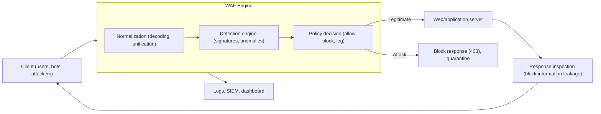
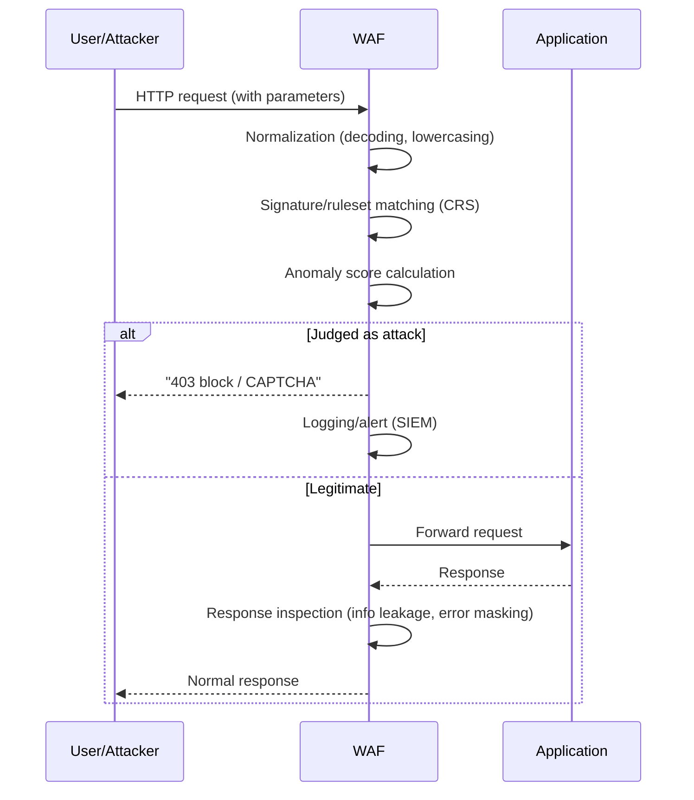

# WAF (Web Application Firewall)

## 1. Overview

### A. Definition and Background
> A **WAF** is a security appliance or service that **interprets HTTP/HTTPS traffic at the application layer (L7)** to **detect and block attack patterns targeting web applications**, such as SQL injection and cross-site scripting (XSS). If a network firewall opens and closes passages at the port and IP level, a WAF understands **the content (payload) and context of requests** that pass through those passages to distinguish legitimate requests from attack requests.

The fundamental background to the emergence of the WAF lies in a shift in perception: "**the center of gravity of defense has moved from the network to the application**." Traditional network firewalls control access at Layers 3 and 4 based on source IP and destination port. However, web services by definition must keep ports 80/443 open to everyone, and attackers come in through that open door exactly like legitimate users. In other words, from the firewall's point of view, an SQL injection request and a login request look like **exactly the same legitimate HTTP traffic**. Because the attack is hidden inside the payload, filtering it requires parsing the request body and understanding malicious strings such as `' OR 1=1--` or the insertion of `<script>` tags. The WAF was born to handle precisely this "**domain where judgment is possible only by understanding the content**."

Another background factor is **statistics showing the shift of the attack surface**. For a long time, breach incident analyses have identified web application vulnerabilities as the most common entry point for external intrusions, and OWASP publishes standardized web vulnerabilities — such as injection, authentication flaws, and broken access control — in the `OWASP Top 10` every 3–4 years. Writing perfectly secure application code is ideal, but in a reality where millions of lines of legacy code and third-party libraries are intertwined, removing every vulnerability at the source level is difficult. The WAF has established itself as a means of "**Virtual Patching**," buying time until a fundamental fix is deployed by **blocking attacks that target vulnerabilities at the front end, even if the vulnerabilities remain**.

### B. Need
The web occupies the widest area among an organization's externally exposed channels, and attacks are correspondingly concentrated there. From a regulatory standpoint as well, PCI-DSS **mandates either deploying a WAF or conducting regular code reviews** for web applications that handle card data, and Korea's Electronic Financial Supervisory Regulations and Personal Information & Information Security Management System (ISMS-P) also require web security controls. Because it can respond quickly to vulnerabilities for which immediate code fixes are impossible, and even cushions unknown bot and automated attacks, the WAF has become an essential defense layer for web services.

### C. Key Characteristics of the WAF
The characteristics of the WAF can be condensed into three. The first is **application context awareness (Context-aware)**: it makes judgments by interpreting the meaning of the HTTP method, URL, headers, cookies, body, and parameters rather than simple packets. The second is **bidirectional inspection (Bidirectional)**: it blocks not only incoming attack requests but also the exposure of server errors, personal information, and source code in outgoing responses. The third is **buying time through virtual patching (Shielding)**: even before a vulnerability is removed from the code, it neutralizes attacks targeting that vulnerability at the front end, buying response time. Combining these three characteristics, the WAF functions as a realistic security layer that "makes it possible to defend the inevitably vulnerable web while operating it in its vulnerable state."

## 2. Overall Structure and Deployment Methods of the WAF

A WAF should be understood not as a single algorithm but as a proxy-style architecture **positioned between the client and the web server to inspect requests and responses bidirectionally**. Below is the overall structure diagram of how a request is judged as it passes through the WAF.



The starting point of WAF processing is always "**Normalization**." To evade detection, attackers disguise payloads with URL encoding, Unicode, double encoding, case variation, comment insertion, and so on. For example, changing `SELECT` to `SEL%45CT` or `SeLeCt/**/` causes simple string comparison to miss it. Therefore, before inspection, the WAF decodes the request, converts it to lowercase, and cleans up whitespace to **unify it into a single canonical form**, and only then passes it to the detection engine. If normalization is weak, any sophisticated detection rule on top of it will be bypassed, so normalization is the hidden foundation of WAF performance. Next, the detection engine inspects the request, the policy engine decides among allow, block, and log, and in the response direction, exposures of error messages, resident registration numbers, and card numbers leaked by the server are filtered out.

### A. Three Deployment Methods
The first design decision running through the WAF is "**where and how to insert it into the traffic path**." In the **inline Reverse Proxy** method, the WAF terminates all traffic in front of the web server, receives and inspects it on the server's behalf, and then forwards it to the server. Because it can fully control requests and responses, blocking, rewriting, and SSL termination are unrestricted, but the price is that the WAF becomes a single point of failure (SPOF) and adds latency. Most commercial WAFs and cloud WAFs take this approach.

In the **Transparent Bridge/inline** method, the WAF has no IP and sits in a network segment like a bridge, sniffing and blocking traffic. Because it does not change the existing network configuration, deployment is simple, but there are limits on active manipulation such as rewriting responses. In the **Out-of-Band/mirroring** method, the WAF receives only a copy of the traffic and performs only detection and logging, either not blocking at all or responding after the fact with TCP resets. It has no performance impact and is good for monitoring purposes, but its real-time blocking power is weak.

In practice, these three methods are combined according to service criticality and latency tolerance. For example, paths that absolutely require real-time blocking, such as payment and login, are terminated with an inline reverse proxy, while latency-sensitive high-volume content delivery segments perform only detection via mirroring. Recently, the **embedded type**, which is installed as a module inside the application server (e.g., Apache's `mod_security`, Nginx modules), and the **cloud-based SaaS WAF**, which only requires changing DNS to the service provider, have become widely used. The embedded type has the advantage of sharing server resources without separate equipment, but rules must be deployed and managed on as many servers as there are; the cloud type processes traffic at edges worldwide and is highly scalable, but its traffic passes through external infrastructure. Thus the choice of deployment method itself becomes an architectural decision that determines performance, cost, and data control.

### B. Detection Methods — Negative and Positive Security Models
The second core principle of the WAF is "**on what basis to distinguish legitimate from attack**." The **negative security model (Blacklist)** takes the approach of "**blocking known bad things**": it registers attack signatures (patterns) for SQL injection, XSS, and the like, and blocks matching requests. It is easy to adopt and has few false positives, but it can miss new or variant attacks not in its signatures (false negatives). The open-source ruleset `OWASP Core Rule Set (CRS)` is the representative example and is used in combination with engines such as ModSecurity.

The **positive security model (Whitelist)** takes the opposite approach: "**let through only permitted legitimate requests and block everything else**." It learns or defines the data type, length, and format each URL and parameter may accept (e.g., an email field allows only the email regex), and blocks anything that deviates from this profile. In theory, it can block even zero-day attacks, giving it the strongest defense, but because the application's normal behavior must be defined and learned exhaustively, its build and maintenance costs are high and false positives tend to increase. Practical WAFs use both models in parallel, broadly blocking common threats with the negative model (CRS) and tightly constraining sensitive URLs with the positive model.

### C. Anomaly and Machine-Learning-Based Detection
The third axis is Anomaly detection, which "**judges by behavior rather than patterns**." With signature methods alone, it is hard to distinguish credential stuffing, scraping, and abnormal request floods (L7 DDoS), which use perfectly legitimate syntax. Modern WAFs therefore learn request frequency per session, User-Agent distribution, statistical deviations in parameter values, request order, and so on, score "**behavior that differs from usual**," and block or challenge (CAPTCHA, JS verification) when a threshold is exceeded. In particular, **Bot Management**, which distinguishes humans from bots, and ML-based adaptive rules that track changes in the patterns of sophisticated attacks, have recently emerged as points of differentiation for WAFs. However, if training data is biased or legitimate traffic changes abruptly, false positives explode, so the standard practice is to operate in a "**learning mode**" that only detects and logs without blocking for an initial period.

### D. WAF Adoption and Tuning Lifecycle
With a WAF, operation after adoption determines success more than the moment of adoption. The practical process for establishing it generally follows this flow.

1. **Identify assets and traffic**: List the web/API endpoints to be protected and understand the characteristics of legitimate traffic (parameters, data types, request volume).
2. **Operate in detection-only (monitoring) mode**: Run rules for a certain period with logging only rather than blocking, observing which legitimate requests in real traffic are caught by rules (false positive candidates).
3. **Tune false positives and define exceptions**: Analyze observed false positives and relax rules or exempt specific URLs and parameters so that legitimate business is not disrupted.
4. **Switch to blocking mode**: Switch rules to blocking sequentially, starting with those that have established a level of trust; block high-risk attack classes strongly while applying ambiguous rules conservatively.
5. **Continuous updating and observation**: Update the ruleset in line with new CVEs and attack trends, continuously monitor attack trends and false positive rates through SIEM-linked dashboards, and readjust rules.

The key in this cycle is "**not rushing to block**." If full blocking is applied first without validation, legitimate transactions are blocked, service trust collapses, and the operations team is driven to the worst choice of turning rules off entirely. Therefore, a WAF must be treated as **an operational process in itself** that matures gradually and iteratively, like software deployment.

## 3. Main Attacks Defended Against and Processing Flow

Let us examine which attacks a WAF actually blocks and how, centering on the OWASP Top 10. Below is a detailed process diagram of how a single request is detected and judged.



The representative targets of defense are as follows. **SQL injection (SQLi)** is an attack that inserts SQL syntax into input values to manipulate or steal from the DB; the WAF detects patterns such as `UNION SELECT`, `' OR '1'='1`, and inline comments, as well as syntax deviations. **Cross-site scripting (XSS)** is an attack that plants `<script>`, event handlers, or JavaScript URIs in responses to hijack other users' sessions; tags and encodings are inspected in both the input and output directions. **Path manipulation and file inclusion (LFI/RFI)**, **Command Injection**, **XML External Entities (XXE)**, and **Server-Side Request Forgery (SSRF)** are also blocked, each with its own characteristic signatures.

A case that particularly proved the value of the WAF in practice is **virtual patching**. In the `Log4Shell` incident (remote code execution in Apache Log4j, CVE-2021-44228) that struck the world in late 2021, countless organizations found themselves unable to replace the library immediately. Many companies then deployed WAF rules that detected and blocked malicious strings of the form `${jndi:ldap://` within hours, holding off attacks until the fundamental patch was applied. This event symbolically demonstrated the WAF's raison d'être: "even if you cannot fix the code, you can block the attack." At the same time, this case also exposed limitations: attackers quickly created variants that bypassed rules by splitting strings into small pieces, such as `${${lower:j}ndi:`, and defenders had to update their normalization and rules several times. This substantiates the proposition discussed later that "virtual patching is a stopgap."

Another case frequently cited in practice is **defense against credential stuffing and scraping**. Automated login attempts that try leaked account lists are syntactically perfectly legitimate requests and are not caught by signatures. Here, the WAF's anomaly and bot management functions identify bots based on login failure rates per IP and session, short-term request floods, and anomalies in header fingerprints, and respond with CAPTCHA or blocking. In particular, scraping bots that harvest inventory and prices in aviation and e-commerce, and ticket macros, directly affect revenue and service quality, so the practical motivation for adopting WAFs has recently been shifting its center of gravity from traditional injection defense to **bot and automated traffic management**.

Making the processing concrete with a single request clarifies understanding. Suppose an attacker enters the following value into the `id` parameter of a login form.

```
id=admin'%20OR%20'1'%3D'1&pw=x
```

The WAF first decodes the URL-encoded `%20` (space) and `%3D` (=) and normalizes the value to `admin' OR '1'='1`. Next, the CRS SQLi rules detect the typical injection pattern `' OR '1'='1`, which is always true (a tautology), as well as the syntax deviation of quotation marks and logical operators appearing in a parameter value. If the total, including the anomaly score, exceeds the threshold, the request is blocked with `403` before reaching the application (DB), and the original payload, source IP, and matched rule ID are logged for use in SIEM correlation analysis. In this way, the WAF is fundamentally different from after-the-fact detection tools in that it "**neutralizes the request itself before the server executes a dangerous query**."

### A. Comparison of the WAF with Similar and Related Technologies
A WAF is not complete on its own, and distinguishing its role from adjacent security technologies is important. The table below is a comparative summary, but the reasons for the differences must also be understood.

| Category | Operating Layer | Inspection Target | Main Defense Purpose | Relationship with WAF |
|------|-----------|-----------|--------------|--------------|
| Network firewall | L3/L4 | IP, port, session | Opening/closing passages | Lower layer of WAF, complementary |
| IPS (Intrusion Prevention) | L3~L7 | Broad network attacks | Blocking known attack signatures | WAF superior in web-specific depth |
| WAF | L7 (HTTP) | Request/response payload and context | Blocking web app attacks | Dedicated to web applications |
| RASP | Inside app runtime | Execution context, data flow | Blocking attacks at execution time | High context accuracy, used alongside WAF |
| API Gateway | L7 (API) | API schema, authentication, quotas | API access control | Trend toward embedding some WAF functions |

The decisive difference between IPS and WAF lies in "**whether it understands the context of the web**." IPS also has L7 signatures, but its focus is on broadly scanning the entire network, so it cannot deeply interpret the subtle variations of web attacks in which sessions, parameters, and encodings are intertwined.

On the other hand, **RASP (Runtime Application Self-Protection)** sees the actual execution paths and data flows from inside the application, so it has few false positives and is accurate, but it is dependent on languages and frameworks and carries a performance burden. If the WAF infers by looking at requests from "outside" the application, RASP judges by looking at actual execution results from "inside," so the two are not competitors but complements that fill each other's blind spots. In practice, **Defense in Depth** is recommended, broadly blocking the front end with a WAF and precisely reinforcing core transactions with RASP; web security is complete only when development-stage controls such as secure coding and SAST/DAST are added as well.

## 4. Advanced — Cloud WAF and the Evolution to WAAP

The biggest recent trend in the WAF market is **the transition from on-premises appliances to cloud-based services (SaaS WAF)**. AWS WAF, Azure WAF, Cloudflare, Akamai, and others inspect and block traffic at edges worldwide simply by pointing DNS to the service provider, and in combination with CDN and L7 DDoS defense, they absorb even high-volume attacks. Because there is no burden of acquiring and maintaining equipment and rulesets are updated automatically, new services increasingly adopt cloud WAFs as the default choice. However, because traffic passes through third-party infrastructure, **trust issues at the SSL decryption point, Data Sovereignty** concerns, and vendor lock-in emerge as new considerations.

Another evolution is the integration of individual functions, namely the expansion to **WAAP (Web Application and API Protection)**. Gartner defines WAAP as a concept that integrates **bot management, L7 DDoS defense, and API security** into the traditional WAF. This is because, as API-First architectures and microservices have become commonplace, not only web pages viewed by people but also API endpoints called by machines have become a new attack surface. APIs have clear schemas (OpenAPI specifications), making them good targets for applying the positive model, and WAAP performs schema validation, authentication token inspection, and abnormal call detection together. From this perspective, the WAF is being reorganized from a standalone product into one pillar of **an integrated edge security platform converging with API gateways, CDNs, and zero trust access control**.

Likely exam directions include: ▲Describe the trade-offs of WAF detection models (negative vs. positive) and discuss the choice in a specific situation; ▲Using real cases such as Log4Shell, discuss the meaning and limits of virtual patching; ▲Present considerations from the perspective of SSL decryption and data sovereignty when adopting a cloud WAF; ▲Compare WAF, IPS, and RASP and present a defense-in-depth design approach.

## 5. Considerations and Implications (Professional Engineer's Perspective)

To successfully establish a WAF, it must be approached from the perspective of "operational capability and process" rather than "equipment adoption." A Professional Engineer's answer should discuss the following trade-offs and strategies together.

- **Balancing false positives and false negatives (accuracy-availability trade-off)**: The WAF's greatest challenge is false positives that block legitimate users. The stronger the blocking rules, the fewer the false negatives, but legitimate transactions are blocked, leading to revenue and reputation losses. Therefore, a **gradual application strategy** is needed in which new rules are always observed sufficiently in "detection-only mode" before switching to blocking, and exceptions (whitelist) are finely tuned. It must be recognized that a WAF is not "done once installed" but **an operational control premised on continuous tuning**.

- **Encrypted traffic and SSL/TLS decryption**: Since most traffic today is HTTPS, a WAF must decrypt SSL to inspect payloads. This brings a performance burden along with **a new risk of plaintext sensitive information being exposed at the decryption point**. Decryption key management (HSM integration), re-encryption after inspection, and inspection methods in PFS (Perfect Forward Secrecy) environments must be designed together.

- **Recognizing the limits of virtual patching as a stopgap**: Rule-based blocking by a WAF is not a fundamental fix. Attackers constantly attempt variants that bypass rules, so after buying time with virtual patching, vulnerabilities must be removed through **source code fixes, secure coding, and SAST/DAST**. Neglecting code security because of the WAF actually allows risk to accumulate.

- **Integration with DevSecOps and observability**: WAF rules must also be treated like code — subject to version control, testing, and automated deployment (Policy as Code) — to keep pace with deployment speed. Linking WAF logs with SIEM and SOAR enables automation (playbooks) from attack detection through response and blocking, and dashboards allow observation of attack trends to adjust rules proactively.

- **Performance, scalability, and SPOF mitigation**: Inline WAFs introduce latency and a single point of failure, so redundancy, autoscaling, and fail-open/fail-close policies must be clearly defined. In particular, choosing between fail-open (letting traffic through on failure) and fail-close (blocking on failure) is a managerial judgment about the organization's priority between availability and security, and should vary according to service characteristics.

- **Regulatory and certification compliance and accountability**: The WAF also functions as a means of compliance with PCI-DSS web security requirements, ISMS-P web vulnerability controls, the Electronic Financial Supervisory Regulations, and so on. However, to be meaningful in an audit, not only the result "it was blocked" but also rule change history, block logs, and exception approval records must be preserved, so WAF policies must be incorporated into the change management (configuration management) system to keep it traceable who changed rules, when, and why.

- **Related technologies and outlook**: The WAF is converging with zero trust, CDNs, API gateways, and cloud-native security toward WAAP and edge security. As automatic mutation of attack payloads using generative AI increases, defenders are also expected to evolve toward strengthening ML-based adaptive detection and threat intelligence integration. However, AI-based detection carries the black-box problem of being hard to explain its reasoning, so securing explainability (XAI) for root-cause analysis and audit response when false positives occur remains a future challenge.

## References
- OWASP, "Web Application Firewall" and "OWASP Top 10", https://owasp.org/www-project-top-ten/
- OWASP, "Core Rule Set (CRS)", https://coreruleset.org/
- OWASP, "Virtual Patching Best Practices", https://owasp.org/www-community/Virtual_Patching_Best_Practices
- Gartner, "Web Application and API Protection (WAAP)", https://www.gartner.com/en/information-technology/glossary/web-application-firewall-waf
- MITRE, "CVE-2021-44228 (Log4Shell)", https://nvd.nist.gov/vuln/detail/CVE-2021-44228

---
> **In one line**: A WAF is a defense layer that interprets HTTP traffic at L7 and blocks web application attacks such as SQLi and XSS through normalization → signature (negative), profile (positive), and anomaly detection; it buys time to address vulnerabilities through virtual patching and is evolving into cloud WAF and WAAP, while false positive tuning, SSL decryption, SPOF, and parallel code security remain the key challenges.
