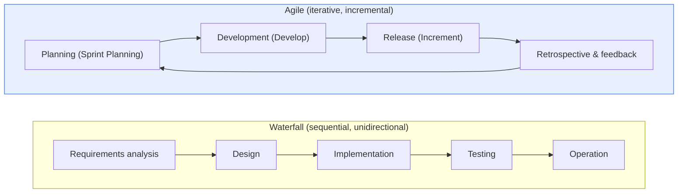
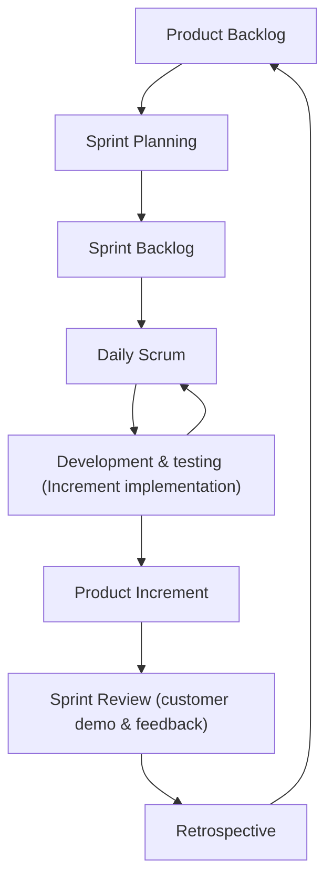

# Comparison of Waterfall and Agile Development Methodologies

## 1. Overview

### A. Definition

> The **Waterfall model** is a traditional, plan-driven, document-centric development methodology that proceeds sequentially and unidirectionally through requirements analysis → design → implementation → testing → operation, like water falling from top to bottom, with each phase required to be completed and approved before moving to the next.
>
> **Agile** is a change-adaptive, empirical methodology that incrementally delivers 'Working Software' in short iterations (Iterations/Sprints) of 2–4 weeks, receiving customer feedback in every iteration to adjust direction.

The opposition between the two methodologies appears on the surface to be a process difference of 'sequential vs. iterative,' but its roots lie in **a philosophical difference in 'how change is viewed.'** Waterfall regards change as **a source of cost and risk**. It therefore tries to secure predictability by fixing requirements as completely as possible in the early phases and controlling and minimizing subsequent changes through Configuration Management and a Change Control Board (CCB). From this perspective, a good project is 'a project that goes according to plan.'

Agile, by contrast, accepts change as **unavoidable and, indeed, a value that creates competitive advantage**. On the premise that market, technology and customer requirements will inevitably change during the project, it shows customers an actually working result every iteration and readjusts the next plan based on that feedback. From this perspective, a good project is not 'a project that kept to plan' but 'a project that delivered the most valuable things the fastest.' The key to comparing the two methodologies is understanding that this fundamental difference in perspective gives rise to all subsequent differences in practice — level of documentation, timing of customer involvement, risk management approach, quality assurance strategy, and so on.

### B. Background and Need

The Waterfall model originates from the sequential model presented by Winston Royce in a 1970 paper. Interestingly, Royce warned of the dangers of this linear model and emphasized feedback loops, but in practice only the unidirectional form — easy to manage and contract — was widely adopted. In the large, stable systems of the 1970s–80s (defense, aviation, manufacturing control), requirements were relatively clear and changes rare, so Waterfall, which manages progress through phase deliverables and approval gates, fit well. As U.S. Department of Defense standards (DoD-STD-2167A) and others institutionalized this approach, Waterfall became the de facto industry standard.

However, the spread of the web and the Internet in the late 1990s changed the situation. Requirements changed frequently even during development, time-to-market became as important as quality, and the recognition that 'perfect upfront planning is impossible' spread. Against this background, in 2001 seventeen software experts gathered and published the **Agile Manifesto**. Its four values are: ① **individuals and interactions** over processes and tools, ② **working software** over comprehensive documentation, ③ **customer collaboration** over contract negotiation, and ④ **responding to change** over following a plan. This manifesto is not a specific technique but a common value system encompassing various lightweight methodologies such as XP, Scrum, Kanban and FDD, and has become the mainstream paradigm of software development today.

## 2. Comparison of Process Structures

The most noticeable difference between Waterfall and Agile is 'when the finished product can be seen.' The diagram below contrasts the overall flow of the two methodologies.

In Waterfall, each phase must be completed before moving on, so an executable finished product appears only **late in the project (after the testing phase)**. The fatal weakness of this structure is that **the later a defect or misunderstanding of requirements is discovered, the more the cost of fixing it grows exponentially**. According to Barry Boehm's research on the cost escalation curve, a defect that costs 1 to fix if found in the requirements phase costs several times more in the design phase and tens to hundreds of times more in the operation phase. The situation in which the customer says "this isn't it" only after six months of development based on misunderstood requirements is Waterfall's typical failure scenario.

Agile, on the other hand, produces a 'Potentially Shippable Increment' at the end of every sprint. It therefore discovers problems and requirement misunderstandings **early and often**, lowering correction costs. However, this is not free. Because planning, development, integration and testing are repeated every iteration, meeting and coordination overhead arises, and continuous refactoring and technical debt management are needed so that accumulated increments maintain a consistent architecture.

For a concrete contrast, assume a 12-month, 10-person customer portal project. With Waterfall, the first 4 months go to requirements and design, months 5–10 to implementation, and months 11–12 to integration testing, so the customer first sees actual screens in month 11. If feedback such as "I didn't know search would work like this" arises then, the team must go back to design, and the remaining month cannot absorb it, resulting in schedule and budget overruns. With Agile dividing the same project into 24 two-week sprints, an initial version of login and search is demonstrated within the first month, and feedback is used to correct direction in the second sprint. The fact that the same misunderstanding differs in correction cost by tens of times depending on whether it is discovered in month 11 or month 1 condenses the essential difference between the two structures.

### A. Internal Flow of an Agile Iteration (Sprint)

To understand how Agile actually works, one must look inside a single iteration. Below is the event and artifact flow within a sprint based on Scrum.

In this flow, each element plays a distinct role. The **Product Backlog** is a prioritized list of requirements; unlike Waterfall's 'requirements specification,' it is not fixed but continuously refined (Grooming). In **Sprint Planning**, the team selects (pulls) the items for this iteration itself, and this autonomous selection creates team commitment. The **Daily Scrum** is a short synchronization meeting of about 15 minutes that shares progress and impediments daily, exposing problems early on a daily basis. In the **Sprint Review**, the actually working increment is demonstrated to the customer to receive feedback, and in the **Retrospective**, the 'team's way of working' — not the product — is improved. Agile thus implements empirical process control, 'Inspect & Adapt,' through tight feedback loops.

## 3. Comparison of Characteristics, Strengths and Weaknesses

### A. Strengths and Weaknesses of Waterfall

Waterfall's core strength is **ease of management and audit, and predictability**. Because clear deliverables (requirements specification, design document, test plan) and completion criteria are defined for each phase, progress can be measured objectively and external audits and inspections are easy to handle. In situations such as fixed-price contracts or public procurement, where 'what, by when, and for how much' must be fixed in advance, this predictability becomes a decisive advantage. For large systems with stable requirements, this approach is still reasonable.

The weaknesses are the flip side of these strengths. The premise of fixing requirements early is often broken in reality, and when changes come in, the team must go back to earlier phases, which is costly. Above all, the fact that the customer **first sees the result only late in the project** increases the risk of heading in the wrong direction. 'A system that was perfect on paper but turned out useless once built' is Waterfall's representative failure type.

### B. Strengths and Weaknesses of Agile

Agile's strengths are **responsiveness to change, fast value delivery and early discovery of risk**. Because the highest-priority features are delivered first, customers experience value from early in the project, and if the direction is wrong, it can be corrected before large losses. Even failure is turned into learning by failing 'quickly and cheaply (Fail Fast).'

The weaknesses come from fluid deliverables and scope. Because it is difficult to fix the overall scope and end date in advance, it is tricky to apply to fixed-price contracts and large-scale procurement, and if the principle of minimal documentation is misused, traceability and maintainability are damaged. In addition, results **depend heavily on the team's skill, autonomy and collaborative culture**, so transplanting it as-is into a command-and-control organization easily degrades it into 'Fake Agile.'

The difference in quality assurance approach is also worth noting. Whereas Waterfall is closer to 'Quality Control' after the fact, separating testing into its own phase to verify after completion, Agile aims for 'Built-in Quality' that fuses development and quality activities, such as Test-Driven Development (TDD), Continuous Integration (CI) and pair programming. For example, in a CI environment where automated tests run on every commit, defects are found on the day they are introduced, minimizing correction costs. This is the technical foundation that allows Agile to sustain 'fast iteration,' and also the reason quality collapses rapidly when Agile is imitated without automated tests.

| Category | Waterfall | Agile |
|---|---|---|
| **Progression** | Sequential, phase-completion | Iterative, incremental |
| **Requirement changes** | Difficult (fixed and controlled early) | Accommodated flexibly |
| **Documentation** | Detailed, emphasized | Minimized (working SW first) |
| **Customer involvement** | Mainly at start and end | Continuous throughout |
| **Result confirmation** | All at once, late | Every iteration |
| **Contract type** | Suits fixed-price | Suits time-and-materials (T&M), incremental contracts |
| **Risk exposure** | Concentrated late | Early and distributed |
| **Key to success** | Completeness of plans and documents | Team capability and collaborative culture |
| **Strengths** | Easy to manage and audit, predictability | Responds to change, fast value, early risk discovery |
| **Weaknesses** | Vulnerable to change, costly late defects | Difficulty managing scope, depends on skill |

### C. Relationship with the V-Model and Spiral Model

Waterfall is not an isolated model but the prototype of several derived models. The **V-Model** is a variant that places test phases (acceptance testing, integration testing, unit testing) symmetrically opposite each Waterfall development phase (requirements, high-level design, detailed design), forcing verification plans to be established from early in development. It attempts to compensate for Waterfall's weakness that 'testing is concentrated late,' and is widely used in fields where verification traceability matters, such as embedded, medical and defense. The **Spiral model** places risk analysis at the center of every cycle and repeats prototyping; combining Waterfall's planning with iterative risk management, it can be seen as a theoretical precursor of Agile.

Understanding this lineage shows that 'Waterfall vs. Agile' is not a black-and-white opposition but a spectrum. The flow from pure Waterfall → V-Model → Spiral → iterative-incremental (RUP) → Agile is a history in which the center of gravity gradually shifted from 'completeness of planning' to 'early resolution of risk and adaptation.' Therefore, the practical choice is a question of which point on this spectrum to take, not a question of exclusively choosing one of the two.

A table alone cannot show 'why' such differences arise. For example, the difference in the 'documentation' item is not a matter of taste; it arises because Waterfall rests on the premise that 'knowledge is transferred between phases through documents,' while Agile rests on the premise that 'knowledge is transferred through face-to-face conversation within the same team.' The difference in documentation level is an inevitable consequence of the difference in knowledge transfer mechanisms.

## 4. Selection Criteria and Hybrid Strategies

### A. Situational Selection Criteria

Methodologies have no superiority; there is only **fit with project characteristics**. The key variables for selection are ① requirement uncertainty, ② level of regulation and safety, ③ speed of market response, ④ contract type, and ⑤ team maturity. For embedded, public and safety-critical systems where requirements are clear and regulation and certification (e.g., medical devices IEC 62304, aviation DO-178C, financial core systems) matter, Waterfall (or the V-Model with strengthened verification) is suitable. Conversely, for web, mobile and startup services where requirements are uncertain and rapid experimentation and release matter, Agile is advantageous.

If one had to pick the single most decisive variable, it would be **requirement uncertainty**. When requirements are stable, upfront planning is accurate and Waterfall's predictability remains an advantage; when requirements are uncertain, even the most elaborate plan soon becomes invalid, and the effort spent on planning becomes a sunk cost. For this reason, coolly diagnosing 'how settled the requirements are' before starting is the starting point of methodology selection, and choosing Waterfall for management convenience despite high uncertainty is the most frequent misjudgment in the field.

### B. Hybrid and Large-Scale Agile

Real-world large projects choose a compromise between the two extremes. **Water-Scrum-Fall**, which plans top-level governance, budget and milestones like Waterfall while iterating actual development like Agile, is representative. When extending Agile across the whole organization, large-scale frameworks such as **SAFe (Scaled Agile Framework)**, **LeSS (Large-Scale Scrum)** and the **Spotify model (Squad, Tribe, Chapter, Guild)** are used. For example, SAFe groups multiple teams into one 'Agile Release Train (ART)' and synchronizes the plans of many teams through 'PI (Program Increment) Planning' every 8–12 weeks, pursuing both Agile's flexibility and large-organization alignment. However, adopting a framework does not itself guarantee agility, and one must beware of the paradox of procedures becoming heavier.

### C. Anti-patterns of Misapplication

A more common failure than methodology selection is the case where 'the choice was right but the application was wrong.' The representative anti-pattern on the Waterfall side is **documents for documents' sake**, consuming time that should be spent on design and verification to formally fill out deliverables no one reads. The obsession with fixing requirements 'completely' up front, which leads to Analysis Paralysis and delays the start, is a problem with the same root.

The representative anti-pattern on the Agile side is **'Fake Agile.'** Examples include the Daily Scrum degenerating into a place for progress reporting and reprimand, sprint scope being forcibly assigned from above rather than by an autonomous team, and improvement ideas from retrospectives being repeated without being implemented. Another is **misuse of minimal documentation**, where not even the minimum Architecture Decision Records (ADRs) needed for maintenance and handover are kept, accumulating technical debt. Such anti-patterns are not defects of the methodology itself but problems of culture and leadership, reminding us that when switching methodologies, the organization's way of working and its evaluation and reward systems must change together.

## 5. Advanced Topic: Latest Trends and Practical Application Cases

Since the 2010s, the methodology debate has entered a new phase through **combination with DevOps and CI/CD**. If Agile deals with 'what to build, why, and in what order,' DevOps deals with 'how to deploy what was built stably and frequently.' Only when the two are combined does Agile's 'fast value delivery' extend beyond the demo stage into the actual production environment. Google's DORA (DevOps Research and Assessment) research measures software delivery performance with four metrics — deployment frequency, lead time for changes, change failure rate and mean time to recovery (MTTR) — and showed that high-performing organizations deploy multiple times a day while maintaining low failure rates. Contrary to the conventional wisdom that 'frequent deployment is unstable,' this backs with data the core Agile/DevOps insight that deploying smaller and more often is actually more stable.

Practical cases make the logic of methodology selection clear. Companies such as Netflix and Amazon practice extreme Agile/DevOps, deploying thousands of times a day on microservices and CI/CD pipelines, because service requirements change rapidly and the cost of failure is localized. Conversely, aircraft flight control software (subject to DO-178C certification) and nuclear control systems maintain plan-driven approaches requiring extensive upfront verification and traceability, since a single change is directly tied to human life. Recently, 'Disciplined Agile (DA),' which keeps documentation and verification strict while developing iteratively, has been spreading even in regulated industries, so the two methodologies are converging not toward opposition but toward being combined to suit the situation on a spectrum.

There are also cases that show lessons of transition. During the early spread of Agile, cases were reported in which large, multi-organization public systems with strict deadlines, such as a health insurance portal, proclaimed Agile without preparation and failed at initial launch due to a lack of integration and governance. Such experiences dispelled the naive expectation that 'Agile is a cure-all' and reminded us that at large scale, disciplines such as inter-team integration, architectural alignment and release coordination must accompany it. Conversely, failures in which Waterfall is insisted upon for fast-changing consumer services, only for the market to have already changed by release time, are also common. Both failures share the commonality that they stem not from 'the methodology itself' but from 'a choice that does not fit the characteristics.'

Moreover, recently, as AI coding assistants and generative AI spread and development iteration cycles become even shorter, the share of 'agile exploration' — quickly building and validating prototypes even in the requirements and design phases — is growing. This suggests that the methodology's center of gravity is shifting further from 'completeness of planning' to 'speed of learning and adaptation' (however, caution is needed in generalizing, as variation by industry and organization is large).

## 6. Considerations and Implications (Professional Engineer Perspective)

1. **Team capability and organizational culture determine success more than methodology.** Agile fails as 'Fake Agile' unless an autonomous, collaborative team culture and the psychological safety to accept failure as learning are in place. Before introducing tools and processes, Change Management that diagnoses organizational maturity and transitions gradually must come first.

2. **The balance of documentation must be designed.** Agile's minimal documentation means 'eliminate unnecessary documents,' not 'eliminate documents.' Defining a 'Barely Sufficient' documentation level needed for traceability, maintenance and audit response in line with project characteristics is within the Professional Engineer's area of judgment.

3. **Consistency with contracts and governance must be ensured.** Applying Agile as-is to fixed-price, fixed-scope contracts creates conflicts in scope control and settlement. The methodology works only when contract models suited to incremental delivery (phased settlement, backlog-based T&M, outcome-based contracts) are designed together with budget and audit systems.

4. **Combination with DevOps, CI/CD and automated testing is essential.** Agile's fast iteration is unsustainable with manual deployment and testing. Continuous integration/deployment pipelines, automated testing, Infrastructure as Code (IaC) and Observability must be built together for 'fast value delivery' to translate into actual operations.

5. **Hybrid is an object of 'design,' not 'compromise.'** Beyond simply dividing into Waterfall at the top and Agile at the bottom, one must intentionally design, based on risk, regulation and market speed, at which layer plans are fixed and at which layer adaptation is allowed. Unprincipled mixing produces a result that combines only the weaknesses of both methodologies.

## References
- Agile Manifesto, https://agilemanifesto.org/
- Scrum Guide (2020), https://scrumguide.org/
- Scaled Agile Framework (SAFe), https://scaledagileframework.com/
- Google Cloud DORA / DevOps research, https://dora.dev/

---

> **In one line**: Waterfall pursues *predictability* by controlling change, while Agile pursues *flexibility and fast value delivery* by embracing change — methodologies of opposing philosophies that are selected according to requirement stability, regulation, market speed and contract type, or combined via Water-Scrum-Fall, SAFe and the like, with integration with DevOps/CI/CD and team capability and organizational culture ultimately determining success.
