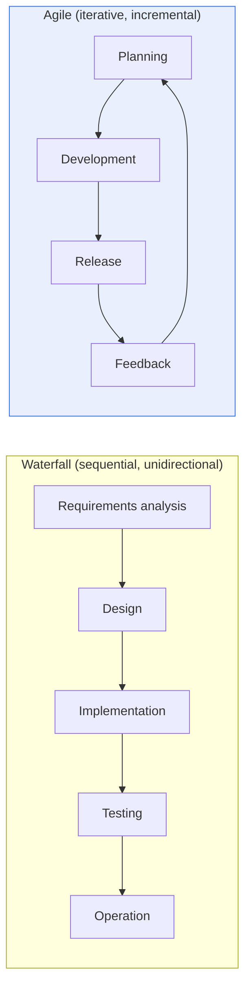

# Comparison of Waterfall and Agile Development Methodologies

## 1. Overview

### A. Definition
> The **Waterfall model** is a traditional methodology that proceeds sequentially and unidirectionally, like a falling waterfall, through requirements analysis → design → implementation → testing → operation, while **Agile** is a methodology that incrementally builds working software in short iterations (Iteration/Sprint) of 2–4 weeks and responds flexibly to change.

The opposition between the two methodologies ultimately comes down to a difference in philosophy: "**how change is viewed**." Waterfall regards change as **cost and risk**, seeking to secure predictability by fully fixing requirements in the early stage and controlling and minimizing subsequent changes. Agile, by contrast, accepts change as **unavoidable and even valuable**, showing customers actually working deliverables in every iteration and correcting direction based on feedback. This fundamental difference in viewpoint produces differences in every practice, including documentation, customer involvement, and risk management.

### B. Background
Waterfall became established in the 1970s for systematic management in the development of large, stable systems (defense, manufacturing). However, with the arrival of the web and mobile era, in which requirements change frequently and speed to market is critical, the **Agile Manifesto** emerged in 2001 from the recognition that "a perfect plan is impossible." Its core values are "responding to change over following a plan, and working software over comprehensive documentation."

## 2. Comparison of Process Structures

In Waterfall, each stage must be completed before moving to the next, so the finished product can be seen only late in the project. The fatal weakness of this structure is that **the later defects or misunderstood requirements are discovered, the more exponentially the cost of fixing them grows** (a requirements-stage defect fixed in the operation stage costs tens to hundreds of times more). Agile, on the other hand, produces working deliverables every iteration, so problems and misunderstandings are **discovered early and often**, lowering correction costs.

## 3. Comparison of Characteristics, Advantages, and Disadvantages

The advantages of Waterfall are that plans, schedules, and deliverables are clear, making **management and auditing easy**, and that predictability is high in large projects with stable requirements. Its disadvantages are that it is vulnerable to change and that customers see results only late, creating a high risk of heading in the wrong direction. The advantages of Agile are **responsiveness to change and rapid value delivery**, as well as early detection of risks; its disadvantages are that deliverables and scope are fluid, making it difficult to apply to large, contract-based projects, and that outcomes depend heavily on the team's skill and autonomy.

| Category | Waterfall | Agile |
|---|---|---|
| **Progression** | Sequential, stage-completion-based | Iterative, incremental |
| **Requirement changes** | Difficult (fixed early, controlled) | Accommodated flexibly |
| **Documentation** | Detailed, emphasized | Minimized (working SW first) |
| **Customer involvement** | Mainly at start and end | Continuous throughout |
| **Result verification** | All at once, late | Every iteration |
| **Advantages** | Easy management/auditing, predictability | Responsiveness to change, fast value, early risk detection |
| **Disadvantages** | Vulnerable to change, costly late defects | Difficult scope management, dependent on skill |

## 4. Selection Criteria and Hybrids

There is no right answer among methodologies, only **suitability to project characteristics**. Waterfall (or the V-model) is suitable for embedded, public-sector, and core financial systems where requirements are clear and regulation and safety are important, while Agile is advantageous for web and mobile services where requirements are uncertain and speed of market response is important. Real large-scale projects compromise with a **hybrid (Water-Scrum-Fall)** approach that runs high-level planning like Waterfall and development like Agile, or with **large-scale Agile frameworks** such as SAFe and LeSS.

## 5. Considerations and Implications

1. **Team capability and organizational culture determine success more than methodology.** Without a culture of autonomous, collaborative teams as a prerequisite, Agile becomes "Agile in name only" and fails.
2. **Balance in documentation** is needed. Just because Agile minimizes documentation does not mean that even the minimum documents needed for traceability and maintenance should be eliminated.
3. Agile's "rapid value delivery" is actually realized when combined with DevOps and CI/CD, and this combination has recently been becoming the standard.

---

> **In one line**: Waterfall controls change to pursue *predictability*, while Agile embraces change to pursue *flexibility and rapid value delivery*; the choice depends on project characteristics such as requirement stability, regulation, and market speed, or a hybrid compromise is used, but the key to success is team capability and culture.
