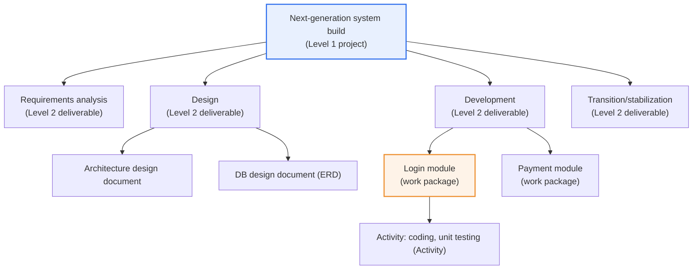
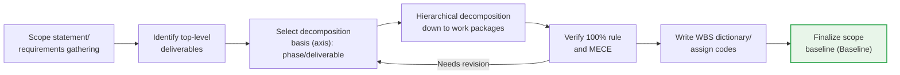

# Work Breakdown Structure (WBS)

## 1. Overview

### A. Definition
> A deliverable-oriented hierarchical structure that **hierarchically decomposes the entire scope (deliverables) of a project into small, manageable work units**. It is a core project management tool that serves as the Baseline for managing scope, schedule, cost, resources, quality, and risk.

The essence of the WBS is "**breaking a huge, vague project down into pieces of manageable size**." A big goal such as "build a next-generation information system" cannot, by itself, be scheduled or costed. As long as the scope remains abstract, it is impossible to assign owners or calculate progress. The WBS decomposes it in tree form, starting from the top-level deliverable, down to sub-deliverables, and finally to the smallest actually executable unit, the **Work Package**. Breaking it down this finely makes it possible to concretely estimate the duration, cost, and owner of each piece of work, to measure progress objectively, and to control the whole without omissions.

The most important principle here is that the WBS is decomposed around "**what to produce (deliverables/outputs)**" rather than "**what to do (activities)**." For example, rather than "coding," it is divided into outputs such as "login module" and "payment module." This deliverable orientation has two practical effects. First, it provides a clear completion criterion (Definition of Done) whose fulfillment can be visibly confirmed. With activities, "how much has been done" is ambiguous, but deliverables are judged by "has it been produced." Second, "what has been missed" can be checked against the list of deliverables, structurally preventing scope omissions. Breaking work down by activities easily leads to duplication and omission, whereas breaking it down by deliverables makes the containment relationship between upper and lower levels clear.

### B. Background and Need
The larger and more complex a project, the harder it is to grasp what must be done and how much, and the more the scope drifts. Especially in IT projects such as SI and SM, where the deliverable is intangible software, progress is hard to confirm visually, and without clear decomposition criteria it is easy to fall into the so-called **90% syndrome**, in which the report "90% done" is repeated until the end of the project. The WBS emerged to eliminate this ambiguity. It visualizes and structures scope to provide a baseline for planning and control, and it creates **a common language and agreement** among stakeholders such as the client, PM, and developers about "what this project produces."

In addition, the WBS serves as the input for all other plans in the project management body of knowledge. Schedule (Gantt chart, CPM), cost (cost baseline), resources (RAM), risk, and quality plans all use the WBS work packages as their starting point. Therefore, if the WBS is weak, a chain effect occurs in which all subsequent plans become weak; conversely, a robust WBS becomes the foundation of project control as a whole.

## 2. Hierarchical Structure and Components of the WBS

The entire project is placed at the root, it is decomposed into increasingly concrete deliverables going downward, and at the bottom sit the work packages, the actual units of management. Each level is constructed to represent 100% of the deliverable above it in full.

The WBS forms a single management system in which multiple components interlock. Each component is not merely a name but plays a different management role, so it is important to understand their meanings distinctly.

The **Work Package** is the lowest-level element of the WBS and is **the basic unit of management** for estimating schedule and cost, measuring progress, and assigning responsibility. Going further down than the work package takes you out of the WBS and into activities in the domain of schedule planning. That is, there is a boundary: the WBS stops at "what is produced (deliverables)," while "how it is produced (activities, sequence)" is handled by subsequent schedule planning. In practice, a work package is usually assigned to one person (or one team) and is designed to have clear completion criteria and a budget.

A **Control Account** is a higher-level management point that groups multiple work packages to measure and control performance. In Earned Value Management (EVM), the unit at which Planned Value (PV), Earned Value (EV), and Actual Cost (AC) are aggregated is precisely this control account, and cost and schedule performance are viewed in an integrated way at this level. If the work package is the unit of execution, the control account is the unit of performance measurement.

The **WBS Dictionary** is a document containing detailed information about each work package. It describes the work content, deliverables, owner, estimated duration and cost, predecessor work, acceptance criteria, related contract information, and so on. A WBS diagram alone is nothing more than a set of name tags; only when accompanied by the WBS dictionary does it become an executable plan. A common reason why plans drift in the field even after a WBS has been drawn is precisely the absence of this dictionary.

The **WBS Code (Code of Accounts)** is a hierarchical identification number assigned to each element (e.g., 1.3.2), serving as the key to systematically linking deliverables with cost and schedule information and tracing parent-child relationships.

| Component | Role | Management Significance |
|---|---|---|
| **Work package** | Lowest-level deliverable unit | Basic unit for schedule/cost estimation, progress measurement, responsibility assignment |
| **Control account** | Grouping of work packages | Point for measuring and integrating EVM performance (PV, EV, AC) |
| **WBS dictionary** | Detailed specification of work packages | Ensures executability (content, criteria, owner, duration) |
| **WBS code** | Hierarchical identification number | Linking and tracing deliverables, cost, and schedule |

## 3. WBS Principles and Procedure

### A. Principles
A WBS is not a picture drawn arbitrarily; there are rules to follow. The most fundamental is the **100% Rule**, the principle that the sum of the lower-level elements must represent the upper-level element 100% completely, with nothing missing and nothing extra. It applies in both directions: upward (no unneeded work is added) and downward (no work is omitted). If the 100% rule is not followed, the scope baseline itself becomes misaligned and all subsequent control becomes meaningless.

The second principle is **Mutual Exclusivity** among elements: the same work must not be included in two deliverables. Duplication causes cost and effort to be double-counted and blurs the boundaries of responsibility. This corresponds exactly to the MECE (Mutually Exclusive, Collectively Exhaustive) principle of logical classification.

The third is the **deliverable (output)-oriented decomposition** emphasized earlier, and the fourth is the **appropriate level of decomposition (appropriate granularity)**. Breaking things down too finely (over-decomposition) causes management overhead to explode, while leaving them too large (under-decomposition) makes progress and cost uncontrollable. In practice, the **8/80 rule** (a work package of about 8 to 80 hours, i.e., 1 day to 2 weeks of work) is commonly used as an empirical criterion, or the yardstick "can completion be judged within one reporting cycle?" is applied. For example, in a project that reports progress every two weeks, it is advantageous for control to size work packages so they finish within two weeks.

| Principle | Description | Problem If Violated |
|---|---|---|
| **100% Rule** | Sum of children = 100% of parent (no omission or excess) | Collapse of scope baseline, loss of control |
| **Mutual Exclusivity (MECE)** | No duplication among elements | Double-counted cost/effort, ambiguous responsibility |
| **Deliverable-oriented** | Decompose by outputs, not activities | Hard to judge completion and check for omissions |
| **Appropriate decomposition level (8/80)** | Size at which progress/cost can be measured | Too fine: overhead / too coarse: uncontrollable |

### B. Procedure and Approaches
WBS creation is approached broadly **Top-down** or **Bottom-up**. Top-down starts from the whole project and gradually breaks it down into detailed deliverables, suitable for projects with relatively clear scope. Bottom-up gathers detailed tasks that team members come up with through brainstorming and groups them into higher categories, which is advantageous for reducing omissions in new or uncertain areas. In practice, the two are often used together, setting up the skeleton top-down and reinforcing the details bottom-up.

The "**basis (axis)**" of decomposition must also be chosen. There is the **deliverable basis** (by product or module), the **phase basis** (by lifecycle phase: analysis–design–development–testing), and the **organizational basis** (by performing organization), and different axes are sometimes mixed at upper and lower levels. For example, the upper level may be divided by phase, and the inside of the development phase by deliverable (module). The following shows the typical creation process.

### C. Representation Formats and Example
A WBS is represented in several formats depending on purpose and audience. The **tree (org-chart) format** shows hierarchical relationships at a glance and is good for reporting to and sharing with the client; the **hierarchical list (outline) format** lists items as text with codes and is advantageous for tool and document management; and the **tabular format** includes owner, duration, and cost together and is suited to execution management. Although the formats differ, the content they hold (hierarchy, deliverables, codes) is the same.

Below is an example of a small SI project expressed in hierarchical list format. Each lowest-level item is a work package, to which the WBS dictionary is attached to give it an owner, duration, and cost.

| WBS Code | Deliverable (Work Package) | Estimated Effort |
|---|---|---|
| 1. Next-generation portal build | (Project) | — |
| 1.1 Requirements analysis | Requirements definition document | 60 M/D |
| 1.2 Design | — | — |
| 1.2.1 Screen design document | UI design deliverable | 40 M/D |
| 1.2.2 DB design document (ERD) | Logical/physical model | 30 M/D |
| 1.3 Development | — | — |
| 1.3.1 Login module | Authentication function | 20 M/D |
| 1.3.2 Payment module | Payment function | 45 M/D |
| 1.4 Testing/transition | Integration test report | 35 M/D |

In this example, for "1.3 Development," the sum of "1.3.1 Login module + 1.3.2 Payment module" must make up 100% (100% rule), and the two modules must not overlap (MECE). If an "admin module" is missing here, the sum of the children does not represent 100% of the parent, so it is a scope omission. In addition, summing the effort (M/D) of each work package yields the project's total effort and cost baseline, and this value becomes the basis for calculating Planned Value (PV) in subsequent EVM.

## 4. Linkage with Other Plans and Utilization

The real value of the WBS is revealed not in itself but when it interlocks with other management tools. First, WBS work packages are decomposed into lower-level **activity lists**, given precedence relationships (PDM), and scheduled using the Critical Path Method (CPM) and Gantt charts. Second, the costs of each work package are summed to create the **Cost Baseline**, to which Bottom-up Estimating is applied. Third, crossing the WBS with the Organizational Breakdown Structure (OBS) yields the **Responsibility Assignment Matrix (RAM/RACI)**, which settles "who is responsible for which deliverable."

Fourth, in the progress control phase, the WBS becomes the backbone of **Earned Value Management (EVM)**. For example, in a project with a total budget of 1 billion won and 100 work packages, if only 30 have actually been completed at a point when 40 should have been completed according to plan, the schedule delay can be quantified from the difference between Planned Value (PV) and Earned Value (EV). Thus, without a WBS, the very units for aggregating EVM's PV and EV do not exist.

**Recovery measures for schedule delays** are also established on the basis of the WBS and CPM. Typically, **Crashing** shortens duration by adding resources to tasks on the critical path, increasing cost, and **Fast Tracking** runs sequential tasks in parallel, increasing rework risk. For example, if design is delayed by two weeks, the delay can be recovered by adding staff to speed up design (Crashing) or by starting part of development before design is complete (Fast Tracking), but either way a price (cost or risk) must be accepted.

| Recovery Measure | Description | Cost |
|---|---|---|
| **Crashing** | Shorten duration by adding resources to the critical path | Increased cost |
| **Fast Tracking** | Parallelize sequential tasks | Increased rework risk |
| **Scope adjustment** | Reduce or defer lower-priority scope | Fewer deliverables |

## 5. Advanced: WBS in Agile Environments and Recent Trends

In traditional Predictive projects, the WBS presupposes that the entire scope is fixed early in initiation. However, in Agile (Adaptive) environments where requirements keep changing, nailing down the entire scope with the 100% rule at the outset actually conflicts with reality. Agile therefore replaces the WBS with the **Product Backlog** and **story decomposition (Epic → Feature → User Story → Task)**. Interestingly, although the names and timing differ, the **principle of decomposition is the same**: "divide a huge scope into small manageable units without duplication or omission." The difference is that Agile does not complete this decomposition all at once but elaborates it progressively each sprint (Progressive Elaboration).

Recent trends in the project management body of knowledge are also noteworthy. Up to the PMBOK 6th edition, the WBS was explicitly defined as a core output of "scope management," but the 2021 PMBOK 7th edition was restructured from a process-centered approach to one **centered on principles and performance domains (Principle/Domain)**, shifting toward not mandating specific tools. Nevertheless, the WBS remains the most widely used scope decomposition technique, and in hybrid (predictive + adaptive) projects, a compromise approach of managing high-level scope with a WBS and detailed execution with a backlog is spreading. In short, understanding the WBS not as a "fixed template" but as "a way of thinking called decomposition" is accurate for both the exam and practice.

## 6. Considerations and Implications

1. **It is the Baseline for all plans.** Without a WBS, schedule (Gantt, CPM), cost (cost baseline), resource (RAM), and risk plans cannot be established. Therefore, accurate WBS creation is the starting point of project success, and a weak WBS propagates errors to all subsequent plans.
2. **Always use it together with the WBS dictionary.** A diagram alone is nothing more than name tags. Only when the WBS dictionary, containing each work package's content, deliverables, owner, duration, and acceptance criteria, is managed alongside it does it become an executable plan, and when change requests come in, the dictionary is also needed to trace the scope of impact accurately.
3. **Link it with change management and configuration management.** A WBS finalized as the scope baseline can be changed only through the Integrated Change Control (ICC) process. Modifying the WBS without control makes it a channel for Scope Creep, so changes must always be approved and recorded.
4. **Appropriate granularity and stakeholder involvement are key.** Criteria such as the 8/80 rule should be established to avoid over- and under-decomposition, and the teams that will actually perform the work and the client should be involved in creating it to produce a realistic, agreed-upon WBS. Expert Judgment and reuse of templates from similar projects also improve quality.
5. **Apply it flexibly according to the methodology.** Predictive projects adopt an early-fixed WBS, Agile adopts backlog-based progressive decomposition, and hybrid projects adopt a compromise between the two. When the WBS is understood not as an absolute template but as "the principle of decomposition," it can be applied consistently across diverse project types.

## References
- PMI, "A Guide to the Project Management Body of Knowledge (PMBOK Guide) – Seventh Edition", 2021, https://www.pmi.org/pmbok-guide-standards
- PMI, "Practice Standard for Work Breakdown Structures", https://www.pmi.org/

---

> **In one line**: The WBS is a deliverable-oriented structure that *hierarchically decomposes project scope around deliverables down to work packages*; by following the 100% rule, MECE, and the 8/80 rule, it provides the baseline for managing schedule, cost, progress, and responsibility (EVM, RAM), and while in Agile it changes form into the product backlog, "the principle of decomposition" remains the same.
