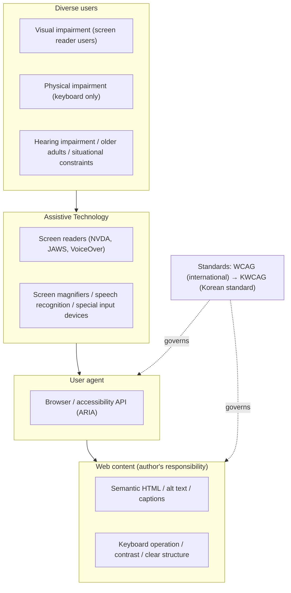
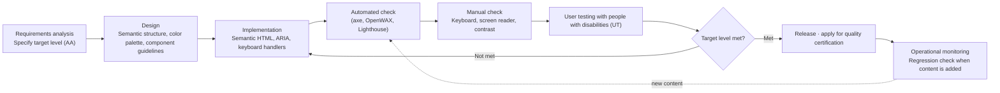

# Web Accessibility and WCAG/KWCAG

## 1. Overview

> **Definition**: Web accessibility is the property — and the design and development principles for achieving it — that ensures all users, including people with disabilities and older adults, can equally perceive, understand, operate, and use the information and functions provided by a website regardless of their physical or technical circumstances.

Three drivers explain why web accessibility has emerged as an independent quality attribute of information systems. First, **demographic and social change**. As aging accelerates, the number of users experiencing declining vision, motor ability, and cognition has surged; when temporary disabilities (a broken arm) and situational disabilities (reading a screen outdoors in bright light, listening to audio in a noisy environment) are included, this effectively covers the entire population. Accessibility has been redefined not as a courtesy for a small group of people with disabilities but as a matter of **Universal Usability**.

Second, **legal and institutional mandates**. In Korea, the Act on the Prohibition of Discrimination Against Persons with Disabilities and Remedy for Their Rights (the "Anti-Discrimination Act") mandates the provision of reasonable accommodation in information, communications, and interaction — including the web — and defines failure to do so as discrimination. The Framework Act on Intelligent Informatization requires national and local governments and public institutions to comply with web accessibility, and non-compliant public services may face point deductions in audits and evaluations or corrective orders. Abroad, Section 508 of the U.S. Rehabilitation Act and the ADA, and in Europe EN 301 549 and the European Accessibility Act (EAA, in force from 2025), have made accessibility a de facto market-entry requirement.

Third, **the maturity of technical standards**. Moving beyond early ad hoc guidelines, the W3C's WCAG (Web Content Accessibility Guidelines) became established as an international standard, and in Korea KWCAG (Korean Web Content Accessibility Guidelines), which reflects WCAG, was enacted as a broadcasting and communications standard. Accessibility can thus be managed not as a "good-faith effort" but through **verifiable quantitative criteria**. From a Professional Engineer's perspective, web accessibility sits at the intersection of usability, compliance, and inclusiveness among non-functional requirements (quality attributes), and is a representative area where building it in from the start (Accessibility by Design) minimizes downstream costs.

## 2. Overall Structure and Principles of Web Accessibility

Web accessibility rests on a triangular structure of content (authors), user agents (browsers, media players), and Assistive Technology. No matter how well content follows standards, accessibility is incomplete without a browser to interpret it and assistive technology to deliver it to the user; conversely, even excellent assistive technology is rendered useless if content carries no semantic structure. The structural diagram below shows this ecosystem together with the standards framework.

### A. POUR — The Four Principles of Web Accessibility

WCAG and KWCAG are both built on four principles known as **POUR**. These principles are higher-level concepts that remain valid as individual technologies change, serving as the compass for accessibility judgments.

**Perceivable** means information and UI components must be presented in forms users can perceive. Typical examples are providing alternative text (alt) for images so screen readers can read it aloud, providing captions, sign language, and audio description for videos, and ensuring sufficient contrast between text and background (at least 4.5:1 for normal text under WCAG AA). Not conveying information by color alone is also an essential requirement for users with color vision deficiency. For instance, the instruction "required fields are in red" is meaningless to users who cannot distinguish colors, so an asterisk or text must be added.

**Operable** means the UI and navigation must be operable. For users with physical impairments who cannot use a mouse, every function must be achievable **with the keyboard alone**, focus must move in a logical order, and there must be no keyboard trap where focus gets stuck on a particular element. Time-limited content must allow extension or removal, and flashing more than three times per second is prohibited because it can trigger photosensitive seizures. Providing a "Skip Navigation" link to bypass repeated menus is another classic example.

**Understandable** means information and UI operation must be understandable. The content language must be specified (lang attribute) so screen readers pronounce it correctly, page components must behave predictably, and when an input error occurs the user must be clearly told where and what went wrong and how to fix it. For example, in a sign-up form, providing specific guidance such as "The email must contain @" rather than merely "Format error" puts this principle into practice.

**Robust** means content must be reliably interpreted by a wide range of current and future user agents and assistive technologies. Markup must be syntactically valid, and custom controls must be given accurate name, role, state, and value through WAI-ARIA so screen readers can convey the element's meaning. If a JavaScript-built custom dropdown exposes no information to the accessibility API, it effectively does not exist for assistive technology users.

### B. WCAG Conformance Levels and Criteria Structure

WCAG (current stable version 2.2, W3C Recommendation of 2023.10.5) has a hierarchical structure with Guidelines under the four principles and testable **Success Criteria**. WCAG 2.2 contains 87 success criteria in total, the result of adding 9 new criteria compared with WCAG 2.1 (focus not obscured, dragging movements alternatives, minimum target size, consistent help, redundant entry, accessible authentication, etc.). Each success criterion is classified into one of three levels.

| Level | Meaning | Practical standing |
|------|------|-------------|
| A (minimum) | Basic accessibility; if not met, certain users cannot use the content at all | Mandatory floor |
| AA (recommended) | The practical target level required by most laws and regulations | **De facto mandatory baseline for public and commercial services** |
| AAA (highest) | Applied to specialized content and special purposes; full conformance is unrealistic | Optional elevated target |

Most national legislation and procurement requirements target **AA conformance**. It should be understood that AAA includes very high criteria such as a 7:1 contrast ratio and sign language provision, making site-wide application difficult. The significance of this level system is that it allows accessibility to be achieved and measured incrementally rather than on an "all or nothing" basis.

### C. KWCAG — Structure of the Korean Guidelines

In Korea, **KWCAG (Korean Web Content Accessibility Guidelines) 2.2**, enacted by the National Radio Research Agency as a broadcasting and communications standard (KCS) based on WCAG, applies. KWCAG 2.2 is a restructuring of WCAG 2.1 reflecting the domestic environment and has a three-tier structure of **4 principles · 14 guidelines · 33 check items**. The table below summarizes representative check items by principle.

| Principle | Representative check items (examples) | Core requirement |
|------|----------------------|-----------|
| Perceivable | Alternative text, captions, color-independent content, contrast (4.5:1) | Perceivable by the senses |
| Operable | Keyboard access, focus movement, skipping repeated areas, flash limits | Operable |
| Understandable | Default language indication, error correction, labels, linear content structure | Content understandable |
| Robust | Markup error prevention, web application accessibility (ARIA) | Stable technical compatibility |

KWCAG conformance is reviewed through **Web Accessibility Quality Certification** based on the Framework Act on Intelligent Informatization (by designated certification bodies such as the Korea Web Accessibility Certification Center), and upon passing a certification mark is granted, valid for one year. Inspection combines automated checking tools (e.g., OpenWAX, K-WAH) with expert and disabled-user evaluation. The practical crux is that automated tools catch only mechanically determinable items such as contrast and the presence of alt text, whereas qualitative items like "Is the alternative text meaningfully written?" require human judgment.

## 3. Accessibility Assurance Process and Implementation Architecture

Accessibility is never achieved cheaply by inspecting a finished site after the fact. **Accessibility by Design** must take root: specifying accessibility as a non-functional requirement at the requirements definition stage and verifying it repeatedly throughout design, implementation, and testing. The process diagram below shows accessibility activities built into the development lifecycle.

The most common failure pattern is treating accessibility as a "work item for passing certification" just before project completion. In that case, already-finalized screen structures must be torn apart, causing modification costs to explode, and the result ends up as superficial compliance that merely fills in alt text. Conversely, if semantic structure and a design system (shared components with built-in accessibility) are established at the design stage, developers reuse button, modal, and tab components whose accessibility is already verified, so a certain level is guaranteed regardless of individual developers' varying accessibility knowledge. In fact, the design systems of governments and large enterprises (e.g., the Korean Government Design System and shared UI components across several financial institutions) are representative cases of raising the organization's overall accessibility quality by guaranteeing conformance at the component level.

The key implementation principle is **semantics first, minimal ARIA**. Standard HTML elements with meaning, such as `<button>`, `<nav>`, `<main>`, and `<h1~h6>`, expose their role and state to the accessibility tree on their own, requiring almost no extra handling. By contrast, attaching a click event to a `
` to use it as a button requires manually implementing role, tabindex, keyboard handlers, and state management, increasing the likelihood of defects. The W3C maxim "No ARIA is better than Bad ARIA" encapsulates this principle.

### D. Common Violation Types and Remediation Cases

Defects repeatedly flagged in field inspections converge into a few types; knowing them allows their use as a design checklist. First, **meaningless alternative text**. This includes filling alt only formally, such as `alt="image"` or `alt="photo1"`, or conversely attaching verbose descriptions to purely decorative images that disrupt screen reader users' listening. The remediation principle is to give "informative images the information the image conveys, and decorative images an empty alt (`alt=""`)" so assistive technology skips them.

Second, **controls not accessible by keyboard**. Menus that open only on mouse hover and pop-ups that close only on mouse click are typical. In one real case, a Korean public reservation service had a calendar widget implemented for mouse only, so users with physical impairments could not select dates; accessibility was restored by reimplementing it so dates are navigated with the arrow keys and selected with Enter. Third, **removal of focus indicators**. This is a common mistake of applying `outline:none` in CSS for aesthetic reasons, leaving keyboard users unable to tell where focus currently is; an alternative focus style with sufficient contrast must always be provided.

Fourth, **missing form labels**. If an input field has no associated `<label>`, a screen reader just reads "edit text," leaving the user unsure what to enter. Even if the label is hidden visually, the programmatic association (label for/id, or aria-label) must be kept. These violations mostly stem from a small number of shared components, so fixing them once at the component level resolves them site-wide simultaneously — illustrating the economics of accessibility refactoring.

## 4. Comparison — Accessibility · Usability · Universal Design

Web accessibility is often conflated with usability and Universal Design, but their targets and perspectives differ. Understanding these differences clarifies how far accessibility investment aims to go.

| Category | Web accessibility | Usability | Universal design |
|------|-----------|--------|-----------------|
| Primary target | Constrained users such as people with disabilities and older adults | General users | All users |
| Key question | "Is it **possible** to use?" | "Is use **efficient and satisfying**?" | "Was it designed from the outset so **anyone** can use it?" |
| Criteria | WCAG/KWCAG success criteria (quantitative) | Task success rate, time on task, error rate | 7 principles (equitable, flexible, simple, etc.) |
| Relationship | Prerequisite for usability | Builds on accessibility | Overarching philosophy encompassing accessibility and usability |

Accessibility and usability are not mutually exclusive but hierarchical. If accessibility is about "removing barriers (possibility of use)," usability concerns "quality of use"; if something is accessible but cumbersome to operate, it can meet accessibility yet have low usability. In practice, however, the two are strongly correlated, because clear structure, logical focus order, and lucid error messages raise usability for everyone, not just people with disabilities. This is the basis of the argument that accessibility investment is not "a cost for the few" but pays back as **overall UX improvement and SEO (search engine optimization — semantic structure also benefits crawlers)**.

As a concrete example, captions were originally a feature for deaf and hard-of-hearing people, but they are also useful to ordinary users watching videos on a noisy subway and to foreign-language learners. This phenomenon, where accessibility features benefit an unexpectedly broad range of users, is called the **Curb-Cut Effect**, and is cited as a representative argument that accessibility is a universal value rather than a special need.

Numerically, too, the population served by accessibility is by no means small. The World Health Organization (WHO) estimates that about 15% or more of the world's population lives with some form of disability, and Korea alone has about 2.6 million registered persons with disabilities. Adding older adults and people with temporary or situational constraints, the beneficiaries of accessibility improvements constitute a substantial share of the entire user base rather than a specific minority. When customer churn and legal dispute costs from non-compliance are weighed against market expansion and brand trust from compliance, the common conclusion of multiple empirical studies is that the ROI of accessibility investment is no less than that of ordinary UX improvement investments.

## 5. Advanced — Recent Trends and WCAG 3.0

Accessibility standards are evolving in step with changing content forms. First, **the next-generation standard WCAG 3.0** is under development at the W3C at the Working Draft stage. WCAG 3.0 inherits the spirit of the existing four POUR principles but is discussing a shift away from the "pass/fail" dichotomy of success criteria and the A/AA/AAA level system toward **multi-dimensional scoring and reporting** (e.g., Bronze/Silver/Gold ratings, outcome-based evaluation). This is an attempt to cover diverse outputs including not only HTML documents but also mobile apps, XR, and web applications, and to reflect qualitative areas such as cognitive accessibility more flexibly. However, reaching a formal Recommendation will take considerable time, so for the next several years **WCAG 2.2/KWCAG 2.2 (AA)** is expected to remain the practical compliance baseline. In an exam answer, it is important to accurately convey the timing: "WCAG 3.0 is still at the draft stage and the current practical standard is 2.2."

Second, **mobile accessibility** has grown in importance. In responsive web and native apps, minimum touch target size (a new WCAG 2.2 criterion), support for screen rotation, and preventing content clipping when zoomed become key issues, and in Korea separate mobile application accessibility guidelines are also in operation. Third, **AI-driven accessibility automation** is spreading — generating image alt text automatically with generative AI, or automated checking tools detecting defects with machine learning. However, AI-generated alt text can misread context ("excessive description on decorative images"), and automated tools miss qualitative items, so it is emphasized that **final human verification is still essential**. Fourth, with the European Accessibility Act (EAA) in force, accessibility has become a legal obligation extending into private sectors such as e-commerce, e-books, and banking services, making it a regulatory risk-management issue for global service companies.

## 6. Considerations and Implications (Professional Engineer's Perspective)

- **Codification as a non-functional requirement and reflection in procurement**: The target level (e.g., KWCAG 2.2 AA, acquisition of quality certification) must be specified quantitatively in the Request for Proposal (RFP) and requirements specification at the ordering and contracting stage to establish a basis for management and acceptance. Writing only a vague "accessibility compliance" leads to disputes at acceptance time, so a strategy of fixing check items, certification acquisition, and deliverable criteria as contract requirements is needed.

- **Economics of proactive embedding versus late remodeling**: The later accessibility defects are found, the more remediation costs increase exponentially (the same principle as rising costs of late-discovered design defects). A **Shift-Left** strategy — building accessibility into design systems and shared components and incorporating automated checks (axe-core, etc.) into the CI pipeline — minimizes total cost of ownership (TCO).

- **Trade-off between automation and manual evaluation**: It must be recognized that automated checking tools can mechanically verify only about 30–40% of all success criteria. Keyboard operation flow, meaningful conveyance in screen reader output, and appropriateness of alt text must be supplemented by expert manual inspection and user testing (UT) with actual people with disabilities, and an automated score of 100% must not be mistaken for complete accessibility.

- **Extending beyond regulatory compliance to inclusion and ESG value**: Beyond avoiding legal risk (remedies for discrimination under the Anti-Discrimination Act, litigation), accessibility links to the Social (S) performance indicators of ESG, expansion of potential customer segments (people with disabilities and seniors), and enhanced brand trust. Considering the curb-cut effect and SEO/UX improvements, accessibility investment should be reinterpreted not as a cost but as value creation through improved universal usability.

- **Integrated management with related technologies**: Accessibility is closely intertwined with design systems, front-end frameworks (accessibility support in React/Vue), semantic markup and SEO, and internationalization (i18n). The key to sustainable accessibility is establishing governance (guidelines, training, automated checking, managing certification renewal cycles) from the perspective of the overall front-end quality architecture rather than as an individual feature.

## References
- W3C, Web Content Accessibility Guidelines (WCAG) 2.2, https://www.w3.org/TR/WCAG22/
- W3C WAI, What's New in WCAG 2.2, https://www.w3.org/WAI/standards-guidelines/wcag/new-in-22/
- W3C, WCAG 3.0 Working Draft, https://w3c.github.io/wcag3/guidelines/
- Korean Web Content Accessibility Guidelines (KWCAG) 2.2, https://a11ykr.github.io/kwcag22/
- Korea Web Accessibility Certification Center (KWACC) Web Accessibility Quality Certification, http://www.kwacc.or.kr/Accessibility/Certification

---
> **In one line**: Web accessibility is a quality attribute that ensures everyone, including people with disabilities and older adults, can equally use web information; it is achieved by building it in from the design stage against WCAG (international, currently 2.2 at AA) and KWCAG (Korean: 4 principles, 14 guidelines, 33 items), both founded on the four POUR principles, and by combining automated, manual, and user evaluation.
