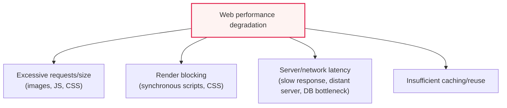
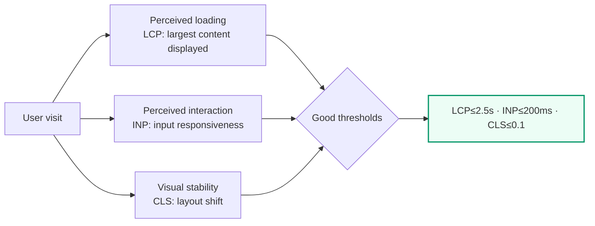

# Web Performance Management and Front-End Optimization

## 1. Overview

### A. Definition
> **Web Performance Management** is a continuous engineering activity that **measures, analyzes, and improves the response speed, loading time, and interaction responsiveness** of web-based services to raise both user experience (UX) and business outcomes. In the era of mobile-first and SPA (Single Page Application), web performance is directly tied to user satisfaction, bounce, conversion rate, and search ranking.

The fundamental reason web performance is treated as a **business metric** rather than merely a matter of "technical polish" is that "**a slow web means user abandonment and lost revenue**." Numerous industry studies report that each second of page-load delay raises the bounce rate and significantly lowers the conversion rate. In a case published by Google, the probability of bounce was reported to increase by about 32% when load time rose from 1 to 3 seconds and by about 90% when it rose from 1 to 5 seconds; Amazon, Walmart, and others have also announced that delays on the order of 100ms affect revenue and conversion by several percent (the numbers can vary by service and time, so they should be interpreted as a trend — "delay is loss" — rather than as absolute values).

Performance degradation is especially critical in mobile environments with unstable networks and weaker CPUs and small screens. Web performance is determined on both the server (back end) and the browser (front end), and interestingly, a large portion (empirically, often "most") of the loading time users actually perceive occurs in the **front-end domain**, where the browser downloads, parses, and renders resources after the server responds. In other words, however quickly the server returns HTML, if the process of receiving heavy images, JavaScript, and CSS and painting the screen takes a long time, users perceive a "slow site." Front-end optimization therefore becomes the key lever for improving perceived performance.

### B. Division of Roles Between Back End and Front End
Performance splits into the time until the server returns the first byte (TTFB) and the time from then until the browser completes the screen. The back end lowers TTFB through fast responses, efficient queries, and appropriate cache headers, while the front end is responsible for how quickly received resources are painted and made interactive. The two domains are interdependent: if the server is slow, the first screen is late no matter how well the front end is optimized, and even if the server is fast, users still wait if the front end is heavy. This note focuses on the front end, where the lever on perceived performance is largest, while maintaining the premise that both must be managed together.

### C. Background and Necessity
In the past, infrastructure-centric performance improvement — "add servers, expand bandwidth" — dominated. However, as SPAs, rich media, and third-party scripts (ads, analytics, chatbots) became ubiquitous, the amount of code that must be executed and rendered in the browser exploded, and user expectations rose as well. On top of that, with **search engines reflecting performance as a ranking signal** (Google's page experience signal based on Core Web Vitals), web performance management was elevated from "nice to have" to an **essential competitive capability** that determines SEO, conversion, and brand trust. Also, from the perspective of **Inclusive Performance**, including users on low-spec devices and low-bandwidth networks, it has been highlighted that a heavy web ends up excluding certain groups from the service.

## 2. The Loading Pipeline That Determines Web Performance and Degradation Factors

To improve web performance, one must first structurally understand "why it is slow." From the moment a user enters a URL until the screen is complete, the request passes through the pipeline **DNS lookup → TCP/TLS connection → server processing → response transfer → browser parsing (HTML/CSS) → resource download → rendering (layout, paint) → script execution**. Each stage can become a bottleneck, and degradation factors generally converge into the four branches below.

**First, excessive resources.** Large unoptimized images, heavy JavaScript bundles that include unused code, and massive CSS increase download and parse times. JavaScript in particular consumes CPU not only for "download time" but also for "parsing, compiling, and executing," so at the same size it places a far greater burden on low-spec devices than images do. This is the background of the front-end adage "JavaScript is more expensive than images."

**Second, Render-Blocking.** When the browser encounters synchronous scripts or stylesheets in `<head>`, it stops painting and processes them first, because the render tree can be built only once the CSSOM is complete, and parser-blocking scripts halt DOM construction. As a result, the state of "content already received but screen still blank" lasts longer.

**Third, server/network latency.** This includes server processing time governing TTFB (Time To First Byte), DB query bottlenecks, origin servers physically far from the user, and repeated round trips (RTT).

**Fourth, insufficient caching/reuse.** Re-downloading unchanging resources on every visit wastes bandwidth and time. Without cache policies or a CDN, the performance difference between first and repeat visits disappears.

In addition, **layout instability**, where elements shift during loading and the screen jumps, greatly reduces perceived quality. When images, ads, and fonts load late and push already-painted content, the button a user was about to tap suddenly moves, causing misclicks. These factors are intertwined, so fixing only one yields limited perceived improvement. Optimization should therefore be approached not as a list of individual techniques but as a prioritization question: "which bottleneck of which metric to tackle first."

| Degradation factor | Typical symptom | Related metric |
|---|---|---|
| **Excessive resources** | Large images, heavy JS bundles, long downloads | LCP, Total Blocking Time |
| **Render blocking** | Synchronous scripts/CSS delay the first screen (blank page) | FCP, LCP |
| **Server/network latency** | Slow first byte, DB bottleneck, distant server | TTFB |
| **Insufficient caching** | Re-download every time even on repeat visits | Repeat-visit load time |
| **Layout instability** | Elements shift during loading, causing misclicks | CLS |

## 3. User-Centric Performance Metrics: Core Web Vitals

"What is measured" determines "what is improved." Past technical metrics such as the `onload` completion time diverged greatly from user perception. Google therefore introduced Core Web Vitals as **metrics representing actual user experience**, and they have become the de facto standard language of performance management today.

**LCP (Largest Contentful Paint)** is the time at which the largest content in the viewport (usually a hero image or heading) is painted, representing "how fast loading feels." The recommended threshold is 2.5 seconds or less. **INP (Interaction to Next Paint)**, which replaced FID (First Input Delay) in 2024, aggregates response latency to user input over the entire page lifetime to measure "how smooth interactions are," with 200ms or less recommended. **CLS (Cumulative Layout Shift)** is the degree to which elements shift unexpectedly during loading, representing "visual stability," with 0.1 or less recommended. These three metrics are collected in two ways — **field data (real users, RUM)** and **lab data (synthetic measurement such as Lighthouse)** — and improvement decisions must be based on the distribution of real users (particularly the 75th percentile). Being fast in the lab does not count as improvement if it is slow in the field for low-spec users.

## 4. Web Optimization Measures from the Front-End Perspective

The core principle of optimization strategy can be summarized as "**smaller, fewer, closer, later, earlier**." Make resources **smaller** (compression), make **fewer** requests, place them **closer** to users via CDN, load what is not needed immediately **later** (deferral), and prepare what will soon be used **earlier** (preload/prefetch). Translating this principle into actual techniques yields the following.

**A. Resource minimization and compression.** Minify JS and CSS (remove whitespace and comments) and compress with Gzip or Brotli at the transport layer. Brotli typically achieves 15–25% higher compression than Gzip on text resources, transferring the same content in fewer bytes. Removing unused code from bundles with **Tree Shaking** also reduces execution cost. The principle is simple — reducing the absolute amount that must be transferred and parsed is the surest improvement.

**B. Image and media optimization.** Images, which account for much of web traffic, yield the greatest optimization effect. Next-generation formats such as WebP and AVIF reduce size by 25–50% or more compared with JPEG/PNG at the same quality. In addition, use `srcset` and `sizes` to deliver sizes appropriate to device resolution (responsive images), and **lazy-load** off-screen images with `loading="lazy"` to exclude them from the initial load. For video, apply a poster image plus on-demand loading instead of autoplay.

**C. Reducing request count and transfer efficiency.** In the HTTP/1.1 era, per-connection concurrency limits made bundling and sprites the standard way to reduce requests. However, **HTTP/2 multiplexing** processes many requests in parallel over a single connection, so excessive bundling can actually hurt cache efficiency. The strategy must therefore be adjusted to the protocol — this is why the rule is not "always reduce requests" but "reduce them appropriately for the context." HTTP/3 (QUIC), based on UDP, improves connection establishment and packet-loss recovery, further boosting performance in mobile environments.

**D. Leveraging caching and CDN.** Use the browser cache with `Cache-Control` and `ETag` to eliminate re-downloads on repeat visits, and append hashes to static resource file names (cache busting) to reconcile long-term caching with immediate updates. A **CDN** replicates content to edge servers geographically near users, reducing physical distance (RTT), which equalizes the perceived experience of users worldwide regardless of origin server performance.

**E. Rendering optimization.** Apply `async` (independent scripts, order-agnostic) and `defer` (executed in order after DOM parsing) to scripts to eliminate parser blocking, and reduce blank time with **Critical CSS**, which inlines only the minimal styles needed for the first screen. With **code splitting**, split bundles by route or component so that the initial load downloads only the code needed for the current screen.

| Measure | Key techniques | Metrics mainly improved |
|---|---|---|
| **Resource minimization/compression** | Minify, Brotli/Gzip, Tree Shaking | LCP, TBT |
| **Image/media optimization** | WebP/AVIF, responsive (srcset), Lazy Loading | LCP |
| **Request reduction/transfer efficiency** | HTTP/2·3 multiplexing, conditional bundling | LCP, TTFB |
| **Caching/CDN** | Cache-Control/ETag, hash busting, edge cache | Repeat visits, TTFB |
| **Rendering optimization** | async/defer, Critical CSS, code splitting | FCP, INP |
| **Layout stabilization** | Explicit width/height, reserved space for font swap | CLS |

## 5. Comparison and Practical Cases: The Context of Technique Selection

Even for the same goal, the optimal technique differs by situation. **Bundling vs. many files** is a classic example. In the HTTP/1.1 era, merging files to reduce requests was advantageous, but since HTTP/2 it is often better to split finely to raise cache hit rates and parallel downloads. The reason for the difference is that the bottleneck moved from "connection count limits" to "transfer and cache efficiency." The practical implication is that "best practices depend on the protocol and CDN configuration."

**Comparison of rendering strategies** is also important. CSR (Client-Side Rendering) has a heavy initial load but fast subsequent interaction; SSR (Server-Side Rendering) has a fast first screen (FCP, LCP) but can increase server load and TTFB. SSG (Static Site Generation) provides the fastest initial load through pre-generation but is weak with dynamic data. Recently, compromises such as **deferred hydration, islands architecture, and streaming SSR** have spread, converging on the direction of "show things statically and quickly, and attach interactivity only where needed."

As a practical improvement case, it is widely reported that a commerce service converted its hero image to WebP and applied lazy loading and preload, lowering LCP from the 4-second range to the 2-second range and improving conversion. There are also cases in which a large media site made third-party ad scripts `async` and lazy-loaded them with a facade (placeholder) pattern, greatly reducing INP and TBT. The common lesson is to **target the most expensive resources (large images, third-party JS) first**; the sequence "measure → identify bottleneck → prioritize the point of greatest effect" determines results.

## 6. Advanced: Performance Budgets, Performance Culture, and Recent Trends

Performance is not a project that ends after one improvement but a **continuous quality attribute** whose regressions must be monitored on every deployment. The tool for institutionalizing this is the **Performance Budget**. For example, set quantitative caps such as "JS bundle ≤ 170KB (gzip), LCP ≤ 2.5s," and warn about or block changes exceeding them in the CI pipeline. Integrating Lighthouse CI into the build automatically measures a performance score for every PR, catching performance degradation at the code review stage. Embedding performance into **organizational culture and processes** in this way produces more sustainable results than one-off tuning.

Measurement must combine **Synthetic monitoring (lab)** and **Real User Monitoring (RUM, field)**. Synthetic monitoring quickly catches regressions in a controlled environment, while RUM reflects the perceived experience across the actual distribution of user devices and networks. When the two datasets disagree (fast in the lab, slow in the field), it may signal a large share of low-spec, low-bandwidth users, providing grounds for adjusting improvement priorities.

Recent trends include (1) the rise of interaction-responsiveness optimization with **INP's formal inclusion in Core Web Vitals (2024)** replacing FID, (2) improving mobile and high-loss network performance through wider adoption of **HTTP/3 (QUIC)**, (3) the trend of executing logic itself near users through **edge computing and edge rendering**, and (4) **wider adoption of AVIF** as an image format and standardization of native browser lazy loading. The common direction of these trends is "computation and content closer to users, and only when needed."

## 7. Considerations and Implications (Professional Engineer's Perspective)

1. **Measurement is the starting point of improvement.** Core Web Vitals (LCP, INP, CLS) must be measured continuously with RUM, and bottlenecks identified based on the 75th percentile. "Optimization without measurement" tends to end in peripheral tuning unrelated to perception; improvement priorities (most expensive resources first) must be set with data to maximize return on investment.
2. **Recognize the weight and trade-offs of front-end optimization.** Since much of perceived load time occurs in the front end, resource and rendering optimization is as effective as (sometimes more than) server tuning. However, bundling, SSR, preload, and the like have situational pros and cons, so techniques must be chosen according to the context of protocol (HTTP/2·3), CDN, and user device distribution.
3. **Embed performance into processes.** Automatically monitor regressions with performance budgets and Lighthouse CI, and use performance as a deployment gate, managing it as "organizational culture" to make it sustainable. Performance is not a one-off project but a quality attribute that continues through maintenance and operations.
4. **Include the accessibility and inclusiveness perspective.** Optimization based on "the slowest user" should be considered so as not to exclude users with low-spec devices and low bandwidth; this ties not only to SEO and conversion but also to the service's social responsibility and broader user base.
5. **Balance of security and performance, and third-party management.** Third-party scripts such as ads and analytics are major variables for performance, stability, and privacy, so their impact should be controlled through facades, lazy loading, and subset loading, and their cost relative to necessity periodically reassessed.

## References
- web.dev, "Core Web Vitals" — https://web.dev/articles/vitals
- web.dev, "Interaction to Next Paint (INP)" — https://web.dev/articles/inp
- MDN Web Docs, "Web performance" — https://developer.mozilla.org/en-US/docs/Web/Performance
- Google Lighthouse — https://developer.chrome.com/docs/lighthouse/overview

---

> **In one line**: Web performance is directly tied to user satisfaction, conversion, and SEO, and since much of perceived performance is determined in the front end, *resource compression, image optimization, request reduction, caching/CDN, rendering optimization, and lazy loading* should be applied to fit the protocol and context, and operations kept regression-free through **Core Web Vitals (LCP, INP, CLS)** measurement and **continuous management based on performance budgets**.
