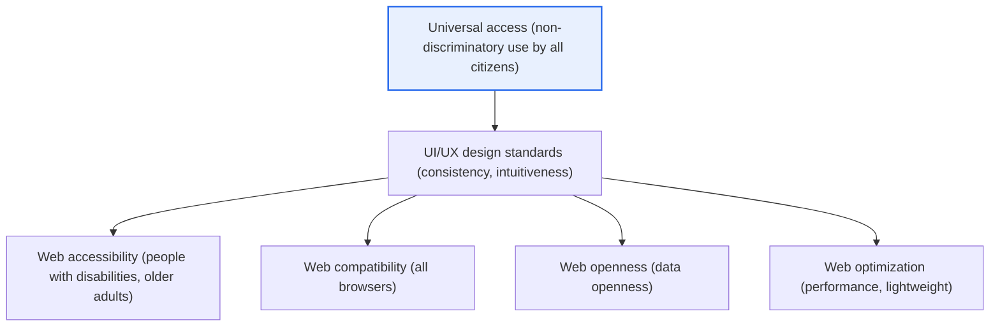
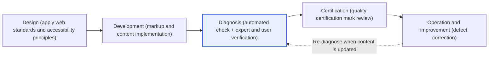

# E-Government Website Quality — Web Accessibility, Compatibility, Openness, and Optimization

## 1. Overview

### A. Concept
> E-government website quality means meeting four quality requirements — **web accessibility, web compatibility, web openness, and web optimization** — together with **UI/UX design standards**, to guarantee that all citizens can use e-government services without discrimination in any environment.

The fundamental reason public websites are required to meet these quality standards lies in publicness: "**e-government services must be usable by all citizens without exception**." Private services are free to optimize for specific user segments or specific browser/device environments in pursuit of profitability. E-government, however, is different in nature. Services such as tax filing, civil document issuance, and welfare applications are directly tied to citizens' exercise of their rights, so all citizens, including people with disabilities and older adults, must be able to **access them at an equal level** regardless of the browser, operating system, or device they use. A public service that works only in a specific environment effectively excludes the rights of citizens who lack that environment.

The government therefore defines the quality a website must have along four axes: people with disabilities and older adults must be able to perceive and operate it (**accessibility**); it must look and behave the same in any browser (**compatibility**); it must be open so that machines can read and reuse its data (**openness**); and it must load quickly on anyone's connection (**optimization**). On top of this, UI/UX standards that design screens, navigation, and terminology consistently enhance ease of use. Importantly, these quality standards are not mere recommendations but **obligations grounded in law, such as the Framework Act on Intelligent Informatization and the Anti-Discrimination Against Persons with Disabilities Act**. E-government web quality should thus be understood as a mechanism that institutionally guarantees **universal access** to public services, beyond technical guidelines.

### B. Background and Necessity
Three trends lie behind the institutionalization of quality standards. First, **the migration of services due to digital transformation**. As administrative tasks once handled at offline counters moved online en masse, a situation arose where not being able to access the web meant not receiving the service at all. Web quality became citizens' right of access to services. Second, **reflection on dependency on specific technologies**. In the past, Korean public websites were tied to specific browsers and plug-ins (such as ActiveX), repeatedly excluding users of other browsers or new devices. This became the direct background for enforcing web standards and web compatibility. Third, **the demand to close the digital divide**. The aim is to narrow the gap institutionally by mandating accessibility and optimization so that people with disabilities, older adults, and users of low-spec devices are not marginalized. In the end, e-government web quality is the minimum requirement for building not "a good-looking site" but "a site that excludes no one."

### C. UI/UX Design Standards
E-government websites are advised to compose screens, navigation, and content consistently according to design principles such as user-centeredness, consistency, intuitiveness, clarity, efficiency, accessibility, and flexibility. [[gov-ui-ux-guideline]]

These design standards form the foundation of the four quality requirements because, even if accessibility and compatibility are observed individually, if screen layouts, terminology, and navigation differ from site to site, the learning cost for citizens to master services grows. In particular, given that many ministries and agencies operate different websites in e-government, **consistency** is a core value that lets users apply what they learned on one site directly to others. Intuitiveness and clarity keep ordinary citizens unfamiliar with administrative terminology from getting lost, and flexibility leads to responsive design that accommodates diverse devices and screen sizes. In other words, UI/UX design standards are not a matter of aesthetics but the skeleton that binds the four quality requirements into actual ease of use.

## 2. The Four Quality Requirements — Overall Structure

E-government web quality is a structure in which four quality requirements are balanced on the foundation of UI/UX design standards. The structural diagram below shows the relationships among the quality requirements. The four requirements do not exist independently; each supports the common goal of "non-discriminatory use by all citizens" from a different angle.

| Quality | Description | Representative criteria/means |
|---|---|---|
| **Web accessibility** | Anyone, including people with disabilities and older adults, can perceive, operate, and understand | KWCAG (alt text, keyboard access, contrast) |
| **Web compatibility** | Identical behavior without dependency on specific browsers/plug-ins | W3C web standards (HTML/CSS syntax compliance) |
| **Web openness** | Search engines and machines can access and collect data | Allowing robots, open formats, metadata |
| **Web optimization** | Fast loading and performance through page lightening and caching | Resource compression, caching, rendering optimization |

These four requirements are often complementary but sometimes in tension. For instance, adding flashy visual effects may raise aesthetics but can worsen accessibility and optimization. Quality management is therefore not about maximizing one of the four requirements but **designing and verifying so that all four are balanced above the minimum standard**. This sense of balance is the essence of e-government web quality practice.

## 3. Details of Each Quality Requirement

### A. Web Accessibility — The Core of the Four Requirements
Among the four requirements, **web accessibility** has the greatest legal enforceability and impact. It enables people with visual, hearing, physical, or other disabilities and older adults to **perceive, operate, and understand** web content and use it robustly, and in Korea it follows the national standard **KWCAG (Korean Web Content Accessibility Guidelines)**. KWCAG adapts the international W3C WCAG standard to the domestic context, and the latest revision, KWCAG 2.2 (revised 2022), consists of **4 principles · 14 guidelines · numerous check items**.

Specifically, it includes providing **alternative text (alt)** that explains the meaning of images, enabling **all functions to be operated by keyboard alone** without a mouse, not conveying information by color alone (consideration for color blindness), ensuring **sufficient contrast** between text and background, and providing captions and sign language for videos. These items are needed because the pathways by which information is received differ by type of disability. Blind users hear alt text as speech through a screen reader, users with physical impairments operate with keyboards and assistive devices, and low-vision and color-deficient users rely on contrast. Accessibility is also an obligation under the Anti-Discrimination Act, and non-compliance can be deemed discrimination, so the pressure to comply is stronger than for the other requirements.

Like the international WCAG, the backbone of KWCAG is the four principles (POUR): **Perceivable, Operable, Understandable, and Robust**. "Perceivable" means content must be perceivable by the senses (alt text, captions, contrast); "Operable" means there must be diverse means of operation (keyboard access, enough time, no seizure-inducing content); "Understandable" means content and operation must be predictable (readability, consistency, error correction); and "Robust" means assistive technologies must be able to interpret it reliably (syntax compliance, providing name and role). Since these four principles underpin individual check items, in practice it is more useful for application to understand "which of the four principles this element serves" than to memorize the items.

### B. Web Compatibility — Escaping Dependency Through Standards Compliance
**Web compatibility** is the requirement that content look and behave the same in any browser without dependency on specific browsers or plug-ins. The means of realizing it is **compliance with W3C web standards (HTML, CSS, ECMAScript)**. Following standards reduces room for browsers to interpret things differently, producing consistent results across Chrome, Edge, Safari, and elsewhere. The purpose of this requirement is to fundamentally resolve the past problem of Korean public websites depending on browser-specific technologies (such as ActiveX) and excluding users of other browsers. Compatibility also dovetails with accessibility, since only standards-compliant markup allows screen readers and assistive technologies to interpret content accurately.

### C. Web Openness — Machine-Readable Public Data
**Web openness** is the requirement to keep a website's information open so that search engine crawlers and data-collection machines can access and collect it. The key points are not unjustly blocking legitimate crawlers via robots.txt, not locking data in closed formats (providing open formats and structured metadata), and enabling information to be searched and reused. This is directly tied to public data openness policy. Underlying it is the philosophy of openness: public information is a national asset, so it should not be trapped in a particular screen but be machine-readable and reusable in other services, research, and industries.

A frequent point where openness is undermined in practice is "locking information in images, PDFs, Flash, and the like." For example, if a statistical table is posted only as a single image, humans can see it but machines cannot read it, and screen readers cannot interpret it either, harming accessibility as well. Conversely, providing the same data as text, tables, and open APIs satisfies search, reuse, and accessibility simultaneously. Openness is thus fundamentally connected with accessibility, so considering both together is efficient.

### D. Web Optimization — Fast on Anyone's Connection
**Web optimization** is the requirement to secure loading speed and performance by lightening pages and applying caching and compression. It reduces image and script sizes, removes unnecessary resources, and raises perceived speed through browser caching and rendering optimization. Optimization is included among the quality requirements because performance is also a matter of accessibility. For citizens using low-spec devices or slow connections (rural, mountain, and fishing villages; low-income households), a heavy page is effectively unusable. Optimization is therefore positioned not as mere technical efficiency but as **a means of closing the digital divide**.

Specifically, techniques such as image format and resolution optimization and lazy loading, minification of scripts and styles and bundle reduction, caching and CDN use for static assets, and methods that bring forward initial rendering are employed. Since services must not slow down or stop even at moments of traffic surges — such as disaster notifications or peaks in civil service requests — optimization is best understood broadly as a concept encompassing not only everyday perceived speed but also **availability under load**.

## 4. Comparison — Differences from Private Web Quality, and Application Cases

E-government web quality and general private web quality differ fundamentally in orientation. The private sector optimizes **business outcomes** such as conversion rate and dwell time and is free to focus on target customers and environments. E-government, by contrast, prioritizes **universal access and equity** over performance indicators, and the decisive difference is that it sets quality based on "users in the most disadvantaged environment."

| Perspective | Private web quality | E-government web quality |
|---|---|---|
| **Top priority** | Business outcomes (conversion, revenue) | Universal access, equity |
| **Target basis** | Core target users | All citizens (based on the weakest environment) |
| **Accessibility** | Optional, recommended | Legal obligation (Anti-Discrimination Act) |
| **Enforceability** | Voluntary | Laws, quality diagnosis, certification |

This difference shows in concrete cases. For example, the government's main portal and civil service sites manage quality by adding alt text to all images for screen reader users, guaranteeing keyboard navigation, and eliminating dependency on specific browsers through web standards compliance. In addition, the Public Data Portal, following the principle of web openness, provides data in machine-readable open formats (e.g., OpenAPI, CSV, JSON), allowing the private sector to build apps and services using it. E-government web quality is thus not an abstract norm but a practical standard concretely reflected in actual service design and operation.

Past cases paradoxically show the need for this standard. At one time, Korean public and financial websites relied on plug-in-based (e.g., ActiveX) authentication and payment that worked only in specific browsers, repeatedly causing citizens using other browsers or new devices to be unable to receive services or to be forced to install numerous programs. This is a typical case where the absence of web compatibility led directly to user exclusion, and it became the direct motivation for later policies of transitioning to web standards and removing plug-ins. Likewise, image-heavy pages that did not consider accessibility were entirely unusable by blind people with screen readers, often incurring enormous rework costs after the fact. Such failures underpin the principle that "quality must be built in at the early stage of design."

## 5. Advanced — Quality Certification and Diagnosis Systems and Recent Trends

E-government web quality is not merely declared but managed through **certification and diagnosis systems**. Representative is the **Web Accessibility Quality Certification (certification mark)** system granted to websites and mobile apps with excellent accessibility, in which designated certification bodies review KWCAG compliance and grant the mark. In addition, **regular government-level website quality diagnoses** periodically measure the accessibility and compatibility levels of public websites and derive improvement tasks. The significance of such systems is that they turn quality into an object of continuous inspection and improvement rather than "build once and done."

The process detail diagram below shows the flow (PDCA) in which quality is managed in a cycle of design–development–diagnosis–certification–improvement. The key is the cyclical structure that returns to re-diagnosis whenever content is updated; if this loop is broken, the quality secured initially erodes over time.

A particularly important step in this cycle is **diagnosis**. A dual structure is desirable: screening broadly for violations with automated checking tools, then having experts and people with disabilities verify through actual use the parts automation has difficulty judging, such as the semantic appropriateness of alt text. Certification is a mechanism that officially confirms these diagnosis results meet a certain level, and the operation and improvement stage plays a feedback role by correcting discovered defects and returning to the next diagnosis.

Recent trends can be summarized in three directions. First, **expansion to mobile accessibility**. As service use shifts to mobile, web accessibility guidelines are being extended and refined into mobile app accessibility guidelines. Second, **broadening of perspective to digital inclusion**. Beyond simply access for people with disabilities, "easy read" language, multilingual support, and cognitive accessibility are emphasized to embrace older adults, people with less education, and multicultural users. Third, **AI- and automation-based quality inspection**. As tools that automatically detect accessibility violations and AI assistive technologies such as automatic alt-text generation advance, attempts to make quality verification continuous and automated are increasing. This complements the limitations of the practice of relying on manual post-development inspection.

## 6. Considerations and Implications

1. **Quality must be built in from the early stage of design.** Adding accessibility and compatibility after development is finished makes rework costs very large. An "accessibility-first" approach that reflects web standards compliance and accessibility from the planning and design stage is advantageous in both cost and quality, consistent with the software engineering principle that the earlier defects are caught, the lower the cost.

2. **A continuous quality management system through certification and regular diagnosis must be established.** Quality levels should be measured quantitatively through web accessibility quality certification and regular diagnosis, and the PDCA cycle of improving discovered defects institutionalized. It must be assumed that quality is not a one-time deliverable but an operational object requiring re-verification whenever content is updated.

3. **Balance and trade-offs among the four requirements must be managed.** Attempts to enhance aesthetics and functionality frequently harm accessibility and optimization. Conflict points between requirements (e.g., visual effects vs. contrast, feature additions vs. performance) should be reconciled in advance with design principles and verification checklists, aiming for overall balance rather than maximizing a particular requirement.

4. **Scope must expand to embrace mobile and digitally vulnerable groups.** Extending beyond the web to mobile app accessibility, easy language, multilingual support, and cognitive accessibility under a digital inclusion perspective, e-government should aim to leave "no one left behind." This also aligns with the inclusiveness values of the UN Sustainable Development Goals (SDGs).

5. **Use automation and AI, but combine them with human verification.** Making verification continuous with automated accessibility checking tools and AI assistive technologies greatly increases efficiency, but the appropriateness of context and meaning (e.g., whether alt text actually conveys meaning) still requires human judgment. A dual verification strategy deploying automation for broad screening and expert/user verification for confirming effectiveness is desirable.

6. **Continuous alignment with international standards and legal changes is necessary.** KWCAG evolves by reflecting revisions of the international WCAG standard, and related laws are also amended in line with changes in the digital environment. Therefore, rather than resting on certification at one point in time, sites should be updated by constantly tracking standards and legal revisions, and it is effective to enforce quality from the ordering stage by reflecting the latest quality standards in requirements at the procurement and contracting stage (RFPs, audit criteria).

## References
- National Radio Research Agency, National standard for the Korean Web Content Accessibility Guidelines (KWCAG) — https://www.rra.go.kr/ko/reference/kcsList_view.do?nb_seq=5247&nb_type=6
- Korean Web Content Accessibility Guidelines (KWCAG) 2.2 — https://a11ykr.github.io/kwcag22/

---

> **In one line**: E-government website quality consists of *UI/UX design standards plus web accessibility, compatibility, openness, and optimization*, and is a universal-access mechanism that guarantees all citizens can use services without discrimination in any environment; in particular, KWCAG-based web accessibility is a legal obligation that must be built in from the early design stage and continuously managed through certification and regular diagnosis.
