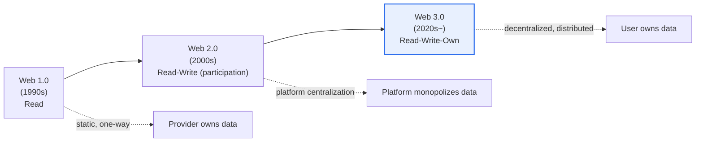
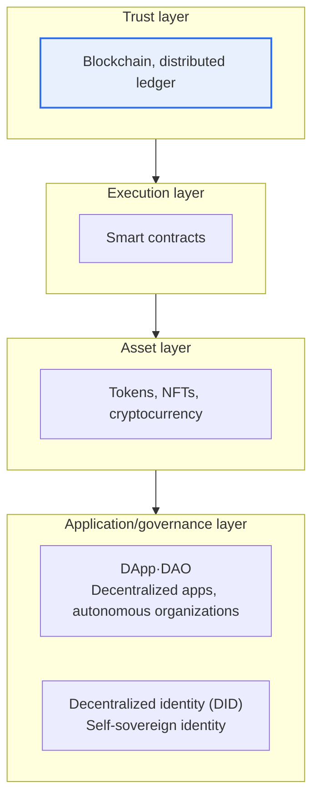

# Web 3.0

## 1. Overview

### A. Background and Concept
> A next-generation web that, to overcome the limitations of Web 2.0 in which central platforms monopolize data and revenue, **returns ownership of data and digital assets to users through blockchain-based decentralization**. It is defined as the "Read-Write-Own" web.

The core idea of Web 3.0 is to return "**the ownership of data and digital assets from platforms to users**." In Web 2.0, users produced content and data, but most of the value was captured by giant platforms (search, social media, e-commerce). Users had neither control over their own data nor the revenue generated from it, and they were in a state of **lock-in** in which, if a platform suspended their account, they could lose in an instant the assets and relationships they had built. Web 3.0 is an attempt to enable users to directly own, trade, and transfer their own data and digital assets through blockchain and tokens. Because trust is guaranteed by cryptography and consensus algorithms even without a central intermediary, a distributed network rather than a particular company's servers underpins the service's basis of trust.

However, it should be noted that the term Web 3.0 does not converge on a single definition; **two perspectives coexist**. One is the **blockchain-based "decentralized ownership"** perspective described above, which is the meaning most widely used in industry and the media today. The other is the **"Semantic Web"** perspective proposed early on by Tim Berners-Lee, referring to an "intelligent web" in which data is given meaning (ontologies, metadata) so that machines can understand and reason about it. Recently, in conjunction with advances in AI, a third axis of "intelligence" has sometimes been added to the discussion. In an answer, it is safe to acknowledge this ambiguity while centering the description on the blockchain-based decentralization perspective.

### B. Necessity
As the deepening of platform monopolies magnified issues of data sovereignty, privacy, and fair distribution, demand grew for a new web paradigm in which users can control their own data and reclaim its value. Specifically, the background includes (1) **centralization risk**, where data and power concentrate in a few platforms (single point of failure, censorship, arbitrary policy changes), (2) **unfair distribution**, where the value of creation and contribution does not return to creators, and (3) **a lack of portability and interoperability** caused by platform lock-in. Web 3.0 has been proposed as a technical alternative to these structural problems.

### C. Coexistence of Two Perspectives
As mentioned above, Web 3.0 does not converge on one definition, so clearly distinguishing the two perspectives makes an answer's structure more stable. The "decentralized ownership" perspective emphasizes moving the subject of trust from people and institutions to code and consensus, while the "Semantic Web" perspective emphasizes structuring data so that machines, rather than people, can understand it. The two perspectives are complementary rather than opposed, and recently a trend of convergence via AI has emerged.

| Category | Decentralized ownership (blockchain) perspective | Semantic/intelligent web perspective |
|---|---|---|
| **Core value** | Ownership and transfer of data/assets | Assigning meaning to data, machine understanding |
| **Basis of trust** | Distributed ledger, consensus algorithms | Ontologies, metadata, standards |
| **Representative technologies** | Blockchain, smart contracts, tokens | RDF, OWL, semantic tagging, AI |
| **Main period of discussion** | Industry discourse since the 2020s | W3C standards discourse of the 2000s |

## 2. Evolution of the Web and the Position of Web 3.0

The web has evolved from a stage of one-way information consumption, through a stage in which users participate and produce, to a stage in which they now own the value they create. Summarizing the direction of this evolution as "connection → participation → ownership" makes the position of Web 3.0 clear.

If Web 1.0 was a static, one-way web where many only read information created by a few, Web 2.0 was a participatory web in which anyone could participate and produce through blogs, social media, and open APIs, but the data and revenue were controlled by platforms. Web 2.0 explosively grew user experience and network effects, but carries the paradox that those very network effects culminated in winner-take-all dynamics and platform monopolies. Web 3.0 aims to reverse this monopoly structure with blockchain, pursuing a web in which users **own** the value they create.

| Category | Web 1.0 | Web 2.0 | Web 3.0 |
|---|---|---|---|
| **Core action** | Read | Read-Write (participation) | Read-Write-Own |
| **Structure** | Static, one-way | Platform-centralized | Decentralized (distributed) |
| **Data subject** | Owned by provider | Monopolized by platform | Owned by user |
| **Basis of trust** | Site operator | Platform operator | Code, consensus algorithm |
| **Value distribution** | Limited | Skewed toward platforms | Centered on contributors and owners |

A point to note here is that the web's evolution is not a "disruptive replacement" that completely supplants the previous stage but a **cumulative expansion**. Even today, Web 1.0-style static pages and Web 2.0-style platforms remain dominant, and it is more realistic to view Web 3.0 as an attempt to add a new layer of "ownership" on top of them.

## 3. Key Characteristics and Technology Elements

The technologies supporting Web 3.0 are layered around the blockchain. At the bottom, a distributed ledger provides the foundation of trust; on top of it sit self-executing contracts and asset representation, and then the application, organization, and identity layers that users use directly.

**Blockchain and distributed ledger (trust layer)** replicate and chain data across many nodes, making tampering practically impossible and guaranteeing "the truthfulness of records" without a central administrator. This immutability and transparency are the root of trust for all of Web 3.0. The practical properties derived from this are **censorship resistance** (no particular entity can arbitrarily erase or block records) and **availability** (no single point of failure).

**Smart contracts (execution layer)** are contracts whose code executes itself when conditions are met, fulfilling promises automatically without intermediaries, as in the slogan "Code is Law." For example, if code specifies that ownership transfers automatically once payment is confirmed, intermediary institutions such as escrow become unnecessary. However, if the code has a defect, it is executed as-is and can lead to large-scale damage (e.g., reentrancy attacks), so audits and verification are essential.

**Tokens and NFTs (asset layer)** prove the ownership and trading of digital assets. Fungible tokens (FT) have identical value like currency or points, while non-fungible tokens (NFT) represent uniqueness like artworks, collectibles, or memberships. Beyond being mere assets, tokens are a means of the **Token Economy**, which distributes incentives to network participants, becoming a mechanism that turns users from "users" of a service into "stakeholders and owners."

**DApp, DAO, and DID (application/governance layer)** are the layer users interact with directly. A DApp is a decentralized application running on a blockchain instead of a central server, and a DAO is a decentralized autonomous organization that automates decision-making and fund execution with smart contracts. DID (decentralized identity) is a self-sovereign identity (SSI) technology in which users directly store and present their own identity information without depending on a platform, in the same vein as MyData.

| Technology element | Layer | Role |
|---|---|---|
| **Blockchain** | Trust | Decentralized, immutable, transparent data foundation |
| **Smart contracts** | Execution | Conditional self-executing contract code |
| **Tokens/NFTs** | Asset | Proof of digital asset ownership and trading, token economy |
| **DApp/DAO** | Application/governance | Operating decentralized apps and autonomous organizations |
| **Decentralized identity (DID)** | Identity | Self-sovereign identity (SSI) |

## 4. Service Applications and Cases

Web 3.0 is not confined to a specific field but extends to finance, content, identity, gaming, and more. Applications in each field are commonly explained by two principles: "eliminating intermediaries" and "user ownership."

**Finance (DeFi, decentralized finance)** performs deposits, lending, and exchange through smart contracts without intermediaries such as banks or brokerages. For example, in an Ethereum-based lending protocol, when a user deposits crypto assets worth 10 million KRW at market value as collateral, the code automatically lends about 7 million KRW according to the loan-to-value ratio (e.g., 70%) and settles interest, and if the collateral value falls below the liquidation threshold, it immediately executes liquidation without human intervention. Automating underwriting, execution, and liquidation in code in this way greatly reduces intermediary costs and time, but conversely increases the risk that code defects or sharp price fluctuations translate directly into losses. In **content and creation**, NFTs prove the originality and ownership of digital works, and royalty conditions can be embedded in smart contracts so that revenue is automatically distributed to creators with every secondary sale. In **identity and authentication**, DIDs implement self-sovereign identity not dependent on platforms, and in **gaming and the metaverse**, items can be truly owned as NFTs (P2E, Play to Earn) and transferred as assets outside the game.

Compared with traditional finance, the differences of DeFi stand out clearly. The key is that "who or what guarantees trust" changes, and this shift simultaneously yields the benefits of accessibility and transparency and the burdens of regulatory gaps and technical risk.

| Category | Traditional finance | DeFi |
|---|---|---|
| **Trust guarantor** | Banks, supervisory authorities | Smart contracts, consensus |
| **Accessibility** | Requires account and screening | Anyone with a wallet |
| **Transparency** | Internal ledgers (private) | Public on-chain, verifiable |
| **Risk** | Institutional credit, systemic risk | Code vulnerabilities, liquidation, regulatory gaps |

| Field | Application | Core principle |
|---|---|---|
| **Finance (DeFi)** | Decentralized deposits, lending, exchange | Automatic settlement without intermediaries |
| **Content/creation** | NFT-based originality, automatic royalty distribution | Creator ownership and monetization |
| **Identity/authentication** | DID self-sovereign identity | Platform independence |
| **Gaming/metaverse** | NFT item ownership and economy (P2E) | Transfer of assets outside the game |
| **Data sovereignty** | Personal data ownership and rewards | Linkage with MyData |

## 5. Advanced: Limitations and Recent Debates

The ideal of Web 3.0 is powerful, but it is necessary to take a balanced view that practical adoption is accompanied by structural limitations. The first is **limits of scalability and performance**. Because every node verifies and replicates transactions, throughput (TPS) is lower and fees (gas) are higher than in centralized systems, which is a burden for mass-market services. To mitigate this, Layer 2 (rollups), sharding, and the transition to Proof of Stake (PoS) are being pursued; in particular, it is known that energy consumption dropped substantially when a leading platform switched from Proof of Work to Proof of Stake (specific figures vary by source, so definitive claims are avoided).

The second is "**the paradox of decentralization**." Although decentralization is professed on the surface, criticism is raised that in reality touchpoints concentrate in a few exchanges, wallets, and infrastructure providers, or that early participants hold most of the tokens, making it effectively no different from centralization. Some call this "Web 2.5." The third is **gaps in regulation and consumer protection**. As side effects such as rug pulls (disappearing after collecting investment), market manipulation, and money laundering recur, countries are building regulatory frameworks for protecting virtual asset users and ensuring market integrity. The fourth is the **usability (UX)** problem: private key management, wallet integration, and the concept of fees remain high barriers to entry for ordinary users.

Because of these limitations, rather than viewing Web 3.0 as "the settled future of the next-generation web," it is more accurate to understand it as a process in which individual elements such as **data sovereignty, self-sovereign identity (SSI), MyData, and the token economy** selectively take root as they broaden their touchpoints with the institutional establishment. From a Professional Engineer's perspective, rather than a "decentralized vs. centralized" dichotomy, a selective-application view is required that identifies in which areas decentralization delivers substantive value (areas where censorship resistance, transparency, and asset portability matter).

## 6. Considerations and Implications

1. **Face the gap between ideal and reality.** The ideals of data ownership and decentralization are attractive, but scalability and performance limits, the paradox of decentralization, regulatory uncertainty, and usability problems are obstacles to practical adoption. Rather than embracing the ideal wholesale, a sober application strategy that weighs the actual benefits area by area is needed.
2. **Manage side effects proactively.** If negative aspects such as token speculation, fraud like rug pulls and market manipulation, smart contract vulnerabilities, and money laundering are not controlled through audits, regulation, and security (code audits, KYC/AML), the technology itself will lose trust.
3. **Link with data sovereignty and MyData trends.** Web 3.0 connects with policy and technology trends in which individuals control their own data, such as DID and SSI, and is evolving in a direction in which decentralized ideals broaden touchpoints with the institutional establishment. Ensuring consistency with MyData, electronic signatures, and decentralized identity standards (W3C DID/VC) is key.
4. **Interoperability and standardization are conditions for diffusion.** The security of cross-chain bridges through which assets and data move between chains, and the standardization of wallets and identity, must be secured for the fragmented ecosystem to integrate into a substantive network. Bridges have been targets of major hacks, so security verification is especially important.
5. **Watch for convergence with AI and semantic perspectives.** Recently, discussions combining the blockchain-based ownership perspective with the semantic/AI-based intelligence perspective have been increasing, so it is valid to take a broad view of Web 3.0 not as a single definition but as a compound evolution of "ownership + intelligence."

## References
- W3C, "Decentralized Identifiers (DIDs) v1.0", https://www.w3.org/TR/did-core/
- Ethereum Foundation, "Web3 / Ethereum overview", https://ethereum.org/en/web3/

---

> **In one line**: Web 3.0 is a next-generation web that *returns ownership of data and assets to users through blockchain-based decentralization*, using smart contracts, tokens, DApps, and DIDs as technology elements for DeFi, NFTs, and self-sovereign identity; but given limitations in scalability, the paradox of decentralization, regulation, and usability, it is more accurate to see it as a process in which individual elements such as data sovereignty selectively take root as they broaden their touchpoints with the institutional establishment.
