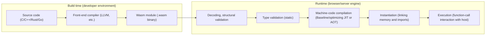
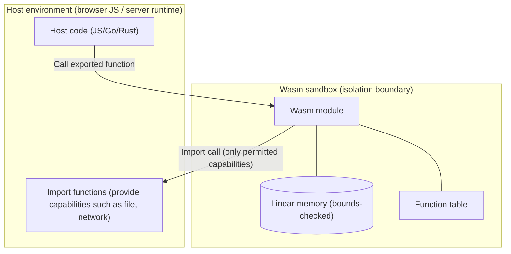

# WebAssembly (Wasm)

## 1. Overview

### A. Definition
> **WebAssembly (Wasm)** is a **portable binary instruction format** for a stack-based virtual machine, a W3C standard technology for compiling diverse languages such as C/C++, Rust, and Go and **executing them safely at near-native speed in multiple execution environments, including the browser**.

Wasm started from the idea of "running code on the web as fast as assembly," but its essence is that it is a **compilation target** not tied to any specific language or browser. In other words, Wasm itself is not so much a language that people write directly as a **low-level intermediate representation and distribution format** that higher-level languages are compiled into. The text format (WAT) and binary format (.wasm) correspond 1:1, and the binary format, which is fast to parse and validate, is used for actual distribution and transfer.

### B. Background and Necessity
Performing compute-intensive tasks on the web (image/video processing, games, CAD, cryptographic operations) with JavaScript alone lacked performance and predictability. Because JavaScript relies on dynamic typing and JIT optimization, execution performance fluctuates depending on runtime conditions, and parsing and optimization costs are also high. Building on the experience of asm.js (an optimizable subset of JavaScript) that tried to address this, the four browser vendors (Google, Mozilla, Microsoft, Apple) jointly designed a **standard binary format** — WebAssembly.

The need for Wasm can be summarized in three points. First, **performance predictability**. Because it is binary code whose types are already fixed, parsing is fast, and after validation it is compiled directly into machine code, delivering consistent near-native performance. Second, **language diversity**. Existing C/C++ and Rust assets can be ported to the web, removing the constraint that "web = JavaScript." Third, **strong isolation (sandbox)**. Linear memory and capability-based interfaces prevent access to arbitrary system resources, providing a foundation for safely executing untrusted code. Thanks to this third characteristic, Wasm is today expanding beyond the browser into serverless, edge, and plug-in runtimes.

## 2. Execution Structure and Processing Flow

Wasm execution is broadly divided into a **compile (build) phase** and a **runtime (load, validate, execute) phase**. The diagram below shows the entire pipeline from a higher-level language to the creation and execution of a Wasm module.

At build time, a higher-level language passes through a compiler such as LLVM and is converted into a Wasm binary module. This module declares definitions of functions, globals, memory, tables, and so on, along with **imports** it must receive from the host and **exports** it exposes to the host. At runtime, the binary is first **decoded** and checked for structural correctness, and then **static type validation** is performed. This validation step is the core of Wasm security, ruling out stack underflow/overflow, type mismatches, out-of-range branches, and the like before execution. Only modules that pass validation are compiled into machine code, and depending on the engine, **baseline compilation** for fast startup and **optimizing compilation** for peak performance are used together (tiering), or code is compiled ahead of time (AOT).

### A. Stack-Based Virtual Machine and Linear Memory
Wasm uses a **stack machine** model. Each instruction pops values from the operand stack, operates on them, and pushes the result back onto the stack. Value types are simple — roughly i32, i64, f32, f64, and reference types — making validation and compilation easy. Heap data used by a program is stored in a contiguous byte array called **linear memory**, which is owned by the host and subject to enforced bounds checking, so a module cannot read or write outside the region allowed to it. The figure below shows the isolation structure through which a Wasm module and the host interact.

The key to this structure is that **a module can use only the capabilities explicitly handed to it by the host**. File access, networking, and system calls are all injected as imports; if not injected, the functionality simply does not exist. This "deny-by-default" model is the basis for treating Wasm as a trust boundary.

### B. Host Interaction and WASI
In the browser, modules are loaded through the JavaScript API (`WebAssembly.instantiate`), and the DOM, fetch, and so on are called via JS. Outside the browser (server, edge), a standard system interface is needed, and this is defined by **WASI (WebAssembly System Interface)**. WASI exposes OS functions such as files, clocks, and standard I/O on a **capability-based** basis; for example, if only a specific directory handle is passed, the module can access only paths beneath it. This makes it possible to create isolated execution units that are lighter and faster to start than containers.

## 3. Application Types and Cases

Wasm's areas of application are rapidly broadening. Representative types, together with their principles, are summarized below.

| Application area | Description | Representative cases/effects |
|---|---|---|
| High-performance browser apps | Port compute-intensive logic to Wasm | Figma (design tool), AutoCAD Web, game engines (Unity/Unreal) |
| Serverless/edge | Execute functions with millisecond-level cold start | Fastly Compute, Cloudflare edge runtime |
| Plug-ins/extensions | Safely isolate untrusted third-party code | Envoy proxy filters, DB/SaaS extensions |
| Portable deployment | Build once, run on multiple architectures | Common edge-cloud artifacts |

As a concrete example, **Figma** is known to have compiled its C++ rendering engine to Wasm, achieving editing performance in the browser close to that of a desktop app and substantially shortening initial load time. On the server side, Wasm runtimes can reduce cold starts — which typically take several hundred milliseconds or more for containers — to **around 1 millisecond**, which benefits edge computing that spins up a new instance per request. However, specific figures can vary with workload and engine, so it is safer to understand them in general terms.

### A. Comparison with Containers and JavaScript

Wasm is often misunderstood as a replacement for containers or JavaScript, but in reality the nature of its **isolation unit** and **execution target** differs. The reason for the difference lies in the trade-off between isolation level and startup cost.

| Category | WebAssembly | Containers (Docker) | JavaScript |
|---|---|---|---|
| Isolation method | VM-level language sandbox | OS namespaces, cgroups | Language runtime isolation |
| Cold start | Very fast (μs–ms) | Relatively slow (hundreds of ms) | Fast |
| Image size | Hundreds of KB to a few MB | Tens to hundreds of MB | - |
| Language diversity | Compiled from many languages | Arbitrary binaries | Single |
| Maturity/ecosystem | Evolving (especially GC, DOM access) | Very mature | Very mature |

Containers can hold arbitrary Linux binaries and a complete file system, offering great versatility, but images are heavy and startup is slow. Wasm, by contrast, can hold less but is **light, fast, and architecture-independent**. The two therefore tend to be **combined hierarchically** rather than being substitutes — e.g., "finer-grained multi-tenant isolation (Wasm) inside heavy isolation (containers)." Compared with JavaScript, its strengths are performance consistency and language freedom, but one must consider that it has no direct DOM access and that support for garbage-collected languages is only now entering maturity.

## 4. Advanced — Standards Evolution and the Component Model

Since its initial release (MVP), Wasm has broadened its scope by standardizing multiple extensions. **Threads and SIMD** boosted parallel and vector computation performance, and **reference types and the GC proposal** opened the way to efficiently compile managed languages such as Java, Kotlin, and C#. Particularly noteworthy are the **Component Model** and **WIT (WebAssembly Interface Types)**. Existing Wasm modules exchange only low-level values such as i32 and f64, making it cumbersome to pass high-level types like strings and structs between modules written in different languages. The Component Model describes interfaces in a language-neutral way and lets components built in different languages be **assembled like LEGO**, concretizing the long-term vision of "portable components reusable regardless of language."

On top of this trend, **WASI Preview 2** shifted the axis of standardization by redefining capability-based interfaces on top of the Component Model, and it is becoming the foundation of the server-side Wasm ecosystem (e.g., serverless functions, extension plug-in runtimes). Since standard details are still being revised, when actually adopting it, it is important to check which proposal stages the intended engine and language toolchain support.

## 5. Considerations and Implications

From a Professional Engineer's perspective, adopting WebAssembly goes beyond simple performance optimization and is intertwined with architecture and security strategy.

- **Adoption criteria**: Wasm is advantageous for workloads that are compute-intensive and require language portability. Conversely, the benefit is limited for I/O-bound workloads or those heavily dependent on the existing container ecosystem, so it should be adopted selectively when requirements for "fast isolation, multi-tenancy, and portability" are clear.
- **Security trade-offs**: The language sandbox is strong, but the scope of capabilities passed via imports becomes the attack surface. Following the **principle of least privilege (deny-by-default)**, only the necessary capabilities should be injected, together with supply-chain verification (module provenance, signatures). One must also recognize that logic bugs within linear memory (e.g., memory errors in C code) can still exist.
- **Maturity and ecosystem outlook**: The lack of direct DOM access, the ongoing maturation of GC-language support, and relatively immature debugging and tooling are still transitional constraints. However, since adoption is accelerating in server, edge, and plug-in areas thanks to Component Model and WASI standardization, it is reasonable to **include it as an option** in mid- to long-term roadmaps.
- **Related-technology perspective**: Wasm combines naturally with serverless and edge computing, service meshes (Envoy filters), zero trust (isolation of untrusted code), and multi-cloud portability strategies. Therefore, rather than viewing it as an individual technology, it should be understood as an architectural axis — a **lightweight isolated execution layer** — and hierarchical combination with containers and orchestration should be considered as a design alternative.

## References
- WebAssembly official site: https://webassembly.org/
- W3C WebAssembly Core Specification: https://www.w3.org/TR/wasm-core-2/
- WASI: https://wasi.dev/
- Bytecode Alliance (Component Model): https://bytecodealliance.org/

---
> **In one line**: WebAssembly is a portable binary format that compiles diverse languages to run safely at near-native speed in browsers, servers, and at the edge, and through capability-based isolation and the Component Model it is expanding into a lightweight isolated execution layer.
