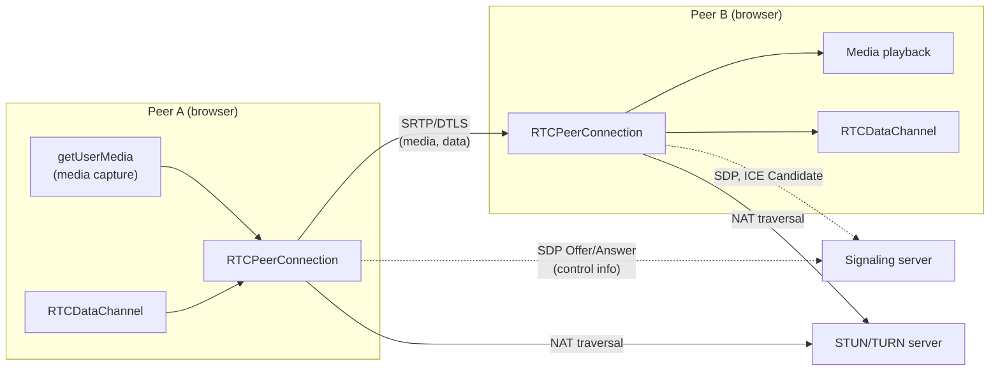
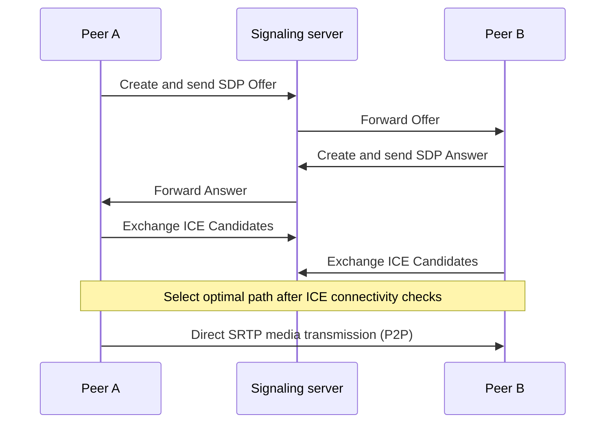

# WebRTC (Web Real-Time Communication)

## 1. Overview

> **WebRTC** is a set of open standard technologies that enables real-time **P2P (Peer-to-Peer)** transmission of audio, video, and arbitrary data between web browsers and mobile apps without separate plug-ins or native application installation. The W3C standardized the JavaScript APIs, and the IETF standardized the transport and media protocols.

Before WebRTC appeared, real-time video and voice communication on the web had to rely on Flash, separate plug-ins, or each vendor's proprietary SDK. This caused installation burdens, security vulnerabilities, and cross-platform compatibility problems. As Google open-sourced the relevant codec and engine technologies in 2011 and standardization proceeded, the goal of "implementing real-time communication using only standard APIs built into the browser" was realized. In particular, with the explosive growth of remote work, remote education, and telemedicine after COVID-19, WebRTC established itself as the core foundational technology for video conferencing (Google Meet and most web-based meeting solutions), real-time customer consultation, cloud game streaming, and IoT video monitoring.

The essential value of WebRTC lies in **minimizing latency**. Unlike typical HTTP-based streaming, which has several seconds of delay, WebRTC uses UDP-based P2P paths to aim for ultra-low-latency communication of a few hundred milliseconds or less. To this end, the browser automatically handles media capture, codec negotiation, NAT traversal, encryption, and congestion control all within the standard stack.

## 2. Overall Structure

WebRTC is broadly divided into a **Signaling layer** and a **media/data transport layer**. Interestingly, the standard does not specify the signaling method, delegating it to developers to implement freely over any channel such as WebSocket or HTTP. By contrast, the paths for actually exchanging media and their security are strictly standardized.

There are three core JavaScript APIs. First, **`getUserMedia()`** accesses the camera and microphone to acquire a media stream. Second, **`RTCPeerConnection`** is the core object of a P2P connection, overseeing codec negotiation, NAT traversal, encryption, and congestion control. Third, **`RTCDataChannel`** is a channel for exchanging arbitrary binary or text data other than audio/video with low latency, used for real-time chat, file transfer, and game state synchronization. `RTCDataChannel` internally uses SCTP over DTLS, and it is characterized by the ability to flexibly configure reliability (whether to retransmit) and ordering guarantees per channel.

## 3. Connection Establishment Procedure — Signaling and NAT Traversal

A WebRTC connection operates on the principle that "control information is exchanged via the signaling server, while actual data flows directly P2P." The two peers need to know each other's media formats, codecs, and network addresses, which they exchange as Offer/Answer in **SDP (Session Description Protocol)** format.

The hardest problem is **NAT/firewall traversal**. Most devices are behind private IPs, so the other party cannot know a public address to connect to directly. The framework that solves this is **ICE (Interactive Connectivity Establishment)**, which makes use of two kinds of auxiliary servers.

| Category | STUN | TURN |
|------|------|------|
| Role | Discover the device's public IP and port | Relay media |
| Traffic path | Direct P2P connection | Via server |
| Server load | Low (only reports the address) | High (forwards traffic) |
| When used | Most cases | Symmetric NAT and other cases where P2P is impossible |

A STUN server only tells a device "this is your public address," so its load is almost negligible, and the device attempts a direct P2P connection with this information. However, in **Symmetric NAT** or strict corporate firewall environments, direct connection is impossible, and in that case a TURN server relays media on behalf of both devices. Because TURN carries the traffic as-is, bandwidth costs are high; in practice about 10–20% of all sessions are known to fall back to TURN, making TURN server capacity sizing a key variable for service quality and cost.

## 4. Security and Media Transport

WebRTC has a structure in which **security is mandatory, not optional**. All media is encrypted with **SRTP (Secure RTP)**, and encryption key negotiation and data channel protection are performed with **DTLS (Datagram TLS)**. In other words, plaintext transmission is fundamentally impossible. In addition, the browser must obtain explicit user consent when accessing the camera or microphone, and the APIs operate only in HTTPS (secure contexts), reducing the risk of eavesdropping and unauthorized capture.

For media codecs, VP8, VP9, AV1, and H.264 are widely used for video, and Opus for audio. **Opus** in particular handles a wide band from speech to music with low latency, establishing itself as the de facto standard audio codec. When network conditions deteriorate, the browser's congestion control algorithm (e.g., GCC, Google Congestion Control) dynamically lowers bitrate, resolution, and frame rate to minimize interruptions.

However, as the number of participants grows, as in multiparty meetings, the pure P2P (Mesh) approach requires each device to send an individual stream to every other party, causing upload bandwidth and CPU usage to rise sharply. For this reason, in practice an **SFU (Selective Forwarding Unit)** or **MCU (Multipoint Control Unit)** server is placed in the center to selectively forward or composite streams. For example, in a five-person meeting, Mesh requires four upstreams per device, but with an SFU each device needs to send only one upstream to the server, greatly improving scalability.

## 5. Comparison with Similar Technologies

Comparing candidate real-time communication technologies clarifies WebRTC's position. HTTP-based streaming such as HLS/DASH is CDN-friendly and advantageous for large-scale viewing but has several seconds of latency, making it unsuitable for two-way conversation. WebSocket is bidirectional but TCP-based, limiting media real-time performance. WebRTC specializes in ultra-low-latency bidirectional communication via UDP-based P2P, with the trade-off of a heavy burden for NAT traversal and server infrastructure (STUN/TURN/SFU).

| Item | WebRTC | HLS/DASH | WebSocket |
|------|--------|----------|-----------|
| Latency | Ultra-low (<500ms) | Several seconds | Low |
| Directionality | Bidirectional P2P | Unidirectional | Bidirectional |
| Transport | UDP (SRTP) | TCP/HTTP | TCP |
| Large-scale viewing | Difficult (requires SFU) | Excellent | Moderate |

## 6. Considerations and Implications

**First, infrastructure design determines service quality.** WebRTC itself is a free standard, but for a stable connection rate, STUN, TURN, and SFU servers must be deployed in a geographically distributed manner. In particular, TURN relay traffic costs and SFU CPU and bandwidth capacity are key cost drivers, so sizing must be based on expected concurrent sessions and the TURN fallback ratio.

**Second, the trade-off between scalability and latency must be resolved through architecture.** When a small number of participants and ultra-low latency matter, Mesh/SFU is appropriate; for mainly large-scale viewing, a hybrid structure combining WebRTC-SFU with HLS is realistic. Recently, LL-HLS with reduced latency and standardization of WebRTC-based large-scale broadcasting (WHIP/WHEP) have been progressing, broadening the options.

**Third, security and privacy must be built in from the design stage.** Transport is protected by SRTP and DTLS, but end-to-end encryption (E2EE) can be broken the moment traffic passes through an SFU. For sensitive meetings, applying Insertable Streams-based E2EE should be considered, along with policy responses to IP exposure via STUN (a privacy issue).

**Fourth, standards and ecosystem trends must be continuously tracked.** Expanding adoption of the AV1 codec, the rise of adjacent low-latency APIs such as WebTransport and WebCodecs, and implementation differences across browsers directly affect service compatibility. From a Professional Engineer's perspective, beyond simple feature implementation, the capability to make architectural decisions that integrate connection success rate (SLA), cost, security, and scalability is required.

---

> **In one line**: WebRTC is an open technology that combines browser standard APIs (`getUserMedia`, `RTCPeerConnection`, `RTCDataChannel`) with ICE (STUN/TURN) and SRTP/DTLS to implement ultra-low-latency P2P real-time audio, video, and data communication without plug-ins, and trade-offs in infrastructure sizing, scalability, and security determine a service's success.
