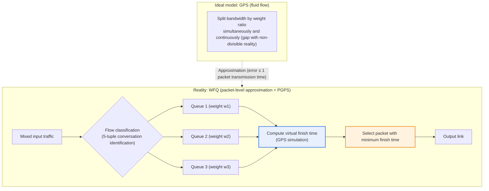
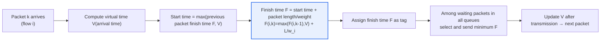

# WFQ (Weighted Fair Queuing)

## 1. Overview

### A. Definition
> **WFQ** is a network queuing technique — a scheduling method that **assigns weights to multiple traffic flows and allocates bandwidth fairly among them**. It gives more bandwidth to higher-importance traffic while guaranteeing a minimum share so that lower flows do not suffer starvation. Theoretically, it is defined as **a packet-level approximation (PGPS) of GPS (Generalized Processor Sharing)**, the ideal fluid model.

The fundamental reason WFQ is needed lies in the core QoS problem: "**how to divide limited bandwidth fairly and efficiently**." The simplest queuing, FIFO (first-in, first-out), processes packets in order of arrival, so if a single large file transfer (e.g., hundreds of MB of backup traffic) monopolizes the queue, delay-sensitive traffic such as video calls or VoIP is pushed back indefinitely. This is called queue hogging and is especially fatal on low-speed WAN links. Conversely, simple Fair Queuing, which divides equally among all flows, has the limitation of being unable to distinguish important traffic from less important traffic.

WFQ solves both problems at once. It classifies each traffic flow into a separate queue and assigns each flow a **weight**, allocating bandwidth in that ratio. As a result, high-priority (large-weight) traffic receives more bandwidth and is processed quickly, while lower flows are guaranteed a minimum share and avoid starvation. In other words, the essence of WFQ is implementing "**differentiated fairness**." This is effective for protecting the quality of each service in converged networks where voice, video, and data are mixed, and today it has established itself as the de facto standard scheduler for router and switch QoS.

### B. Background and Theoretical Roots
In the late 1980s, as real-time traffic such as voice and video began to coexist with bulk data on the Internet, simple FIFO could not guarantee QoS, and differentiated, fair queuing became necessary. WFQ was proposed by Demers, Keshav, and Shenker in 1989 in the SIGCOMM paper "Analysis and Simulation of a Fair Queueing Algorithm," and in 1993 Parekh and Gallager established the theory of the ideal fluid model **GPS** and its packet approximation **PGPS (Packet-by-Packet GPS)**, proving mathematical delay bounds. The key conclusion is that "**PGPS differs from GPS by at most one packet transmission time under any arrival pattern**," guaranteeing that WFQ can mimic ideal fair allocation very closely in practice. Thanks to this theoretical foundation, WFQ is recognized not as a mere heuristic but as a technique capable of **quantitative QoS guarantees**.

### C. Characteristics
WFQ has four properties: **automatic flow classification** (identifying conversations by 5-tuple and the like without separate configuration), **weight-proportional allocation**, **starvation prevention** (service rotates across all active flows), and **adaptive bandwidth redistribution** (active flows share the portion of idle flows). In particular, thanks to the last property (work-conserving), the link is never idle, so bandwidth utilization is high.

## 2. The Relationship Between the GPS Ideal Model and WFQ — Overall Structure

To understand WFQ, one must first know its ideal, GPS. GPS is a hypothetical model that serves multiple flows **simultaneously and infinitely finely divided (like a fluid)** in proportion to their weights. For example, if flows A, B, and C have weights of 3:2:1, GPS divides the bandwidth at every instant into exactly 3/6, 2/6, and 1/6. But real packets cannot be split, so only one can be sent at a time. WFQ approximates GPS by computing "**when would this packet have finished transmission under GPS**" (the virtual finish time) and actually sending packets in that order.

The key in the structural diagram above is the dotted line connecting GPS (ideal) and WFQ (reality). For every packet, WFQ internally simulates GPS, attaches a timestamp called the virtual finish time, and sends the packet with the smallest value first. In this way, the actual transmission order nearly matches the completion order of ideal fluid allocation, achieving fairness and delay guarantees simultaneously.

## 3. Operating Principle — Virtual Time and Virtual Finish Time

The heart of WFQ is **virtual time (V(t))** and **virtual finish time (F)**. Virtual time is an internal clock indicating how much work the GPS server has progressed, and its rate of advance depends on the number of active flows and the sum of their weights. When each packet arrives, WFQ computes when that packet would finish transmission under GPS as follows.

Let us unpack the meaning of each term in the formula `F(i,k) = max(F(i,k-1), V(a)) + L(i,k)/w_i`. **The `max(...)` term** means "if this flow's previous packet has not yet finished, continue after it; if it has already finished, start from the current point (virtual time)." This prevents a flow that has been idle for a long time from suddenly bursting and grabbing the bandwidth. **The `L/w_i` term** is the packet length L divided by the weight w; the larger the weight, the smaller this increment, bringing the finish time earlier so that the packet is sent first. In other words, the structure is such that **packets from flows with larger weights get smaller tags and are served first**.

The reason this approach excels is that it is **fair regardless of packet size**. Simple round robin (WRR) divides by the "number" of packets per round of the queues, creating unfairness in which a flow sending only large packets actually takes more bytes than a flow of small packets. WFQ, by contrast, reflects the **byte-level length L** in the finish time calculation, so it precisely maintains weight ratios on a byte basis even when packet sizes vary. This is the key point where WFQ is theoretically superior to WRR.

In practice, weights are determined by traffic marking values. For example, Cisco's flow-based WFQ assigns larger weights to higher **IP Precedence values (0–7)**, automatically adjusting so that voice with Precedence 5 receives several times more bandwidth than ordinary data with Precedence 0. It is implemented by assigning internal weights inversely proportional to (Precedence+1), so each step up in priority increases the relative bandwidth share (the specific constants differ by IOS version, so this is generalized).

### A. Finish Time Calculation — Step-by-Step Numerical Example
To make the concept concrete, consider a simple example. Suppose there are flow A (weight 2) and flow B (weight 1), and for convenience virtual time equals real time and packet lengths are expressed in units of service time. Finish-time tags are assigned in the following order.

- **t=0**: Packet A1 of A (length 4) arrives. Since there is no previous finish time, `F(A1)=max(0,0)+4/2=2`.
- **t=0**: Packet B1 of B (length 3) arrives. `F(B1)=max(0,0)+3/1=3`.
- **Selection**: The minimum of the two tags is A1 (2), so **A1 is sent first**. A, with the larger weight, wins the contention at the same moment.
- **After t advances**: A2 of A (length 4) arrives. `F(A2)=max(F(A1)=2, V)+4/2=2+2=4`.
- **Selection**: Waiting tags are B1 (3) and A2 (4). The minimum is **B1 (3), which is sent** → followed by A2 (4). The resulting transmission order is A1→B1→A2.

What to observe in this sequence is that A, with twice the weight, carries roughly twice as many bytes as B in the same time window (A1+A2=8 vs. B1=3 and continuing), while B is never pushed out entirely and is always served in between. This is how "differentiated fairness" is implemented through actual tag arithmetic; with a pure priority queue, B1 would not have been sent until A's traffic stopped.

## 4. Types and Extensions — Flow-based WFQ, CBWFQ, LLQ, DRR

WFQ is not a single fixed algorithm but has evolved into several derivatives and extensions. The original **flow-based WFQ (Flow-based / conversation-based)** automatically identifies conversations by 5-tuple — source/destination IP, protocol, ports, etc. — and dynamically creates queues. At Cisco it was traditionally the default scheduler for low-speed serial interfaces of 2.048 Mbps or less, protecting small amounts of real-time traffic from heavy bulk traffic without separate class definitions. However, since it maintains state per flow, it has **scalability limits** in large core routers through which tens of thousands of flows pass.

To solve this scalability problem, **CBWFQ (Class-Based WFQ)** emerged. CBWFQ creates queues not per individual flow but per **user-defined class (e.g., voice, video, business traffic, other)**, and guarantees each class bandwidth as an absolute value (kbps) or percentage. No matter how many flows there are, the number of queues is limited to the number of classes (e.g., up to 64), making it predictable and easy to manage even in core networks. Most practical QoS designs are based on CBWFQ.

However, CBWFQ alone struggles to fully protect **traffic extremely sensitive to delay and jitter**, such as VoIP, because with weight-based allocation alone, voice packets may in the worst case wait briefly behind other queues. Therefore **LLQ (Low Latency Queuing)** adds one **strict priority queue** on top of CBWFQ, sending voice traffic immediately ahead of any other queue, but cutting it off when it exceeds a set bandwidth limit (policer) to prevent starvation of other classes. Today LLQ is the de facto standard for enterprise voice network QoS.

Meanwhile, in terms of computational complexity, WFQ's finish-time sorting costs O(log N) for N flows. On ultra-high-speed hardware even this sorting cost becomes a burden, so **DRR (Deficit Round Robin)**, which simplifies this to O(1), is widely used. DRR gives each queue a "deficit" counter and a quantum to approximate byte-level fairness, a compromise between the low implementation cost of round robin and the byte fairness of WFQ. Many schedulers in actual high-performance switch ASICs adopt DRR or its variants.

## 5. Comparison with Other Queuing Techniques

The table below summarizes representative queuing techniques, but the table alone does not explain "why" the differences arise. The description after the table explains the causes of the differences and their practical implications.

| Technique | Core method | Strengths | Weaknesses |
|---|---|---|---|
| **FIFO** | Simple first-in, first-out | Simple implementation, minimal overhead | No QoS guarantee, risk of queue hogging |
| **PQ (Priority Queuing)** | Absolute precedence for high priority | Minimal delay for top-priority traffic | Starvation of low queues |
| **WRR** | Weighted round robin (packet count) | Easy to implement, differentiation possible | Packet-size unfairness |
| **WFQ** | Weight-proportional + byte fairness | Starvation prevention, byte fairness | Per-flow state, scalability |
| **CBWFQ** | Class-based WFQ | Bandwidth guarantee, scalability | Weak real-time delay guarantee |
| **LLQ** | CBWFQ + strict priority | Minimal voice delay and jitter | Drops when priority bandwidth exceeded |

FIFO cannot uphold QoS, and pure priority queuing (PQ) lets high priority monopolize bandwidth so low traffic may starve. WRR allows differentiation but, as explained earlier, divides by packet "count," unduly favoring flows of large packets. WFQ overcomes all three problems through byte-level weighted allocation, but because of per-flow state maintenance, the practical standard is to extend it to CBWFQ in large networks and reinforce it with LLQ when delay guarantees are needed, as for voice. In other words, these should be understood not as competing technologies but as **hierarchical tools layered according to the required level**.

As a concrete numerical example, on a 155 Mbps link, if three flows — voice (weight 5), video (3), and data (1) — all burst, WFQ divides the bandwidth into about 5/9 (≈86 Mbps), 3/9 (≈52 Mbps), and 1/9 (≈17 Mbps). If the data flow pauses briefly, its share is divided between voice and video in a 5:3 ratio, so the link never sits idle (work-conserving). Simultaneously achieving quantitative allocation and reuse of idle bandwidth in this way is the practical value of WFQ.

## 6. Advanced — Practical QoS Design and Recent Trends

In practice, the WFQ family is used in combination with the **DiffServ (Differentiated Services)** architecture. DiffServ marks classes in the packet's DSCP field at the network edge, and core routers apply a **PHB (Per-Hop Behavior)** according to that marking; the schedulers that actually implement these PHBs are CBWFQ and LLQ. For example, EF (Expedited Forwarding, voice) maps to the LLQ priority queue, and AF (Assured Forwarding, business) maps to the CBWFQ bandwidth-guaranteed queue. WFQ can therefore be seen as **the core engine responsible for the scheduling stage** in the QoS policy pipeline of "classification → marking → scheduling → congestion avoidance (WRED)."

As an industry application case, in an enterprise network connecting branches and headquarters over a low-speed WAN where video conferences frequently dropped, a typical approach is to configure LLQ on the headquarters router's output to prioritize voice and video (EF/AF41) and group file sharing and backups into lower classes with bandwidth limits, stabilizing meeting quality. Since allocating excessive bandwidth to the priority queue starves other business traffic, the common design practice is to limit priority bandwidth to within 33% of the link.

As for recent trends, as ultra-low-latency requirements grow in data centers and 5G transport networks, research is active on generalizing WFQ's ideas at hardware line rate, such as **PIFO (Push-In First-Out)-based programmable schedulers** and the Time-Aware Shaper of Time-Sensitive Networking (**TSN**). Nevertheless, these new technologies still stand on WFQ's fundamental principle of "dividing fairly in proportion to weights, without starvation," so WFQ remains valid as a reference point of queuing theory. From a Professional Engineer's perspective, a high-scoring strategy is to describe WFQ not as an individual technique but as **the central axis of the QoS scheduling lineage that starts from the GPS ideal, branches into CBWFQ, LLQ, and DRR, and extends into DiffServ and TSN**.

## 7. Considerations and Implications

1. **The balance between differentiation and fairness** is the core value of WFQ. WFQ simultaneously achieves preferential treatment of important traffic and minimum bandwidth guarantees, overcoming both the starvation problem of pure priority methods (PQ) and the indiscriminateness of pure fair methods. In design, since weight settings translate directly into service SLAs, weight calculation based on traffic characteristic analysis determines success or failure.
2. **Scalability trade-offs must be considered.** Flow-based WFQ is fine-grained but the cost of maintaining flow state is high, so it is reasonable to choose CBWFQ, which aggregates into classes, for core and large networks, and O(1)-complexity DRR for ultra-high-speed hardware. The balance point between scale and precision must be struck to suit the organizational environment.
3. **Reinforce real-time traffic with LLQ.** WFQ's weighted allocation alone makes it difficult to guarantee delay and jitter bounds for VoIP and video. A dual safeguard is needed: process real-time traffic immediately with LLQ, which adds a strict priority queue, while limiting its bandwidth with a policer to prevent starvation of other classes.
4. **Design it integrally as part of QoS policy.** WFQ operates as the scheduling stage of the overall DiffServ policy, combined with classification, marking, and congestion avoidance (WRED). Actual quality is guaranteed only when consistent end-to-end DSCP marking and PHB mapping are presupposed, not isolated tuning.
5. **Outlook: linkage with hardware line rate and programmable scheduling.** In ultra-low-latency domains such as data centers, 5G, and TSN, WFQ's fairness principle is evolving into programmable schedulers and time-aware shapers, so a perspective that understands and links WFQ not as static knowledge but as the theoretical foundation of next-generation QoS is required.

## References
- Demers, Keshav, Shenker, "Analysis and Simulation of a Fair Queueing Algorithm" (SIGCOMM 1989): https://www.cs.emory.edu/~cheung/Courses/558/Syllabus/11-Fairness/WFQ.html
- Weighted fair queueing overview: https://en.wikipedia.org/wiki/Weighted_fair_queueing
- Packet Scheduling (WFQ/Virtual Clock) lecture slides (UT Austin): https://www.cs.utexas.edu/~lam/396m/slides/Packet_scheduling.pdf
- Cisco, "Quality of Service — Congestion Management (WFQ/CBWFQ/LLQ)" configuration guide: https://www.cisco.com/c/en/us/support/docs/quality-of-service-qos/qos-congestion-management/index.html

---

> **In one line**: WFQ is a queuing technique that approximates the ideal fluid model GPS at the packet level (PGPS), *assigning weights to traffic flows and allocating bandwidth byte-fairly in order of virtual finish time*; it resolves FIFO's hogging, PQ's starvation, and WRR's size unfairness, extends into CBWFQ, LLQ, and DRR, and links with DiffServ and TSN to realize end-to-end QoS.
