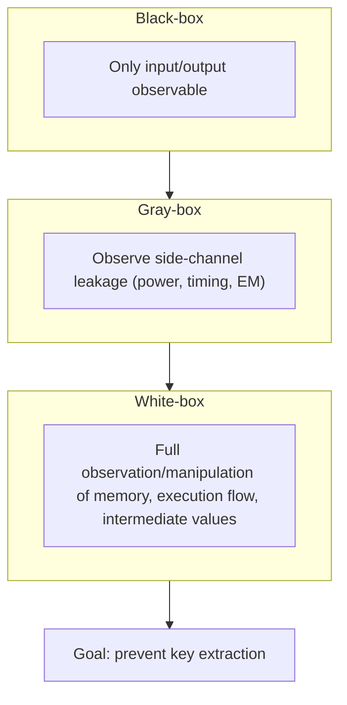
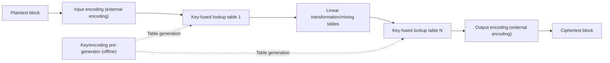

# White-box Cryptography

## 1. Overview

> **White-box Cryptography (WBC)** is a software-based key protection technology that mathematically fuses and conceals the secret key inside the algorithm implementation so that the key is not exposed, even under the assumption of an environment in which the attacker can fully observe and manipulate the device, memory, and execution flow where the cipher runs (the white-box attack model).

Traditional cryptanalysis developed on the premise of a **black-box model**, in which the attacker can see only the input (plaintext) and output (ciphertext) of the cryptographic algorithm. From this perspective, standard algorithms such as AES and RSA are proven secure as long as the key is unknown, and in practice the standard approach was to keep keys in a server's protected memory or in hardware secure areas such as HSMs and smart cards. The problem arises when cryptographic operations are performed on devices entirely controlled by the user, such as smartphones, set-top boxes, and PCs. On such devices, the attacker is the device owner or someone who has seized the device, and can dump memory with a debugger, halt execution, and trace instructions. However strong the algorithm, if the key loaded into memory during execution can be read as-is, it is defeated by a single dump.

White-box cryptography emerged precisely to close this gap. Its origin is the 2002 proposal by Chow et al. of white-box implementations of AES and DES targeting DRM environments, and the core idea is "don't keep the key in memory — dissolve it into the algorithm itself." That is, the cipher is implemented in the form of huge lookup tables precomputed for a specific key, so that the key value never appears in its original form anywhere during execution. The goal is to protect keys on hostile devices with pure software alone, without hardware security modules.

The key characteristics of white-box cryptography can be condensed into three. First, **embedding the key in the implementation**: the key becomes part of the algorithm code and tables rather than independent data, making separate extraction difficult. Second, **software-only nature**: it does not depend on specific hardware, so portability, distribution, and updates are unconstrained. Third, **probabilistic and temporal security**: it is not absolute irreversibility but a relative defense that raises attack cost and time so that extraction is practically difficult within the key renewal period. These three characteristics define where white-box is strong and where it is vulnerable.

The necessity becomes clear when pictured in concrete scenes. For a pay-TV app to play content, it must load the decryption key into memory for computation; if an attacker attaches a debugger on a rooted smartphone and dumps memory at the moment the key is loaded, they can use that key to copy and redistribute content without authorization. Similarly, if a mobile card payment app processes the card domain key in software, an attacker who has taken over the device can extract that key and attempt forged or tampered transactions. In such situations where "the execution device itself is hostile," when all operations cannot be sent to the server and hardware secure areas cannot be used, the demand to protect keys with software alone gave rise to white-box cryptography.

However, white-box cryptography is not a panacea and cannot fully replace hardware-based protection. As long as it is implemented in software, an attacker who invests enough time and resources can theoretically extract the key, and indeed many commercial white-box implementations have been reported broken by side-channel-like attacks. White-box cryptography should therefore be understood not as absolute security but as a **"delay and escalate" control that raises attack costs to a level that is economically difficult to bear**, and the key is to design it as one element of Defense in Depth combined with key renewal, server verification, obfuscation, and integrity verification.

This positioning is especially important in exam answers. Describing white-box as "an HSM made in software" is an exaggeration, while saying "it will be broken anyway, so it is meaningless" misses industry reality. The correct perspective is that white-box is a realistic compromise that practically lowers the risk of key exposure on a wide range of devices lacking hardware security, and it becomes complete only when its limitations are filled in by other controls at the operational and architectural level.

## 2. Classification of Attack Models and the White-box Threat Assumption

The need for white-box cryptography becomes clear only when attack models — assumptions about what the attacker can observe and manipulate — are distinguished. Even for the same AES, the required level of protection differs completely depending on the scope of information accessible to the attacker. The conceptual diagram below shows the differences in observation scope among the three attack models.

**The black-box model** assumes the attacker views the cryptographic module as a closed box and can handle only its inputs and outputs. It is the ground on which the security proofs of traditional cryptography stand, and is valid when the execution environment is trusted, as with server-side cryptography. In this model, the mathematical strength of the algorithm is the security, and the key is assumed to be in protected storage. The problem white-box targets is precisely the situation in which this premise — the assumption that "the execution environment is trusted" — has collapsed, so the starting point is recognizing that black-box security proofs do not hold as-is.

**The gray-box model** assumes that the attacker cannot directly see execution itself but can observe physical side-channel information such as power consumption, computation time, and electromagnetic emissions. It is realized in attacks on smart cards and IoT devices, where keys are recovered with techniques such as DPA (Differential Power Analysis). Here, side-channel countermeasures such as masking and constant-time implementation are required. Gray-box is the middle ground between black-box and white-box, with the key point being that the observed information is partial and indirect. An important insight is that the statistical techniques of this side-channel analysis were transplanted directly into white-box through DCA, discussed later, showing that the three models are not disconnected but lie on a continuum of attack observation scope.

**The white-box model** is the strongest attack assumption, holding that the attacker fully controls the execution environment and can read memory, inspect intermediate computation values, halt execution at any desired point, and tamper with instructions. Software running on untrusted devices — DRM content protection, mobile payment apps, game clients — is the target of this model. To protect the key here, one must make it so that "the key never exists in its original form anywhere during execution," and this is the essential requirement of white-box cryptography.

| Category | Observation scope | Representative threats | Countermeasures |
|------|-----------|-----------|-----------|
| Black-box | Input/output | Cryptanalysis, brute force | Strong algorithms, sufficient key length |
| Gray-box | Side-channel leakage | DPA, timing attacks | Masking, constant time, noise |
| White-box | Entire memory and execution | Memory dump, key extraction, code lifting | Key fusion, encoding, obfuscation, integrity verification |

## 3. Implementation Principles and Structure

The implementation of white-box cryptography can be summarized as the process of replacing key-involved operations with precomputed tables without changing the mathematical definition of the standard algorithm. The key is to apply secret encodings (random invertible transformations) to the inputs and outputs of each stage, scrambling the values themselves so that the attacker cannot back-calculate the key even by inspecting the tables. Below is the typical processing structure of a white-box AES implementation.

The four principles below are best understood as defensive layers stacked in order — a structure in which each subsequent layer raises the attack difficulty again in case the preceding layer is breached.

**First, Key Embedding into tables.** In standard AES, operations such as XOR with round keys, the S-box, and MixColumns use the key at execution time. A white-box implementation precomputes these operations offline for a specific key, turning them into lookup tables that map "input byte → output byte." At execution time only the tables are referenced, so the key does not exist separately in code or memory. For example, a table taking 8-bit input has 256 entries, and multiple tables are chained to form one round.

The relationship between table size and performance is also determined at this stage. The wider the input bit width, the higher the expressiveness, but tables grow exponentially, so the common compromise is to divide into 8-bit units and chain multiple tables. This design choice determines the app's size and computational load.

**Second, concealment by internal and external Encoding.** If tables are left as-is, an attacker can recover the key by comparing them with the standard AES structure. To prevent this, a random invertible function (internal encoding) is applied to each table's output, and its inverse is absorbed into the input of the next table to cancel it out. As a result, the values of individual tables are meaninglessly scrambled, but chaining them all produces the correct ciphertext. Furthermore, if external encodings are also applied to the first input and the last output, the implementation becomes not standard AES but a "transformed function with composed encodings," so the encodings must be managed together for interoperability with other systems.

**Third, combination with obfuscation and integrity protection.** Table-based concealment alone struggles to prevent code lifting (an attack that copies the entire implementation and reuses it like an oracle) or table extraction. Actual products therefore apply code obfuscation, control-flow flattening, anti-debugging, execution integrity verification, and device binding together. In addition, a **key rotation** strategy is used in parallel, in which the server periodically pushes new tables (new keys) to shorten the lifespan of leaked implementations.

**Fourth, built-in side-channel countermeasures.** Early white-box designs considered it sufficient to hide values with encodings alone, but this assumption was broken when the DCA attack, described later, directly exploited the statistical bias of intermediate values. In response, modern implementations port into software the masking (multiplying/adding random masks to intermediate values to remove statistical correlation), shuffling (randomizing operation order), and dummy operation insertion borrowed from hardware side-channel countermeasures. In the end, white-box design must have both "value concealment (encoding)" and "statistical concealment (masking)" to withstand real-world attacks.

The processing principles of a white-box implementation can be summarized in stages as follows.

- **Pre-generation (offline):** Precompute round operations with a specific key and encoding to create a set of lookup tables.
- **Key fusion:** Absorb the round keys into table values so that no original key remains in execution code or memory.
- **Encoding composition:** Scramble table values and inputs/outputs with internal and external encodings to block comparison with the standard structure.
- **Side-channel hardening:** Suppress statistical leakage of intermediate values with masking, shuffling, and noise.
- **Runtime protection:** Hinder duplication and extraction of the implementation itself with obfuscation, anti-debugging, integrity verification, and device binding.

## 4. Application Cases and Comparison of Attack Techniques

White-box cryptography is widely used in industries where cryptographic operations on untrusted devices are unavoidable. There are three common conditions: cryptographic operations occur on user-controlled devices; those devices lack a reliable hardware secure area or access to it is restricted; and yet the economic value of protecting the key is high. Representative fields satisfying all these conditions are content protection and mobile payments.

Notably, in **DRM (Digital Rights Management)**, media players on set-top boxes and smartphones must handle content decryption keys, and where there is no hardware secure area or portability is required, white-box protects the keys. In **mobile payments**, the HCE (Host Card Emulation) approach processes card credentials with app software alone, without a Secure Element (SE) chip, so EMV tokens and domain keys are wrapped in white-box to guard against memory dumps. It is also applied to OTP generators, cheat prevention in game clients, and software license protection.

What these applications have in common is the requirement that "the computation happens on a hostile device, but the business must retain substantive control of the key." For example, in HCE payments, the actual card master key is not placed on the device; only domain keys with limited scope and usage count are pushed down in white-box form and replaced at short intervals. This is designed so that even if leaked, what can be done with the key is limited in time and scope — a typical pattern of compensating for white-box's vulnerability with key lifecycle control.

A concrete sense of industry figures is also important. Lookup-table-based white-box AES includes tables ranging from several hundred KB to several MB per key, increasing app size and initial loading and computation burden. Nevertheless, pay-TV and mobile payment providers accept this because of the large operational advantage of being able to immediately distribute and update the same software across hundreds of millions of diverse devices lacking hardware secure areas. The benefits of portability and deployment agility offset the cost of resource burden.

However, white-box implementations are targets of various white-box-specific attacks. The most basic threat is the memory dump: in a sloppy implementation where the key is not fused, simply scanning memory during execution for key patterns extracts it. Even if the key is fused, **code lifting** — copying the entire implementation wholesale and reusing it as a legitimate oracle — is possible, and since it bypasses protection without extracting the key, it must be blocked with device binding and server-side verification.

More threatening are automated techniques that move hardware side-channel attacks into software instrumentation. **DCA (Differential Computation Analysis)** collects a large number of memory access and intermediate value traces during execution, then applies the statistical techniques of power analysis (differential analysis) directly to recover the key without knowing the encodings. Published in 2016, this technique defeated several commercial white-box implementations at the time with relatively few traces, showing that encoding alone cannot prevent side-channel information leakage. **DFA (Differential Fault Analysis)** injects faults into specific intermediate values during execution and back-calculates the key from differences between normal and faulty outputs; it is powerful enough that, theoretically, an AES key can be recovered with only a few fault injections. In response, the latest implementations introduce masking and shuffling, redundant computation and fault detection, and trace noise insertion, but attack and defense continue to cycle.

| Attack technique | Principle | Characteristics | Countermeasure |
|-----------|------|------|------|
| Memory dump/key scanning | Search for key patterns in memory during execution | Most basic | Key fusion (no original key) |
| Code lifting | Copy entire implementation, reuse as oracle | Bypass without key extraction | Device binding, server verification |
| DCA | Differential analysis of computation traces | Encoding-agnostic, automated | Masking, noise, shuffling |
| DFA | Differential analysis after fault injection | Recovery with few faults | Redundant computation, fault detection |

The common lesson of these attacks is that "hiding values" and "eliminating information leakage" are different. Encoding only changes the appearance of intermediate values while leaving their statistical correlation with the key intact, so analyses like DCA strip that correlation right out. A robust white-box must therefore combine appearance concealment (encoding) with correlation removal (masking) and prevention of implementation duplication (device binding); these three axes respectively counter the distinct attack vectors of key extraction, side channels, and code lifting.

## 5. Advanced — Standardization Trends and Relationship with Hardware Security

A characteristic and weakness of white-box cryptography is that no official international algorithm standard exists. There is no single publicly vetted standard like AES, and each vendor often implements its own method privately, raising controversy over "security by obscurity." Kerckhoffs's principle in cryptography requires that "it should be secure as long as the key is protected, even if the algorithm is public," but because white-box dissolves the key into the implementation, it carries an inherent tension in which security wavers if the implementation is disclosed. For this reason, the lack of a system to objectively evaluate and certify white-box strength is pointed out as an industry challenge. Academia and industry have therefore competed on the robustness of implementations through public verification venues such as the **WhibOx** white-box contest of the CHES (Cryptographic Hardware and Embedded Systems) conference, where many submissions were broken within the contest period, repeatedly confirming how difficult complete key protection by software alone is. In the payments field, EMVCo's SBMP (Software-Based Mobile Payment) requirements present security criteria for software-based payments and effectively require white-box, obfuscation, and device integrity verification.

The implication of the repeated results of the WhibOx contest is clear: a single published white-box implementation usually collapses before experts with enough time, so security must not rely on the secrecy of the implementation alone. This is also the basis for the key renewal and defense in depth emphasized earlier. That is, practical security comes from operations that accept the premise that individual implementations will be broken someday, change keys before they are broken, and layer server verification and anomaly detection so that damage does not spread even when breached.

The relationship with hardware security is also an important point. With hardware roots of trust such as a TEE (Trusted Execution Environment), SE (Secure Element), or TPM, keys can be handled in isolated areas, which is in principle stronger. However, hardware approaches have varying support across device types, TEE API access may be restricted, and older or low-cost devices may lack them altogether, limiting portability and deployment scope. White-box, being pure software, has the advantages of deployability on any device and easy updates, but its security ceiling is lower. Summarizing the characteristics of the two makes the selection criteria clear.

- **Root of trust:** TEE/SE is rooted in hardware isolation with a high security ceiling, whereas white-box relies on software obfuscation with a low ceiling.
- **Portability/deployment:** TEE support varies by device, OS, and chipset, and API access is restricted, but white-box can be deployed and updated on any device.
- **Performance/size:** TEE has small overhead through computation in the isolated area, but white-box carries a large size and computation burden due to big tables.
- **Breach response:** TEE physically isolates the key, making leakage itself difficult, whereas white-box assumes leakage and manages risk through key renewal cycles.

In practice, therefore, a hybrid strategy of "use TEE if available, otherwise fall back to white-box" and a multilayered design that uses white-box as the first line of defense while absorbing residual risk with server-side risk-based authentication and fraud detection systems (FDS) are becoming established. As an expected exam direction, a structure that (1) compares the black-, gray-, and white-box attack models, (2) explains white-box implementation principles (key fusion, encoding), and (3) discusses attacks such as DCA and the trade-offs versus hardware (TEE) is likely.

## 6. Considerations and Implications

From a Professional Engineer's perspective, white-box cryptography should be treated not as a standalone solution but as one axis of a strategy for protecting untrusted execution environments. Whether to adopt it and at what strength should be decided by integrating the value of the protected assets, the trust level of the devices, performance and size constraints, and regulatory requirements, with balanced consideration of the following.

- **Application strategy (risk-based selection):** Assess the value of the keys to be protected and the trust level of the devices; prioritize TEE/SE when a hardware secure area is available, and adopt white-box when portability and deployment scope matter, combining the two in a fallback structure. Do not defend high-value assets with white-box alone.

- **Related technologies:** The defensive line is complete when white-box is linked with code signing and app integrity verification, RASP (Runtime Application Self-Protection), device tampering detection (rooting/jailbreak detection), tokenization, and server-side FDS. These each handle different layers: implementation protection, environment verification, and transaction verification.

- **Trade-off (performance/size vs. security):** The lookup-table approach requires tables of several hundred KB to several MB and additional computation per key, placing a heavy burden on app size, memory, and performance. The more encoding and masking are strengthened, the higher the security but the greater the resource consumption, so a balance point must be designed. On low-spec IoT and mobile devices, this burden directly affects usability, so the resource characteristics of the target device group must be understood first.

- **Key lifecycle and renewal:** On the premise that leakage cannot be completely prevented, establish an operational system in which the server periodically distributes new white-box tables to shorten the lifespan of leaked implementations, and immediately revokes and replaces keys upon detecting a breach. This is the key control that supplements white-box security with "time."

- **Linkage with defense in depth:** White-box becomes effective when combined with code obfuscation, anti-debugging, integrity verification, device binding, server verification, and fraud detection (FDS). Design so that even if one layer is breached, other layers raise the attack cost.

- **Verification and compliance:** Do not blindly trust the strength of an in-house implementation; periodically check robustness through third-party penetration assessments and public benchmarks (WhibOx, etc.). In the payments field, design white-box, integrity, and device verification to align with EMVCo and PCI requirements, and prepare key revocation and rollback procedures in advance for breaches.

- **Standardization and evaluation framework:** Considering the structural limitation that conflicts with Kerckhoffs's principle, efforts are needed to institutionalize public verification and third-party evaluation and to establish strength ratings and certification criteria so as not to rely solely on implementation secrecy.

- **Outlook:** Amid the continuing competition between increasingly sophisticated automated side-channel-type attacks (DCA, DFA) and defensive techniques, white-box implementations of post-quantum algorithms and countermeasures against AI-driven attack automation are emerging as research topics. White-box is expected to continue its role as a complement that fills areas hardware security cannot reach.

## References
- Chow et al., White-Box Cryptography and an AES Implementation (2002) — https://link.springer.com/chapter/10.1007/3-540-36492-7_17
- Bos et al., Differential Computation Analysis: Hiding Your White-Box Designs is Not Enough (CHES 2016) — https://eprint.iacr.org/2015/753
- CHES WhibOx Contest — https://whibox.io/contests/
- EMVCo, Software-Based Mobile Payment Security Requirements — https://www.emvco.com

---
> **In one line**: White-box cryptography is a software technique that protects keys by fusing and concealing them into the algorithm via lookup tables and encodings even under the white-box model where the attacker fully controls the execution environment; it is used in DRM, mobile payments, and the like, but because it is vulnerable to DCA and DFA attacks, it must be combined with obfuscation, key renewal, hardware (TEE), and defense in depth.
