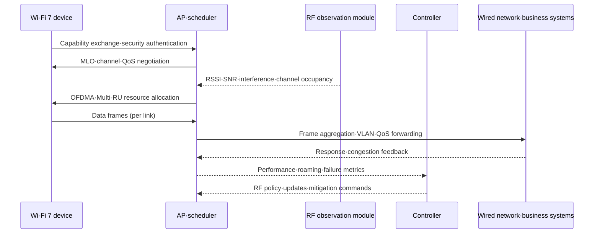

# High-Performance, Low-Latency Wireless LAN Design Based on Wi-Fi 7 (IEEE 802.11be)

## 1. Overview

> **Definition**: Wi-Fi 7 is the next-generation wireless LAN generation based on the technologies of IEEE 802.11be-2024, aiming for high throughput, low latency, and high reliability by leveraging wide channels, multiple links, high-order modulation, and sophisticated resource allocation across the 2.4GHz, 5GHz, and 6GHz bands.

Wi-Fi is going beyond being a means of Internet access in the office to becoming the access network for business systems such as manufacturing robots, video conferencing, XR, medical devices, and logistics terminals.
As the number of devices and traffic grow, it is difficult to guarantee user experience and business quality simply by raising average speed.
This is because congestion, interference, device mobility, contention for channel occupancy, and retransmissions in the wireless segment lengthen the tail of latency.

The essence of Wi-Fi 7 is not limited to raising the peak speed of a single link.
It uses multiple frequency links as the situation requires, combines wide channels with high-order modulation, and exploits the wireless medium by dividing resource units finely.
Designers should therefore not merely compare AP and device specifications but review frequency planning, wired backhaul, power and heat, authentication, observability, and application latency requirements in an integrated manner.

IEEE 802.11be-2024 is an active standard for which IEEE SA recorded board approval on September 26, 2024, and which was published on July 22, 2025.
In this amendment, IEEE modifies the PHY and MAC and defines support for a maximum throughput of at least 30Gbit/s measured at the MAC service access point in at least one mode of operation, as well as improved worst-case latency and jitter.
This does not mean that measured user speed is always 30Gbit/s; rather, it specifies the conditions and measurement point the standard targets.

The Wi-Fi Alliance's Wi-Fi CERTIFIED 7 is an interoperability certification program distinct from the IEEE standard itself.
The fact that Wi-Fi 7 features are listed on a product box is not the same as having completed official certification, so in public and enterprise procurement, the list of supported features and the certification status must be verified separately.

This answer organizes, in essay form, the structure and core technologies of Wi-Fi 7, the adoption procedure, comparisons with Wi-Fi 6, wired, and 5G, enterprise and manufacturing cases, security and operational considerations, and implications from a Professional Engineer's perspective.

## 2. Background and Goals

### A. Limitations of Existing Wireless LANs

Wi-Fi 6 and Wi-Fi 6E improved multi-device environments with features such as OFDMA, BSS Coloring, and Target Wake Time.
However, when multiple APs contend on adjacent channels and a device selects only one of several bands, momentary interference and link quality degradation are hard to avoid.
In particular, 4K/8K video, XR rendering, and collaboration applications demand not only average bandwidth but also consistent latency and loss patterns.

With conventional single-link connections, even if interference arises on a 5GHz channel, it is difficult for the device to immediately move traffic to another link.
Packet latency can grow while the channel is reselected and the authentication and association state is adjusted.
Wi-Fi 7, through MLO, manages multiple links as a single logical connection, widening the room for recovery from link failures and congestion.

In addition, in offices and factories with high cell density, using wide channels unconditionally is not beneficial.
A 320MHz channel increases the potential throughput of a single link, but if available spectrum is insufficient, reuse between adjacent APs drops, and in some regions DFS, regulatory, and interference constraints arise.
High-performance features should therefore be applied selectively, taking frequency resources and device capabilities into account.

### B. Design Goals of Wi-Fi 7

The first goal is high throughput.
320MHz channels and 4096-QAM allow more data to be transmitted at once at short range where signal quality is sufficient.
However, the higher the modulation order, the higher the required signal-to-noise ratio, so in environments with many walls, long distances, moving people, and interference, the link may drop to a lower MCS.

The second goal is improving latency and reliability using multiple links.
With MLO, the device and AP coordinate the 2.4GHz, 5GHz, and 6GHz links to use them simultaneously, or use one link as a standby or auxiliary link.
Which link application data is placed on depends on the implementation mode, power, link quality, and regulatory conditions, so it must not be interpreted as "always double the speed."

The third goal is resource efficiency for many devices.
Multi-RU and improved OFDMA operation allow small units of channel resources to be divided and assigned to multiple users.
Devices that send small, short packets, like factory sensors, and video devices are not handled the same way; wireless resources can be allocated according to traffic characteristics.

The fourth goal is extended quality of service.
Even if the standard targets low worst-case latency and jitter, the quality of the overall wireless network is determined together with APs, switches, authentication servers, and application queues.
Therefore, Wi-Fi 7 contributes to the latency targets of business services only when combined with QoS, wired QoS, observability, and incident response.

## 3. Wi-Fi 7 Reference Architecture and Operating Principles

### A. Overall Configuration

```mermaid
flowchart LR
    DEV1[Wi-Fi 7 device<br/>MLO STA] -. 2.4 GHz .-> AP[Wi-Fi 7 AP<br/>MLO·OFDMA]
    DEV1 -. 5 GHz .-> AP
    DEV1 -. 6 GHz .-> AP
    DEV2[Legacy device<br/>Wi-Fi 5/6] --> AP
    AP --> SW[Multi-gigabit switch<br/>PoE·VLAN·QoS]
    SW --> CTRL[Wireless LAN controller<br/>Policy·RF management]
    SW --> AUTH[AAA/RADIUS<br/>802.1X authentication]
    SW --> APP[Business systems·Internet·edge]
    MON[Observability·logs·wireless analytics] --> CTRL
    MON --> SW
```

A Wi-Fi 7 device (STA) negotiates with the AP the bands and number of links it supports, the number of spatial streams, the channel width, and the modulation scheme.
Just because a device supports all three bands does not mean it always transmits and receives on all bands simultaneously.
The number of links and how they are used vary with battery, antenna configuration, national spectrum regulations, and the AP's implementation policy.

The AP manages multiple wireless links while performing scheduling, frame transmission, security encryption, and roaming support.
Because it makes decisions by aggregating the state of multiple links, the AP's CPU, memory, wireless chipset processing capability, and firmware maturity are important.
In high-density environments, channel reuse between APs and co-channel interference must be evaluated together rather than the peak speed of a single AP.

Wired backhaul determines the upper bound of wireless performance.
When multi-link devices generate high throughput, uplinks of 2.5GbE, 5GbE, 10GbE or more, sufficient PoE power, switch buffers, and VLAN design are required.
If only the APs are replaced and the 1GbE backhaul is left as-is, a bottleneck arises between the wireless PHY speed and actual business throughput.

A wireless LAN controller or cloud management platform centrally manages channels, power, SSIDs, policies, and firmware.
Local autonomy and configuration caching must be designed so that existing APs continue service with safe settings even if central management is interrupted.
RADIUS, certificates, log collection, and time synchronization are also part of the operational quality of wireless connectivity.

### B. Data Flow of Core Technologies



At the start of a connection, the AP and device exchange supported bands, spatial streams, channel width, MLO capabilities, and security policy.
If this negotiation settles at a low level, the device's actual connection may remain at Wi-Fi 6 level even if the AP is a top-tier product.
Operators should display connection capability and actual negotiated results separately on dashboards.

The AP scheduler looks at the wireless channel occupancy state and queues and decides which time and frequency resources to give to which device.
OFDMA divides one channel into multiple Resource Units to serve multiple devices simultaneously, and Multi-RU extends this toward combining resource units to fit device and frame requirements.
The scheduler selects a policy balancing fairness, priority, latency, throughput, and battery savings.

RSSI alone is not sufficient as measurement data.
Causes can be distinguished only by looking together at SNR, MCS changes, retransmission rate, channel occupancy, packet latency distribution, roaming failures, and authentication time.
For example, even if RSSI is high, retransmissions can increase if adjacent APs' channel occupancy is high.

## 4. Core Technologies and Design Points

### A. 320MHz Channels and 6GHz

The Wi-Fi CERTIFIED 7 technology overview presents 320MHz channels as a key feature of Wi-Fi 7.
Wide contiguous channels increase the symbols and amount of data that can be transmitted at once, but can reduce the number of non-overlapping channels that can be deployed in the same area.
Ultimately, a design decision must be made between the peak performance of a single AP and the spatial reuse of many APs.

The 6GHz band has the advantage of providing wide channels and relatively new spectrum resources.
On the other hand, national usage conditions, indoor/outdoor regulations, device support, and wall penetration loss must be checked.
Designing to use only 6GHz lowers accessibility for older devices, so a coexistence policy with 2.4GHz and 5GHz is needed.

In areas such as office meeting rooms, where APs are sufficiently far apart and devices are stationary, 320MHz can be chosen.
Conversely, in places where many APs are densely deployed, such as production lines and hospital wards, reusing 80MHz or 160MHz across multiple cells may be better for overall capacity and stability.

### B. 4096-QAM and the Physical Layer

4096-QAM is a high-order modulation scheme that improves transmission efficiency by carrying more bits per symbol.
However, because the spacing between symbols becomes tighter, it is sensitive to noise and interference, and high MCS is maintained only when signal quality between the AP and device is good.
Therefore, the peak PHY speed in product advertisements must not be presented as the user speed at every location.

In actual design, the MCS at the cell edge, minimum SNR, retransmission rate, and 95th/99th percentile latency are measured.
Simply raising transmit power to strengthen the signal can increase adjacent-cell interference and device battery burden.
The combination of power, channel width, AP spacing, and antenna placement must be optimized through on-site measurement.

### C. MLO (Multi-Link Operation)

MLO is Wi-Fi 7's signature feature that allows the device and AP to manage multiple links as a single logical connection.
The STR mode, which uses links simultaneously, has room for improving throughput and latency, while modes that alternate links or put them to sleep can reduce power and interference.
Specific behavior may vary with chipset, firmware, device power policy, and certification profile.

MLO design considers per-link security state and retransmission, packet ordering, and link switching time.
Even if 5GHz has wide range and 6GHz has channel headroom, link quality can differ when there is a wall in between.
If the threshold for detecting quality degradation on one link and moving traffic to another is too sensitive, ping-pong switching occurs, so hysteresis and a minimum hold time are set.

MLO does not solve every latency problem.
If backhaul queues are saturated or the application server is slow, adding wireless links does not reduce end-to-end latency.
Therefore, timestamps across the wireless, wired, and server segments must be correlated to identify where the bottleneck is.

### D. OFDMA and Multi-RU

OFDMA divides the entire channel into small resource units that the AP allocates to multiple devices simultaneously.
It can reduce the waste of monopolizing an entire large channel to send short sensor packets and can lower access latency for many devices.
However, if the per-device resource units are too small, control overhead increases and throughput for high-volume devices can drop.

Multi-RU increases flexibility by combining multiple resource units to fit device capabilities and traffic.
The scheduler must allocate by distinguishing the continuous data of video devices from the short periodic messages of sensor devices.
If the fairness algorithm keeps favoring only certain kinds of devices, latency for other devices worsens, so per-service SLAs and maximum wait times are applied together.

### E. 512 Compressed Block Ack and Reliability

The Wi-Fi CERTIFIED 7 technology overview describes the compressed Block Ack feature, which can aggregate and acknowledge up to 512 MPDUs, as a major feature.
Efficiently acknowledging frames can reduce the acknowledgment overhead of large data transfers, but retransmission and buffer policies must be checked so that losses do not escalate into retransmission delays for the entire aggregate.
A differentiated policy is needed, such as prioritizing throughput for video and file transfer, and latency for control traffic and interactive business.

| Feature | Problem addressed | Expected effect | Caution |
|---|---|---|---|
| 320MHz | Insufficient per-channel transmission volume | High peak throughput | Frequency reuse, interference |
| MLO | Single-link congestion/disconnection | Improved throughput, resilience, latency | Device/AP implementation differences |
| 4096-QAM | Limited bits per symbol | Higher efficiency in good signal environments | High SNR requirement |
| OFDMA | Contention among many devices | Fine-grained simultaneous resource allocation | Scheduler fairness |
| Multi-RU | Rigidity of resource units | Per-traffic resource combination | Control overhead |
| Block Ack | Acknowledgment frame overhead | Efficiency of large transfers | Loss, buffering, retransmission |

The features in the table are not independent switches.
Even if throughput is raised with wide channels and high-order modulation is used, the MCS can drop if interference increases.
Therefore, rather than per-feature figures, results in throughput, latency, loss, and power must be verified at the service level.

## 5. Deployment and Operations Procedure

### A. Requirements and Site Survey

First, classify requirements by user, business, device, and space.
Video conferencing in meeting rooms prioritizes latency and uplink quality, logistics terminals prioritize roaming during movement and authentication success rate, and sensors prioritize short packets and battery.
Requirements should be expressed not as "adopt Wi-Fi 7" but in terms of service KPIs and failure impact.

The site survey measures walls, metal structures, machinery, electromagnetic sources, existing APs, and channel occupancy.
In factories, motors and welding equipment can create interference, and in hospitals, radio compatibility of equipment and the risk of work disruption are reviewed separately.
Only by combining measurement results with floor plans and time-of-day traffic can the number of APs and channel widths be determined rationally.

Next, investigate device capabilities and roaming policy.
Installing Wi-Fi 7 APs does not mean all existing devices can use MLO, 6GHz, or 4096-QAM.
In mixed-generation environments, SSIDs, bands, and policies can be separated so that legacy devices do not excessively occupy resources of new devices.

### B. Design, Testing, and Phased Rollout

At the design stage, RF planning, wired backhaul, VLANs, QoS, authentication, monitoring, and failover paths are created together.
Even if per-AP channels and power are left to automatic optimization, minimum coverage and maximum cell overlap criteria for business-critical areas must be specified.
Divide the roles of 6GHz, 5GHz, and 2.4GHz, and define default behavior when a particular band is unavailable.

Testing is divided into functional, performance, interoperability, security, and failure testing.
Include scenarios such as loss of one MLO link, 6GHz non-line-of-sight zones, AP reboot, controller disconnection, RADIUS latency, switch uplink saturation, and a video call during roaming.
Do not pass on average speed alone; use 95th/99th percentile latency, packet loss, retransmissions, authentication time, and recovery time as criteria.

Rollout proceeds in the order of lab, limited floors/lines, times of low business peak, and full expansion.
Define entry and abort conditions for each stage, and maintain for a certain period the configuration and equipment needed to revert to the existing APs.
After the change, perform before-and-after measurements at the same locations to confirm whether wireless performance actually translated into business outcomes.

### C. Observability and Service Level Management

Observability data must link APs, devices, controllers, switches, AAA, and applications into a single flow.
Look together at connection speed, MCS, channel width, number of links, RSSI, SNR, retransmission rate, channel occupancy, roaming, authentication, and application response time.
Analyzing by device name alone makes impact analysis by user, business, and location difficult, so manage asset identifiers and service tags.

Failure classification is also layered.
If connection fails altogether, first check authentication, frequency, radio propagation, and IP assignment; if connected but slow, distinguish RF retransmissions, scheduler, backhaul, and server queues.
Synchronizing the timing of events and performance metrics makes it possible to objectively evaluate the effect of actions such as AP replacement or channel changes.

## 6. Technology Comparison and Adoption Decisions

### A. Wi-Fi 6 vs. Wi-Fi 7

If Wi-Fi 6 greatly improved multi-device efficiency and power savings, Wi-Fi 7 builds on it by combining wider channels, MLO, high-order modulation, and fine-grained resource operation.
However, the benefits of Wi-Fi 7 do not appear at the same rate in every environment.
If devices are Wi-Fi 6 and only 1GbE backhaul is used, replacing just the APs with Wi-Fi 7 may yield limited return on investment.

| Category | Wi-Fi 6/6E | Wi-Fi 7 |
|---|---|---|
| Representative standard | 802.11ax | 802.11be-2024 |
| Core direction | High-density efficiency, power savings | Throughput, multi-link, low latency |
| Channel width | 20–160MHz depending on environment | Up to 320MHz feature |
| Link operation | Mainly single link | Multiple links managed via MLO |
| Modulation | 1024-QAM | 4096-QAM support |
| Adoption decision | Scope of device/AP replacement | Integration of devices, RF, backhaul, operations |

This comparison does not mean that a higher generation is always superior.
In high-density offices, a Wi-Fi 6 design reusing small channels across many cells can be more stable than a single wide channel.
Conversely, in areas where high instantaneous throughput and low latency matter, such as XR, wireless backhaul, and high-definition video, the value of Wi-Fi 7 features grows.

### B. Wi-Fi 7 vs. 5G vs. Wired

Wired Ethernet provides predictable physical paths and high stability but low mobility and installation flexibility.
Private 5G networks are strong in wide-area mobility, SIM-based management, and carrier integration, while Wi-Fi 7 can be advantageous in terms of existing IP networks, the device ecosystem, and indoor deployment costs.
Rather than choosing one of the three wholesale, compare business mobility, radio environment, security domain, operational capability, and TCO.

| Criterion | Wired Ethernet | Wi-Fi 7 | Private 5G |
|---|---|---|---|
| Mobility | Low | Indoor/local mobility | Wide-area mobility |
| Installation flexibility | Cabling required | AP placement required | Base stations and core required |
| Fixed latency | Most predictable | Affected by RF environment | Affected by radio and core |
| Device ecosystem | Mature | Very broad | Modules/SIM required |
| Suitable cases | Servers, fixed equipment | Offices, XR, indoor IoT | Factory mobile units, campuses |

For example, fixed inspection equipment on a production line can prioritize wired, worker tablets and mobile cameras can use Wi-Fi 7, and AGVs moving across the entire factory can be compared against private 5G.
At this point, standardizing the authentication, addressing, QoS, and observability models so the same application can use multiple access networks reduces switching costs.

## 7. Case: Wireless Visual Inspection and AGVs in a Manufacturing Plant

Suppose a manufacturer connects high-resolution visual inspection cameras, AGVs, and maintenance tablets on a single wireless infrastructure.
Visual inspection has high instantaneous uplink throughput, AGVs prioritize roaming latency and connection persistence, and tablets prioritize user mobility and authentication convenience.
An approach that simply offers peak speed on the same SSID has difficulty satisfying all three requirements simultaneously.

First, for the camera zone, consider 6GHz and wide channels, but measure inter-AP interference and backhaul.
Along AGV routes, secure continuity of 5GHz and 6GHz links, and test MLO switching time and roaming failures.
Place tablets and existing sensors under separate policies so that low-priority traffic does not squeeze video and control traffic.

Switches provide multi-gigabit uplinks with VLAN and QoS, and the controller distributes per-production-service policies to APs.
Authentication uses 802.1X and per-device credentials, and temporary equipment is given access only to a restricted network.
Even if the controller or AAA is temporarily down, already-authenticated devices must be able to operate safely and failure notices must be possible.

The pilot's acceptance criteria are not just camera throughput.
Measure together AGV 99th percentile latency, handover failure rate, video frame loss, authentication success time, AP failure recovery time, backhaul utilization, and operator incident handling time.
If criteria are exceeded during peak production time, new features are automatically turned off and the system reverts to the existing profile.

The key point of this case is not to view Wi-Fi 7 as a standalone equipment purchase.
RF design, the wired network, business priorities, security, operational automation, and on-site safety procedures must be tied together into a single service design.

## 8. Security, Privacy, and Operational Considerations

First, make authentication and encryption the default.
Apply WPA3-Enterprise, 802.1X, RADIUS, and certificate lifecycles, and separate the credentials and network permissions of personal, business, and IoT devices.
If many devices share a single common PSK, revocation and tracking become difficult upon employee departure, loss, or vendor change.

Second, separate the management plane.
Separate AP, controller, and switch management interfaces from the user data network, and apply administrator MFA, least privilege, access allowlists, change approval, and command logging.
Even when using a cloud-managed platform, specify in the contract the management API, tenant isolation, data retention, and local operation in case of provider outage.

Third, consider RF security and availability together.
Jamming, rogue APs, Evil Twins, certificate forgery, and channel exhaustion can cause not only user data leakage but also business disruption.
Include wireless intrusion detection, channel scanning, rogue device blocking, and physical AP protection in operational procedures, but put approval and recovery procedures in place so that false positives do not block normal business.

Fourth, control the personal information in location and connection logs.
Device MAC, user ID, AP location, and connection time are useful for business analysis but can be used to infer an individual's movement path.
Define purpose, retention period, access rights, de-identification, and deletion procedures, and retain only the minimum scope necessary for failure analysis.

Fifth, manage the supply chain and firmware.
Include vulnerability notices for APs, chipsets, and controllers, firmware signing, support periods, SBOM, and emergency patch procedures in contracts and procurement evaluation.
Before enabling new features, pass interoperability, security, and performance regression tests, and be able to revert to the previous firmware and RF profile if problems arise.

| Area | Representative risk | Professional Engineer's response |
|---|---|---|
| Authentication | Illegal devices, credential theft | 802.1X, WPA3-Enterprise, MFA, certificate revocation |
| RF | Jamming, Evil Twin, rogue APs | WIDS/WIPS, channel analysis, on-site response |
| Management | Hijacking of controller/API privileges | Management network separation, least privilege, audit logs |
| Backhaul | Uplink saturation, VLAN errors | Capacity planning, QoS, redundancy, alerts |
| Privacy | Excessive collection of location/connection logs | Purpose limitation, retention period, access control |
| Supply chain | Vulnerable firmware, forged updates | Signing, SBOM, patch SLA, rollback |

## 9. Advanced: Standards and Certification Trends and Exam Perspective

With IEEE 802.11be-2024 published as an active standard, Wi-Fi 7 has moved from the stage of simply listing draft features to the stage of standards-based design and product verification.
However, the feature definitions of the IEEE standard and the scope of support in Wi-Fi Alliance-certified products may not be the same.
In an exam answer, the key to accuracy is describing the standard, the certification program, and vendor options separately.

In January 2026, the Wi-Fi Alliance announced certification applying Wi-Fi CERTIFIED 7 features to 20MHz-only IoT devices as well.
This change shows a direction of extending Wi-Fi 7 beyond high-performance smartphones and laptops to sensors, wearables, and industrial equipment.
Since 20MHz devices do not need the peak throughput of 320MHz, the perspective of applying features selectively to balance power, cost, and interoperability is important.

Expected essay questions may be framed as "Wi-Fi 7 technologies and adoption plan" or "high-density, low-latency wireless LAN design."
Structuring the answer in the order of definition and background; the principles of 320MHz, MLO, 4096-QAM, and OFDMA; AP, backhaul, and controller architecture; comparisons with Wi-Fi 6, 5G, and wired; field cases; and security and operational metrics can demonstrate both technical principles and application strategy.

## 10. Considerations and Implications

### A. Prioritize Service Metrics over Speed

Peak PHY speed is merely the potential of the wireless link, not the throughput of a business service.
A Professional Engineer should present user-perceived experience, 99th percentile latency, loss, authentication and roaming success rates, failure recovery time, and TCO as target metrics.

### B. Design RF, Wired, and Applications End to End

Even with MLO and 320MHz applied, the effect disappears if the backhaul, firewalls, or server queues are the bottleneck.
Along with the AP replacement budget, multi-gigabit switches, PoE, VLANs, QoS, observability platforms, and server performance must be designed.

### C. Assume Phased Adoption and Mixed-Generation Coexistence

Rather than replacing all devices and APs at once, start pilots in high-value zones and business functions.
Safely accommodate legacy devices, and clarify default behavior and rollback paths for unsupported MLO and 6GHz features.

### D. Embed Security and Privacy in the Operational Lifecycle

Wireless security does not end with WPA settings; it includes certificates, firmware, management APIs, logs, and rogue APs.
Limit the purpose and retention of personal movement information and connection logs, and keep evidence of changes, incidents, and vendor replacements.

### E. Make Standards Compliance and Interoperability Testing Procurement Conditions

A statement that IEEE 802.11be features are supported is different from completion of Wi-Fi CERTIFIED 7.
In procurement, require with figures and evidence the mandatory features, supported channels and bands, MLO modes, security versions, test equipment and interoperability targets, and firmware support period.

### F. Safely Contain Automation Failures

RF auto-optimization and central policy distribution reduce the operational burden, but incorrect channels, power, or firmware can affect wide areas simultaneously.
Combine canary deployment, change approval, scope limits, automatic rollback, and local autonomy to reduce the blast radius of automation.

## References

- IEEE 802.11 Working Group, IEEE Std 802.11be-2024 publication notice: https://www.ieee802.org/11/
- IEEE Standards Association, IEEE 802.11be-2024 standard information: https://standards.ieee.org/ieee/802.11be/7516/
- Wi-Fi Alliance, Wi-Fi CERTIFIED 7 Technology Overview: https://www.wi-fi.org/system/files/Wi-Fi_CERTIFIED_7_Technology_Overview_202401_0.pdf
- Wi-Fi Alliance, Wi-Fi CERTIFIED programs and the distinction between standards and certification: https://www.wi-fi.org/topic/certification
- Wi-Fi Alliance, Extension of Wi-Fi CERTIFIED 7 to 20MHz-only IoT devices: https://www.wi-fi.org/topic/iot

---

> **In one line**: Wi-Fi 7 raises wireless LAN throughput, latency, and reliability through 320MHz, MLO, 4096-QAM, and fine-grained resource allocation, but its real value emerges only when RF, wired backhaul, devices, security, and operations are designed and verified end to end at the service level.
