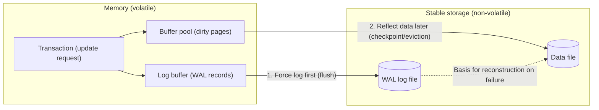
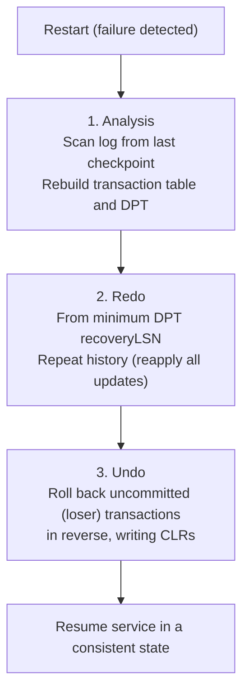

# Write-Ahead Logging (WAL) and Database Recovery Techniques (ARIES)

## 1. Overview

> **Write-Ahead Logging (WAL)** is the fundamental protocol of transaction recovery that requires the log recording a change to be forcibly written (forced) to stable storage before the data page (block) is reflected on disk. That is, through the ordering rule "log first, data later," it guarantees that even if a failure occurs, a consistent state of the data can be reconstructed as long as the log exists.

For performance, a database does not write updated pages to disk immediately but caches them temporarily in the buffer pool. This deferral greatly increases throughput, but when failures such as power outages, forced process termination, or disk errors occur, the updates in the buffer can be lost, creating the risk of breaking transaction Atomicity and Durability. WAL emerged precisely to eliminate this risk. If updates from a transaction that has not yet committed are reflected on disk first, a basis is needed to undo them upon failure; conversely, if updates from a committed transaction have not yet been reflected on disk, a basis is needed to redo them. The essence of WAL is to leave both bases in the log while forcing that log to reach stable storage before the data.

The fundamental reason WAL is needed is to preserve ACID while securing freedom in buffer management policy. If all updated pages were forcibly written to disk at every commit (force policy), redo would be unnecessary, but random I/O would explode and performance would collapse. Conversely, if dirty pages of uncommitted transactions were prevented from being evicted from the buffer (no-steal policy), the buffer would quickly be exhausted. Modern DBMSs adopt the **steal/no-force** policy, which performs best (allowing eviction even of uncommitted pages, and not forcing data writes at commit); this policy requires **both** undo and redo, and its safety net is WAL. WAL is commonly implemented across commercial and open-source engines, including Oracle's redo log, PostgreSQL's WAL segments, MySQL InnoDB's redo log and undo log, and SQLite's WAL mode. Although representation and detailed structure differ by engine, all share without exception the rule of "leaving the log in stable storage before the data," so WAL can be called a universal principle of transaction processing.

## 2. Basic Principles of WAL and Log Structure

WAL consists of two sub-rules. The first is the **undo rule**: before an update to a page is reflected on disk, the log that can reverse that update (the before-image) must first be written to stable storage. The second is the **redo rule**: before a transaction is considered committed, all of that transaction's update logs (after-images) must be written to stable storage. When both rules are upheld, no matter when a failure occurs, committed transactions can be re-executed and uncommitted transactions canceled using the log alone, recovering to a consistent state.

The diagram below shows the overall structure through which an update operation passes through the buffer, log, and disk.

Depending on what is left in the log, logging methods are divided into three. **Physical logging** leaves the changed bytes/page image as-is, making reapplication simple but producing large log volume; **logical logging** records the operation itself, such as "deduct 100 from account A," producing small log volume but making idempotent recovery difficult due to side effects and ordering issues on reapplication. **Physiological logging**, adopted by ARIES, is a compromise that "specifies the page physically but describes the change within that page logically," keeping log volume moderate while remaining unaffected by intra-page movements such as slot array reordering. Most practical engines follow this physiological approach.

The log is a sequence of append-only records, each identified by a unique **LSN (Log Sequence Number)**. Since LSNs increase monotonically, they directly represent the temporal order and causal relationships of the log. The header of each data page records the **pageLSN**, the LSN of the last log applied to that page. During recovery, if a log record's LSN is greater than the page's pageLSN, it is judged to be "an update not yet applied" and redone; if less than or equal, it is judged "already applied" and skipped. This LSN comparison is the key mechanism guaranteeing the idempotency of recovery. For example, even if another failure occurs during recovery and recovery is repeated from the start, already-applied updates are automatically excluded via the pageLSN comparison, so double application does not occur.

For performance, the log itself is first gathered in an in-memory **log buffer** and then written to stable storage under certain conditions (commit, buffer full, periodic flush). To uphold the WAL rule here, the invariant must hold that "immediately before writing a data page to disk, the log up to that page's pageLSN must have been flushed." **Group commit**, which bundles the commit logs of many transactions into a single fsync, is a representative optimization that raises throughput by reducing the number of disk synchronizations while maintaining this invariant. Conversely, fsyncing the log immediately for each individual commit makes durability perfect, but ties the number of commits per second to the disk's fsync performance. Thus, "when and how strongly to write the log" is a key performance variable in WAL implementation.

Representative types of log records are as follows. The table is an aid to comparison; why each type is needed should be understood from the perspective of the undo/redo rules above.

| Log type | Recorded content | Role in recovery |
|-----------|-----------|--------------|
| Update | LSN, transaction ID, page ID, before-image, after-image | Basis for both undo and redo |
| Commit | Transaction completion marker | Completion determination (confirms redo targets) |
| Abort/Rollback | Start of transaction cancellation | Determines undo targets |
| CLR (Compensation Log Record) | Fact that undo was performed and next undo target (UndoNextLSN) | Guards undo against re-failure, tracks progress |
| Checkpoint | Snapshot of active transactions and dirty page state | Shrinks the recovery starting point |

## 3. Checkpoints and the Need for Recovery

Since the log keeps accumulating, if all of it were reapplied from the very beginning upon failure, recovery time would grow without bound. The mechanism that prevents this is the **checkpoint**. A checkpoint leaves a snapshot of the system state (the list of active transactions and dirty pages) in the log at a specific point, advancing the starting point so that recovery needs to examine only what comes after it.

There are two types of checkpoints. A **synchronous (sharp) checkpoint** writes all dirty pages to disk at the moment of the checkpoint and halts transaction processing in the meantime. Recovery logic becomes simple, but the service stalls momentarily due to massive forced writes. By contrast, an **asynchronous (fuzzy) checkpoint** records only the current dirty page table and transaction table without stopping processing, and actual page writes are performed gradually in the background. Modern engines including ARIES mostly use fuzzy checkpoints to ensure availability. For example, InnoDB uses both sharp checkpoints (at shutdown/flush) and fuzzy checkpoints (background flushing during operation) depending on the situation.

The effectiveness of a checkpoint is determined by how far it raises "the lower bound of the log that recovery must examine." Since the minimum recoveryLSN in the dirty page table left by a fuzzy checkpoint becomes the starting point of redo, the more smoothly background flushing proceeds and dirty pages are cleared quickly, the shorter the recovery scan interval. Conversely, if heavy writes pile up and dirty pages remain for a long time, the recovery interval does not shrink much even with frequent checkpoints. Therefore, checkpoint frequency and buffer flush rate (e.g., InnoDB's adaptive flushing) are a pair of variables that must be tuned together.

The policy for when updates are reflected also affects the recovery burden. **Immediate update** can reflect dirty pages on disk even while a transaction is in progress, so undo is necessarily required; **deferred update** postpones disk reflection until commit, so undo is unnecessary but buffer pressure and commit latency increase. Most performance-oriented commercial DBMSs adopt the combination of immediate update + steal/no-force + WAL.

## 4. The ARIES Recovery Algorithm

**ARIES (Algorithm for Recovery and Isolation Exploiting Semantics)**, proposed by C. Mohan and others at IBM, is the de facto standard algorithm for WAL-based recovery. ARIES rests on three design principles: first, **WAL compliance**; second, **repeating history** — the principle that during recovery all updates up to just before the failure (including those of uncommitted transactions) are first reproduced as-is and then the uncommitted portions are reversed; and third, **logging of undo via compensation log records (CLRs)** — the principle that undo itself is recorded in the log so that even if a re-failure occurs during recovery, work already undone is not undone again.

ARIES uses two core data structures. The **Transaction Table** holds active transactions and each one's last LSN (lastLSN), and the **Dirty Page Table (DPT)** holds pages updated in the buffer but not yet reflected on disk, along with each page's recoveryLSN (the LSN of the first update that made that page dirty). The minimum recoveryLSN in the DPT determines the point at which redo begins.

Recovery proceeds in three phases — **Analysis → Redo → Undo** — as shown below.

**The Analysis phase** starts from the last completed checkpoint record and scans forward to the end of the log, restoring the set of transactions active at the time of failure (loser transactions that did not complete) and the set of dirty pages. The purpose of this phase is to determine the starting LSN for the subsequent redo and the list of transactions to undo. For example, transactions with a commit log are classified as winners, and those without are classified as losers.

**The Redo phase** scans the log forward again from the minimum recoveryLSN in the DPT, reapplying all updates regardless of winner or loser to reproduce "the state just before the failure" as-is. However, for each update, it compares the page's pageLSN with the log LSN and skips updates already reflected on disk. Reproducing even the losers' updates may seem counterintuitive, but it makes the algorithm simple and robust by letting the next undo phase roll back on the premise of "a normally updated state" (the repeating history principle).

**The Undo phase** rolls back the updates of loser transactions one by one in reverse, starting from lastLSN. Each undo operation is recorded as a **CLR (Compensation Log Record)** containing the fact of the rollback and the next target to roll back (UndoNextLSN). Thanks to CLRs, even if another failure occurs during undo and recovery is re-run, following the CLR's UndoNextLSN resumes processing only after the point already rolled back, so undo is never performed twice and recovery always terminates in finite time. This property is expressed as "undo is never undone (CLR is never undone)."

Another reason ARIES has been widely adopted is that it covers not only recovery but also sophisticated control during normal operation. Because each log record points to its prevLSN (the previous log of the same transaction) like a linked list per transaction, **partial rollback** to a specific savepoint is naturally supported. It also works consistently with fine-granularity locking at the record/tuple level rather than the page level, enabling accurate recovery even in high-concurrency environments where multiple transactions access a single page simultaneously. Thanks to this generality, the core ideas of ARIES (LSN, repeating history, CLR) have become the common design language of commercial DBMS recovery subsystems.

## 5. Recovery Scenario Example (LSN-Based Tracing)

How the three phases of ARIES actually mesh becomes clearest when viewed through a concrete log sequence. Below is a simplified log of a situation in which the system crashed while two transactions, T1 and T2, were in progress. Assume LSNs increase in steps of 10.

| LSN | Transaction | Operation | Note |
|-----|----------|------|------|
| 10 | T1 | begin | |
| 20 | T1 | update P5 (A: 100→150) | P5 dirty, recoveryLSN=20 |
| 30 | — | checkpoint | Active=T1, DPT={P5:20} |
| 40 | T2 | begin | |
| 50 | T2 | update P7 (B: 30→60) | P7 dirty, recoveryLSN=50 |
| 60 | T1 | commit | T1 is a winner |
| 70 | T2 | update P5 (A: 150→200) | |
| — | — | **CRASH** | T2 is uncommitted (loser) |

**The Analysis phase** starts from the checkpoint at LSN 30. As a result of the scan, T1 committed at LSN 60 and is therefore a winner, while T2 has no commit log and is classified as a loser. P5 (recoveryLSN=20) and P7 (recoveryLSN=50) are placed in the DPT. **The Redo phase** scans forward from 20, the minimum recoveryLSN in the DPT, comparing the updates at LSN 20, 50, and 70 against the pages' pageLSNs and reapplying only those needed. At this point, even the loser T2's updates at LSN 50 and 70 are applied to reproduce the state just before the failure as-is (repeating history). **The Undo phase** rolls back loser T2 in reverse from lastLSN (70). It rolls back the update at LSN 70 (A: 200→150), writing a CLR, then rolls back the update at LSN 50 (B: 60→30), writing a CLR, and finishes. In the end, T1's update (A=150) survives and all of T2's updates disappear, resulting in a consistent state in which atomicity and durability are both guaranteed.

In this example, it is worth noting that the existence of the checkpoint (LSN 30) raised the starting point of analysis and redo to the middle of the log rather than its very beginning. In a real operating environment where tens of millions of log records have accumulated, checkpoint frequency becomes the decisive variable determining recovery time.

## 6. Comparison of Update and Recovery Policies

The required recovery operations differ depending on the combination of buffer management policies. The comparison below is not a simple list but shows the trade-offs each combination creates between performance and recovery burden. Steal allows eviction of uncommitted pages to improve buffer efficiency at the cost of requiring undo, while no-force omits forced writes at commit to reduce commit latency at the cost of requiring redo. This is why steal/no-force, which performs best, requires both undo and redo — and why WAL becomes essential.

| Policy combination | Undo required | Redo required | Performance characteristics | Typical adoption |
|-----------|-----------|-----------|-----------|-----------|
| no-steal / force | Not required | Not required | Massive forced I/O at commit, buffer pressure | Theoretical/small-scale |
| steal / force | Required | Not required | High commit latency | Rare |
| no-steal / no-force | Not required | Required | Risk of buffer exhaustion | Rare |
| **steal / no-force** | **Required** | **Required** | Best performance | Most commercial DBMSs |

As one concrete example, MySQL InnoDB operates the redo log (a circular group of files) and the undo log (undo tablespace) separately. With `innodb_flush_log_at_trx_commit=1`, the redo log is fsynced to disk at every commit, guaranteeing complete durability (strict application of the WAL redo rule); lowering the value to 0 or 2 increases performance but introduces the risk of losing up to about one second of transactions. This is a practical tuning point that trades durability for throughput by adjusting the strength of WAL's forced writes.

## 7. Advanced: Recent Trends and Practical Applications

WAL is being reinterpreted beyond a mere recovery mechanism as core infrastructure of today's data platforms. First, it is **the foundation of physical replication**. PostgreSQL streaming replication and Oracle Data Guard achieve high availability and read scaling by transmitting the WAL/redo stream generated by the primary to standbys in real time and reapplying it. In other words, the log kept for recovery becomes the replication channel as-is.

Second, it is **the source of change data capture (CDC) and event streaming**. Tools like Debezium read the WAL via the MySQL binlog or PostgreSQL logical decoding and stream data changes as Kafka events. Since reliable change propagation is possible from the log alone without touching application code, WAL has become the de facto standard source for data synchronization among microservices.

Third, **the spread of the storage engine design philosophy**. LSM-Tree-based engines (RocksDB, Cassandra, etc.) also write to the WAL (commit log) before updating the memtable to ensure durability, and the cloud-native DB Amazon Aurora, on the principle that "the log is the database," sends only redo logs to the storage layer and lets storage nodes reconstruct data pages from the log, dramatically reducing network write volume. This is a representative case of extending the WAL concept into a distributed storage architecture.

Fourth, **the intersection with non-volatile memory (PMEM)**. In persistent memory environments, the cost structure of forced log writes changes, and research on reducing or eliminating logs (e.g., logless recovery) is under way, but WAL's very purpose — guaranteeing atomicity and durability — remains valid.

Fifth, **conceptual convergence with event sourcing and the outbox pattern**. The idea of Event Sourcing at the application layer — "record state changes first in an event log and derive state from it" — is no different from raising the WAL principle inside the DBMS to the level of service architecture. The transactional outbox pattern likewise shares WAL's philosophy of "record first, apply later" in that it binds business data changes and event publication into the same local transaction to ensure atomicity. Understanding WAL not as a localized technique of the storage engine but as a general principle of reliable state propagation allows database and distributed system design to be viewed through a single lens.

## 8. Considerations and Implications

From a Professional Engineer's perspective, the following should be considered comprehensively when applying WAL and ARIES in practice.

- **Tuning the durability–performance trade-off**: The strength of log fsync at commit (e.g., InnoDB `innodb_flush_log_at_trx_commit`, PostgreSQL `synchronous_commit`) and optimizations such as group commit, which bundles log flushes of many transactions, must be configured to fit workload characteristics (OLTP vs. large batch). Unconditional full synchronization hurts throughput, while indiscriminate relaxation hurts data safety.

- **Balancing the recovery time objective (RTO) and checkpoint frequency**: Frequent checkpoints reduce the scan range during recovery and shorten RTO but increase flush I/O during operation. Conversely, infrequent checkpoints improve normal performance but lengthen failure recovery. The frequency must be calculated in conjunction with disaster recovery (RPO/RTO) requirements.

- **Stability and capacity management of log storage**: Since WAL must be stored on stable storage, the I/O performance and redundancy of the log volume can become both a bottleneck and a single point of failure. Monitoring is needed for log archiving (PITR, point-in-time recovery) and retention periods, circular reuse policies, and disk saturation (situations where the log fills up before the data).

- **Strategy for extending to distributed and replicated environments**: When using WAL as the source for replication, CDC, and event sourcing, the consistency–latency trade-off depending on the choice of synchronous vs. asynchronous replication, management of standby apply delay (replication lag), and propagation of schema changes in logical replication must be designed together. In modern architectures where recovery infrastructure becomes data integration infrastructure, WAL design determines the reliability of the entire data platform beyond a single DB.

- **Operational observability and incident response**: Recovery time, checkpoint frequency, replication lag, and log flush latency should be monitored continuously, and actual RTO verified through recovery rehearsals (periodic forced restart tests). Since WAL-related metrics are latent risks that do not surface until a failure occurs, securing observability becomes the key to proactive prevention rather than after-the-fact response.

- **Consistency with related technologies**: The role of WAL becomes clear when understood together with distributed transactions such as two-phase commit (2PC) and the saga pattern, CDC and the outbox pattern, and LSM-Tree and B+Tree storage structures. Recovery policies also interact with isolation levels, locking, and MVCC, so they must be approached in an integrated way within the overall context of transaction management.

## References

- C. Mohan et al., "ARIES: A Transaction Recovery Method Supporting Fine-Granularity Locking and Partial Rollbacks Using Write-Ahead Logging," ACM TODS, 1992. https://dl.acm.org/doi/10.1145/128765.128770
- PostgreSQL Documentation, "Reliability and the Write-Ahead Log." https://www.postgresql.org/docs/current/wal-intro.html
- MySQL Reference Manual, "InnoDB Redo Log." https://dev.mysql.com/doc/refman/8.0/en/innodb-redo-log.html
- Amazon Aurora, "Amazon Aurora: Design Considerations for High Throughput Cloud-Native Relational Databases," SIGMOD, 2017. https://dl.acm.org/doi/10.1145/3035918.3056101

---

> **In one line**: WAL is the foundation of recovery that guarantees atomicity and durability through the ordering rule "log before data," and ARIES is the de facto standard algorithm that implements it with the three phases of Analysis, Redo, and Undo plus LSNs, the DPT, and CLRs, and today it is expanding into core infrastructure for replication, CDC, and cloud databases.
