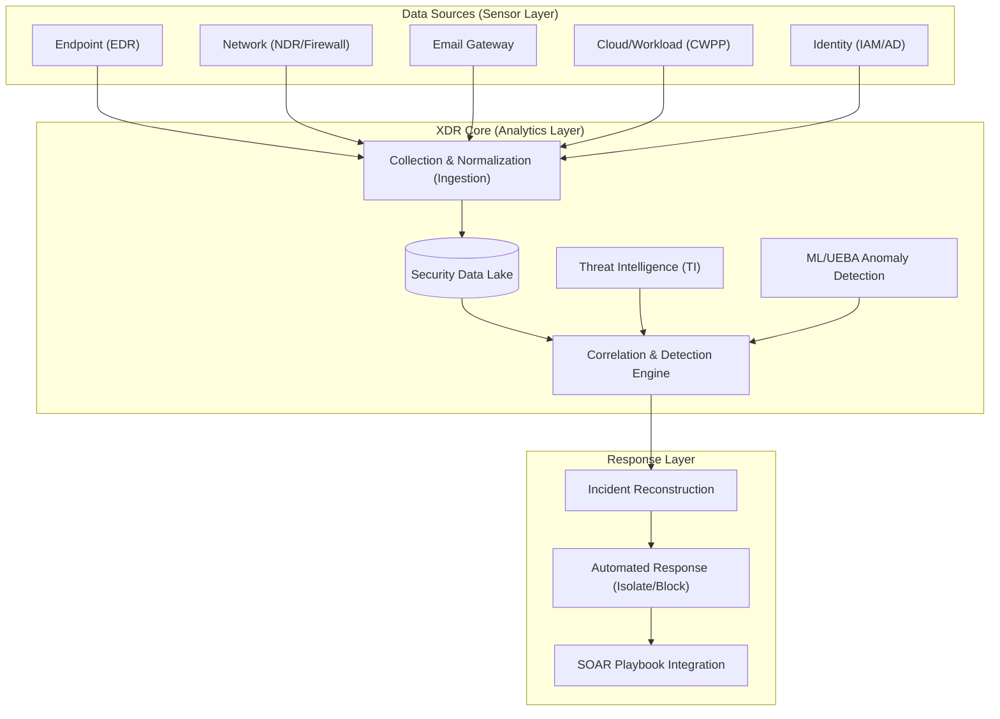
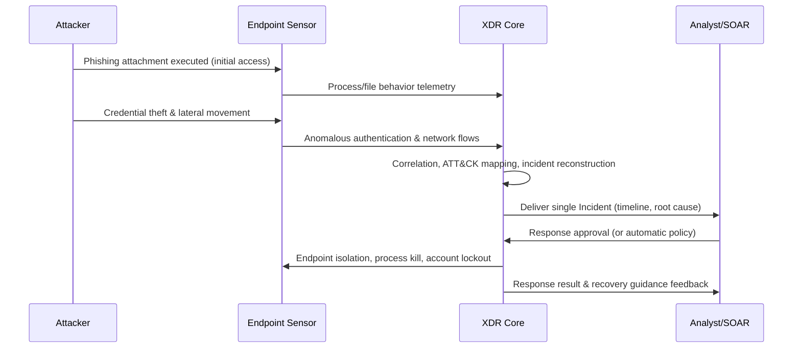

# Extended Detection and Response (XDR, eXtended Detection and Response)

## 1. Overview

> **Definition**: XDR (eXtended Detection and Response) is an integrated threat detection and response framework that collects, normalizes, and correlates telemetry from heterogeneous security domains—endpoint (EDR), network (NDR), email, cloud, server, and identity—on a single platform, automatically reconstructs individual alerts into a single attack story (Incident), and links it all the way through to response.

XDR emerged from two practical pains: "alert fatigue" and "siloed detection." In traditional security operations, EDR detected only endpoints, firewalls and IPS only the network, and mail gateways only mail—each independently—and these alerts were gathered into a SIEM where humans stitched them together by eye. Today's attacks, however, **cross multiple domains**: they infiltrate via a phishing email (email), execute malware on an endpoint (endpoint), steal an account (identity), move laterally across the internal network (network), and then exfiltrate data from cloud storage (cloud). Viewed separately, each domain's alerts are merely "medium-risk" noise, but chained together in time order they form an unmistakable breach scenario. Because tens of thousands of alerts pour in daily, far too many to "stitch" manually, the essence of XDR is having the platform perform correlation and reconstruction automatically.

XDR's essential characteristics can be summarized in four points. First, **cross-domain integration**—endpoint, network, cloud, and identity are handled on one analytic plane. Second, **turning alerts into incidents (Correlation)**—results are presented not as individual alerts but as incidents bound by causal relationships. Third, **a closed loop of detection and response**—everything from detection to containment is connected within one platform. Fourth, **automation and intelligence (AI-driven)**—ML, UEBA, and generative AI augment analysts' judgment. Together these four characteristics define XDR's identity as "integration of the operational flow," not merely the sum of individual tools.

Another driver is the shortage of security personnel and pressure on mean time to detect and respond (MTTD/MTTR). The longer it takes to recognize and contain a breach after it occurs, the more damage grows exponentially, so organizations came to demand an operating model in which analysts receive not a "count" of alerts but "concluded incidents," with containment linked automatically. In particular, the reality that at many organizations breaches lie undetected (Dwell Time) for weeks to months was evidence that detection from a single-domain perspective misses stealthy attacks.

XDR combines the strengths of SIEM's broad log collection and compliance capabilities with EDR's deep endpoint visibility and response capabilities, but differentiates itself by integrating the operational flow of "detect–investigate–respond" into a single product experience. In other words, XDR should be understood not as the addition of one new detection algorithm but as an approach that vertically integrates the scattered data, analytics, and response of security operations to redesign the SOC's operating model itself.

## 2. Overall XDR Architecture and Components

XDR has a layered architecture that pulls data from various security sensors, processes it in an integrated way in a single analytics layer, and passes the results to a response layer. The conceptual diagram below shows the overall structure from data sources to response.

In this structure, data flows bottom-up (sensor → core → response), but threat intelligence and response results are fed back down to continuously refine detection rules. Each layer is examined in detail below.

**A. Sensor (data source) layer.** XDR's detection quality fundamentally depends on "how broad and deep the telemetry it secures is." Endpoint sensors provide low-level behaviors such as process creation, file changes, registry activity, and API calls; network sensors provide session, protocol, and DNS query flows; identity sources provide logins, privilege escalations, and anomalous authentication. The key principle here is that **each domain's data complements the others' context**. For example, when an unidentified process on an endpoint communicates externally, combining network and TI information that its destination is a known C2 (command-and-control) server per threat intelligence promotes an alert that was ambiguous on its own into a confirmed breach.

**B. Collection, normalization, and the security data lake.** Logs from heterogeneous sources differ in field names, time formats, and severity scales, so they must be normalized to a common schema (e.g., OCSF, Open Cybersecurity Schema Framework) before correlation is possible. For instance, one source labels the source address `src_ip` and another `source.address`; without normalization, a machine cannot even recognize the fact that "the same IP was active across multiple domains." Normalized data is loaded into a large-scale security data lake and used both for real-time streaming analytics and for after-the-fact threat hunting (retrospective queries on historical data). Because retention period, cost, and query performance trade off against one another, it is common to tier the last 30–90 days of data to high-speed storage (Hot) and older data to low-cost storage (Cold), and to design the minimum retention period needed for breach investigations (typically 6 months to 1 year) in line with compliance requirements.

Collection is also not mere forwarding but a stage of selecting "what to send." Indiscriminately sending all raw logs makes storage and query costs explode, so optimizing the data pipeline—prioritizing security-relevant events that contribute to detection and summarizing or sampling low-value logs—becomes a core practical task.

**C. Correlation and detection engine.** The heart of XDR, it combines rule-based detection with behavioral and statistical detection. Rule-based detection uses MITRE ATT&CK tactic/technique mapping to detect causal chains of attack stages such as "privilege escalation → credential access → lateral movement," while UEBA (User and Entity Behavior Analytics) and ML anomaly detection catch behavior that deviates from the usual baseline. The two approaches are complementary: rules are strong against known techniques but weak against new variants, while ML catches unknown anomalies but produces many false positives. So in practice, hybrid scoring is used in which ML scores serve as risk weights for rules.

The differentiator of correlation lies in "combining the three axes of time, entity, and technique." Whereas simple SIEM rules stop at single-condition matching—"if condition A, then alert"—XDR uses the same entity (endpoint, account, IP) as an axis and checks whether events from multiple domains form an ATT&CK chain within a time window (e.g., 30 minutes). For example, if "the same account logs in from a new region at an unusual hour → is added to the administrators group within 5 minutes → performs remote execution," then even if each step is low-risk, the combined risk exceeds the threshold and is promoted to an incident. This combination logic is the core mechanism that reduces false positives while raising the detection rate of stealthy multi-stage attacks.

**D. Incident reconstruction and the response layer.** Alerts found to be related through correlation are bundled into one incident and presented to analysts with a timeline, affected assets, and attack techniques. The principle of incident reconstruction goes beyond simple grouping to building a "causal graph." That is, it links which process created which file and, using which account, connected where, as nodes and edges to produce a map of the attack's progression, and the root of this graph is the root cause (initial point of entry). Responses such as endpoint isolation, account lockout, and IP blocking are then performed immediately by XDR's own functions, while more complex multi-step actions (firewall policy changes, ticket issuance, notifying related departments, etc.) are delegated to SOAR playbooks. It is safest to gradually expand the level of response automation according to organizational maturity, from semi-automated (presenting recommendations) to fully automated (immediate policy-based action).

## 3. Detection and Response Process (Operational Flow)

The value of XDR comes from "how well it converges alerts into a single conclusion and how quickly it contains the threat." Below is the processing flow from intrusion through response and recovery.

The operational flow is typically organized as a cycle of **Detect → Triage → Investigate → Respond → Recover**. When individual alerts fire in the detection stage, XDR does not immediately throw them at humans; it groups related alerts and calculates risk. In this process, tens of thousands of raw daily alerts are compressed into dozens of incidents; in actual vendor cases, the ratio of alerts to incidents has been reported to shrink by tens to hundreds to one, dramatically lowering analysts' cognitive load.

In the investigation stage, analysts use the timeline and root cause analysis attached to the incident to quickly grasp "what the initial entry point was and how far it spread." XDR's strength here is **cross-domain pivoting**. From a single incident screen, analysts can move instantly from endpoint → account → network destination while investigating, eliminating the context-switching cost of hopping between multiple consoles as before. In the response stage, actions are taken in stages according to risk; a "human-in-the-loop" policy is recommended in which clear-cut malicious activity is isolated automatically and ambiguous cases are acted on after analyst approval.

**Concrete case — early interdiction of ransomware deployment.** Consider the SOC of a manufacturing company. A finance employee opens a fake invoice email and a macro executes (initial access); the endpoint sensor captures an abnormal parent–child relationship in which an Office process spawns PowerShell. On its own, this is a common low-risk alert. But a few minutes later, an unusual authentication to a domain administrator account (identity) occurs from the same endpoint, followed immediately by mass SMB connections to an internal file server (network). Had the three domains' alerts arrived separately, a Tier 1 analyst would likely have pushed them down the priority list. XDR automatically links these three signals into the ATT&CK chain "initial access → credential access → lateral movement," promotes them to a single high-risk incident, and automatically isolates the endpoint and locks the stolen account before mass file encryption begins. The combination of weak signals that would have been buried individually is thus the key to early interdiction, and this is XDR's real differentiator versus single-domain EDR or post-hoc log-analysis SIEM.

It is desirable to tier response policies by risk grade. For example, a three-stage gate—unattended automatic isolation for confirmed breaches scoring 90 or above, isolation after analyst approval for suspicious incidents scoring 60–90, and observation/monitoring for those below 60—lets you manage both the speed of automation and the risk of business disruption from malfunctions.

The recovery and improvement stage is often overlooked but is a measure of operational maturity. After an incident is closed, detection rules are reinforced so the same type of attack does not recur, and the causes of false negatives (missed signals) and false positives (unnecessary alerts) are analyzed in a post-mortem and fed back into correlation rules and baselines. Mean time to detect (MTTD) and mean time to respond (MTTR) are tracked continuously as key metrics here, and organizations adopting XDR are reported to have meaningfully shortened MTTD and MTTR compared with manual SIEM operations. However, neglect without improvement leads to rule obsolescence and detection capability degrades over time, so threat intelligence updates and rule reviews must be made routine.

## 4. Type Comparison — Native XDR vs Open (Hybrid) XDR

XDR is broadly divided into two types depending on how data sources are secured. This distinction is not merely a product classification but a strategic choice directly tied to an organization's existing security investments, lock-in, and integration difficulty.

| Category | Native XDR | Open (Hybrid) XDR |
|------|-----------|------------------|
| Data sources | Centered on a single vendor's product line | Includes heterogeneous third parties |
| Integration depth | Deep and works immediately (pre-tuned) | Requires connector development & normalization |
| Advantages | Fast adoption, high correlation accuracy | Protects existing investments, flexibility |
| Disadvantages | Vendor lock-in | Complex integration, uneven quality |
| Suitable organization | New builds, single-vendor oriented | Already owns diverse tools |

Because in Native XDR one vendor provides all EDR, NDR, mail, and cloud sensors, field mappings and correlation rules are pre-optimized, yielding high detection accuracy immediately upon adoption. On the other hand, for organizations that have already invested substantially in another vendor's firewalls or EDR, the lock-in that forces them to abandon existing assets is a burden. Open XDR ingests data from heterogeneous tools via connectors and protects existing investments, but log quality and field consistency vary by source, so the normalization and tuning burden is heavy and correlation accuracy depends on source quality. Hence the general practical guideline is "Native for organizations building entirely from scratch, Open for organizations with many tools," and recently there has been a strong trend toward adopting a standard schema (OCSF) to lower the boundary between the two approaches.

The choice between the two types also aligns with the organization's maturity curve. A realistic evolution path is to quickly build fundamentals with Native XDR, which delivers immediate impact, in the early stage of a security organization, and then secure flexibility with Open XDR and a standard schema after the organization grows and adopts diverse tools. In either case, the key is securing both "breadth of detection coverage (number of domains)" and "depth of detection in each domain"—broad but shallow misses true positives, and deep but narrow misses cross-domain attacks.

XDR is also frequently confused with adjacent concepts, so the boundaries need to be clear. SIEM is strong in broad log collection and compliance reporting but weak in response integration and heavy in tuning burden; SOAR specializes in response automation (playbooks) but does not perform detection itself. EDR is deep detection and response limited to the endpoint domain. XDR's position differs in that rather than replacing these, it **broadens the scope of detection to multiple domains (extending EDR) and binds detection and response into one flow (operational integration of SIEM+SOAR)**. In practice, mature SOCs often operate SIEM (long-term logs, compliance) + XDR (real-time cross-domain detection and response) + SOAR (broad orchestration) in a mutually complementary manner.

## 5. Advanced — Latest Trends and Practical Application

**A. Combination with AI and generative AI.** Recent XDR platforms are evolving to incorporate generative AI–based "security copilots" that provide natural-language summaries of complex incidents, investigative queries, and response recommendations. For example, when an analyst asks in natural language, "Tell me the initial access path and the affected accounts in this incident," it proposes a timeline and next actions. This lowers the barrier to entry for junior analysts (Tier 1) and speeds up investigations, but because of the risk of LLM hallucination and misjudgment, the practical consensus is that human verification is still required for final containment decisions.

**B. Expansion to SASE/SSE and the cloud.** As remote work and cloud adoption move protected assets outside the data center, XDR is broadening to combine with SASE (Secure Access Service Edge) and SSE telemetry to apply the same detection and response wherever users are. Integration that absorbs cloud workload protection (CWPP) and cloud security posture management (CSPM) signals into XDR is also active. In a perimeterless environment, "identity and behavior" rather than "network location" become the new control points, so identity-domain telemetry accounts for an ever-growing share of XDR detection.

**C. Consumption as an MDR service.** Mid-sized and small organizations that find it difficult to build their own SOC are increasingly outsourcing XDR technology as Managed Detection and Response (MDR) services. That is, XDR is purchased not as a "product" but as a "service" combined with 24/7 expert operations, establishing itself as a realistic way around the staffing shortage. Even when outsourcing, however, data sovereignty, log storage location, and the scope of response authority (how far the provider may automatically isolate) must be clearly defined in contracts and SLAs to prevent disputes over accountability.

Meanwhile, XDR is also used as the foundation platform for threat hunting. Going beyond passively waiting for alerts, analysts form hypotheses such as "Could this technique already be lurking in our environment?" and retrospectively query the data lake to actively find undetected breaches; the more mature the SOC, the greater the weight of this active defense capability.

**D. Standardization (OCSF) and interoperability.** To reduce vendor lock-in and integration burden, adoption of an open security schema (OCSF) is spreading, which serves as the basis for raising the integration quality of Open XDR and increasing the reusability of data lakes.

**E. Adoption procedure (practical perspective).** Because adopting XDR is a transformation of the operating system rather than a "product installation," a phased approach is required. Typically the steps are: ① establish an inventory of assets and data sources and identify coverage gaps → ② integrate sensors for priority domains (starting with endpoint and identity) and normalize schemas → ③ baseline learning and correlation rule tuning (3–6 months) → ④ define response playbooks and gradually expand automation → ⑤ continuous improvement based on threat hunting and metrics (MTTD/MTTR). Cases of failure due to normalization burden and a surge in false positives from trying to integrate all domains at once in the early stage are common, so a strategy of expanding incrementally starting with high-value domains is safer.

Likely exam directions include "comparison of XDR with SIEM/SOAR/EDR," "data normalization and privacy considerations in XDR adoption," and "linking Zero Trust and XDR"; structuring an answer in the flow of conceptual diagram → types and comparison → adoption procedure → considerations from a Professional Engineer's perspective secures logical completeness.

## 6. Considerations and Implications (Professional Engineer's Perspective)

**First, data quality and normalization determine success or failure.** Because XDR correlation depends entirely on the consistency of input data, the principle of "garbage in, garbage out (GIGO)" applies directly. From the start of adoption, log source coverage (which domains are missing), time synchronization (NTP), and common schema mapping must be secured, since coverage gaps become detection blind spots. A desirable strategy is adopting a standard schema (OCSF) to lower costs when replacing or expanding sources in the future.

**Second, the false-positive/false-negative trade-off must be tuned to organizational risk.** Raising detection sensitivity reduces false negatives but increases false positives and analyst fatigue, while lowering it does the opposite. An operational-maturity perspective is needed that applies differentiated policies according to asset criticality (Crown Jewels) and sets an initial 3–6 month learning and baseline establishment period (Baselining) to gradually raise precision.

**Third, a strategic balance between vendor lock-in and integration flexibility is required.** Because Native XDR's immediate effectiveness and Open XDR's flexibility conflict, the choice should weigh the organization's existing investments, future cloud strategy, and staff capabilities together. To reduce the risk of single-vendor lock-in, it is practically effective to specify standard interfaces and data portability (export) as requirements at the procurement contract stage.

**Fourth, harmony with privacy and compliance is essential.** Because XDR broadly collects sensitive information such as user behavior, authentication, and network flows, the principles of minimum collection and purpose limitation under the Personal Information Protection Act, log retention periods, and access control and audit trails must be reflected at the design stage. UEBA behavioral profiling can spark controversy over employee surveillance, so procedural legitimacy such as prior notice and purpose limitation must be secured.

**Fifth, it should be linked as an axis for expanding Zero Trust and automation.** XDR can function as the detection-and-response execution engine of a Zero Trust architecture that pursues "continuous verification and least privilege," and when combined with SOAR, IAM, and SASE, real-time trust re-evaluation (immediately terminating a session upon a login anomaly) becomes possible. However, since the scope of automated response carries the risk of business disruption if it malfunctions, it is safer to place staged approval gates on high-impact actions.

**Sixth, organizational and process maturity must precede technology adoption.** XDR is a powerful tool, but without the analysts, playbooks, and escalation structure to operate it, it degenerates into an "expensive alert generator." If running an in-house SOC is difficult, a sourcing strategy combining expert operations via MDR (Managed Detection and Response) services should be considered, and measuring and managing adoption outcomes not by tool features but by operational metrics such as reduced MTTD and MTTR, incident throughput, and false-positive rate is the balanced approach from a Professional Engineer's perspective.

## References
- MITRE ATT&CK, https://attack.mitre.org/
- Open Cybersecurity Schema Framework (OCSF), https://schema.ocsf.io/
- Gartner, "Market Guide for Extended Detection and Response", https://www.gartner.com/

---
> **In one line**: XDR is an integrated threat response framework that normalizes and correlates telemetry from endpoint, network, email, cloud, and identity on a single platform, reconstructing scattered alerts into one attack story and automating detect–investigate–respond as a single flow; data quality, false-positive tuning, vendor lock-in, privacy, and Zero Trust integration are the key adoption considerations.
