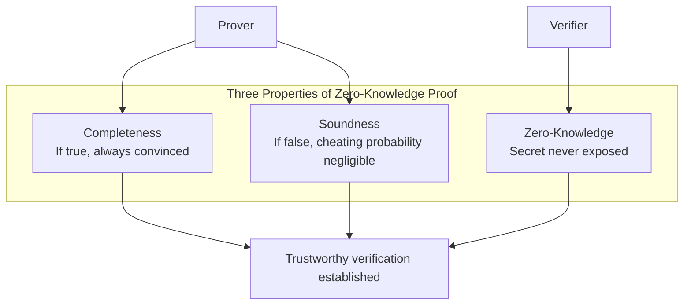
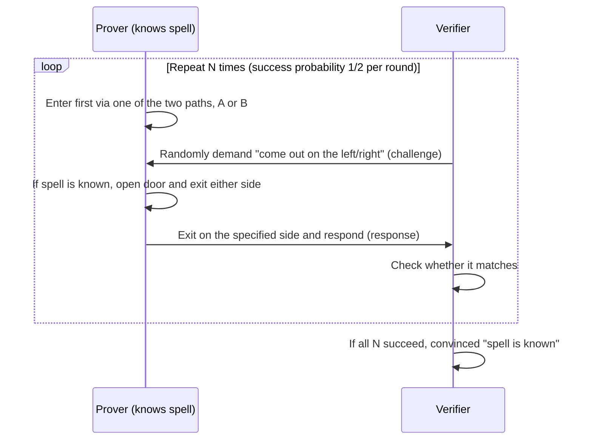

# Zero-Knowledge Proof (ZKP)

## 1. Overview

> A **Zero-Knowledge Proof** is a cryptographic protocol in which a prover **convinces a verifier that a statement (the fact of possessing secret knowledge) is true, without revealing any information about the secret itself**. It was first formalized in 1985 by Goldwasser, Micali, and Rackoff when they defined interactive proof systems.

Traditional authentication and verification followed a structure of "proving you know a secret by showing the secret." You had to send your password to the server to log in, and disclose your balance to prove your ability to pay. This approach, however, has the fundamental limitation that **the proof process itself becomes a channel for information leakage**. If the server is compromised, the transmitted and stored secrets are stolen as-is, and excessive personal information such as resident registration numbers and dates of birth must be handed over every time for identity verification. This directly conflicts with the principle of data minimization (Privacy by Design).

A zero-knowledge proof separates "**the fact of knowing**" from "**what is known**." That is, without revealing the secret (e.g., a password, age, balance, or identity), it mathematically convinces only of the fact that "I know the secret" or "the statement is true." If homomorphic encryption protects privacy through "computation on ciphertext" and multi-party computation (MPC) through "distributed secret sharing," ZKP complements them from the unique position of "**verifiable ignorance**." Its practical importance has grown sharply as it has recently emerged as core infrastructure for blockchain scalability (zk-Rollup) and self-sovereign identity (SSI, DID).

## 2. Conditions for Validity and Interaction Structure

For a zero-knowledge proof to hold, three properties must be satisfied simultaneously. These three conditions are designed to defend against different stakeholders (an honest verifier, an honest prover, a dishonest prover, and a dishonest verifier), so if even one is missing, the protocol is neutralized.

First, **Completeness** is the property that if the statement is actually true and both parties follow the protocol honestly, the verifier will always be convinced. Second, **Soundness** is the property that if the statement is false, the probability that a dishonest prover can convince the verifier, however hard they try to cheat, is negligible. Third, **Zero-Knowledge** is the property that the verifier can learn nothing about the secret during the proof other than the fact that "the statement is true"; this is proven by showing that the verifier could reproduce (simulate) all the messages it saw on its own, without the secret. The logic is that since the verifier gained no additional information, there is no leakage.

Classical ZKP has an **interactive** structure in which the verifier poses random questions (challenges) and the prover responds. If the verifier repeatedly poses unpredictable questions and the prover answers correctly each time, the probability of guessing correctly by chance halves with every round, converging to practically zero after dozens of rounds. This "repeated random challenge-response" is the core mechanism that statistically guarantees soundness.

## 3. Operating Principle — The Challenge-Response Protocol

The intuition behind zero-knowledge proofs is often explained with the **"Ali Baba Cave"** analogy. Deep inside a ring-shaped cave is a door that opens only with a secret spell, and the prover wants to show the verifier that they know the spell without saying the spell itself. The procedure below diagrams this challenge-response structure.

The key is that **an impostor who does not know the secret (spell) can pass only by luck**. Because the impostor can only come out the side they entered, they fail if the verifier specifies the opposite side. Since the success probability each round is 1/2, after 20 rounds the probability of an impostor passing drops to about one in a million, securing soundness. Conversely, the verifier observes only the fact that "the prover came out of the specified side" and learns nothing about the spell, preserving zero-knowledge. In real cryptographic implementations, this "cave" is replaced by **mathematically hard problems of one-way functions** such as discrete logarithms, elliptic curves, and hashes. For example, the Schnorr protocol proves "knowledge of the private key" over the discrete logarithm problem without exposing it.

Because the interactive approach requires the prover and verifier to communicate multiple times in real time, it is ill-suited to asynchronous, multi-party environments like blockchains. The solution is the **Fiat-Shamir Heuristic**, which removes interaction by replacing the verifier's random challenge with "the output of a hash function." The result is a **non-interactive proof** that anyone can verify at any time once the prover generates it, enabling offline and on-chain verification.

## 4. Type Comparison — zk-SNARK and zk-STARK

The representative technologies that made non-interactive ZKP practical are **zk-SNARK** and **zk-STARK**. Both share the goal of compressing the validity of large-scale computation into a short proof, but there are clear trade-offs in terms of whether a trusted setup is needed, proof size, and quantum resistance. These differences lead to a design judgment of "what to trust more and what to give up."

zk-SNARK (Succinct Non-interactive ARgument of Knowledge) has very small proofs of a few hundred bytes and fast verification, but requires a **Trusted Setup** process to create common parameters initially. If the secret value generated at this time (toxic waste) is not destroyed and is leaked, false proofs can be forged, so the risk is mitigated by having multiple participants perform this setup in a distributed manner (an MPC ceremony). zk-STARK (Scalable Transparent ARgument of Knowledge), on the other hand, is hash-based, so it needs no trusted setup (Transparent) and is quantum-resistant, withstanding quantum computer attacks, but its proofs are large at tens to hundreds of KB, making on-chain storage costly.

| Category | zk-SNARK | zk-STARK |
|------|----------|----------|
| Trusted setup | Required (Trusted Setup) | Not required (Transparent) |
| Proof size | Very small (~hundreds of B) | Large (~tens of KB) |
| Verification speed | Very fast | Relatively slow |
| Quantum resistance | Vulnerable (elliptic-curve based) | Strong (hash-based) |
| Representative uses | Zcash, zkSync | StarkNet |

The practical choice depends on the situation. Services that frequently post proofs to a blockchain, where gas fees (storage costs) matter, benefit from SNARK's small proofs, while services seeking to fundamentally eliminate trusted-setup risk and prepare for long-term quantum threats are better suited to STARK. Recently, universal setup techniques (such as PLONK) that do not repeat the trusted setup for every program have emerged, lowering SNARK's operational burden.

## 5. Use Cases and Industry Application

The area where the industrial impact of zero-knowledge proofs is most pronounced is **blockchain scalability**. Ethereum's **zk-Rollup** processes thousands of transactions off-chain and then compresses the fact that "all these transactions were executed according to the rules" into a single zero-knowledge proof submitted to the main chain. Because the main chain only needs to verify the proof rather than re-execute individual transactions, throughput (TPS) improves by dozens of times and fees drop significantly. Unlike Optimistic Rollup, which relies on "re-verification in case of disputes," zk-Rollup has the practical advantage of being **finalized immediately by mathematical proof**, with no withdrawal delay.

The second axis is **privacy-preserving identity proof**. In self-sovereign identity (SSI) and decentralized identity (DID) systems, ZKP implements "Selective Disclosure." For example, when buying alcohol, instead of showing an entire ID card (date of birth, address, resident registration number), one can prove only that the statement "I am 19 or older" is true (Range Proof). Since the actual age and date of birth are not exposed at all, it technically enforces the principles of data minimization and purpose limitation. In anti-money laundering (AML) in the financial sector, applications are also spreading that prove "not on the sanctions list" without exposing customer identity.

The third is **anonymous cryptocurrency**: Zcash uses zk-SNARK to hide the sender, recipient, and amount while proving only that "there is no double spending and the balance is sufficient," thereby validating the transaction. Beyond this, its scope is widening as a means of guaranteeing integrity in untrusted environments, such as using Verifiable Computation to verify that computation outsourced to the cloud was performed honestly.

## 6. Considerations and Implications

From a Professional Engineer's perspective, adopting zero-knowledge proofs requires comprehensive consideration of the following.

First, **quantitative evaluation of performance-cost trade-offs** is needed. In exchange for privacy and verifiability, ZKP consumes considerable computing resources and time to generate proofs. In particular, SNARK/STARK proof generation is hundreds to thousands of times heavier than verification, so for services where real-time performance matters, hardware acceleration (GPUs, dedicated ASICs) or proof delegation (proving service) architectures should be considered in parallel. Reflecting the asymmetric structure of "verification is cheap, proving is expensive" early in design is key.

Second, **managing trusted setup and securing Crypto-Agility** are required. In the SNARK family, management of trusted-setup toxic waste can become a single point of failure, so the risk should be distributed via multi-party ceremonies, and for elliptic-curve-based schemes, the architecture should remain open to transitioning to STARK or PQC in preparation for the quantum computing era. Designing an abstraction layer that is not tied to a specific curve or library determines long-term stability.

Third, **alignment with privacy regulations** should be actively leveraged. ZKP's selective disclosure is a powerful means of technically implementing the minimum-collection and purpose-limitation principles of the Personal Information Protection Act and GDPR's Data Minimization. However, anonymity and unlinkability must also be designed so that the proof itself does not become a link for re-identifying individuals, and a balance between audit traceability for regulators and privacy must be secured.

Fourth, **tracking standardization trends and securing interoperability** are important. An interoperability foundation not tied to any specific vendor should be established through the ZKProof standardization initiative and linkage with W3C's Verifiable Credentials (VC) and DID standards, and soundness compromise due to implementation defects should be prevented through correctness audits and formal verification of verification circuits.

Fifth, **judging application priorities** is necessary. ZKP is not a panacea and may be over-engineering for simple access control. A reasonable hybrid strategy is to apply it selectively to situations where "trust between verifier and prover is absent and only facts must be confirmed without exposing secrets" (on-chain scaling, privacy-preserving identity, anonymous voting, etc.), and otherwise combine it with existing authentication and cryptographic technologies.

## References

- Goldwasser, Micali, Rackoff, "The Knowledge Complexity of Interactive Proof-Systems", 1985/1989
- Ethereum Foundation, "Zero-Knowledge Rollups", https://ethereum.org/en/developers/docs/scaling/zk-rollups/
- ZKProof Standards, https://zkproof.org/
- StarkWare, "STARK vs SNARK", https://starkware.co/stark/

---

> **In one line**: A zero-knowledge proof is a cryptographic protocol that mathematically convinces only of the fact that "I know the secret / the statement is true" without revealing the secret; satisfying completeness, soundness, and zero-knowledge, and made practical through zk-SNARK and zk-STARK, it is establishing itself as core infrastructure for blockchain scaling (zk-Rollup) and privacy-preserving identity proof (selective disclosure).
