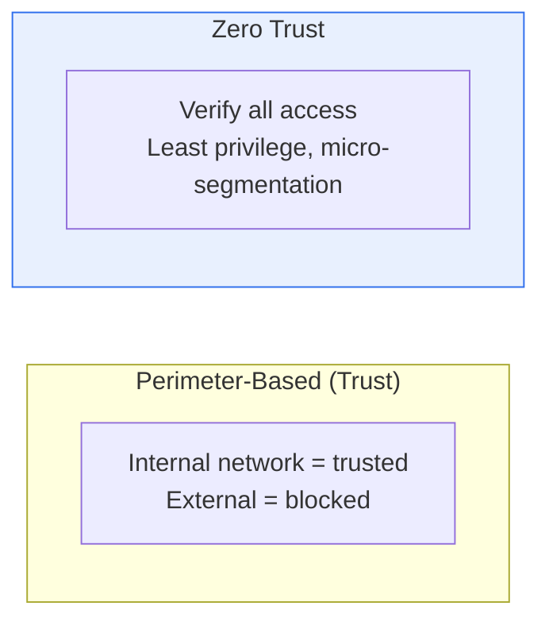
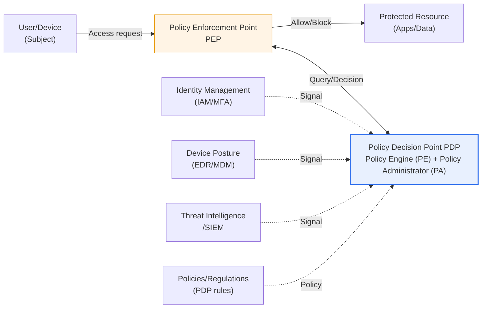

# Zero Trust Security Model

## 1. Overview

### A. Definition

> A security model that, under the principle of "**Never Trust, Always Verify**," authenticates and authorizes every access request every time, regardless of whether it originates inside or outside. The name comes from setting the default trust value to "zero," and trust derives not from "location" but only from "verified identity and context."

Zero Trust is not the name of a specific product or solution but a **paradigm and security philosophy** for designing access control. In 2010, John Kindervag of Forrester established the concept from the awareness that "Trust is a vulnerability," and it was later proven in a large-scale enterprise environment through Google's internal implementation, the **BeyondCorp** project. In other words, Zero Trust is not an academic ideal but a battle-tested model that global enterprises have already operated in verifiable form by removing VPN perimeter defenses from their own networks.

### B. Background — The Collapse of Perimeter-Based Security

The background to the emergence of Zero Trust is the **collapse of traditional perimeter-based security**. In the past, security drew a boundary with firewalls like a castle wall and assumed that "**the internal network is safe**." Once through the castle gate (the firewall), one could move freely inside. This model is often likened to an "M&M chocolate": hard on the outside (perimeter) but soft on the inside (internal network), meaning that once the shell cracks, the entire interior is exposed.

However, three structural changes undermined this premise. First, with the **shift to cloud and SaaS**, the resources to be protected are no longer only inside the corporate data center. Second, with the spread of **remote work, mobile, and BYOD**, users and devices are scattered anywhere outside the perimeter, so the very line physically separating "inside/outside" has disappeared. Third, as **partner, supply chain, and insider threats** increased, the assumption that "whatever is inside is benign" was broken statistically as well. In fact, many major breaches escalated damage through **Lateral Movement**, in which an attacker who has infiltrated once moves freely within.

Zero Trust discards this premise that "the inside is safe." Whether inside or outside, every access is verified each time. Instead of removing the castle walls, it is like placing an identity check desk in front of every door.

### C. Necessity

In an environment where resources and users are scattered everywhere, "where you are (location)" can no longer be the basis of trust. The criterion of trust must shift **from Network Location to Identity and Context**, and Zero Trust implements this shift. The United States mandated a Zero Trust transition for federal agencies through the 2021 presidential Executive Order (EO 14028) and the 2022 OMB M-22-09 memorandum, and in Korea, the Ministry of Science and ICT and KISA have been driving public and private adoption by publishing the **"Zero Trust Guideline 1.0 (2023) and 2.0 (2024)"**. This shows that Zero Trust has become not an option but a regulatory and policy-level trend.

## 2. Comparison with the Perimeter-Based (Trust) Model

The decisive difference between the two models is the **Blast Radius** when a breach occurs. The perimeter-based model verifies only once, when the perimeter is first crossed, so once the interior is breached, the attacker moves laterally unhindered and damage grows uncontrollably. This is because firewalls and VPNs follow a "once through, you're done" structure. Zero Trust, by contrast, verifies every time for each resource and isolates finely, so even if one point is breached, damage is confined to that point.

This difference matters in practice because the essence of today's attacks has shifted from "breaching the perimeter" to "legitimate login with stolen credentials." An attacker who has stolen an account through phishing does not need to break through the firewall but logs into the VPN normally, and in the perimeter model is indistinguishable from an insider from that moment on. Because Zero Trust continuously verifies "is this request really legitimate?" even after login, stolen credentials alone are not enough to reach resources.

| Category | Perimeter-Based (Trust) | Zero Trust |
|---|---|---|
| **Premise** | Inside is trusted | Trust no one |
| **Verification timing** | Once at first (crossing the perimeter) | Continuous, every request |
| **Basis of trust** | Network location (IP) | Identity, device, context |
| **Defense focus** | Perimeter (firewall, VPN) | Resources, identity |
| **Access method** | Resource access after network connection | Per-session authorization per resource |
| **On breach** | Spreads via lateral movement | Blast radius minimized |

## 3. Core Principles

Zero Trust is commonly implemented through four principles. Each principle does not exist independently; they are mutually complementary mechanisms for actually implementing the "verification timing" and "extent of damage" seen in the table above.

**A. Verify Explicitly.** Authenticate and authorize every request by combining all available signals—user, device, location, time, and behavior patterns. Rather than letting someone through simply because the ID/PW matched once, the context of "is this user accessing from an unusual region, time, or device?" is evaluated together. This is the foundation of Adaptive Authentication.

**B. Least Privilege.** Grant only the minimum access absolutely necessary for the job, and only for the time needed. The concepts of JIT (Just-In-Time) and JEA (Just-Enough-Access) apply here. If privileges are not always left open but are issued minimally at the time of request, the privileges an attacker can get hold of are small even if credentials are stolen.

**C. Assume Breach.** Design defenses on the premise that you have already been breached. From the perspective that "a breach will inevitably happen someday," minimize the blast radius and focus on quickly detecting and isolating breaches through end-to-end encryption, continuous monitoring, and log analysis. This is a shift in attitude that treats defense failure not as an "exception" but as a "constant."

**D. Micro-segmentation.** Divide networks and resources finely so that a breach in one zone cannot spread to another. Going beyond the broad VLAN-level partitioning of the past, policies are refined down to the workload, application, and process level, blocking lateral movement paths themselves.

| Principle | Key content | Implementation technologies (e.g.) |
|---|---|---|
| **Verify explicitly** | Authenticate and authorize user, device, context every time | MFA, adaptive authentication, device trust assessment |
| **Least privilege** | Only minimum necessary access (JIT/JEA) | RBAC/ABAC, PAM, JIT privilege issuance |
| **Assume breach** | Assume already breached, minimize blast radius | End-to-end encryption, UEBA, SIEM/SOAR |
| **Micro-segmentation** | Block lateral movement through resource segmentation | SDP, workload firewalls, service mesh |

These four principles interlock like a chain. Explicit verification narrows "the door you come in through," least privilege narrows "what you can touch once inside," micro-segmentation cuts "the paths for spreading sideways," and assume breach makes "observation and response when breached anyway" routine. Adopting only one makes it half-baked. For example, if only MFA (explicit verification) is applied while privilege design (least privilege) is neglected, a single stolen legitimate account can still reach a wide range of resources. This is why Zero Trust is called a "strategy" rather than a "product."

## 4. Architecture and Components (Based on NIST SP 800-207)

Zero Trust is not a single product but a combination of multiple technologies, and its logical structure is conventionally explained with the reference architecture established by the U.S. National Institute of Standards and Technology in **NIST SP 800-207**. The heart of this architecture is the separation of the **Policy Decision Point (PDP), composed of the Policy Engine (PE) and Policy Administrator (PA)**, from the **Policy Enforcement Point (PEP)**, which allows or blocks access at the actual traffic chokepoint.

The operational flow is as follows. When a subject (user/device) tries to access a resource, the request must pass through the **PEP**. The PEP does not decide on its own but queries the **PDP**: "May this subject access this resource right now?" The PDP's policy engine **comprehensively evaluates (calculates a trust score from)** identity signals from IAM/MFA, device posture (patch and infection status) from EDR/MDM, risk signals from SIEM and threat intelligence, and administrator-defined policy rules to decide whether to allow, block, or require additional authentication. The key point is that this decision continues throughout the session. If the device becomes infected with malware midway or the user's risk score rises, even an in-progress session can be re-evaluated and blocked.

To summarize the main components: **identity (IAM, MFA, SSO)** forms the axis of verification, **PDP/PEP** decide and enforce policy, **micro-segmentation and SDP** isolate the network, and **UEBA and SIEM/SOAR** continuously monitor and automatically respond to anomalous behavior. Combined with **DLP and encryption**, which protect the data itself, and **EDR and MDM**, which protect endpoints, they form the overall control plane.

## 5. Implementation Approaches and Application Areas

Approaches to actually implementing Zero Trust fall broadly into three axes. The **identity-centric (SIM-based)** approach centers on strong IAM, MFA, and conditional access, and is the most widely used in cloud and SaaS environments. The **network-centric (SDP, micro-segmentation)** approach uses a software-defined perimeter to hide resources so they are "invisible (Dark)" to users, then dynamically opens connections only to authenticated subjects. **SASE (Secure Access Service Edge)** is an evolved form that integrates the two at the cloud edge, combining SD-WAN (network) and SSE (security: SWG, CASB, ZTNA, FWaaS) into a single service.

Application areas are broad. In **remote work and work-from-home** environments, VPN is replaced with ZTNA (Zero Trust Network Access) to provide resource-level access; in **multi-cloud**, communication among scattered workloads is controlled at the segment level; and for **partner and supply chain** access, the least-privilege principle is applied to contain risk. In the public sector, a phased transition is underway according to the domestic and international guidelines mentioned above.

A representative proof case is Google's **BeyondCorp**. Starting around 2011 and over several years, Google shifted to allowing access to internal applications based not on whether one was on the corporate network (VPN) but on "verified user + managed device + access policy." As a result, all employees came to access internal resources from anywhere on the internet through the same verification without a separate VPN, marking a turning point that showed the premise "being on the corporate network equals trust" could be removed in a real, large-scale organization. Subsequently, many companies such as Netflix (LISA), Microsoft, and Cloudflare published similar identity-based access architectures, and Zero Trust became established as a practical standard.

Comparing VPN and ZTNA, the difference is clear. Because a VPN places the user on the corporate "network" once authentication succeeds, at that moment the user gains a wide passage to the many resources connected to the network. ZTNA, by contrast, opens sessions not to the network but per "specific application," and makes other unauthorized resources completely invisible to the user (their existence is not even exposed). This "minimization of connection targets" is the practical mechanism by which Zero Trust fundamentally blocks lateral movement.

| Category | Traditional VPN | ZTNA (Zero Trust) |
|---|---|---|
| **Access unit** | Network (subnet) | Application/resource |
| **Verification** | Once at connection | Continuous and conditional throughout the session |
| **Unauthorized resources** | Discoverable on the network | Hidden (not exposed) |
| **Lateral movement** | Relatively easy | Structurally blocked |

## 6. Advanced — Maturity Model and Adoption Strategy

The most common failure in Zero Trust is the misconception that "you just buy one Zero Trust solution and turn it on." In reality, it is a journey implemented gradually over a long period according to a **Maturity Model**. In its **Zero Trust Maturity Model (ZTMM)**, the U.S. CISA presents five pillars—**identity, devices, networks, applications, and data**—and has maturity diagnosed by dividing each pillar into Traditional → Initial → Advanced → Optimal stages. Running through the five pillars are the cross-cutting capabilities of visibility and analytics, automation and orchestration, and governance.

The crux of a practical adoption strategy is to **"define the Protect Surface first."** As Kindervag emphasized, rather than trying to defend the entire vast Attack Surface, identify the organization's most important data, assets, applications, and services (DAAS), narrow micro-perimeters around them, and apply first there. Then map transaction flows, describe policies in fine detail using the Kipling method of "Who/What/When/Where/Why/How," and iteratively improve policies through continuous monitoring. This phased approach is also a realistic solution for making the transition while managing practical constraints such as coexistence with existing legacy (on-premises systems, old protocols), concerns about degraded user experience, and MFA fatigue attacks.

Recently, too, **Identity Threat Detection and Response (ITDR)**, Continuous Access Evaluation, and AI-based anomalous behavior analysis have been combined, advancing Zero Trust's "continuous verification" toward real time and automation. Conversely, as AI agents and machine identities (non-human accounts) surge, extending least privilege and verification not only to people but also to workloads and service accounts is emerging as a new challenge.

In a Professional Engineer exam answer, it is effective to position Zero Trust not as "a replacement for perimeter security" but as "a higher-level strategy that compensates for the limitations of perimeter security." The perspective is not to discard existing controls such as firewalls and IPS, but to layer a dynamic, identity- and context-based verification layer on top of them to complete Defense in Depth. Likely exam directions frequently combine ① describing concepts and principles versus the perimeter-based model, ② diagramming the NIST SP 800-207 architecture (PDP/PEP), ③ the relationship with SASE and ZTNA, and ④ a phased adoption strategy based on the maturity model, so weaving these four axes organically into the answer is a high-scoring strategy.

## 7. Considerations and Implications (Professional Engineer's Perspective)

1. **Identity is the new perimeter.** Because "who, with which device" rather than location becomes the criterion of trust, strong IAM, MFA, and SSO along with privilege management (PAM) are the de facto core axis of Zero Trust. If IAM is weak, Zero Trust cannot be established no matter how well the other components are in place.

2. **Phased, maturity-based adoption is realistic.** Big-bang transitions almost always fail. A roadmap is needed that applies first to core assets (Protect Surface), diagnoses maturity using CISA ZTMM and NIST SP 800-207 as references, and expands gradually. This is also a strategy for managing budget, organizational resistance, and coexistence with legacy.

3. **The trade-off between user experience (UX) and security must be designed.** If per-request verification leads to frequent re-authentication, it invites productivity loss and MFA fatigue attacks. The key to success is the balance of verifying "smoothly normally, strongly only when risky" through risk-based and adaptive authentication.

4. **It evolves in combination with SASE, SDP, and ZTNA.** In the direction of defining network access in software and integrating security at the cloud edge, Zero Trust is converging not into individual controls but into an integrated security architecture. VPN replacement (ZTNA) is its most practical entry point.

5. **It cannot be established without visibility and governance.** "Continuous verification" presupposes "continuous observation." Only when backed by SIEM/SOAR that collect and analyze logs and telemetry, and by a governance framework that manages and audits policies consistently, is the basis for trust decisions secured. Without data, there is no verification.

## References

- NIST SP 800-207, *Zero Trust Architecture* — https://csrc.nist.gov/pubs/sp/800/207/final
- CISA, *Zero Trust Maturity Model v2.0* — https://www.cisa.gov/zero-trust-maturity-model
- KISA/Ministry of Science and ICT, *Zero Trust Guideline* — https://www.kisa.or.kr

---

> **In one line**: Zero Trust is a security paradigm that *discards perimeter-based trust and continuously verifies all access based on identity and context*; built on the principles of explicit verification, least privilege, assume breach, and micro-segmentation and on the PDP/PEP architecture (NIST SP 800-207), it blocks lateral movement, is adopted in phases starting with core assets according to the maturity model (CISA ZTMM), and evolves into SASE and ZTNA.
