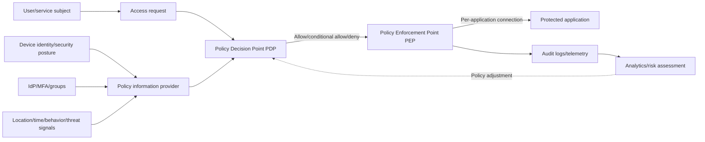
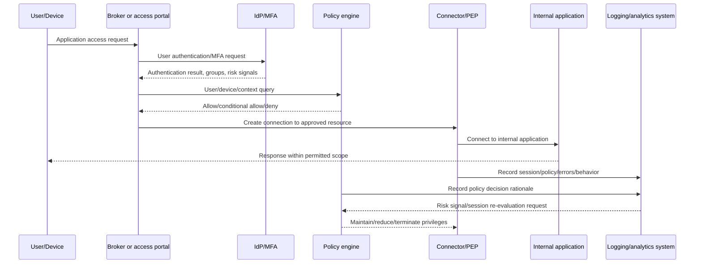

# ZTNA (Zero Trust Network Access)

## 1. Overview

> **ZTNA (Zero Trust Network Access)** is an access control architecture that does not trust a user's network location or whether they are connected to the corporate network, but instead verifies the user, device, application, and request context every time and then connects them with least privilege only to the applications they need.

Traditional remote access placed users into a specific segment of the corporate network via VPN and then let them find the servers they needed from within.

This model was easy to operate in an era when the data center and headquarters network were the center of information systems.

However, as SaaS, multi-cloud, remote work, and partner access spread, the assets to be protected no longer existed only inside the network.

Another important limitation is that if an attacker enters the VPN with a stolen account, they can explore internal resources or attempt lateral movement simply because the connection is authenticated.

NIST SP 800-207 presents the Zero Trust principle that implicit trust should not be granted to users or assets based on network location alone, and that subjects and devices must be authenticated and authorized before accessing resources ([NIST SP 800-207](https://csrc.nist.gov/pubs/sp/800/207/final)).

ZTNA is the representative means of making this principle concrete for remote access and application access paths.

However, ZTNA should not be understood merely as a new name for VPN products.

VPNs tend to establish a network connection first and control access on top of it, whereas ZTNA first defines the applications to be protected and creates connections on a per-request basis.

Therefore, the goal of ZTNA is not to eliminate the network entirely, but to demote the network from a basis of trust to a means of transport and to shift security decisions toward applications, data, and identity.

## 2. ZTNA Principles and Conceptual Structure

The core of ZTNA is not a single authentication that only checks "who you are," but a judgment that combines "which subject, in what state, wants to perform what action on which resource."

Even if user authentication passes, access can be restricted or additional authentication required when an unmanaged device, an abnormal location, risky behavior, and an after-hours request are combined.

Conversely, when the same user requests an approved application from an approved device in a normal business context, access can be allowed within the necessary scope.

The following conceptual diagram shows the overall flow in which an access request passes through policy decision and enforcement points.

### A. Identity and Subject Verification

In ZTNA, a subject does not mean only a human user.

Every actor that requests access to a resource—people, service accounts, batch jobs, IoT devices, and so on—is considered a subject.

User identity is verified through the enterprise IdP, directory, SSO, and MFA, while service identity is verified with workload certificates or service account tokens.

Authentication and authorization must be separated.

Authentication is the procedure of confirming "who you are," and authorization is the procedure of deciding "what you can do" by policy.

For example, just because an HR user is authenticated does not mean they have administrator privileges on every HR database.

Read, modify, and export privileges must be granted separately by combining job function, project, data classification, and approval status.

MFA lowers the risk of account takeover but does not complete ZTNA on its own.

Even a session that has passed MFA requires additional verification if the device is infected with malware or the user's behavior differs from usual.

ZTNA therefore treats the IdP's authentication result as one of several inputs to the policy engine.

### B. Device Posture and Context Evaluation

Device verification goes beyond checking the type of operating system or browser; it is the process of determining whether the device is managed by the organization and meets security baselines.

For example, disk encryption, security patch level, whether EDR is running, screen lock policy, jailbreak/root status, and possession of a certificate can be used as signals.

Device posture is not a permanent attribute but an observation that changes over time.

Even a laptop judged healthy yesterday should not retain the same privileges today if its EDR has stopped or a risky process has been detected.

For this reason, policies are designed to be re-evaluated periodically or when risk signals occur, rather than static rules that "once allowed, remain unconditionally until the session ends."

Beyond the user and device, context can include location, access time, network type, requested application, classification of the target data, previous behavior, and threat intelligence.

However, collecting more signals does not automatically improve decision quality.

Low-accuracy location information or excessive behavioral analysis can increase false positives and privacy violations, so business purpose and the principle of minimum collection must be applied together.

### C. Least Privilege and Per-Application Connections

ZTNA does not connect users to "the entire corporate network," but limits connections to the name, address, port, and scope of actions of approved applications.

Users select the order management system from a portal, or access permitted web applications through a browser-based proxy.

From a network perspective, applications are not exposed directly to users; a connector or broker relays connections on both sides.

This structure does not expose internal IP addresses or unnecessary service lists to users, reducing the scope of attacker reconnaissance.

Least privilege does not end with merely shortening the application list.

Even within the same application, viewing, registration, approval, and download can be separated, and re-authentication or administrator approval can be attached to high-risk actions.

For example, a customer information screen can allow viewing while blocking bulk downloads, or only approvers can be allowed to call the payment approval API.

Setting least privilege too narrowly causes business interruptions and workaround access, so privileges should be refined by analyzing actual business workflows.

## 3. Components and Operating Procedure

A ZTNA implementation is not a single appliance but a logical structure combining identity, policy, connection brokering, resource protection, and observation systems.

The following detailed flow shows everything from the moment a user accesses an application through session termination and auditing.

### A. Policy Decision Point and Policy Enforcement Point

The Policy Decision Point (PDP) is the logical role that computes whether to allow access.

The Policy Enforcement Point (PEP) is the role that enforces the PDP's decision on the actual communication path.

In NIST's abstract model, the Policy Engine (PE) and Policy Administrator (PA) make up the policy decision function, and the PEP controls the connection between the requesting subject and the resource ([NIST Zero Trust Architecture](https://csrc.nist.gov/pubs/sp/800/207/final)).

Depending on the product, the PDP, PE, and PA may appear as a single cloud service or be distributed across brokers, gateways, and agents.

What matters is not the name but a structure in which decision and enforcement are separated so that policy cannot be bypassed.

If the PDP returns "allow" but actual traffic can reach the internal server directly via another path, ZTNA's controls are neutralized.

The PEP can be implemented as an agent on the user's device, a reverse proxy, an application gateway, a service mesh proxy, firewall policies, and so on.

Enforcement points should be close to the protected resources, and high availability and a default deny or limited allow (fail safe) policy in case of failure must be clearly defined.

### B. Integration with IdP, MFA, and Device Management

The IdP provides user authentication and group/role information, but it should not become the single source of truth for ZTNA policy.

The device management system provides device identifiers and compliance status, EDR provides threat detection status, and SIEM and threat intelligence provide risk signals.

The policy engine collects this information to evaluate the risk of a request.

For example, the condition "a finance user who passed MFA and connected during business hours from a company-managed encrypted laptop" can allow read access.

On the other hand, if "the same user, but with EDR stopped, attempted a bulk download from an abnormal overseas location," the session can be blocked or switched to administrator approval.

Time lags and identifier mismatches among integrated systems occur frequently in actual operations.

If user ID, employee number, email, and device ID differ across systems, policies can be applied to the wrong subject, so identifier normalization and monitoring for synchronization failures are needed.

### C. Broker, Connector, and Application Protection

The ZTNA broker handles authentication, policy, and session relay between the user and the protected application.

Connectors are deployed on the internal network and can create outbound connections to approved applications without opening inbound ports to the outside.

This approach reduces the risk of exposing internal applications directly to the internet and simplifies firewall policy.

Web applications can be protected with a reverse proxy approach, while non-web protocols such as SSH, RDP, and databases may require dedicated connectors or agent-based approaches.

The agent-based approach allows fine-grained device identification and network control, but is hard to install on unmanaged devices or partner equipment.

The agentless approach makes access easy with just a browser, but control of functions such as file transfer, clipboard, and local printers may be limited.

Approaches are therefore combined according to the application's protocol, user type, and data sensitivity.

If a connector can excessively access every internal network, ZTNA can become a new pathway for lateral movement.

The target resources, execution privileges, network segments, and update paths of each connector should be minimized, and the connector itself must be monitored as an asset.

## 4. Application Types and Comparison

### A. Application Types

First, a type that places an application proxy between remote users and internal web applications.

The proxy receives browser requests, checks authentication and policy, and forwards only approved requests to the backend.

Second, a type that uses device agents and a cloud broker to connect even non-web protocols.

To users it appears as though they are connecting to applications via a virtual network address, but the agent passes through only approved hosts and ports.

Third, a type that applies workload identity to server-to-server and service-to-service access.

When a microservice calls another service's API, the service certificate, namespace, deployment information, and request scope are used as policy inputs.

Fourth, a type that provides temporary access to partners, outsourced staff, and unmanaged devices.

In this case, account validity period, access time, screen recording, file movement, approver, and automatic revocation at contract termination must be included in the policy.

### B. Comparison of VPN, ZTNA, and SASE

| Category | Traditional VPN | ZTNA | ZTNA from a SASE perspective |
|---|---|---|---|
| Basic target | Network segment | Applications/resources | Applications/services at the cloud edge |
| Basis of trust | Network location after authentication | Identity, device, context, resource policy | Identity/context and integrated security policy |
| Connection scope | Relatively broad network | Permitted resources/sessions | Optimal path combined with security functions at the edge |
| Lateral movement | Relatively high exposure potential | Reduced to per-application scope | Controlled together with SSE, DLP, SWG |
| Operational focus | Tunnels, addresses, firewalls | Policy, identity, device posture | Integration of network and security services |
| Main limitations | Internal trust and scalability issues | Policy/integration complexity, legacy compatibility | Cloud dependence, vendor lock-in, data sovereignty |

The difference between VPN and ZTNA is not determined solely by whether tunnels are encrypted.

Modern VPNs can also support MFA and segmentation policies, so asserting that "VPNs are always insecure" is inaccurate.

The key difference lies in whether the user is placed onto the network or only specific sessions to protected resources are relayed.

ZTNA's security is not complete merely by hiding network addresses; it becomes effective only when authentication, authorization, device compliance, logging, and policy operations mature together.

SASE is a service architecture that combines ZTNA with SWG, CASB, FWaaS, DLP, SD-WAN, and more.

Thus ZTNA can be adopted as one function of SASE, or first adopted as an independent application access system for the in-house data center.

### C. Choosing Between RBAC and ABAC

Role-Based Access Control (RBAC) maps job functions or organizational roles to privileges, making it easy to understand and simple to manage.

However, the number of roles can grow excessively when trying to express changing attributes such as remote work, project-based organizations, partners, and device risk.

Attribute-Based Access Control (ABAC) expresses fine-grained conditions by combining user, resource, and environment attributes.

For example, `user department=Finance`, `device compliance=healthy`, `data classification=internal`, `location=permitted country`, and `action=read` can be evaluated simultaneously.

ABAC is fine-grained but depends on attribute quality and the explainability of policies.

Organizations can consider a hybrid approach that manages basic business roles with RBAC and supplements dynamic conditions such as device posture, time, risk level, and data classification with ABAC.

If policies are not version-controlled and tested like code, conflicts and exceptions accumulate as conditions increase.

## 5. Adoption Procedure and Hypothetical Case

### A. Step-by-Step Adoption Procedure

Step 1 is identifying protected assets and business workflows.

Inventory the application list, owning department, data classification, accessing users, protocols, and dependent services.

Step 2 is putting the identity and device foundation in order.

Eliminate shared accounts, link identifiers across IdP, MFA, device management, and EDR, and classify unmanaged assets.

Step 3 is applying policies in observation mode to low-risk applications.

In observation mode, actual access patterns and unexpected dependencies are collected to refine the allow list.

Step 4 is transitioning, starting with workloads that have heavy VPN usage and clear application boundaries.

For example, targets that are easy to verify per application, such as the intranet, development dashboards, and partner portals, are suitable.

Step 5 is applying enhanced policies to high-risk data and administrative access.

For administrator shells, production databases, and bulk downloads, consider separate approval, short sessions, command control, and session recording.

Step 6 is continuous measurement and policy improvement.

Compare access success rate, authentication failure rate, blocked risky sessions, number of policy exceptions, application outages, and mean time to revoke privileges against baselines.

### B. Hypothetical Case: Partner Remote Access at a Manufacturing Company

Hypothetical manufacturing company A had been issuing VPN accounts to partner employees and opening multiple ports on its production management servers.

There were problems in that accounts whose contracts had ended were not revoked immediately, and the security posture of partner devices was difficult to check.

Company A first defined the production management web portal as a protected asset and registered partner, work site, and work period as account attributes.

It applied a policy under which partner employees perform MFA at the IdP and can access the portal only from approved browsers.

When the work period ends, the account is automatically deactivated, and administrator screens outside the scope of work are not visible without separate approval.

Non-web equipment diagnostic access was restricted to specific hosts and ports through a dedicated connector.

The policy allows access only when `contract status=valid`, `worker role=diagnostics`, `device risk=acceptable`, and `access time=approved shift` are all satisfied.

Bulk file downloads and abnormal command execution are blocked, and worker, device, resource, and approver information is recorded for every session.

The key achievement of this case is not the fact that VPN equipment was replaced, but that resource-level least privilege, time limits, and audit evidence were applied even to partners, subjects outside the network.

## 6. Advanced — Cloud-Native ZTNA and Maturity

In cloud-native environments, not only users but also services and workloads call each other's APIs.

NIST SP 800-207A describes a model for cloud-native applications across multi-cloud and multiple locations that applies network-tier and identity-tier policies together and leverages API gateways, sidecar proxies, and service identity infrastructure ([NIST SP 800-207A](https://csrc.nist.gov/pubs/sp/800/207/a/final)).

From this perspective, ZTNA expands beyond a VPN replacement for remote users into a policy framework that integrates user-to-app, service-to-service, and operator-to-management-plane access.

A service mesh's mTLS can provide encryption of service-to-service communication and workload authentication, but it does not automatically resolve business privileges or data action policies.

Therefore, connection permission at the network layer, API privileges at the application layer, and view/export controls at the data layer must be separated and linked.

The CISA Zero Trust Maturity Model 2.0 presents five pillars—Identity, Devices, Networks, Applications and Workloads, and Data—and the cross-cutting capabilities of Visibility and Analytics, Automation and Orchestration, and Governance ([CISA Zero Trust Maturity Model](https://www.cisa.gov/zero-trust-maturity-model)).

Rather than bringing every item to the optimal level at once, organizations should start with asset identification and securing visibility, and gradually mature toward automation, dynamic policies, and governance.

Current implementations can combine agentless access, browser isolation, continuous risk assessment, service identity, and security analytics automation.

However, a large number of product features does not mean high maturity.

It must be verified that policies are actually enforced in front of resources, that exceptions are tracked, that signal errors do not paralyze business, and that recovery is safe during outages.

## 7. Considerations and Implications

- **Prioritizing the protect surface**: Rather than wrapping all resources in ZTNA at once, identify first the protect surfaces with the greatest breach impact, such as personal information, intellectual property, the management plane, and core business APIs.

- **Policy quality and explainability**: Operators must be able to explain why access was denied and on what grounds it was allowed. Manage policy conflicts, exceptions, expiration dates, and approvers with versioning and audit logs.

- **Availability and failure response**: The IdP, broker, connectors, DNS, and certificates can all become dependencies of the access path. Test redundancy, the permitted scope of caching, emergency accounts, and limited recovery procedures during outages in advance.

- **Legacy compatibility**: Old clients, equipment requiring fixed IPs, and non-standard protocols are hard to protect with an application proxy alone. Run segment security and dedicated connectors in parallel as a transitional measure, and establish a long-term modernization plan.

- **Devices and non-human subjects**: If only user MFA is strengthened while service accounts, API keys, and automation tokens are neglected, bypass paths remain. Manage the issuance, rotation, and revocation of non-human identities together with their call scope.

- **Privacy and monitoring**: Collecting location, behavior, and device posture is useful for security, but excessive surveillance can create legal and organizational resistance. Review collection purpose, retention period, access rights, masking, and notice and consent requirements.

- **Measuring outcomes**: Rather than the number of units deployed, evaluate together the ratio of protected applications, the rate of unmanaged devices blocked, reduction of excessive privileges, time to re-evaluate session risk, extent of lateral movement in incidents, and business delays.

- **Organization and operations**: If the network team manages only tunnels and the security team manages only policies, accountability gaps arise. Define a RACI for policy changes and incident response involving application owners, IAM, endpoint, network, and the SOC.

- **Vendor lock-in and data sovereignty**: Confirm in contracts and technical validation the cloud broker's region, log storage location, alternative paths in case of service outage, support for standard protocols, and the ability to export policies.

From a Professional Engineer's perspective, ZTNA is not a matter of product adoption but "an operating model that shifts trust from network location to resources, identity, context, and evidence."

Therefore, architectural design should not emphasize security alone but jointly optimize business continuity, user experience, regulatory compliance, operational automation, and total cost of ownership.

## References

- [NIST SP 800-207, Zero Trust Architecture](https://csrc.nist.gov/pubs/sp/800/207/final)
- [NIST SP 800-207A, A Zero Trust Architecture Model for Access Control in Cloud-Native Applications](https://csrc.nist.gov/pubs/sp/800/207/a/final)
- [CISA Zero Trust Maturity Model](https://www.cisa.gov/zero-trust-maturity-model)
- [CISA Zero Trust Maturity Model Version 2.0 PDF](https://www.cisa.gov/sites/default/files/2023-04/CISA_Zero_Trust_Maturity_Model_Version_2_508c.pdf)

---

> **In one line**: ZTNA is an access architecture that, instead of trusting network location and opening up the internal network, verifies the user, device, context, and resource on every request to enforce per-application least privilege; to succeed, identity, policy, connectors, observability, and governance must mature together.
