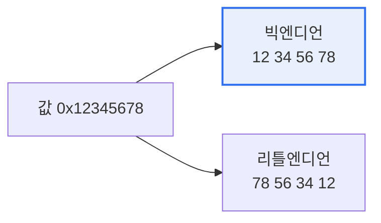

# 빅 엔디언(Big Endian)과 리틀 엔디언(Little Endian)

## 1. 개요

### 가. 정의
> **엔디언(Endianness)** 은 여러 바이트로 이뤄진 데이터를 메모리에 저장할 때 **바이트를 배열하는 순서**를 말한다. **빅 엔디언**은 최상위 바이트(MSB)를 낮은 주소에, **리틀 엔디언**은 최하위 바이트(LSB)를 낮은 주소에 저장한다.

엔디언이 문제가 되는 근본 이유는 '**같은 값을 시스템마다 다른 순서로 저장해, 데이터를 주고받을 때 깨진다**'는 데 있다. 예를 들어 4바이트 정수 `0x12345678`을 저장할 때, 빅 엔디언은 사람이 쓰는 순서 그대로 `12 34 56 78`로, 리틀 엔디언은 거꾸로 `78 56 34 12`로 메모리에 담는다. 한 컴퓨터 안에서만 쓰면 아무 문제 없다. 문제는 서로 다른 엔디언을 쓰는 시스템이 데이터를 교환할 때다. 빅 엔디언 장비가 보낸 바이트를 리틀 엔디언 장비가 그대로 읽으면 값이 완전히 뒤바뀐다. 네트워크 통신·파일 교환·이기종 연동에서 반드시 고려해야 하는 이유다. 그래서 네트워크에서는 표준으로 빅 엔디언(네트워크 바이트 순서)을 정해 두었다. 어느 쪽이 더 우수한 것은 아니며, CPU 설계 철학의 차이일 뿐이다(인텔 x86은 리틀, 일부 RISC·네트워크는 빅).

### 나. 저장 예시 (0x12345678)
| 주소 | 빅 엔디언 | 리틀 엔디언 |
|---|---|---|
| 낮은 주소 → | 12 | 78 |
|  | 34 | 56 |
|  | 56 | 34 |
| 높은 주소 → | 78 | 12 |

## 2. 비교

| 구분 | 빅 엔디언 | 리틀 엔디언 |
|---|---|---|
| **저장 순서** | MSB를 낮은 주소에 | LSB를 낮은 주소에 |
| **직관성** | 사람 읽는 순서와 동일 | 역순(사람엔 덜 직관적) |
| **연산 편의** | — | 하위 바이트 접근·산술에 유리 |
| **대표 사용** | 네트워크(TCP/IP), 일부 RISC | 인텔 x86, ARM(기본) |

빅 엔디언은 사람이 읽는 순서와 같아 디버깅·덤프 확인이 직관적이고, 리틀 엔디언은 하위 바이트부터 저장돼 다양한 크기의 산술 연산·형변환에서 이점이 있다.

## 3. 처리 방법

이기종 통신에서 엔디언 불일치를 막기 위해, 네트워크로 데이터를 보낼 때는 **네트워크 바이트 순서(빅 엔디언)로 변환**하고 받을 때 자기 방식(호스트 순서)으로 되돌린다. C의 `htonl()/ntohl()`(host-to-network, network-to-host) 함수가 이 변환을 담당한다.

## 4. 고려사항 및 시사점

1. **이기종 연동 시 명시적 변환**이 필수다. 서로 다른 엔디언 시스템 간 데이터 교환에서는 네트워크 바이트 순서로 통일하거나, 프로토콜·파일 포맷에 엔디언을 명시해 호환성을 보장해야 한다.
2. **직렬화·바이너리 포맷 설계 시 고려**한다. 파일 포맷·통신 프로토콜을 설계할 때 엔디언을 규정해야 플랫폼 간 이식성이 확보되며, 표준 직렬화 라이브러리(Protobuf 등)는 이를 내부 처리한다.
3. **바이 엔디언(Bi-Endian) 지원**이 늘고 있다. ARM·PowerPC 등 최신 프로세서는 엔디언을 전환할 수 있어, 시스템 통합 유연성이 높아졌다.

---

> **한 줄 요약**: 엔디언은 *멀티바이트 데이터의 저장 순서* 로, 빅 엔디언(MSB 먼저·네트워크 표준)과 리틀 엔디언(LSB 먼저·x86)이 있으며, 이기종 통신 시 네트워크 바이트 순서로 변환해 호환성을 확보하는 것이 핵심이다.
