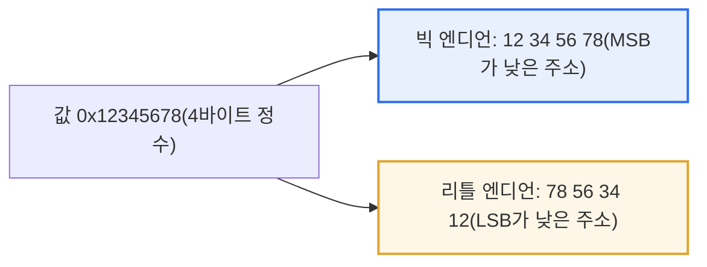
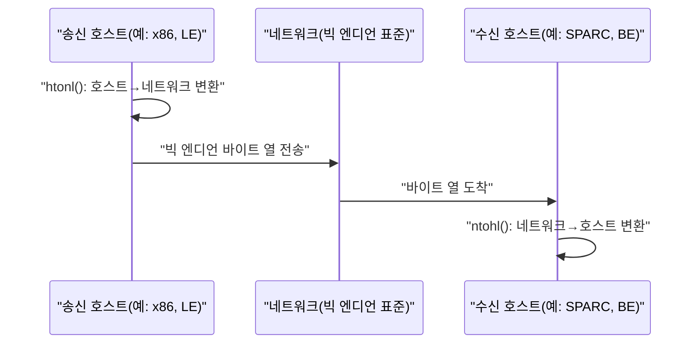

# 빅 엔디언(Big Endian)과 리틀 엔디언(Little Endian)

## 1. 개요

### 가. 정의
> **엔디언(Endianness)** 은 2바이트 이상으로 이루어진 데이터(정수·부동소수·포인터 등)를 메모리나 전송 매체에 저장할 때 **구성 바이트를 배열하는 순서**를 말한다. **빅 엔디언(Big Endian)** 은 최상위 바이트(MSB, Most Significant Byte)를 가장 낮은 주소에, **리틀 엔디언(Little Endian)** 은 최하위 바이트(LSB, Least Significant Byte)를 가장 낮은 주소에 저장한다.

엔디언이 문제가 되는 근본 이유는 "**같은 값을 시스템마다 다른 순서로 저장해, 데이터를 주고받을 때 값이 깨진다**"는 데 있다. CPU의 레지스터 안에서 숫자는 하나의 논리적 값이지만, 그 값을 바이트 단위로 쪼개 주소가 매겨진 메모리에 펼쳐 담는 순간 "어느 바이트를 먼저 둘 것인가"라는 물리적 선택이 생긴다. 예를 들어 4바이트 부호 없는 정수 `0x12345678`을 저장한다고 하자. 사람이 읽는 순서 그대로 `12 34 56 78`을 낮은 주소부터 담으면 빅 엔디언이고, 거꾸로 `78 56 34 12`로 담으면 리틀 엔디언이다. 값 자체는 같지만 메모리의 바이트 배열은 정반대다.

한 컴퓨터 안에서만 데이터를 쓰고 읽는다면 엔디언은 전혀 문제가 되지 않는다. CPU가 저장할 때 쓴 규칙으로 그대로 읽기 때문이다. 문제는 **엔디언이 다른 두 시스템이 바이너리 데이터를 교환할 때** 발생한다. 빅 엔디언 장비가 보낸 `12 34 56 78`을 리틀 엔디언 장비가 자기 규칙대로 해석하면 최하위 바이트가 `12`라고 오해하여 값이 `0x78563412`로 완전히 뒤바뀐다. 이것이 네트워크 통신, 파일 포맷 교환, 이기종(heterogeneous) 장비 연동에서 엔디언을 반드시 고려해야 하는 이유다. 그래서 인터넷 프로토콜은 전송 시 표준 순서로 **빅 엔디언(네트워크 바이트 순서, network byte order)** 을 채택해 혼란을 차단한다.

어느 쪽이 본질적으로 우월한 것은 아니며, **CPU 설계 철학의 차이**일 뿐이다. 이름의 유래도 의미심장하다. 조너선 스위프트의 소설 『걸리버 여행기』에서 삶은 달걀을 큰 쪽(big end)부터 깨는 사람들과 작은 쪽(little end)부터 깨는 사람들이 사소한 차이로 전쟁을 벌이는 장면에서 따온 것으로, "어느 쪽이 옳다기보다 합의가 필요한 관습"이라는 성격을 잘 드러낸다.

한 가지 구분해 둘 개념은 **바이트 엔디언(byte order)과 비트 엔디언(bit order)** 이다. 통상 "엔디언"이라고 하면 바이트 단위 배열 순서를 가리키며, 이는 프로그래머가 메모리·네트워크에서 직접 마주하는 문제다. 한편 직렬 통신·비트필드 전송에서는 한 바이트 안의 비트를 어느 쪽부터 보내는가 하는 비트 엔디언도 존재하지만, 대부분의 하드웨어가 이를 투명하게 처리하므로 일상적 응용 개발에서는 바이트 엔디언만 고려하면 충분하다. 또한 과거 PDP-11 등에서는 `0x12345678`을 `34 12 78 56`처럼 워드 단위로 뒤섞어 저장하는 **미들 엔디언(Middle Endian)** 도 있었으나, 오늘날에는 역사적 유물로만 남아 실무에서 마주칠 일은 거의 없다.

### 나. 등장 배경과 저장 예시
역사적으로 인텔(Intel) 계열 x86 CPU는 리틀 엔디언을, 모토로라 68000·초기 SPARC·PowerPC 등과 인터넷 프로토콜은 빅 엔디언을 채택하면서 두 방식이 공존하게 되었다. 리틀 엔디언을 택한 설계는 "낮은 주소 = 하위 바이트"라는 규칙이 산술 연산과 형 변환에 유리하다는 점을, 빅 엔디언을 택한 설계는 "사람이 읽는 순서와 일치"한다는 점을 각각 근거로 삼았다. 아래는 4바이트 값 `0x12345678`이 실제 메모리에 어떻게 놓이는지를 보인 것이다.

| 주소 | 빅 엔디언 | 리틀 엔디언 |
|---|---|---|
| 낮은 주소(base+0) | 12 | 78 |
| base+1 | 34 | 56 |
| base+2 | 56 | 34 |
| 높은 주소(base+3) | 78 | 12 |

## 2. 동작 원리와 비교

두 방식의 차이는 "값을 바이트로 분해해 주소 축 위에 어느 방향으로 펼치느냐"로 요약된다. 아래 다이어그램은 동일한 값 하나가 두 규칙에 따라 서로 다른 바이트 열로 갈라지는 모습을 나타낸다.


```mermaid
flowchart LR
  V["값 0x12345678(4바이트 정수)"] --> B["빅 엔디언: 12 34 56 78(MSB가 낮은 주소)"]
  V --> L["리틀 엔디언: 78 56 34 12(LSB가 낮은 주소)"]
  style B fill:#e8f0fe,stroke:#2f6fed,stroke-width:2px
  style L fill:#fef7e8,stroke:#e0a42f,stroke-width:2px
```

빅 엔디언이 주는 가장 큰 실무적 이점은 **가독성**이다. 메모리 덤프나 패킷 캡처를 16진수로 펼쳐 보면 바이트 순서가 사람이 숫자를 쓰는 순서와 같아, 디버깅·프로토콜 분석 시 값을 직관적으로 읽을 수 있다. 반면 리틀 엔디언은 **하위 바이트가 항상 같은(낮은) 주소에 위치**한다는 규칙 덕분에, 4바이트 값을 2바이트나 1바이트로 잘라 쓸 때 주소를 바꾸지 않고 그대로 앞부분만 읽으면 되어 형 변환과 다중 정밀도 산술 구현이 단순해진다. 이는 덧셈을 하위 바이트(=낮은 주소)부터 올림수를 전파하며 수행하는 CPU 내부 동작과도 잘 맞는다.

| 구분 | 빅 엔디언 | 리틀 엔디언 |
|---|---|---|
| **저장 순서** | MSB를 낮은 주소에 | LSB를 낮은 주소에 |
| **직관성** | 사람이 읽는 순서와 동일 | 역순(덤프에서 덜 직관적) |
| **연산·형변환** | — | 하위 바이트 접근·가변 정밀도 산술에 유리 |
| **대표 사용** | 네트워크(TCP/IP), 68000, 초기 SPARC | 인텔 x86/x64, ARM(기본 LE), RISC-V |

이 대비는 "왜 두 진영이 끝내 하나로 통일되지 못했는가"를 설명해 준다. 각 설계가 자기 용도에서 실질적 이점을 가졌기 때문이다. CPU 내부 산술 효율을 중시한 진영은 리틀 엔디언을, 사람의 가독성과 프로토콜 일관성을 중시한 진영은 빅 엔디언을 택했고, 둘 다 "틀리지 않은" 선택이었으므로 생태계가 고착된 뒤에는 전환 비용이 이점을 압도해 공존이 굳어졌다.

여기서 주의할 점은, 엔디언은 **멀티바이트 단위에만 적용**된다는 사실이다. 1바이트(예: ASCII 문자) 데이터나, 바이트 배열·문자열처럼 "요소 하나가 1바이트인 연속 데이터"는 엔디언과 무관하게 동일하게 저장된다. 엔디언이 값을 뒤집는 대상은 어디까지나 하나의 정수·실수처럼 여러 바이트가 모여 한 값을 이루는 경우다. 이 점을 혼동하면 문자열이 깨진 원인을 엉뚱하게 엔디언으로 돌리는 오류를 범하기 쉽다.

## 3. 처리 방법 — 바이트 순서 변환

이기종 통신에서 엔디언 불일치를 막는 표준 전략은 "**전송 계층에서 바이트 순서를 통일**"하는 것이다. 구체적으로, 데이터를 네트워크로 내보낼 때는 자신의 호스트 순서(host byte order)를 **네트워크 바이트 순서(빅 엔디언)로 변환**하고, 받을 때는 다시 자기 호스트 순서로 되돌린다. 이 변환을 응용이 일관되게 수행하면, 양쪽 CPU의 엔디언이 무엇이든 중간에서 합의된 표준 하나로 만나므로 값이 보존된다.


```mermaid
sequenceDiagram
  participant S as "송신 호스트(예: x86, LE)"
  participant N as "네트워크(빅 엔디언 표준)"
  participant R as "수신 호스트(예: SPARC, BE)"
  S->>S: "htonl(): 호스트→네트워크 변환"
  S->>N: "빅 엔디언 바이트 열 전송"
  N->>R: "바이트 열 도착"
  R->>R: "ntohl(): 네트워크→호스트 변환"
```

C/POSIX 환경에서는 이 변환을 위해 `htonl()`/`htons()`(host-to-network, 4/2바이트)와 `ntohl()`/`ntohs()`(network-to-host) 함수를 제공한다. 이들 함수는 호스트가 이미 빅 엔디언이면 아무 일도 하지 않고(무변환), 리틀 엔디언이면 바이트를 뒤집는 식으로 **호스트 엔디언을 신경 쓰지 않고도 이식 가능한 코드**를 짜게 해준다. 예컨대 x86(리틀 엔디언) 호스트에서 포트 번호 `80`(0x0050)을 전송할 때 `htons(80)`은 바이트를 뒤집어 네트워크로는 `00 50`(빅 엔디언)이 나가도록 보장한다. 반대로 이미 빅 엔디언인 호스트에서는 같은 호출이 아무것도 바꾸지 않는다. 이렇게 "변환 함수는 호출하되 실제 동작은 호스트 엔디언에 따라 달라지는" 구조 덕분에, 동일한 소스 코드가 양쪽 아키텍처에서 똑같이 올바르게 동작한다.

응용 수준에서는 Protocol Buffers·Avro·Thrift 같은 직렬화 라이브러리가 엔디언 처리를 내부에서 담당하므로, 개발자가 저수준 변환을 직접 다룰 필요가 줄어든다. 다만 직접 바이너리 포맷을 정의하는 경우(파일 헤더·임베디드 프로토콜)에는 포맷 명세에 엔디언을 반드시 명시해야 한다. 또한 부동소수점(IEEE 754)도 멀티바이트 값이므로 엔디언의 영향을 받는데, 대부분의 리틀 엔디언 시스템은 정수와 동일하게 부동소수도 리틀 엔디언으로 저장하지만, 일부 임베디드 환경은 정수와 부동소수의 엔디언이 다른 혼합 사례가 있어, 실수 데이터를 바이너리로 교환할 때는 정수와 별도로 호환성을 검증해야 한다.

자기 시스템의 엔디언을 확인하는 고전적 기법은, 정수 `1`을 저장한 뒤 그 메모리의 첫 바이트를 읽어 보는 것이다. 첫 바이트가 `01`이면 하위 바이트가 앞에 온 것이므로 리틀 엔디언, `00`이면 빅 엔디언이다. 아래는 그 판별을 C 코드로 표현한 것으로, 4바이트 정수의 첫 바이트를 `char` 포인터로 들여다보는 전형적 관용구다.

```c
#include <stdio.h>

int is_little_endian(void) {
    unsigned int x = 1;          /* 0x00000001 */
    char *p = (char *)&x;        /* 첫 바이트 주소 */
    return (*p == 1);            /* 1이면 LSB가 앞 → 리틀 엔디언 */
}

int main(void) {
    printf("%s\n", is_little_endian() ? "Little Endian" : "Big Endian");
    return 0;
}
```

실제 사례로, TIFF·이미지 포맷이나 유니코드 텍스트 파일은 파일 앞머리에 **BOM(Byte Order Mark)** 이나 매직 넘버(`II`=Intel/LE, `MM`=Motorola/BE)를 두어 읽는 쪽이 엔디언을 판별하도록 설계되었다. 즉 포맷 자체가 "나는 어느 엔디언으로 쓰였다"를 선언해 두는 것인데, 이는 앞서 설명한 "포맷 명세에 엔디언을 명시"하라는 원칙을 실제 표준들이 구현한 형태다.

## 4. 사례와 실무 함의

엔디언 불일치는 추상적 이론이 아니라 실제 버그의 흔한 원인이다. 첫째 사례로, 임베디드 센서(빅 엔디언 MCU)가 수집한 16비트 온도 값을 x86 리눅스 서버(리틀 엔디언)로 그대로 보내면서 변환을 누락하면, `0x0102`(258)가 서버에서 `0x0201`(513)로 읽혀 온도가 엉뚱한 값으로 기록된다. 둘째, 파일 포맷 호환 문제로, 빅 엔디언 장비에서 만든 바이너리 설정 파일을 리틀 엔디언 PC에서 읽을 때 정수 필드가 모두 뒤집혀 파싱이 실패한다. 셋째, 네트워크 프로그래밍에서 포트 번호나 IP 주소 같은 필드를 `htons()` 없이 구조체에 직접 넣어 전송하면, 같은 엔디언 장비끼리는 동작하다가 이기종 연동에서 갑자기 깨지는 "재현 안 되는 버그"가 된다. 이처럼 엔디언 버그는 **동일 엔디언 환경에서는 숨어 있다가 이기종 연동에서만 드러나** 진단이 까다롭다.

넷째 사례는 **공유 메모리·메모리 맵 파일(mmap)** 이다. 빅 엔디언 서버에서 생성해 디스크에 그대로 덤프한 구조체를 리틀 엔디언 서버가 메모리 맵으로 읽으면, 문자열 필드는 멀쩡한데 정수 카운터나 오프셋 필드만 터무니없는 값으로 나타난다. 이는 "바이트 배열(문자열)은 엔디언 무관, 멀티바이트 정수는 엔디언 의존"이라는 앞서의 원리가 한 구조체 안에서 동시에 작용한 결과로, 증상이 부분적이어서 원인을 찾기가 더 까다롭다.

따라서 실무 원칙은 명확하다. 바이너리 데이터가 프로세스·장비·언어 경계를 넘는 모든 지점에서 **엔디언을 명시적으로 통일**하고, 절대 "우연히 같은 엔디언이라 동작하는" 코드에 의존하지 않는 것이다. 텍스트 기반 포맷(JSON·XML)이 이기종 연동에서 선호되는 숨은 이유 하나도 바로 엔디언 문제에서 자유롭다는 점이다.

## 5. 심화 — 바이 엔디언과 최신 동향

최근 프로세서들은 **바이 엔디언(Bi-Endian)** 을 지원하는 추세다. ARM, PowerPC, MIPS, RISC-V 등은 설정 레지스터나 부팅 옵션으로 엔디언 모드를 전환할 수 있어, 하나의 칩을 빅/리틀 양쪽 생태계에 통합하기 쉽다. 예컨대 ARM은 기본적으로 리틀 엔디언으로 동작하지만 네트워크 장비용으로 빅 엔디언 모드를 선택할 수 있다. 이는 과거 "CPU가 엔디언을 고정"하던 시대에서, "시스템 통합 유연성을 위해 엔디언을 선택 가능한 속성"으로 다루는 방향으로의 변화다.

이런 전환 기능은 주로 시스템 부팅 초기 단계나 펌웨어 수준에서 한 번 결정되며, 운영체제와 응용은 그 위에서 일관된 엔디언을 전제로 동작한다. 따라서 전환 자체는 칩 제조사·보드 설계자의 통합 편의를 위한 것이지, 응용 개발자가 런타임에 수시로 바꾸는 기능은 아니라는 점을 이해해야 한다. 응용 입장에서는 여전히 "내가 도는 환경의 엔디언이 무엇이든 경계에서 변환한다"는 원칙이 유효하다.

한편 현실에서는 **리틀 엔디언의 사실상 표준화**가 진행되고 있다. 인텔 x86/x64와 리틀 엔디언 모드의 ARM이 서버·모바일·PC 시장을 석권하면서, 새로 설계되는 파일 포맷·언어 런타임·가상머신 상당수가 리틀 엔디언을 기본으로 전제한다. RISC-V 표준 역시 리틀 엔디언을 기본으로 규정한다. 다만 네트워크 프로토콜은 여전히 빅 엔디언을 표준으로 유지하므로, 통신 코드에서는 앞으로도 바이트 순서 변환이 사라지지 않는다. 결국 "내부 연산은 리틀, 전송 표준은 빅"이라는 이원 구조를 이해하고 경계에서 변환을 일관되게 적용하는 것이 실무의 핵심으로 남는다.

## 6. 고려사항 및 시사점 (기술사 관점)

1. **이기종 연동 시 명시적 변환 강제**: 서로 다른 엔디언 시스템 간 바이너리 교환에서는 네트워크 바이트 순서로 통일하거나, 프로토콜·포맷 명세에 엔디언을 못 박아야 한다. `htonl/ntohl` 등 표준 변환 함수를 일관되게 사용해 호스트 엔디언에 독립적인 코드를 작성한다.
2. **직렬화·바이너리 포맷 설계 원칙**: 파일·통신 포맷을 설계할 때 엔디언과 필드 크기를 규정해야 플랫폼 간 이식성이 보장된다. 가능하면 Protobuf·Avro 같은 검증된 직렬화 프레임워크를 사용해 엔디언 처리를 위임하고, 필요 시 헤더에 BOM·매직 넘버로 엔디언을 표기한다.
3. **테스트·진단 전략**: 엔디언 버그는 동일 엔디언 환경에서 숨으므로, 빅/리틀 양쪽 환경(또는 QEMU 등 교차 에뮬레이션)에서 바이너리 상호운용성 테스트를 수행해야 조기에 발견된다.
4. **바이 엔디언·표준화 흐름의 활용**: ARM·RISC-V 등 엔디언 전환이 가능한 아키텍처는 시스템 통합 유연성을 높이지만, 설정에 따라 동작이 달라지므로 배포 환경의 엔디언 모드를 형상 관리로 통제해야 한다. 신규 시스템은 리틀 엔디언 사실상 표준을 전제하되, 전송 경계의 빅 엔디언 변환은 유지한다.
5. **성능·정렬(alignment)과의 연계**: 엔디언 변환 자체는 비용이 작지만, 대량 데이터 전송에서 바이트 스왑이 병목이 되지 않도록 버퍼 단위 일괄 변환과 메모리 정렬을 함께 고려하는 것이 바람직하다.

## 참고자료
- Wikipedia, "Endianness" — https://en.wikipedia.org/wiki/Endianness
- RFC 1700 / IEN 137 (Network byte order, "On Holy Wars and a Plea for Peace")
- Linux man-pages, "byteorder(3) — htonl/htons/ntohl/ntohs" — https://man7.org/linux/man-pages/man3/htonl.3.html

---

> **한 줄 요약**: 엔디언은 *멀티바이트 데이터를 메모리에 배열하는 바이트 순서* 로, 빅 엔디언(MSB 먼저·네트워크 표준)과 리틀 엔디언(LSB 먼저·x86 사실상 표준)이 설계 철학의 차이로 공존하며, 이기종 경계에서 네트워크 바이트 순서로 명시적 변환해 값의 호환성을 확보하는 것이 핵심이다.
