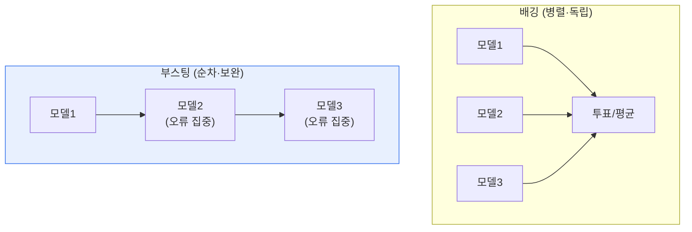

# 앙상블 학습 — 배깅(Bagging)과 부스팅(Boosting)

## 1. 개요

### 가. 정의
> **앙상블(Ensemble) 학습**은 **여러 개의 약한 학습기(weak learner)를 결합해 하나의 강한 예측 모델을 만드는 기법**으로, 단일 모델보다 정확도와 안정성을 높인다. 대표 방식이 배깅과 부스팅이다.

앙상블이 강력한 근본 원리는 '**여러 명의 의견을 모으면 한 명보다 낫다(집단 지성)**'는 데 있다. 하나의 모델은 특정 데이터에 과적합하거나 편향될 수 있다. 그러나 서로 다른 여러 모델의 예측을 종합하면, 각 모델의 오류가 상쇄되고 전체 예측이 안정된다. 마치 여러 전문가에게 물어 다수결·평균을 내면 개별 오판의 영향이 줄어드는 것과 같다. 이 결합을 어떻게 하느냐에 따라 두 방향으로 나뉜다. **배깅**은 여러 모델을 '병렬로 독립' 학습시켜 결과를 평균·투표하는 방식으로, 모델들의 분산(variance)을 줄여 과적합을 막는다. **부스팅**은 여러 모델을 '순차로 연결'해, 앞 모델이 틀린 부분에 뒤 모델이 집중하도록 학습하는 방식으로, 편향(bias)을 줄여 정확도를 끌어올린다. 둘 다 단일 모델의 한계를 극복하지만, 줄이는 오류의 종류(분산 vs 편향)와 방식(병렬 vs 순차)이 다르다.

### 나. 기반 개념
편향-분산 트레이드오프에서, 배깅은 분산을 줄이고 부스팅은 편향을 줄이는 상보적 접근이다. [[decision-tree]]

## 2. 배깅 vs 부스팅

| 구분 | 배깅(Bagging) | 부스팅(Boosting) |
|---|---|---|
| **학습 방식** | 병렬(독립) | 순차(이전 오류 보완) |
| **데이터 샘플링** | 부트스트랩(복원추출) | 오분류 샘플 가중치↑ |
| **결합** | 투표·평균 | 가중 합 |
| **주 효과** | 분산↓(과적합 완화) | 편향↓(정확도↑) |
| **과적합** | 강건함 | 상대적으로 민감 |
| **대표 알고리즘** | 랜덤 포레스트 | AdaBoost, GBM, XGBoost |

## 3. 대표 알고리즘

**배깅**의 대표는 **랜덤 포레스트**로, 여러 결정트리를 부트스트랩 샘플과 무작위 특성 선택으로 학습시켜 투표한다. 트리 각각은 과적합해도 종합하면 안정적이다.

**부스팅**의 대표는 **XGBoost·LightGBM**(Gradient Boosting 계열)로, 이전 모델의 잔차(오류)를 다음 모델이 학습하며 점진적으로 개선한다. 정형 데이터 예측에서 최고 성능을 자주 보여 캐글 등에서 널리 쓰인다.

## 4. 고려사항 및 시사점

1. **문제 특성에 맞는 선택**이 필요하다. 과적합이 우려되고 안정성이 중요하면 배깅(랜덤 포레스트), 정확도를 극대화하려면 부스팅(XGBoost)이 유리하다. 다만 부스팅은 튜닝·과적합에 주의한다.
2. **정형 데이터의 강자**다. 딥러닝이 이미지·자연어를 지배하지만, 정형(테이블) 데이터에서는 여전히 부스팅 계열 앙상블이 최고 성능을 보이는 경우가 많다.
3. **해석성과 비용의 트레이드오프**를 고려한다. 앙상블은 정확하지만 단일 모델보다 해석이 어렵고 계산 비용이 크므로, SHAP 등 설명기법을 병행하고 자원·성능 균형을 맞춘다.

---

> **한 줄 요약**: 앙상블은 *여러 약한 학습기를 결합해 강한 모델을 만드는 기법* 으로, 배깅(병렬·분산↓·랜덤포레스트)과 부스팅(순차·편향↓·XGBoost)이 상보적이며, 문제 특성에 맞춰 선택하되 정형 데이터에서 특히 강력하다.
