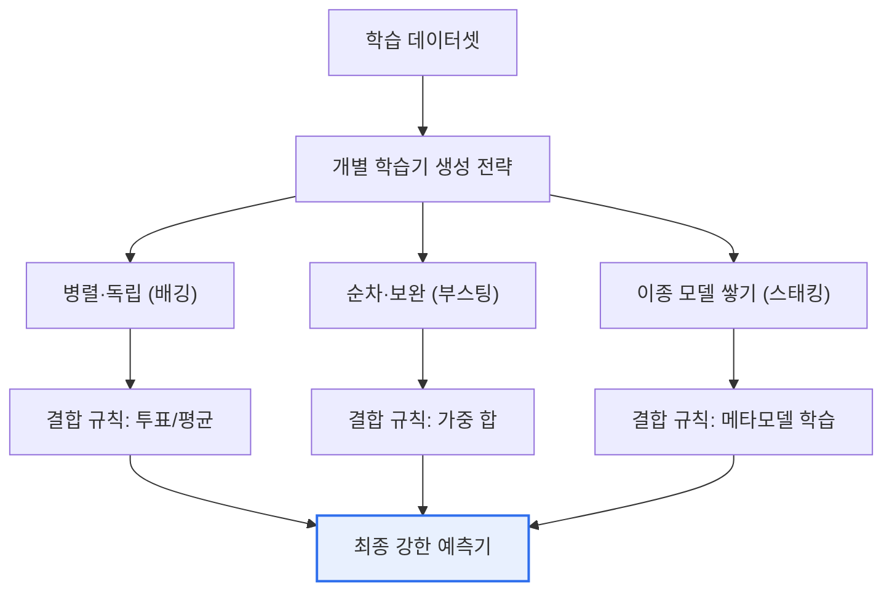
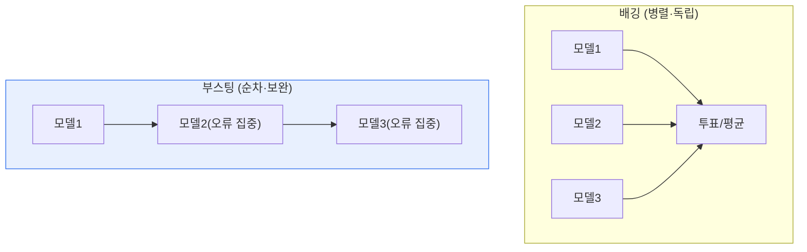

# 앙상블 학습 — 배깅(Bagging)과 부스팅(Boosting)

## 1. 개요

### 가. 정의
> **앙상블(Ensemble) 학습**은 **여러 개의 약한 학습기(weak learner)를 전략적으로 결합해 하나의 강한 예측 모델(strong learner)을 만드는 기법**으로, 단일 모델보다 예측 정확도와 일반화 안정성을 동시에 높인다. 대표 방식이 병렬 결합의 배깅(Bagging)과 순차 결합의 부스팅(Boosting)이다.

앙상블이 강력한 근본 원리는 '**여러 명의 의견을 모으면 한 명보다 낫다(집단 지성, wisdom of crowds)**'는 통계적 직관에 있다. 하나의 모델은 학습 데이터의 특정 패턴에 과적합(overfitting)하거나 특정 방향으로 편향(bias)될 수 있고, 그 오류는 그 모델만의 고유한 것이다. 그러나 서로 다른 방식·데이터로 학습한 여러 모델의 예측을 종합하면, 각 모델이 저지르는 **서로 상관이 낮은 오류들이 평균 과정에서 상쇄**되고 전체 예측의 분산이 줄어든다. 마치 한 명의 전문가보다 여러 전문가에게 물어 다수결·평균을 내면 개별 오판의 영향이 희석되는 것과 같은 이치다. 핵심 전제는 **개별 학습기가 무작위 추측보다 조금이라도 나아야 하고(약학습기), 서로 충분히 다양(diversity)해야 한다**는 점이다. 모든 모델이 똑같이 틀리면 아무리 모아도 소용이 없기 때문이다.

이 '결합'을 어떻게 설계하느냐에 따라 앙상블은 크게 두 방향으로 갈린다. **배깅**은 여러 모델을 '병렬로 독립' 학습시켜 결과를 평균·투표하는 방식으로, 개별 모델의 **분산(variance)**을 줄여 과적합을 억제하는 데 초점을 둔다. 반면 **부스팅**은 여러 모델을 '순차로 연결'해, 앞 모델이 틀린 부분에 뒤 모델이 집중하도록 학습을 이어가는 방식으로, **편향(bias)**을 줄여 정확도를 끌어올리는 데 초점을 둔다. 둘 다 단일 모델의 한계를 극복한다는 공통 목적을 갖지만, 줄이려는 오류의 종류(분산 대 편향)와 학습 구조(병렬 대 순차)가 정반대여서 상보적(complementary) 관계를 이룬다.

### 나. 등장 배경과 필요성
전통적 기계학습에서 단일 모델을 아무리 정교하게 튜닝해도 성능이 한계에 부딪히는 경험이 반복되면서, "**하나를 잘 만드는 것보다 여럿을 잘 섞는 것**"이 더 효과적이라는 인식이 자리 잡았다. 1996년 Breiman의 배깅, 같은 해 Freund·Schapire의 AdaBoost가 이론적 토대를 세웠고, 이후 Random Forest(2001)와 Gradient Boosting 계열이 등장하면서 앙상블은 정형(테이블) 데이터 예측의 사실상 표준이 되었다. 실제로 Kaggle 등 데이터 경진대회 상위 솔루션의 대다수가 XGBoost·LightGBM·CatBoost 같은 부스팅 계열이나 여러 모델을 겹쳐 쌓는 스태킹(Stacking)을 채택한다. 딥러닝이 이미지·자연어를 지배하는 오늘날에도, 금융 신용평가·수요예측·이탈예측처럼 정형 데이터가 중심인 산업 현장에서는 앙상블이 여전히 최고 성능을 내는 경우가 많다는 점이 그 필요성을 방증한다.

### 다. 이론적 기반 — 편향-분산 트레이드오프
앙상블을 이해하는 열쇠는 예측 오차를 편향²·분산·노이즈로 분해하는 **편향-분산 트레이드오프**다. 편향이 큰 모델은 데이터의 구조를 충분히 학습하지 못해 과소적합(underfitting)하고, 분산이 큰 모델은 학습 데이터의 잡음까지 외워 과적합한다. 배깅은 낮은 편향·높은 분산을 가진 모델(깊은 결정트리 등)을 여럿 평균 내어 **분산만 선택적으로 낮추고**, 부스팅은 높은 편향·낮은 분산의 얕은 모델(그루터기, stump)을 순차로 보완해 **편향을 낮춘다**. 즉 두 기법은 동일한 트레이드오프의 서로 다른 축을 공략하는 상보적 접근이다. [[decision-tree]]

## 2. 전체 구조와 동작 원리

앙상블의 전체 골격은 아래와 같이 '개별 학습기 생성 → 결합 전략 → 최종 예측'의 3단계로 정리된다. 어떤 데이터로 어떤 학습기를 만들고, 그 예측을 어떤 규칙으로 합칠지가 앙상블 설계의 전부라고 해도 과언이 아니다.

```mermaid
flowchart TB
  D["학습 데이터셋"] --> G["개별 학습기 생성 전략"]
  G --> P["병렬·독립 (배깅)"]
  G --> S["순차·보완 (부스팅)"]
  G --> K["이종 모델 쌓기 (스태킹)"]
  P --> C["결합 규칙: 투표/평균"]
  S --> C2["결합 규칙: 가중 합"]
  K --> C3["결합 규칙: 메타모델 학습"]
  C & C2 & C3 --> R["최종 강한 예측기"]
  style R fill:#e8f0fe,stroke:#2f6fed,stroke-width:2px
```

위 구조도가 큰 그림이라면, 배깅과 부스팅의 학습 흐름 차이를 세부적으로 보면 다음과 같다. 배깅은 원본 데이터에서 복원추출(부트스트랩)한 서로 다른 샘플로 모델들을 **동시에, 서로 참조 없이** 학습시킨다. 반대로 부스팅은 하나의 모델을 학습한 뒤 그 오차를 측정하고, **오차가 큰 샘플에 가중치를 실어** 다음 모델을 학습시키는 과정을 반복한다. 따라서 배깅은 병렬화가 쉬워 대규모 데이터에 유리하고, 부스팅은 앞 결과에 의존하므로 본질적으로 순차적이다.

```mermaid
flowchart TB
  subgraph B["배깅 (병렬·독립)"]
    B1[모델1] & B2[모델2] & B3[모델3] --> BV["투표/평균"]
  end
  subgraph BO["부스팅 (순차·보완)"]
    O1[모델1] --> O2["모델2(오류 집중)"] --> O3["모델3(오류 집중)"]
  end
  style BO fill:#e8f0fe,stroke:#2f6fed
```

### 가. 배깅(Bagging)의 원리
배깅은 Bootstrap Aggregating의 줄임말로, 이름 그대로 두 단계로 이뤄진다. 첫째 **부트스트랩**은 원본 데이터에서 중복을 허용해(복원추출) 원본과 같은 크기의 샘플을 여러 벌 만드는 것이다. 이 과정에서 각 샘플은 원본과 조금씩 다른 구성이 되고, 평균적으로 약 63%의 고유 데이터만 포함되며 나머지 37%는 제외(Out-Of-Bag, OOB)된다. 이 OOB 데이터는 별도 검증셋 없이도 일반화 성능을 추정하는 무료 검증 수단으로 활용된다.

둘째 **집계(Aggregating)**는 각 샘플로 학습한 모델들의 예측을 합치는 것으로, 분류는 다수결 투표, 회귀는 산술 평균을 쓴다. 핵심은 각 모델이 서로 다른 샘플을 봤기 때문에 오류의 방향이 제각각이고, 이를 평균 내면 **개별 모델의 높은 분산이 크게 줄어든다**는 데 있다. 다만 배깅은 편향은 거의 줄이지 못하므로, 개별 학습기로는 편향이 낮은(즉 충분히 복잡한) 모델을 쓰는 것이 원칙이다. 실무에서는 깊게 자란 결정트리가 대표적 선택이다.

배깅이 효과를 보려면 **모델 간 다양성**이 관건이다. 부트스트랩만으로는 트리들이 비슷해질 수 있어, 랜덤 포레스트는 각 분기(split)마다 무작위로 일부 특성만 후보로 삼는 '특성 무작위성'을 추가로 도입한다. 이렇게 하면 특정 강한 변수 하나에 모든 트리가 매달리는 현상이 완화되어 트리 간 상관이 낮아지고, 평균의 분산 감소 효과가 극대화된다.

### 나. 부스팅(Boosting)의 원리
부스팅의 철학은 "**약점을 반복적으로 보완한다**"는 것이다. 첫 모델을 학습한 뒤, 그 모델이 틀린 샘플에 더 큰 가중치를 부여하여 다음 모델이 그 어려운 사례에 집중하도록 만든다. 이 과정을 정해진 횟수만큼 반복하면서 각 모델의 예측을 성능에 비례한 가중치로 합산해 최종 예측을 만든다. 대표 초기 알고리즘인 **AdaBoost**는 오분류 샘플의 가중치를 지수적으로 키우는 방식으로 이 아이디어를 구현했다.

현대 부스팅의 주류는 **경사 부스팅(Gradient Boosting)**으로, 관점을 '가중치 조정'에서 '**잔차(residual) 학습**'으로 바꾼다. 즉 다음 모델이 직전까지의 예측 오차(손실함수의 음의 기울기)를 목표로 학습하여, 앙상블 전체가 경사하강법처럼 손실을 점진적으로 줄여간다. 이때 각 단계의 기여를 학습률(learning rate)로 축소해 조금씩 더하는 것이 핵심 안정화 장치다. 학습률을 낮추면 더 많은 트리가 필요하지만 과적합 위험이 줄고 일반화가 좋아지는 트레이드오프가 생긴다.

부스팅은 편향을 강력하게 줄여 높은 정확도를 내지만, **오류에 집착하는 구조상 잡음(noise)이나 이상치(outlier)에 민감**하고 과적합 위험이 배깅보다 크다. 따라서 트리 깊이 제한, 학습률 조정, 조기 종료(early stopping), 정규화 항 추가 등 세심한 튜닝이 성능을 좌우한다.

### 다. 앙상블 결합 방식의 유형 체계
배깅·부스팅은 앙상블의 두 대표 축이지만, 결합 방식 전체로 넓히면 네 유형으로 정리된다. 이를 구분해 이해해야 실무에서 상황에 맞는 방식을 고를 수 있다. 가장 단순한 **보팅(Voting)**은 서로 다른 알고리즘의 예측을 그대로 투표·평균하는 방식으로, 분류에서는 다수결의 하드 보팅과 확률을 평균하는 소프트 보팅으로 나뉜다. 소프트 보팅은 각 모델의 확신도(예측 확률)까지 반영하므로 일반적으로 하드 보팅보다 성능이 좋다.

**배깅**은 같은 알고리즘을 부트스트랩 샘플로 병렬 학습해 분산을 낮추는 방식, **부스팅**은 순차 보완으로 편향을 낮추는 방식임은 앞서 설명한 대로다. 마지막 **스태킹(Stacking)**은 여러 이종 모델의 예측 결과 자체를 새로운 특성으로 삼아 그 위에 메타모델을 한 번 더 학습시키는 2단계 구조로, 개별 모델의 강점을 학습을 통해 조합한다. 네 유형은 아래처럼 '무엇을 다양화하고 어떻게 결합하는가'로 구별된다.

| 유형 | 개별 학습기 | 다양성 원천 | 결합 규칙 | 주 효과 |
|---|---|---|---|---|
| **보팅** | 이종(서로 다른 알고리즘) | 알고리즘 차이 | 투표·확률평균 | 안정성↑ |
| **배깅** | 동종 | 데이터 샘플링 | 투표·평균 | 분산↓ |
| **부스팅** | 동종 | 오류 보완(순차) | 가중 합 | 편향↓ |
| **스태킹** | 이종 | 모델+메타학습 | 메타모델 학습 | 정확도 극대화 |

### 라. 두 방식의 비교
아래 표는 배깅·부스팅의 차이를 정리한 것이지만, 표의 각 항목은 앞서 설명한 '분산을 줄이느냐 편향을 줄이느냐'라는 근본 차이에서 파생된 결과임을 기억해야 한다. 예컨대 배깅이 과적합에 강건한 이유는 독립 병렬 학습이 오류를 상쇄하기 때문이고, 부스팅이 과적합에 민감한 이유는 순차적으로 오류를 좇다 잡음까지 학습할 수 있기 때문이다.

| 구분 | 배깅(Bagging) | 부스팅(Boosting) |
|---|---|---|
| **학습 방식** | 병렬(독립) | 순차(이전 오류 보완) |
| **데이터 샘플링** | 부트스트랩(복원추출) | 오분류 샘플 가중치↑ / 잔차 학습 |
| **결합** | 투표·평균 | 성능 가중 합 |
| **주 효과** | 분산↓(과적합 완화) | 편향↓(정확도↑) |
| **과적합** | 강건함 | 상대적으로 민감(튜닝 필요) |
| **병렬화** | 용이(독립) | 어려움(순차 의존) |
| **대표 알고리즘** | 랜덤 포레스트 | AdaBoost, GBM, XGBoost, LightGBM |

## 3. 대표 알고리즘과 산업 적용 사례

**배깅의 대표는 랜덤 포레스트(Random Forest)**다. 수백 개의 결정트리를 부트스트랩 샘플과 특성 무작위 선택으로 학습시켜 투표·평균한다. 개별 트리는 깊게 자라 과적합하더라도 종합하면 안정적이며, 특성 중요도(feature importance)를 자연스럽게 제공해 해석에도 유리하다. 실제로 국내외 금융권의 **신용카드 이상거래 탐지(FDS)**나 통신사의 **고객 이탈 예측**에 랜덤 포레스트가 폭넓게 쓰인다. 예를 들어 수십만 건의 거래 로그에서 사기 여부를 분류할 때, 단일 트리보다 랜덤 포레스트가 오탐(false positive)을 크게 낮추는 효과가 보고된다.

**부스팅의 대표는 XGBoost·LightGBM·CatBoost**(Gradient Boosting 계열)다. XGBoost는 2차 근사와 정규화를 도입해 정확도와 속도를 동시에 잡았고, LightGBM은 리프 중심(leaf-wise) 성장과 히스토그램 기반 분할로 대용량 데이터에서 수 배 빠른 학습을 제공한다. 이 계열은 정형 데이터 예측에서 최고 성능을 자주 보여, 예컨대 **전자상거래의 수요·재고 예측**, **제조 공정의 불량 예측**, **광고 클릭률(CTR) 예측** 등에서 표준처럼 쓰인다. 한 예로 대규모 유통사가 수요예측 모델을 단순 회귀에서 LightGBM 앙상블로 바꿔 예측 오차(MAPE)를 눈에 띄게 줄이고 재고 비용을 절감한 사례가 여럿 알려져 있다.

세 번째 축으로 **스태킹(Stacking)**이 있다. 랜덤 포레스트·부스팅·로지스틱 회귀 등 성격이 다른 모델들의 예측을 입력으로 삼아, 그 위에 메타모델(meta-learner)을 한 번 더 학습시켜 결합한다. 이질적 모델을 섞어 개별 강점을 취합하므로, 대회에서 마지막 성능을 쥐어짜는 용도로 흔히 쓰인다. 다만 구조가 복잡하고 과적합·운영 비용이 커 실무 적용은 신중해야 한다.

### 가. 배깅의 분산 감소 효과 — 간단한 수치 직관
배깅이 왜 효과적인지는 간단한 통계로 직관할 수 있다. 서로 독립인 n개의 예측을 평균 내면, 각 예측의 분산이 σ²일 때 평균의 분산은 σ²/n으로 줄어든다. 예컨대 개별 트리의 예측 분산이 1이고 트리가 100개라면, 완전히 독립이라는 이상적 가정에서 평균 예측의 분산은 0.01까지 낮아진다. 물론 실제 트리들은 완전히 독립일 수 없어 상관계수 ρ만큼 감소 효과가 제한되며, 분산은 대략 ρσ² + (1−ρ)σ²/n에 수렴한다. 이 식이 알려주는 실무적 교훈은 명확하다. **트리 개수를 늘리는 것(n↑)보다 트리 간 상관을 낮추는 것(ρ↓)이 어느 지점부터 더 중요**해진다는 점이며, 랜덤 포레스트가 특성 무작위 선택으로 ρ를 낮추는 이유가 바로 여기에 있다.

### 나. 성능 평가와 하이퍼파라미터 튜닝
앙상블의 성능은 하이퍼파라미터에 크게 좌우된다. 배깅 계열에서는 트리 개수(n_estimators), 트리 깊이, 분기 후보 특성 수(max_features)가, 부스팅 계열에서는 트리 개수·학습률(learning_rate)·트리 깊이·정규화 항이 핵심 조절 변수다. 특히 부스팅에서는 **학습률과 트리 개수의 곱이 대략 일정한 성능을 내는 트레이드오프**가 있어, 낮은 학습률에 많은 트리 + 조기 종료를 결합하는 것이 과적합을 억제하는 정석이다. 튜닝은 교차검증(k-fold)으로 일반화 성능을 추정하며 그리드/랜덤 서치나 베이지안 최적화로 탐색하고, 배깅에서는 OOB 오차를 별도 검증셋 없이 활용할 수 있다.

## 4. 심화 — 최신 동향과 예상 출제 방향

최근 부스팅 계열은 **범주형 변수 자동 처리(CatBoost의 순서형 타깃 인코딩)**, **GPU 가속 학습**, **분산 학습**으로 발전하며 대용량·고차원 데이터에 대응하고 있다. 또한 딥러닝과의 경계에서, 정형 데이터 전용 신경망(TabNet, FT-Transformer 등)이 앙상블에 도전하고 있으나, 여러 벤치마크에서 여전히 잘 튜닝된 Gradient Boosting이 대등하거나 앞선다는 결과가 보고되어 "정형 데이터의 강자" 지위는 견고하다. 한편 **AutoML** 플랫폼들은 내부적으로 앙상블·스태킹을 자동 구성해 사람의 튜닝 부담을 줄이고 있으며, 설명가능성 요구가 커지면서 **SHAP(SHapley Additive exPlanations)** 같은 사후 설명기법을 앙상블에 결합하는 것이 사실상 표준 관행이 되었다.

기술사 관점에서 이 주제는 "**배깅과 부스팅을 비교 설명하고 각각의 적용 상황을 논하라**", "**편향-분산 관점에서 앙상블의 효과를 설명하라**", "**랜덤 포레스트와 XGBoost의 원리 차이와 실무 선택 기준**" 형태로 출제되기 쉽다. 답안은 반드시 (1) 편향-분산 트레이드오프라는 이론적 근거, (2) 병렬·독립 대 순차·보완이라는 구조적 차이, (3) 과적합·해석성·비용이라는 실무적 트레이드오프, (4) 구체적 산업 적용 사례를 함께 엮어 전개하는 것이 고득점 구성이다.

## 5. 고려사항 및 시사점

1. **문제 특성에 맞는 선택 전략**이 필요하다. 데이터에 잡음이 많고 과적합이 우려되며 안정성이 중요하면 배깅(랜덤 포레스트)이, 정확도를 극한까지 끌어올려야 하고 튜닝 여력이 있으면 부스팅(XGBoost·LightGBM)이 유리하다. 두 모델의 예측을 다시 섞는 스태킹은 최후의 성능 향상 수단으로 검토한다.
2. **정형 데이터의 강자라는 위치를 활용**한다. 딥러닝이 이미지·음성·자연어를 지배하는 흐름과 별개로, 테이블 형태의 비즈니스 데이터에서는 앙상블이 최고 성능·빠른 학습·낮은 데이터 요구량이라는 실용적 이점을 가지므로, 무조건 딥러닝을 택하기보다 앙상블을 우선 검토하는 것이 합리적이다.
3. **해석성과 계산 비용의 트레이드오프를 관리**한다. 앙상블은 정확하지만 단일 모델보다 내부가 불투명하고 학습·추론 비용이 크다. 규제 산업(금융·의료)에서는 SHAP·부분의존도(PDP) 등 설명기법을 병행해 근거를 제시하고, 실시간 서비스에서는 모델 경량화·트리 개수 제한으로 지연을 관리해야 한다.
4. **과적합·데이터 품질 관리가 성패를 가른다**. 특히 부스팅은 이상치와 라벨 잡음에 민감하므로, 교차검증·조기 종료·정규화로 과적합을 통제하고 학습 데이터의 품질(라벨 정확성·불균형 처리)을 먼저 확보해야 한다. 아무리 강한 앙상블도 저품질 데이터의 한계를 넘지 못한다.
5. **운영·재현성 관점의 MLOps 연계**가 중요하다. 무작위 시드·하이퍼파라미터·데이터 버전에 따라 결과가 달라지므로, 모델 버전관리·실험추적·재학습 파이프라인을 갖춰야 예측 성능을 지속 유지할 수 있다.

## 참고자료
- scikit-learn User Guide, "Ensemble methods": https://scikit-learn.org/stable/modules/ensemble.html
- XGBoost Documentation, "Introduction to Boosted Trees": https://xgboost.readthedocs.io/en/stable/tutorials/model.html
- LightGBM Documentation, "Features": https://lightgbm.readthedocs.io/en/stable/Features.html

---

> **한 줄 요약**: 앙상블은 *여러 약한 학습기를 결합해 강한 모델을 만드는 기법*으로, 배깅(병렬·독립·분산↓·랜덤포레스트)과 부스팅(순차·보완·편향↓·XGBoost)이 편향-분산 트레이드오프의 상보적 두 축을 공략하며, 문제 특성·해석성·비용을 고려해 선택하되 정형 데이터에서 특히 강력하다.
