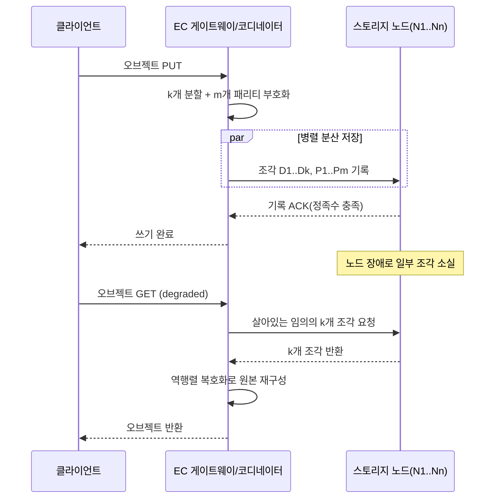

# 소거 코딩(Erasure Coding)과 분산 스토리지 데이터 내구성

## 1. 개요

### 가. 정의
> 소거 코딩(Erasure Coding, EC)이란 원본 데이터를 **k개의 데이터 조각(fragment)** 으로 나눈 뒤, 수학적 부호화를 통해 **m개의 잉여(패리티) 조각**을 추가로 생성하여 총 n(=k+m)개 조각으로 분산 저장하고, **임의의 k개 조각만 살아 있으면 원본을 완전히 복원**할 수 있게 하는 오류정정 부호(error-correcting code) 기반 데이터 보호 기법이다.

소거 코딩의 본질은 "채널에서 데이터가 **소거(erasure, 어느 위치가 사라졌는지는 알지만 값은 모르는 손실)** 되는 상황"을 저장 시스템에 이식한 것이다. 통신 이론에서 발전한 Reed–Solomon 부호 등이 그대로 저장 매체의 결함 모형에 적용되는데, 디스크·노드 장애는 "그 조각이 없어졌다"는 사실을 정확히 알 수 있으므로 위치를 모르는 일반 오류정정보다 훨씬 효율적으로 복구할 수 있다. 즉 EC는 **적은 용량 오버헤드로 높은 내구성(durability)** 을 확보하는, 정보이론적으로 최적에 가까운 잉여 배치 방식이다.

### 나. 등장 배경 및 필요성
클라우드·오브젝트 스토리지 시대에 데이터 총량은 페타바이트를 넘어 엑사바이트로 팽창했지만, 개별 디스크의 신뢰성은 그에 비례해 좋아지지 않았다. 전통적으로 분산 스토리지는 **3중 복제(3-replication)** 로 내구성을 확보해 왔다. 3중 복제는 구현이 단순하고 읽기 지역성이 좋지만, **저장 오버헤드가 200%(원본 1에 사본 2)** 로 매우 크다. 수십 PB 규모에서 이 200% 오버헤드는 곧 막대한 디스크·전력·상면(rack space) 비용을 의미한다.

소거 코딩은 동일하거나 더 높은 내구성을 **훨씬 적은 잉여로** 달성한다. 예를 들어 널리 쓰이는 RS(10,4) 구성은 데이터 10조각 + 패리티 4조각 = 14조각으로, **저장 오버헤드가 40%** 에 불과하면서도 임의의 4개 조각 동시 손실을 견딘다. 3중 복제가 최대 2개 사본 손실(동일 데이터 기준)을 견디는 것과 비교하면, EC는 더 적은 공간으로 더 많은 동시 장애를 허용한다. 대용량·저빈도 접근(cold/warm) 데이터가 폭증하면서, "비용 대비 내구성"을 극대화해야 하는 요구가 EC 확산의 근본 동인이다. 실제로 Meta의 f4, Microsoft Azure, AWS S3, Google Colossus, Ceph, HDFS-EC가 모두 대규모 저장 계층에서 EC를 표준으로 채택했다.

근본적으로 EC의 부상은 **저장 경제학(storage economics)** 의 문제다. 수 EB 규모에서 저장 오버헤드 1%포인트의 차이는 수천 대의 디스크와 그에 딸린 전력·냉각·상면·운영 인력의 차이로 환산된다. 3중 복제의 200% 오버헤드를 EC의 40~50%로 낮추면 동일 데이터 보호에 필요한 하드웨어가 3분의 1 이하로 줄어드는 셈이며, 이는 초대규모 사업자에게 곧 연간 수백억 원대의 총소유비용(TCO) 절감으로 이어진다. 동시에 데이터는 "만들어지되 거의 다시 읽히지 않는" 콜드 데이터가 대부분을 차지하도록 분포가 바뀌었는데, 이런 저빈도 데이터일수록 지연 페널티는 감내할 만하고 저장 비용 절감 효과는 극대화되므로 EC의 적용 여지가 넓다. 요컨대 EC는 통신 이론의 오류정정 기술을, 폭증하는 데이터를 경제적으로 지켜야 하는 스토리지의 요구에 맞게 재해석한 결과다.

### 다. 핵심 특징
EC의 성격은 네 가지로 요약된다. 첫째 **공간 효율성** — MDS 부호는 잉여 대비 내구성의 이론적 상한을 달성해, 같은 내구성을 복제보다 훨씬 적은 저장 공간으로 얻는다. 둘째 **높은 내구성** — m을 조절해 임의의 m개 동시 장애까지 견디도록 내구성을 세밀하게 설계할 수 있다. 셋째 **비대칭적 비용** — 정상 읽기는 저렴하지만 복구·성능저하 읽기·부분 갱신은 비싸다. 넷째 **배치 의존성** — 조각을 충분히 많은 장애 도메인에 분산해야만 이론적 내구성이 실제로 보장된다. 이 특징들은 뒤에서 다룰 "언제 EC를 쓰고 언제 복제를 쓰는가"의 판단 근거가 된다.

## 2. 소거 코딩의 동작 원리와 아키텍처

### 가. 부호화·복호화의 기본 원리
EC의 수학적 토대는 **갈루아 필드(GF(2^w)) 위의 선형대수** 다. k개의 데이터 조각을 벡터 D로 보고, (k+m)×k 크기의 **생성 행렬(generator matrix)** G를 곱해 n개의 부호화 조각 C = G·D 를 만든다. Reed–Solomon 부호에서 G의 상단 k행은 항등행렬(원본 그대로 저장, systematic code), 하단 m행은 반데르몬드(Vandermonde) 또는 코시(Cauchy) 행렬로 구성해 **어떤 k개 행을 뽑아도 그 부분행렬이 가역(invertible)** 이 되도록 설계한다. 이 성질 덕분에 임의의 k개 조각만 있으면 해당 부분행렬의 역행렬을 곱해 원본 D를 유일하게 복원할 수 있다.

이때 핵심은 **MDS(Maximum Distance Separable) 성질** 이다. MDS 부호는 "n개 중 어떤 m개가 사라져도 나머지 k개로 복원 가능"하다는, 잉여 대비 내구성의 이론적 상한을 달성한다. Reed–Solomon이 대표적 MDS 부호이며, 이것이 EC가 복제보다 공간 효율적인 근본 이유다. 복호화 시에는 살아남은 조각에 대응하는 행만 골라 역행렬 연산을 수행하므로, 소거된 위치를 아는 저장 환경에서는 연산량이 크게 줄어든다.

가장 단순한 형태의 직관은 RAID에서도 쓰이는 XOR 패리티다. m=1인 특수한 EC는 데이터 D1, D2, D3에 대해 P = D1 ⊕ D2 ⊕ D3 하나만 두어, 임의의 한 조각이 사라져도 나머지와 P의 XOR로 복원한다. 그러나 m=1로는 동시 2개 손실을 견딜 수 없다. Reed–Solomon은 이 아이디어를 갈루아 필드 위의 다항식·행렬 연산으로 일반화해, **서로 선형독립인 m개의 패리티** 를 만들어 임의의 m개 동시 손실까지 견디도록 확장한 것이다. 즉 XOR 패리티가 EC의 가장 얇은 특수 사례이고, RS는 그것을 임의의 m으로 끌어올린 일반해라고 이해하면 된다. 이 일반성 덕분에 저장 시스템은 요구 내구성에 맞춰 m을 자유롭게 조정할 수 있다.

부호화된 조각들은 반드시 **서로 다른 장애 도메인(failure domain)** — 노드, 랙, 전원 계통, 가용영역(AZ) — 에 분산 배치해야 한다. 한 랙에 여러 조각이 몰리면 랙 단위 정전 시 m개를 초과하는 손실이 발생해 복구가 불가능해지기 때문이다. 따라서 EC의 배치 정책은 부호 파라미터(k, m)만큼이나 **토폴로지 인식(topology-aware) 배치** 가 중요하다.

EC 시스템의 주요 구성요소를 정리하면 다음과 같다.
- **부호화/복호화 엔진**: 생성행렬·GF 연산을 수행하는 핵심 모듈. ISA-L 등 SIMD 라이브러리나 DPU/GPU 오프로딩으로 가속한다.
- **스트라이프 관리자**: 오브젝트를 스트라이프·조각으로 분할하고 매핑 메타데이터를 관리한다.
- **배치(placement) 정책 엔진**: 조각을 장애 도메인에 겹치지 않게 분산 배치하는 규칙을 집행한다.
- **재구축 관리자**: 조각 손실을 감지해 재구축을 스케줄링하고 대역폭을 스로틀링한다.
- **무결성 검증기(scrubber)**: 조각 체크섬을 주기적으로 검증해 조용한 손상을 조기 발견·정정한다.

### 나. 시스템 아키텍처와 I/O 경로
분산 스토리지에서 EC는 쓰기 경로와 읽기 경로가 비대칭적이다. 쓰기 시에는 클라이언트 또는 게이트웨이가 데이터를 스트라이프 단위로 모아 부호화한 뒤 n개 노드에 병렬 전송한다. 정상 읽기(degraded가 아닌 경우)에는 systematic 부호 특성상 데이터 조각 k개만 그대로 읽으면 되므로 복호화 연산이 필요 없다 — 이는 EC 성능 설계의 중요한 최적화 포인트다. 반면 조각이 손실된 **성능저하(degraded) 읽기** 나 **재구축(reconstruction)** 시에는 k개 조각을 네트워크로 끌어와 복호화해야 하므로 네트워크·CPU 부하가 급증한다.

이 구조에서 가장 비용이 큰 것은 **재구축 트래픽** 이다. RS(10,4)에서 조각 하나를 복구하려면 다른 노드 10곳에서 조각을 읽어와야 하므로, 복구할 데이터량의 10배에 달하는 네트워크·디스크 I/O가 발생한다. 대규모 클러스터에서는 디스크 교체가 일상적이므로, 이 재구축 대역폭이 상시 백그라운드 부하가 되어 정상 서비스 I/O와 경합한다. 이 문제를 완화하려는 것이 뒤에서 다룰 LRC(Local Reconstruction Codes)다.

또 하나 유의할 것은 **부분 갱신(small write) 비용** 이다. 복제 방식은 특정 블록만 고쳐 각 사본에 반영하면 되지만, EC에서는 스트라이프 내 데이터 조각 하나만 바뀌어도 그 스트라이프의 모든 패리티를 다시 계산해야 한다. 이 "read-modify-write" 부담 때문에 EC는 **불변(immutable)·추가 전용(append-only) 오브젝트** 나 대용량 순차 쓰기에 잘 맞고, 잦은 소량 갱신이 일어나는 트랜잭션형 워크로드에는 부적합하다. 이 성질이 EC를 오브젝트 스토리지·아카이브 계층에 배치하고, 블록·파일 핫데이터에는 복제를 쓰는 계층화의 기술적 근거가 된다.

### 다. 무결성 검증과 조용한 손상 대응
EC의 내구성 가정은 "손실된 조각의 위치를 정확히 안다"는 전제 위에 성립한다. 그런데 디스크는 완전히 죽지 않고도 비트가 슬며시 뒤집히는 **조용한 데이터 손상(silent data corruption)** 을 일으킬 수 있고, 이 경우 시스템은 손상 사실 자체를 인지하지 못한 채 잘못된 조각으로 복호화해 오염된 원본을 반환할 위험이 있다. 따라서 실전 EC 시스템은 각 조각에 **체크섬(CRC/해시)** 을 병행 저장하고, 백그라운드에서 주기적으로 조각을 읽어 검증하는 **스크러빙(scrubbing)** 을 수행한다. 검증에서 불일치가 발견된 조각은 소거로 간주해 EC로 재생성함으로써, 위치를 모르는 손상을 위치를 아는 소거 문제로 전환한다. 즉 EC의 효율은 체크섬·스크러빙과 결합할 때 비로소 실질적 내구성으로 완성된다.

## 3. 유형과 파라미터 선택

소거 코딩은 부호 계열과 (k, m) 파라미터, 그리고 복구 효율 개선 여부에 따라 유형이 나뉜다. 가장 널리 쓰이는 것은 Reed–Solomon 계열이며, 재구축 비용을 줄이기 위한 변형으로 LRC와 재생 부호(Regenerating Codes)가 등장했다. 파라미터 선택은 곧 **내구성 · 저장효율 · 복구비용의 3자 트레이드오프** 를 어디에 맞출지의 문제다.

| 구분 | 대표 방식 | 저장 오버헤드 | 결함 허용 | 재구축 비용 | 적용 예 |
|---|---|---|---|---|---|
| 복제(비교군) | 3-replication | 200% | 사본 2개 | 낮음(1:1 복사) | HDFS 기본, 핫데이터 |
| RS(6,3) | Reed–Solomon | 50% | 3개 | 높음(6조각 읽기) | Ceph 기본 예시 |
| RS(10,4) | Reed–Solomon | 40% | 4개 | 높음(10조각 읽기) | Facebook f4, HDFS-EC |
| LRC(12,2,2) | Local Reconstruction | 약 50% | 다층 | 중간(로컬 그룹만) | Azure Storage |
| MSR/MBR | Regenerating Code | 40~50% | m개 | 낮음(부분 조각만) | 연구·차세대 스토리지 |

RS(k,m)에서 **m을 키우면 내구성이 급격히 좋아지지만** 저장 오버헤드도 함께 늘고, **k를 키우면 저장효율은 좋아지지만** 재구축 시 읽어야 할 조각 수가 늘어 복구 부담이 커진다. 예컨대 RS(10,4)는 40% 오버헤드로 최대 4중 장애를 견뎌, 3중 복제(200% 오버헤드, 실질 2중 장애 허용)보다 공간·내구성 모두 우수하다. 다만 조각이 14개 노드에 흩어지므로 재구축·소규모 랜덤 읽기에는 불리하다. 이 때문에 **접근 빈도가 높은 핫데이터는 복제, 접근이 드문 웜/콜드 데이터는 EC** 로 계층화하는 하이브리드 정책이 실무 표준이 되었다.

LRC는 이 재구축 비용 문제를 정면으로 겨냥한다. 전체 조각을 몇 개의 **로컬 그룹** 으로 나누고 그룹마다 로컬 패리티를 두어, 단일 조각 손실 시 전체가 아닌 **같은 그룹의 소수 조각만** 읽어 복구한다. Azure의 LRC(12,2,2)는 12개 데이터를 6+6 두 그룹으로 나눠 각 그룹에 로컬 패리티 1개, 전체에 글로벌 패리티 2개를 둔다. 그 결과 단일 노드 장애(현실에서 가장 빈번한 사례)의 복구 비용을 크게 낮추면서도 저장 오버헤드는 복제보다 낮게 유지한다 — Microsoft는 이 방식으로 순수 RS 대비 재구축 I/O를 절반 수준으로 줄였다고 보고했다.

파라미터 선택을 정량적으로 감각화하면 다음과 같다. 저장 오버헤드는 (k+m)/k − 1 로 계산되므로, RS(6,3)은 (6+3)/6 − 1 = 50%, RS(10,4)는 (10+4)/10 − 1 = 40%, RS(12,4)는 33%가 된다. 즉 **k가 커질수록 패리티가 상대적으로 희석되어 오버헤드가 줄지만**, 대신 스트라이프 폭이 넓어져 재구축 시 읽을 조각 수와 조각을 배치할 장애 도메인 수 요구가 함께 늘어난다. 예컨대 RS(10,4)를 랙 단위로 안전하게 배치하려면 최소 14개의 서로 다른 장애 도메인이 필요하며, 소규모 클러스터에서는 이 요건 자체가 제약이 된다. 반대로 작은 클러스터에서는 RS(4,2)·RS(6,2)처럼 폭이 좁은 부호가 현실적이다. 이처럼 부호 파라미터는 이론적 효율뿐 아니라 **클러스터 규모와 토폴로지** 에 종속된 실무 결정이다.

## 4. 복제와의 비교 및 실무 적용 사례

소거 코딩과 복제의 선택은 단순한 "무엇이 더 좋은가"가 아니라 **워크로드 특성에 대한 정합성** 문제다. 복제는 각 사본이 완전한 데이터이므로 읽기 지역성이 뛰어나고, 조각을 모아 복호화할 필요가 없어 지연시간이 낮으며, 재구축이 단순 복사라 빠르다. 반면 EC는 저장 효율이 압도적으로 좋지만 소규모·임의 읽기의 지연과 재구축 대역폭에서 불리하다. 따라서 차이가 생기는 근본 이유는 **"잉여를 완전한 사본으로 두느냐, 수학적으로 압축된 패리티로 두느냐"** 라는 설계 철학의 차이이며, 이는 곧 비용과 성능의 교환으로 나타난다.

이 차이는 오브젝트 스토리지의 실제 배치에서 두드러진다. 오브젝트 스토리지는 데이터를 파일 시스템의 블록 단위가 아니라 불변 오브젝트 단위로 다루므로, 각 오브젝트를 통째로 스트라이프로 부호화해 조각을 여러 노드·AZ에 흩어 두기에 EC와 궁합이 좋다. 오브젝트는 한 번 쓰면 잘 바뀌지 않아 부분 갱신 부담이 거의 없고, PUT/GET 위주의 접근 패턴이라 부호화·복호화를 요청 경계에서 자연스럽게 수행할 수 있다. 반대로 블록 스토리지(가상머신 디스크, 데이터베이스 볼륨)는 랜덤 소량 갱신이 잦아 EC의 read-modify-write 비용이 커지므로, 여기서는 복제나 좁은 폭의 EC가 선호된다. 이처럼 "무엇을 EC로 보호할 것인가"는 스토리지 접근 방식(오브젝트/파일/블록)과 밀접하게 연결된다.

구체적 사례로, **Facebook(Meta)의 f4** 는 자주 접근되지 않는 BLOB(사진·동영상)을 RS(10,4)로 저장해, 기존 3중 복제 대비 저장 공간을 약 절반 이하로 줄였다. **AWS S3** 는 표준 스토리지 클래스에서 오브젝트를 EC로 분산해 최소 3개 AZ에 배치하며 "연간 99.999999999%(11 nines)" 내구성을 광고하는데, 이 극단적 내구성은 EC와 다중 AZ 배치의 결합으로만 경제적으로 달성 가능하다. **Ceph** 는 풀(pool) 단위로 replicated/erasure 프로파일을 선택하게 하여, 운영자가 데이터 등급별로 정책을 지정한다. **HDFS-EC(3.0+)** 는 콜드데이터 디렉터리에 RS(6,3)·RS(10,4) 정책을 적용해 하둡 클러스터의 저장 비용을 대폭 절감했다.

수치로 보면 그 함의가 분명하다. 1PB의 원본을 3중 복제로 저장하면 실제 3PB의 디스크가 필요하지만, RS(10,4)로 저장하면 1.4PB면 충분하다 — 동일 데이터에 대해 **디스크·전력·상면 비용이 절반 이하** 로 준다. 다만 이 절감은 "지연 민감·고빈도 접근 데이터에는 부적합"이라는 대가를 수반하므로, 실무에서는 데이터 수명주기 정책(lifecycle policy)으로 시간이 지난 데이터를 복제→EC로 자동 전환하는 것이 정석이다.

내구성 관점에서도 두 방식은 정량적으로 비교된다. 흔히 데이터 내구성은 "몇 개의 9(nines)"로 표현하는데, 이는 개별 조각의 연간고장률(AFR), 재구축 소요 시간(MTTR), 그리고 견딜 수 있는 동시 손실 수 m에 좌우된다. **재구축이 빠를수록**(취약 구간이 짧을수록), **m이 클수록** 내구성은 지수적으로 좋아진다. 이 때문에 클라우드 사업자는 EC의 m을 늘리고 다중 AZ에 조각을 배치해 11 nines급 내구성을 광고하는 동시에, 재구축 속도를 높이기 위해 LRC·병렬 재구축·스로틀링을 정교하게 튜닝한다. 반대로 재구축이 느린 대용량 디스크 환경에서 m이 작으면, 재구축 도중 2차·3차 장애가 겹쳐 데이터 손실로 이어지는 이른바 **상관 장애(correlated failure)** 위험이 커진다. 따라서 EC 설계는 "m을 얼마로 둘 것인가"뿐 아니라 "재구축을 얼마나 빨리 끝낼 수 있는가"를 함께 고려해야 하는 문제다.

정리하면, 두 방식의 선택은 다음 기준으로 판단할 수 있다.
- **복제가 유리한 경우**: 낮은 지연·높은 IOPS가 필요한 핫데이터, 잦은 소량 갱신(트랜잭션·메타데이터), 작은 클러스터(장애 도메인 부족), 빠른 단순 재구축이 중요한 워크로드.
- **EC가 유리한 경우**: 대용량·불변·순차 접근의 웜/콜드 데이터(백업·아카이브·미디어·로그), 저장 비용 절감이 최우선인 경우, 장애 도메인이 충분한 대규모 클러스터, 다중 AZ/리전 내구성이 요구되는 경우.
- **하이브리드가 정답인 경우**: 데이터 등급이 시간에 따라 변하는 대부분의 실무 — 수명주기 정책으로 초기에는 복제, 일정 기간 후 EC로 자동 전환한다.

## 5. 심화: 재구축 비용 문제와 차세대 부호 동향

EC 연구·실무의 최전선은 "MDS의 저장 효율은 유지하되 **재구축 비용을 어떻게 줄이는가**"에 집중되어 있다. 순수 Reed–Solomon의 최대 약점은 조각 하나를 복구하는 데 k개 조각 전체를 네트워크로 옮겨야 한다는 점인데, 대규모 클러스터에서 디스크 교체가 상시 발생하는 현실에서 이 **복구 트래픽(repair traffic)** 이 클러스터 네트워크의 상당 비중을 차지한다.

이 문제가 특히 심각해진 배경에는 디스크 대용량화가 있다. 단일 디스크 용량이 수십 TB로 커지면서, 디스크 하나를 EC로 재구축하는 데만 수 시간에서 하루 이상이 걸릴 수 있게 되었다. 재구축이 오래 걸릴수록 그 기간 동안 다른 조각까지 추가로 잃을 확률이 누적되어 내구성이 실질적으로 떨어지므로, "재구축 대역폭을 어떻게 줄이고 어떻게 병렬화하는가"가 곧 내구성 문제와 직결된다. 이를 해결하는 접근을 요약하면 다음과 같다.
- **LRC(Local Reconstruction Codes)**: 로컬 패리티를 추가해 단일 장애 복구에 필요한 조각 수를 국소화한다. 저장 오버헤드를 약간 늘리는 대신 복구 대역폭을 크게 절감하며, Azure Storage가 대표 채택 사례다.
- **재생 부호(Regenerating Codes, MSR/MBR)**: 저장량과 복구 대역폭 사이의 최적 트레이드오프 곡선을 정보이론적으로 규명하고, 복구 시 각 노드가 전체 조각이 아닌 **부분 정보만** 전송하도록 설계해 복구 트래픽을 최소화한다.
- **Clay/Piggyback 등 실전형 부호**: MSR의 이론적 이점을 구현 복잡도를 낮춰 실제 시스템(예: Ceph clay 플러그인)에 적용하려는 계열이다.

이들 중 LRC는 이미 상용에서 널리 쓰이고, 재생 부호 계열은 연구·특수 시스템 중심이지만 초대규모 스토리지의 유력한 방향으로 꼽힌다.

종합하면 최근 EC의 진화 축은 "MDS의 저장 효율은 지키면서 재구축·연산 비용을 낮추는 것"으로 수렴한다. 알고리즘 측면의 LRC·재생 부호, 실행 측면의 하드웨어 오프로딩, 배치 측면의 지오분산·계층적 부호가 서로 맞물리며 발전하고 있어, 앞으로 EC는 더 넓은 데이터 계층으로 확산될 것으로 보인다.

한편 **하드웨어 가속** 도 중요한 동향이다. GF 곱셈은 CPU 부하가 크므로 Intel ISA-L(Intelligent Storage Acceleration Library)이 SIMD(SSE/AVX) 명령으로 부호화를 가속하며, 최근에는 **DPU/SmartNIC** 나 GPU로 EC 연산을 오프로딩해 CPU를 해방하는 시도가 늘고 있다. 또한 지리적으로 분산된 **다중 리전 EC(geo-distributed EC)** 는 리전 단위 장애까지 견디되 광역 네트워크 지연·비용을 고려해야 하므로, LRC와 결합한 계층적 부호 설계가 활발히 연구된다. 다만 이런 최신 기법의 성숙도·표준화 수준은 제품마다 편차가 크므로, 실제 도입 시에는 벤더 구현의 구체 스펙과 검증 결과를 확인하는 신중함이 필요하다.

에코시스템 측면에서 EC는 오픈소스와 상용 스토리지 전반에 이미 내장되어 있다. Ceph는 `jerasure`·`isa`·`clay` 등 여러 EC 플러그인을 지원해 운영자가 알고리즘과 (k, m)을 프로파일로 지정하고, MinIO는 오브젝트 스토리지 기본값으로 EC를 적용해 소규모 배포에서도 사용된다. HDFS는 3.0부터 EC 정책을 디렉터리 단위로 지정할 수 있게 했고, 상용 오브젝트 스토리지·백업 어플라이언스 대부분이 내부적으로 RS 또는 그 변형을 채택한다. 표준화된 단일 "EC 프로토콜"이 있는 것은 아니며, 부호 계열·조각 크기·배치 정책은 시스템별로 다르므로 서로 다른 스토리지 간 EC 조각의 직접 호환은 기대하기 어렵다. 따라서 마이그레이션이나 멀티 벤더 설계에서는 EC 조각 수준이 아니라 **오브젝트/파일 수준의 상호운용** 을 전제로 접근하는 것이 안전하다.

## 6. 고려사항 및 시사점 (기술사 관점)

- **워크로드 기반 계층화 전략**: EC는 만능이 아니다. 지연 민감·고빈도 랜덤 접근(트랜잭션 DB, 핫 캐시)에는 복제가, 대용량·저빈도 순차 접근(백업, 미디어 아카이브, 로그)에는 EC가 적합하다. 데이터 수명주기 정책으로 **핫(복제) → 웜/콜드(EC)** 자동 전환을 설계하는 것이 비용·성능을 동시에 잡는 정석이다.
- **파라미터·배치의 트레이드오프 관리**: (k, m) 선택은 내구성·저장효율·재구축비용의 3자 균형이다. m을 키우면 내구성↑·공간↓, k를 키우면 공간효율↑·복구부담↑이다. 반드시 **장애 도메인(노드·랙·AZ)을 넘는 분산 배치** 와 함께 설계해야 하며, 조각 쏠림은 EC의 내구성 가정을 무너뜨린다.
- **재구축 폭풍(rebuild storm) 대비**: 대용량 디스크(수십 TB) 시대에는 단일 디스크 재구축에도 장시간·대역폭이 소요되어, 그 사이 2차 고장 확률이 커진다. LRC 채택, 재구축 대역폭 스로틀링, 우선순위 큐, 백그라운드 스크러빙(scrubbing)으로 **조용한 손상(silent data corruption)** 과 재구축 부하를 함께 관리해야 한다.
- **성능·비용 정량 평가**: 도입 전 "저장 오버헤드 절감액"뿐 아니라 **degraded 읽기 지연, 재구축 트래픽이 정상 I/O에 주는 영향, CPU/네트워크 비용** 을 함께 정량화해야 한다. ISA-L·DPU 오프로딩 등 가속 수단의 적용 여부가 실효 비용을 좌우한다.
- **접근 방식과의 정합성 확인**: 오브젝트·불변·순차 데이터에는 EC가 잘 맞지만, 블록·파일 기반의 랜덤 소량 갱신 워크로드에는 read-modify-write 비용 때문에 부적합하다. 대상 데이터의 접근 패턴(오브젝트/파일/블록, 갱신 빈도)을 먼저 분석해 보호 방식을 결정해야 하며, 부호 파라미터는 클러스터의 장애 도메인 수라는 물리적 제약을 넘지 않아야 한다.
- **무결성·거버넌스 병행**: EC의 내구성 가정은 "손실 위치를 안다"는 전제에 기대므로, 체크섬·스크러빙으로 조용한 손상을 소거 문제로 전환하는 장치가 반드시 병행되어야 한다. 또한 다중 AZ/리전 배치 시에는 데이터 주권·규제 준수(데이터 소재지) 요건과 조각 분산 정책이 충돌하지 않도록 거버넌스 관점에서 함께 설계해야 한다.
- **연계 기술과 전망**: EC는 오브젝트 스토리지, 데이터 레이크/레이크하우스, 백업·아카이빙, 콜드 클라우드 계층의 근간 기술이며, 향후 **LRC·재생 부호·지오분산 EC** 로 재구축 효율이 개선되고 **하드웨어 오프로딩** 이 보편화되면 적용 범위는 더 확대될 전망이다. 기술사는 단순 기법 지식을 넘어, 조직의 데이터 등급·SLA·비용 목표에 맞춘 **스토리지 보호 정책의 종합 설계자** 로서 EC와 복제를 배합할 수 있어야 한다.

## 참고자료
- Reed, I. S., & Solomon, G., "Polynomial Codes over Certain Finite Fields", 1960. — https://en.wikipedia.org/wiki/Reed%E2%80%93Solomon_error_correction
- Huang, C. et al., "Erasure Coding in Windows Azure Storage (LRC)", USENIX ATC 2012. — https://www.usenix.org/conference/atc12/technical-sessions/presentation/huang
- Muralidhar, S. et al., "f4: Facebook's Warm BLOB Storage System", OSDI 2014. — https://www.usenix.org/conference/osdi14/technical-sessions/presentation/muralidhar
- Apache Hadoop, "HDFS Erasure Coding". — https://hadoop.apache.org/docs/current/hadoop-project-dist/hadoop-hdfs/HDFSErasureCoding.html
- Ceph Documentation, "Erasure code". — https://docs.ceph.com/en/latest/rados/operations/erasure-code/

---
> **한 줄 요약**: 소거 코딩은 원본을 k개 데이터 + m개 패리티(총 n=k+m) 조각으로 부호화해 임의의 k개만으로 복원하는 MDS 오류정정 기법으로, 3중 복제 대비 훨씬 적은 저장 오버헤드로 높은 내구성을 제공하지만 재구축·degraded 읽기 비용이라는 대가가 있어 워크로드별 계층화와 LRC 등 복구효율 개선 기법으로 보완해야 한다.
