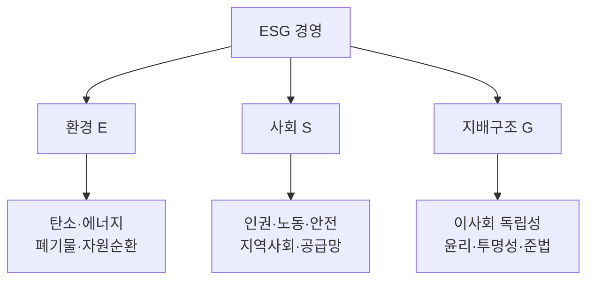

# ESG 경영(Environment, Social, Governance)

## 1. 개요

### 가. 정의 및 목표
> **환경(E)·사회(S)·지배구조(G)** 의 비재무적 요소를 경영 의사결정에 통합하여, **지속가능성과 장기 기업가치**를 함께 추구하는 경영 패러다임.

ESG의 핵심은 "**재무제표에 잡히지 않던 비재무 리스크를 경영의 중심으로 끌어들인다**"는 데 있다. 과거 재무성과만으로 기업을 평가하던 방식은 탄소 규제, 협력사 인권 문제, 지배구조 불투명 같은 위험을 놓쳤고, 이런 위험이 실제로 소송·불매·투자 회수로 이어지며 기업가치를 훼손했다. ESG는 이 비재무 요소들을 측정·관리 대상으로 삼아, 단기 이익이 아니라 **지속가능한 성장과 이해관계자 신뢰**를 목표로 한다.

### 나. 등장 배경 및 필요성
기후위기의 현실화와 사회적 책임 요구의 확대가 배경이다. 특히 **ESG 정보의 공시가 의무화**(TCFD, 국제 지속가능성 공시기준 ISSB 등)되고, 글로벌 자산운용사·연기금이 투자 결정에 ESG 평가를 반영하면서, ESG는 "착한 기업의 선택"이 아니라 **자금 조달과 생존이 걸린 필수 과제**가 되었다. 즉 규제·자본시장·소비자 세 방향의 압력이 동시에 작용해 기업이 ESG를 외면하기 어려워진 것이다.

## 2. ESG 구성 및 주요 지표

세 축은 서로 다른 이해관계자와 위험을 다룬다. **환경(E)** 은 기후·자원과 관련해 온실가스 배출량을 핵심 지표로 삼는데, 여기서 Scope 1(직접 배출)·2(구매 전력)·3(공급망 전체)의 구분이 중요하다. Scope 3는 통제하기 가장 어렵지만 배출량의 대부분을 차지하는 경우가 많아, 진정한 감축은 공급망 협력을 요구한다. **사회(S)** 는 임직원·협력사·지역사회 등 사람과의 관계로, 산업안전·인권·다양성·공급망 실사가 지표다. **지배구조(G)** 는 이 모든 것이 제대로 굴러가게 하는 의사결정 체계로, 이사회 독립성·윤리경영·공시 투명성을 본다. E·S가 아무리 좋아도 G가 부실하면 지속되지 못하므로, G는 나머지를 떠받치는 토대로 여겨진다. 측정에는 GRI·SASB·TCFD·ISSB 같은 국제 표준과 국내 **K-ESG 가이드라인**이 쓰인다.

| 영역 | 주요 지표 |
|---|---|
| 환경(E) | 온실가스(Scope 1·2·3), 재생에너지 비율, 폐기물·용수 |
| 사회(S) | 산업안전, 인권·다양성, 공급망 실사, 지역사회 |
| 지배구조(G) | 이사회 독립성, 윤리경영, 공시 투명성, 준법 |
| 표준 | GRI, SASB, TCFD, ISSB, K-ESG 가이드라인 |

## 3. ESG를 지원하는 IT

ESG는 "**측정할 수 없으면 관리할 수 없고, 관리할 수 없으면 공시할 수 없다**"는 명제 위에 서 있어, 데이터를 다루는 IT가 필수 기반이 된다. **IoT·센서**는 공장·설비의 에너지 사용과 탄소 배출을 실시간으로 계측해, 추정이 아닌 실측 데이터를 제공한다. **빅데이터·AI**는 이 데이터로 배출량을 예측·최적화하고 ESG 리스크(협력사 이슈 등)를 조기에 탐지한다. **블록체인**은 위·변조가 어려운 특성을 이용해 공급망 원산지 추적과 탄소배출권 거래의 투명성을 보장한다. **클라우드·EMS(에너지관리시스템)** 는 자원 효율을 높여 그린 IT를 실현하고, **ESG 공시 플랫폼**은 흩어진 데이터를 수집·집계·리포팅해 공시 작업을 자동화한다. 즉 IT는 ESG 데이터의 수집→분석→공시 전주기를 관통한다.

| IT 기술 | ESG 기여 |
|---|---|
| IoT·센서 | 실시간 에너지·탄소 배출 실측 |
| 빅데이터·AI | 배출량 예측·최적화, 리스크 분석 |
| 블록체인 | 공급망 추적·탄소배출권 거래 투명성 |
| 클라우드·EMS | 에너지 관리, 그린 IT |
| ESG 공시 플랫폼 | 데이터 수집·집계·리포팅 자동화 |

## 4. 추진 시 고려사항

ESG 추진의 최대 함정은 **그린워싱**, 즉 실제보다 친환경·사회적 성과를 부풀리는 것이다. 이는 공시 데이터의 신뢰성 문제로 직결되므로, 측정·검증(제3자 인증) 체계를 갖춰 데이터가 근거를 갖도록 해야 한다. 또 ISSB 등 강화되는 공시 기준을 준수하려면 재무데이터 수준의 엄밀함이 요구되고, 이를 뒷받침할 **ESG 전담조직과 이사회 감독**이라는 거버넌스가 필요하다. 특히 Scope 3처럼 협력사에 걸친 지표는 자사 노력만으로 안 되므로 **공급망 전반의 ESG 실사·관리**가 관건이 된다.

| 구분 | 내용 |
|---|---|
| 데이터 신뢰성 | 측정·제3자 검증으로 그린워싱 방지 |
| 공시 대응 | ISSB·지속가능성 공시 기준 준수 |
| 거버넌스 | ESG 전담조직·이사회 감독 |
| 공급망 | 협력사 ESG 실사·Scope 3 관리 |

## 5. 고려사항 및 시사점
- **비용이 아닌 투자**: ESG는 규제·평판 리스크를 줄이는 방어인 동시에, 친환경 신제품·녹색금융 같은 신규 기회를 여는 공격이기도 하다. 기술사 관점에서는 리스크 관리와 기회 창출을 함께 보는 균형이 필요하다.
- **데이터 거버넌스가 승부처**: 공시가 의무화·정량화될수록 결국 "믿을 수 있는 데이터를 얼마나 체계적으로 확보하느냐"가 경쟁력을 가른다. IT 부서의 역할이 지원을 넘어 핵심으로 이동한다.
- **표준의 수렴**: 난립하던 ESG 표준이 ISSB를 축으로 수렴 중이므로, 조기에 국제 기준에 맞춘 데이터 체계를 구축한 기업이 규제 대응·글로벌 자본 유치에서 앞선다.

---

> **한 줄 요약**: ESG 경영은 *환경·사회·지배구조의 비재무 리스크를 경영에 통합*하는 지속가능경영으로, "측정해야 관리·공시 가능"하기에 IoT·AI·블록체인·공시 플랫폼이 데이터 전주기를 뒷받침하며, 데이터 신뢰성(그린워싱 방지)이 성패를 가른다.
