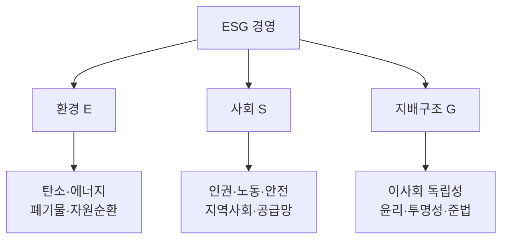

# ESG 경영(Environment, Social, Governance)

## 1. 개요

### 가. 정의 및 목표
> **환경(E)·사회(S)·지배구조(G)** 의 비재무적 요소를 경영에 통합하여 **지속가능성과 기업가치**를 함께 추구하는 경영 패러다임.
- **목표**: 지속가능 성장, 기업가치·평판 제고, 이해관계자 신뢰, 규제·공시 대응

### 나. 등장 배경
- 기후위기·사회적 책임 요구 증가
- **ESG 공시 의무화**(TCFD·ISSB), 투자기관의 ESG 평가 반영

## 2. ESG 구성 및 주요 지표

| 영역 | 주요 지표 |
|---|---|
| **환경(E)** | 온실가스(Scope 1·2·3), 재생에너지 비율, 폐기물·용수 |
| **사회(S)** | 산업안전, 인권·다양성, 공급망 실사, 지역사회 |
| **지배구조(G)** | 이사회 독립성, 윤리경영, 공시 투명성, 준법 |
| **표준** | GRI, SASB, TCFD, ISSB, **K-ESG 가이드라인** |

## 3. ESG를 지원하는 IT

| IT 기술 | ESG 기여 |
|---|---|
| **IoT·센서** | 실시간 에너지·탄소 배출 모니터링 |
| **빅데이터·AI** | 배출량 예측·최적화, ESG 리스크 분석 |
| **블록체인** | 공급망 추적·탄소배출권 거래 투명성 |
| **클라우드·EMS** | 에너지 관리 시스템, 그린 IT |
| **ESG 공시 플랫폼** | 데이터 수집·집계·리포팅 자동화 |

## 4. 추진 시 고려사항

| 구분 | 내용 |
|---|---|
| **데이터 신뢰성** | 측정·검증 체계로 **그린워싱 방지** |
| **공시 대응** | ISSB·지속가능성 공시 기준 준수 |
| **거버넌스** | ESG 전담조직·이사회 감독 |
| **공급망** | 협력사 ESG 실사·관리 |

## 5. 고려사항 및 시사점
- ESG는 **비용이 아닌 투자** — 리스크 관리·신규 기회
- IT는 ESG 데이터의 **수집·측정·공시** 전주기를 뒷받침(측정 가능해야 관리 가능)
- 규제 강화(공시 의무화)에 대비한 데이터 거버넌스 필수

---

> **한 줄 요약**: ESG 경영은 *환경·사회·지배구조* 지표를 관리하는 지속가능경영이며, **IoT·AI·블록체인·공시 플랫폼** 등 IT가 데이터 측정·분석·공시를 지원하고 데이터 신뢰성이 관건이다.
