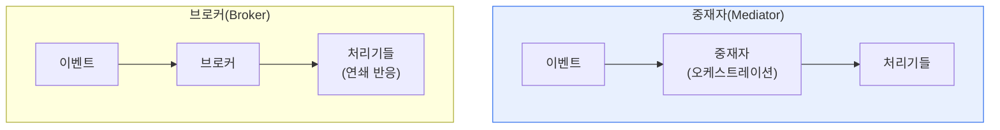

# 이벤트 기반 아키텍처(EDA) — 중재자·브로커 토폴로지

## 1. 개요

### 가. 정의
> **이벤트 기반 아키텍처(Event Driven Architecture)** 는 상태 변화를 나타내는 '이벤트'의 발생·전달·처리를 중심으로 시스템을 구성하는 아키텍처 스타일. 컴포넌트가 이벤트를 발행(Publish)하고 구독(Subscribe)해 **느슨하게 결합**된 채 비동기로 협력한다.

EDA의 핵심 발상은 '**직접 호출하지 말고 이벤트로 알려라**'이다. 전통적 시스템은 A가 B를 직접 호출해 강하게 결합되므로, B가 바뀌거나 느려지면 A도 영향을 받는다. EDA에서는 A가 "주문이 생성됐다"는 이벤트를 발행만 하고, 그 이벤트에 관심 있는 B·C·D가 알아서 구독해 반응한다. A는 누가 이벤트를 받는지 몰라도 되고, 새로운 처리기를 추가해도 A를 고칠 필요가 없다. 이 느슨한 결합과 비동기 처리 덕분에 시스템은 유연하게 확장되고, 실시간 반응이 가능하며, 한 부분의 장애가 전체로 번지지 않는다. EDA를 구현하는 방식은 이벤트 흐름을 어떻게 조율하느냐에 따라 **중재자 토폴로지** 와 **브로커 토폴로지** 로 나뉜다.

### 나. 필요성
MSA·실시간 처리·IoT가 확산되며, 서비스 간 강한 결합으로는 확장과 변경이 어려워졌다. EDA는 느슨한 결합과 비동기로 확장성·실시간성·장애 격리를 제공한다.

## 2. 중재자 토폴로지 vs 브로커 토폴로지

두 토폴로지는 이벤트 흐름을 누가 조율하느냐가 다르다. **중재자 토폴로지** 는 중앙의 중재자(오케스트레이터)가 이벤트 처리 순서와 흐름을 지휘한다. 여러 단계를 조율해야 하는 복잡한 업무(예: 주문→결제→배송의 순차 처리)에 적합하고 흐름 파악이 쉽지만, 중재자가 단일 병목·장애점이 될 수 있다. **브로커 토폴로지** 는 중앙 조율자 없이 이벤트가 브로커(메시지 큐)를 통해 전달되고 각 처리기가 연쇄적으로 반응한다. 결합도가 더 낮고 확장성이 뛰어나지만, 전체 흐름을 추적하기 어렵다.

| 구분 | 중재자 토폴로지 | 브로커 토폴로지 |
|---|---|---|
| **조율** | 중앙 중재자가 흐름 지휘 | 중앙 조율 없음(연쇄 반응) |
| **결합도** | 상대적 높음 | 매우 낮음 |
| **흐름 파악** | 쉬움(중앙 집중) | 어려움(분산) |
| **적합** | 복잡한 순차·조율 업무 | 단순·고확장 이벤트 처리 |
| **약점** | 중재자 병목·장애점 | 흐름 추적·오류 처리 곤란 |

## 3. 구성요소

| 구성요소 | 내용 |
|---|---|
| **이벤트 생산자** | 상태 변화를 이벤트로 발행 |
| **이벤트 채널/브로커** | 이벤트 전달(Kafka·메시지 큐) |
| **이벤트 소비자** | 이벤트를 구독·처리 |
| **중재자** | (중재자 토폴로지) 흐름 조율 |

## 4. 고려사항 및 시사점

1. **토폴로지 선택은 업무 복잡도에 달렸다**. 여러 단계를 엄격히 조율해야 하면 중재자를, 단순하고 확장성이 중요하면 브로커를 택한다. 실제로는 혼합해 쓰기도 한다.
2. **최종 일관성·오류 처리 설계**가 관건이다. 비동기 이벤트 처리는 즉시 일관성이 보장되지 않으므로, 최종 일관성·보상 트랜잭션(사가)·재처리·멱등성을 설계해야 한다.
3. **MSA·실시간 시스템의 핵심**이다. 마이크로서비스 간 느슨한 결합, 실시간 스트리밍(Kafka), IoT 이벤트 처리의 기반이 되며, 이벤트 소싱·CQRS와 결합해 발전한다.

---

> **한 줄 요약**: EDA는 *이벤트의 발행·구독으로 컴포넌트를 느슨하게 결합* 하는 아키텍처로, 중앙 조율자가 흐름을 지휘하는 중재자 토폴로지와 조율자 없이 연쇄 반응하는 브로커 토폴로지로 구현되며, 최종 일관성·오류 처리 설계가 관건이다.
