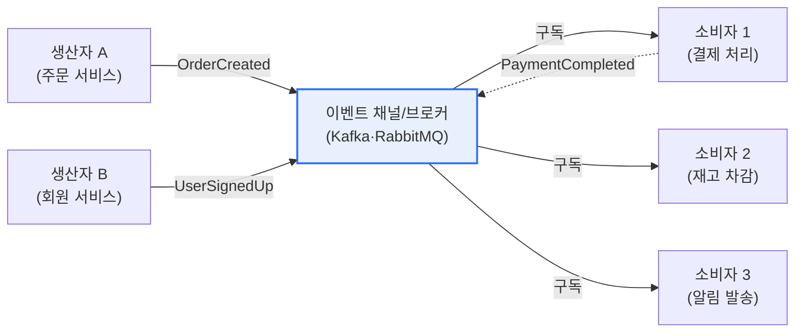
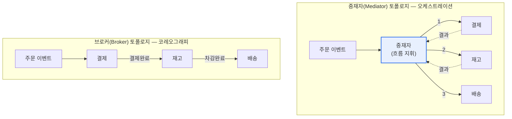

# 이벤트 기반 아키텍처(EDA) 토폴로지

## 1. 개요

### 가. 정의

> **이벤트 기반 아키텍처(Event Driven Architecture, EDA)** 는 시스템의 상태 변화를 나타내는 '이벤트(event)'의 발생·전달·처리를 중심으로 컴포넌트를 구성하는 아키텍처 스타일이다. 컴포넌트는 이벤트를 발행(Publish)하고 구독(Subscribe)하여 **느슨하게 결합(loose coupling)** 된 채 비동기(asynchronous)로 협력한다.

EDA의 핵심 발상은 한 문장으로 요약된다 — '**직접 호출하지 말고 이벤트로 알려라(Don't call, notify)**'. 전통적인 요청-응답(request-response) 방식의 시스템에서는 서비스 A가 서비스 B의 API를 직접 호출한다. 이 방식은 직관적이지만 A와 B가 **시간적·공간적으로 강하게 결합**된다는 대가를 치른다. B가 응답하기 전까지 A는 스레드를 붙잡고 기다려야 하고(시간적 결합), A는 B의 주소·인터페이스·가용성을 알고 있어야 한다(공간적 결합). 결과적으로 B가 느려지거나 장애가 나면 그 영향이 곧바로 A로, 다시 A를 호출한 상위 서비스로 연쇄 전파(cascading failure)된다.

EDA는 이 결합의 방향과 성격을 근본적으로 바꾼다. A는 "주문이 생성되었다(OrderCreated)"는 사실을 이벤트로 발행할 뿐, 누가 그 이벤트를 소비하는지 전혀 알지 못한다. 그 이벤트에 관심 있는 결제 서비스 B, 재고 서비스 C, 알림 서비스 D가 스스로 구독하여 각자 반응한다. 새로운 소비자(예: 마케팅 분석 서비스 E)를 추가할 때도 A의 코드는 한 줄도 바뀌지 않는다. 이처럼 **생산자와 소비자가 서로를 모르는(anonymous)** 관계가 EDA의 본질이며, 여기서 확장성·유연성·장애 격리(fault isolation)라는 세 가지 이점이 파생된다. 발행 즉시 A가 자기 일을 끝내므로 응답 지연이 사라지고(실시간성), 소비자 하나가 죽어도 이벤트는 큐에 남아 나중에 처리되므로 장애가 격리된다.

이러한 EDA를 실제로 구현할 때, 이벤트 흐름을 **누가 조율하는가** 에 따라 구현 형태가 갈린다. 조율의 책임을 중앙의 조정자에게 맡기면 **중재자(Mediator) 토폴로지**, 조정자 없이 이벤트가 브로커를 거쳐 스스로 흘러가게 두면 **브로커(Broker) 토폴로지** 가 된다. 이 두 토폴로지의 선택이 EDA 설계의 첫 번째이자 가장 중요한 의사결정이다.

### 나. 등장 배경 및 필요성

EDA가 최근 다시 주목받는 배경에는 세 가지 산업적 변화가 있다. 첫째, **마이크로서비스 아키텍처(MSA)의 확산** 이다. 하나의 거대한 모놀리스를 수십·수백 개의 독립 서비스로 쪼개면 서비스 간 통신량이 폭증하는데, 이를 전부 동기 REST 호출로 처리하면 서비스들이 촘촘하게 얽혀 '분산 모놀리스(distributed monolith)'라는 안티패턴에 빠진다. 이벤트를 통한 비동기 통신은 이 문제를 해소하는 정석적 해법이다.

둘째, **실시간 처리(real-time processing)에 대한 요구** 다. 금융 이상거래 탐지, 실시간 추천, IoT 센서 스트림 처리처럼 "지금 이 순간 일어난 일"에 즉시 반응해야 하는 업무가 늘었다. 배치(batch) 방식으로는 이 즉시성을 확보할 수 없고, 상태 변화를 그 즉시 이벤트로 흘려보내는 EDA가 자연스러운 선택이 된다. 셋째, **IoT·모바일의 폭발적 이벤트 생성** 이다. 수백만 대의 디바이스가 초당 막대한 양의 신호를 쏟아내는 환경에서는 이를 완충하고 여러 소비자에게 분배할 수 있는 이벤트 백본(backbone)이 필수적이다. 이 세 흐름이 겹치면서, 느슨한 결합·비동기·확장성을 동시에 제공하는 EDA가 클라우드 네이티브 시대의 기본 아키텍처로 자리 잡았다.

## 2. EDA의 구성요소와 이벤트 처리 흐름

EDA를 이해하려면 먼저 그 구성 부품과 이벤트가 흐르는 경로를 파악해야 한다. 아래 다이어그램은 EDA의 전체 구조를 도식화한 것이다.

```mermaid
flowchart LR
  P1["생산자 A<br/>(주문 서비스)"] -->|OrderCreated| CH["이벤트 채널/브로커<br/>(Kafka·RabbitMQ)"]
  P2["생산자 B<br/>(회원 서비스)"] -->|UserSignedUp| CH
  CH -->|구독| C1["소비자 1<br/>(결제 처리)"]
  CH -->|구독| C2["소비자 2<br/>(재고 차감)"]
  CH -->|구독| C3["소비자 3<br/>(알림 발송)"]
  C1 -.->|PaymentCompleted| CH
  style CH fill:#e8f0fe,stroke:#2f6fed,stroke-width:2px
```

**이벤트 생산자(Producer)** 는 상태 변화가 일어난 시점에 그 사실을 이벤트로 만들어 발행하는 주체다. 여기서 중요한 설계 원칙은 이벤트가 "무엇을 하라(command)"가 아니라 "무슨 일이 일어났다(fact)"를 담아야 한다는 점이다. 예컨대 "결제하라"가 아니라 "주문이 생성되었다"를 발행해야, 생산자가 소비자의 처리 방식에 개입하지 않고 결합이 느슨하게 유지된다. 생산자는 이벤트를 발행하는 순간 자신의 트랜잭션을 완료하며, 이후 처리에는 관여하지 않는다.

**이벤트 채널/브로커(Channel/Broker)** 는 이벤트가 지나가는 통로이자 완충 장치다. Apache Kafka, RabbitMQ, AWS EventBridge, NATS 등이 대표적이다. 브로커는 생산자와 소비자를 물리적으로 분리(decoupling)하는 핵심 부품으로, 소비자가 잠시 죽어 있어도 이벤트를 보관했다가 재개 시 전달하는 내구성(durability)을 제공한다. 특히 Kafka는 이벤트를 삭제하지 않고 로그(log)로 보존하여, 나중에 합류한 소비자도 과거 이벤트를 처음부터 재생(replay)할 수 있게 한다. 이 특성이 뒤에 설명할 이벤트 소싱(Event Sourcing)의 토대가 된다.

**이벤트 소비자(Consumer)** 는 관심 있는 이벤트를 구독하여 실제 비즈니스 로직을 수행한다. 소비자는 처리 결과로 다시 새로운 이벤트를 발행할 수 있고(위 그림의 PaymentCompleted), 이 연쇄가 업무 프로세스를 완성한다. 소비자 설계에서 가장 중요한 것은 **멱등성(idempotency)** 이다. 브로커는 네트워크 장애 대비를 위해 최소 한 번 전달(at-least-once)을 보장하는 경우가 많은데, 이는 같은 이벤트가 두 번 도착할 수 있음을 의미한다. 따라서 소비자는 동일 이벤트를 여러 번 처리해도 결과가 한 번 처리한 것과 같도록(예: 이벤트 ID 기반 중복 제거) 설계해야 한다.

**중재자(Mediator)** 는 중재자 토폴로지에서만 등장하는 특수 구성요소로, 여러 단계에 걸친 이벤트 처리 순서와 조건 분기를 중앙에서 지휘한다. 그 역할과 대안은 다음 절에서 자세히 다룬다.

## 3. 중재자 토폴로지 vs 브로커 토폴로지

EDA의 두 대표 토폴로지는 "복잡한 업무 흐름을 누가 책임지고 조율하는가"에서 갈라진다. 아래 다이어그램은 동일한 '주문 처리' 업무를 두 토폴로지가 각각 어떻게 처리하는지 대비한 것이다.

```mermaid
flowchart TB
  subgraph MED["중재자(Mediator) 토폴로지 — 오케스트레이션"]
    direction LR
    E1["주문 이벤트"] --> M["중재자<br/>(흐름 지휘)"]
    M -->|1| P["결제"]
    M -->|2| I["재고"]
    M -->|3| D["배송"]
    P -.결과.-> M
    I -.결과.-> M
  end
  subgraph BRK["브로커(Broker) 토폴로지 — 코레오그래피"]
    direction LR
    E2["주문 이벤트"] --> B1["결제"] -->|결제완료| B2["재고"] -->|차감완료| B3["배송"]
  end
  style M fill:#e8f0fe,stroke:#2f6fed,stroke-width:2px
```

### 가. 중재자 토폴로지 — 오케스트레이션(Orchestration)

**중재자 토폴로지** 는 중앙의 중재자(오케스트레이터)가 지휘자처럼 전체 흐름을 통제한다. 오케스트라의 지휘자가 각 악기의 연주 시점을 지시하듯, 중재자는 "먼저 결제하고, 성공하면 재고를 차감하고, 그다음 배송을 시작하라"는 순서와 조건을 알고 있으며 각 처리기를 순차적으로 호출한다. 이 방식의 가장 큰 장점은 **흐름의 가시성** 이다. 업무의 전체 시나리오가 중재자 한 곳에 명시적으로 표현되므로, 어떤 단계에서 문제가 생겼는지 파악하고 추적하기 쉽다.

특히 여러 단계가 엄격한 순서와 조건 분기를 요구하는 복잡한 업무(예: 보험 청구 심사, 대출 승인 워크플로)에 적합하다. 각 단계의 성공·실패에 따라 다음 행동이 달라지는 상태 기계(state machine) 성격의 업무를 중재자가 명확하게 표현할 수 있기 때문이다. 실무에서는 Netflix의 **Conductor**, Uber의 **Cadence**, 그리고 그 후속인 **Temporal**, AWS **Step Functions** 같은 워크플로 엔진이 이 중재자 역할을 담당한다.

그러나 중재자 토폴로지에는 대가가 따른다. 첫째, 중재자가 **단일 병목·장애점(SPOF)** 이 될 수 있다. 모든 흐름이 중재자를 거치므로 중재자의 성능이 전체 처리량의 상한이 되고, 중재자가 죽으면 해당 업무 전체가 멈춘다. 둘째, 처리기들이 중재자를 통해 간접적으로나마 조율되므로 브로커 토폴로지보다 결합도가 상대적으로 높다. 새로운 단계를 추가하려면 중재자의 흐름 정의를 수정해야 하는 경우가 많다.

### 나. 브로커 토폴로지 — 코레오그래피(Choreography)

**브로커 토폴로지** 는 중앙 조율자 없이, 각 처리기가 이벤트를 받으면 자기 일을 하고 그 결과를 다시 이벤트로 발행하여 다음 처리기를 촉발하는 **연쇄 반응(chain reaction)** 방식이다. 무용수들이 지휘자 없이 서로의 동작에 반응하며 군무를 완성하는 코레오그래피에 비유된다. 결제 서비스가 "결제 완료"를 발행하면 재고 서비스가 이를 듣고 차감한 뒤 "차감 완료"를 발행하고, 다시 배송 서비스가 반응하는 식이다.

이 방식의 장점은 **극도로 낮은 결합도와 뛰어난 확장성** 이다. 중앙 조율자가 없으므로 병목이 없고, 각 서비스는 완전히 독립적으로 배포·확장될 수 있다. "결제 완료" 이벤트에 관심 있는 새로운 서비스(예: 적립금 지급)를 추가할 때 기존 서비스는 전혀 손대지 않아도 된다. 그래서 단순하고 확장성이 최우선인 대용량 이벤트 처리에 적합하다.

반면 가장 큰 약점은 **전체 흐름을 추적하기 어렵다** 는 점이다. 업무 로직이 여러 서비스에 흩어져 있어 "지금 이 주문이 전체 프로세스의 어디까지 진행됐는가"를 한눈에 파악하기 어렵고, 순환 의존(A→B→A)이나 예상치 못한 연쇄가 발생할 위험이 있다. 이 때문에 브로커 토폴로지에서는 분산 추적(distributed tracing)과 상관관계 ID(correlation ID)를 통한 관측성(observability) 확보가 필수다.

### 다. 두 토폴로지의 비교

| 구분 | 중재자 토폴로지 | 브로커 토폴로지 |
|---|---|---|
| **조율 방식** | 중앙 중재자가 흐름 지휘(오케스트레이션) | 중앙 조율 없이 연쇄 반응(코레오그래피) |
| **결합도** | 상대적으로 높음 | 매우 낮음 |
| **흐름 가시성** | 높음(한 곳에 집중) | 낮음(여러 서비스에 분산) |
| **적합 업무** | 복잡한 순차·조건 분기 업무 | 단순·고확장 이벤트 처리 |
| **주요 약점** | 중재자 병목·SPOF | 흐름 추적·순환 의존 위험 |
| **대표 기술** | Temporal, AWS Step Functions | Kafka 기반 순수 pub/sub |

두 토폴로지의 차이가 생기는 근본 이유는 **"업무 로직의 위치"** 에 있다. 중재자 토폴로지는 업무 흐름 로직을 중앙에 모으고, 브로커 토폴로지는 각 서비스에 분산시킨다. 따라서 선택 기준도 명확하다 — 흐름이 복잡하고 감사·추적이 중요하면 중재자를, 흐름이 단순하고 확장성·독립성이 중요하면 브로커를 택한다. 실무에서는 이 둘을 이분법으로 나누기보다, 큰 도메인 경계에서는 코레오그래피로 느슨하게 두고 그 안의 복잡한 트랜잭션은 오케스트레이션으로 조율하는 **혼합(hybrid)** 방식을 흔히 쓴다.

## 4. 실무 사례와 분산 트랜잭션 — 사가(Saga) 패턴

EDA를 실제로 도입할 때 가장 먼저 부딪히는 벽은 **분산 트랜잭션** 이다. 하나의 DB 안에서라면 ACID 트랜잭션으로 "전부 성공 또는 전부 취소"를 보장할 수 있지만, 결제·재고·배송이 각기 다른 서비스와 DB에 있으면 이런 원자성을 확보할 수 없다. 이때 등장하는 것이 **사가(Saga) 패턴** 으로, 여러 서비스에 걸친 일련의 로컬 트랜잭션을 이벤트로 연결하되, 중간에 실패하면 앞서 성공한 작업을 되돌리는 **보상 트랜잭션(compensating transaction)** 을 실행하는 방식이다. 예컨대 배송 단계에서 실패하면 "재고 복구", "결제 취소" 보상 이벤트를 역순으로 발행한다. 사가는 오케스트레이션 사가(중재자가 보상까지 지휘)와 코레오그래피 사가(각 서비스가 보상 이벤트를 스스로 발행)로 나뉘며, 두 토폴로지 선택과 직결된다.

구체적 산업 사례를 보면 그 효과가 분명하다. 첫째, **Netflix** 는 수천 개의 마이크로서비스가 Kafka 기반 이벤트로 협력하며, 워크플로 조율에는 자체 개발한 Conductor를 사용한다. 재생·추천·과금 등 서비스가 이벤트로 느슨하게 결합되어 있어, 하루 수십억 건의 이벤트를 처리하면서도 개별 서비스의 독립 배포가 가능하다. 둘째, **Uber** 는 초기에 코레오그래피 방식의 문제(흐름 추적 곤란)를 겪고 Cadence(현 Temporal)를 개발하여, 배차·요금 계산 같은 장기 실행 워크플로를 중재자 방식으로 관리한다. 셋째, 전자상거래 플랫폼들은 주문 처리에 사가 패턴을 적용해, 결제 실패 시 자동으로 재고를 원복하고 사용자에게 알림을 보내는 흐름을 이벤트로 구성한다. 이 사례들은 "단순 이벤트 처리는 브로커, 복잡한 트랜잭션은 중재자"라는 선택 원칙을 실증한다.

## 5. 심화 — 이벤트 소싱·CQRS 및 최신 동향

EDA는 그 자체로 완결된 아키텍처이기도 하지만, 두 가지 심화 패턴과 결합하며 발전하고 있다. 첫째, **이벤트 소싱(Event Sourcing)** 은 애플리케이션의 상태를 현재 값이 아니라 "그 상태에 이르기까지 일어난 모든 이벤트의 나열"로 저장하는 방식이다. 은행 계좌를 예로 들면, 현재 잔액 10만 원을 저장하는 대신 "입금 5만, 입금 8만, 출금 3만"이라는 이벤트 시퀀스를 저장하고, 필요할 때 이를 재생하여 잔액을 계산한다. 이 방식은 완벽한 감사 추적(audit trail)과 과거 시점 복원(time travel)을 제공하지만, 상태를 매번 재계산하는 부담과 이벤트 스키마 변경(schema evolution)의 어려움이라는 대가가 있다.

둘째, **CQRS(Command Query Responsibility Segregation)** 는 데이터를 변경하는 명령(Command) 모델과 조회하는 쿼리(Query) 모델을 분리하는 패턴이다. EDA·이벤트 소싱과 결합하면, 쓰기는 이벤트로 처리하고 읽기는 이벤트를 소비해 만든 별도의 조회 전용 모델(read model)에서 담당한다. 이로써 읽기와 쓰기를 독립적으로 최적화·확장할 수 있으나, 쓰기 모델과 읽기 모델 사이에 **최종 일관성(eventual consistency)** 이라는 시간차가 생긴다. 사용자가 방금 쓴 데이터가 조회에는 몇 밀리초~수 초 뒤에야 반영될 수 있다는 뜻이며, 이를 UX 차원에서 다루는 설계가 필요하다.

최신 동향으로는 **이벤트 스트리밍 플랫폼의 표준화** 가 두드러진다. Apache Kafka가 사실상 표준 이벤트 백본으로 자리 잡았고, 클라우드에서는 서버리스 이벤트 라우팅(AWS EventBridge, Google Eventarc)이 확산되고 있다. 또한 이벤트 형식의 상호운용성을 위해 CNCF의 **CloudEvents** 규격이 등장하여, 벤더에 관계없이 이벤트 메타데이터를 표준화하려는 움직임이 있다. 데이터 관점에서는 서비스 각자가 자기 도메인의 데이터를 이벤트로 발행하고 소유하는 **데이터 메시(Data Mesh)** 개념과도 접점을 넓히고 있다. 이러한 흐름은 EDA가 단순한 통신 방식을 넘어 데이터 아키텍처 전반을 재편하는 축으로 확장되고 있음을 보여준다.

## 6. 고려사항 및 시사점

EDA는 강력하지만 만병통치약은 아니며, 도입 시 다음을 기술사 관점에서 종합적으로 판단해야 한다.

1. **토폴로지 선택은 업무 복잡도와 감사 요구가 결정한다.** 여러 단계를 엄격히 순서·조건에 따라 조율해야 하거나 규제상 흐름 추적이 필수라면 중재자 토폴로지를, 단순하고 확장성·서비스 독립성이 최우선이면 브로커 토폴로지를 택한다. 실무에서는 도메인 경계는 코레오그래피로, 그 안의 복잡한 트랜잭션은 오케스트레이션으로 두는 혼합 전략이 현실적이다.

2. **최종 일관성과 오류 처리 설계가 성패를 가른다.** 비동기 처리는 즉시 일관성을 포기하는 대가로 확장성을 얻는다. 따라서 최종 일관성을 전제로 사가·보상 트랜잭션, 재처리(retry)와 백오프(backoff), 죽은 편지 큐(Dead Letter Queue), 그리고 소비자의 멱등성을 반드시 함께 설계해야 한다. 이를 빠뜨리면 이벤트 유실·중복 처리로 데이터 정합성이 무너진다.

3. **관측성(observability)에 대한 선제 투자가 필요하다.** 흐름이 분산될수록 "무슨 일이 어디까지 일어났는가"를 추적하기 어려워진다. 상관관계 ID를 이벤트마다 전파하고, 분산 추적(OpenTelemetry)·중앙 로깅·이벤트 흐름 모니터링을 초기부터 구축해야 운영 단계의 디버깅 비용을 줄일 수 있다.

4. **조직 성숙도와 트레이드오프를 냉정히 평가해야 한다.** EDA는 개발·운영 복잡도를 확실히 높인다. 서비스가 몇 개뿐이고 트래픽이 크지 않은 초기 단계라면 동기 호출이 더 단순하고 효율적일 수 있다. EDA는 조직이 다수의 서비스를 독립적으로 운영할 역량(DevOps·모니터링·온콜 체계)을 갖췄을 때 비로소 그 이점이 비용을 넘어선다. 도입은 핵심 도메인부터 점진적으로 확대하는 전략이 안전하다.

5. **연계 기술과의 진화 방향을 조망해야 한다.** EDA는 MSA·이벤트 소싱·CQRS·데이터 메시와 결합하며 발전하고 있으며, CloudEvents 같은 표준과 서버리스 이벤트 라우팅이 도입 장벽을 낮추고 있다. 장기적으로는 실시간 데이터와 AI 추론 파이프라인을 잇는 스트리밍 백본으로서 EDA의 전략적 중요성이 더 커질 전망이다.

## 참고자료

- Martin Fowler, "What do you mean by Event-Driven?", https://martinfowler.com/articles/201701-event-driven.html
- Microservices.io, "Pattern: Saga", https://microservices.io/patterns/data/saga.html
- AWS, "Event-driven architecture", https://aws.amazon.com/event-driven-architecture/
- CNCF CloudEvents, https://cloudevents.io/

---

> **한 줄 요약**: EDA는 *이벤트의 발행·구독으로 컴포넌트를 느슨하게 결합* 하는 아키텍처로, 중앙 조율자가 흐름을 지휘하는 중재자 토폴로지와 조율자 없이 연쇄 반응하는 브로커 토폴로지로 구현되며, 사가·최종 일관성·멱등성·관측성 설계가 성패를 가른다.
