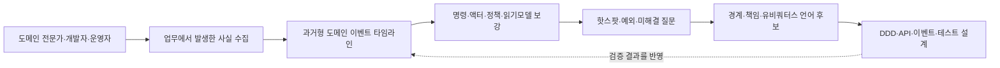
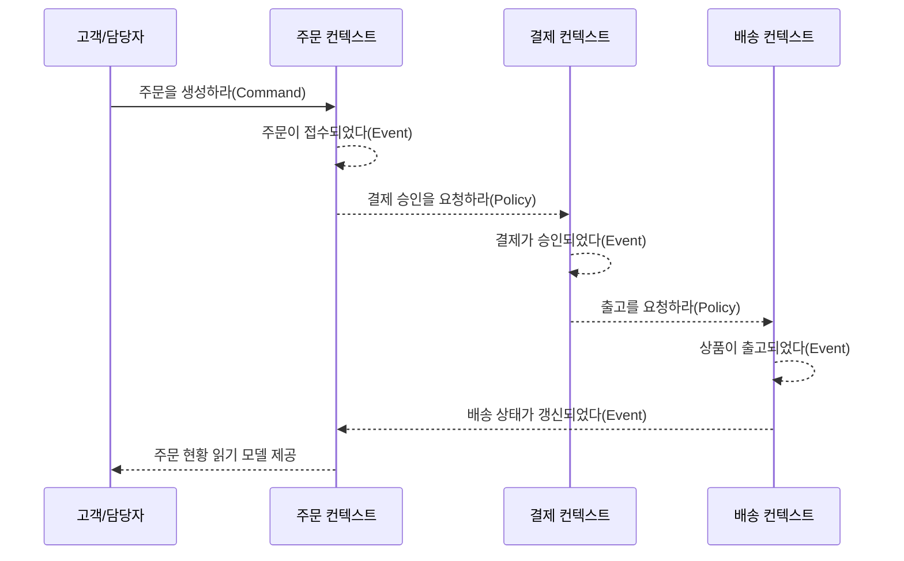

# EventStorming(이벤트 스토밍) 기반 도메인 탐색과 설계

## 1. 개요

> **정의**: EventStorming은 이해관계자와 개발자가 한 공간에서 도메인 이벤트를 시간 순서로 펼쳐 놓고, 복잡한 업무 영역의 사실·규칙·책임·경계를 공동으로 탐색하는 협업형 모델링 워크숍이다.

소프트웨어 프로젝트의 실패는 기술 스택을 잘못 선택해서만 발생하지 않는다.
업무 담당자가 사용하는 용어와 개발자가 설계한 객체의 의미가 다르거나, 부서마다 같은 업무를 다른 순서와 책임으로 이해할 때 요구사항은 문서로 고정되기 전에 이미 흔들린다.
특히 주문·결제·배송·환불처럼 여러 부서와 외부 시스템이 얽힌 업무는 단순한 화면 목록이나 CRUD 테이블만으로 전체 흐름을 설명하기 어렵다.

EventStorming은 이러한 지식 단절을 먼저 대화와 시각적 모델로 드러내는 방법이다.
참가자는 시스템이 무엇을 저장하는지부터 정하지 않고, 업무에서 이미 발생한 사실을 과거형 문장으로 적는다.
예를 들어 `주문이 접수되었다`, `결제가 승인되었다`, `상품이 출고되었다`와 같이 사건을 시간축 위에 배치하면, 서로 다른 사람들이 생각하는 업무 흐름의 공통점과 충돌이 동시에 보인다.

이 방식의 핵심은 정답인 설계도를 한 사람이 내려주는 것이 아니라, 도메인 전문가와 기술자가 함께 모델을 만들면서 **집단적 학습(collective learning)** 을 수행하는 데 있다.
따라서 결과물은 단순한 회의록이 아니라 유비쿼터스 언어 후보, 업무 규칙, 미해결 질문, 경계 후보, 후속 설계의 출발점이 된다.
EventStorming은 도메인 주도 설계(DDD)를 지원하지만 DDD의 모든 활동을 대신하지 않으며, UML·BPMN·데이터 모델을 폐기하는 기법도 아니다.

### 1.1 등장 배경과 필요성

전통적인 분석은 요구사항을 인터뷰하고, 분석가가 내용을 정리한 다음, 개발자에게 문서로 전달하는 선형 흐름을 취한다.
이 과정에서는 실제 업무를 수행하는 사람이 가진 암묵지가 문서화 과정에서 생략되고, 질문이 생겼을 때 다시 회의 일정을 잡아야 한다.
문서가 완성될 때까지 오류가 발견되지 않으면 구현 단계에서 재작업 비용이 급증한다.

반면 EventStorming은 큰 벽이나 디지털 보드 위에 모두가 동시에 카드를 붙이고 이동시킨다.
빠른 시각화는 말로만 존재하던 불일치를 즉시 드러내며, 카드의 위치와 문구를 바꾸는 비용이 작기 때문에 초기 가설을 안전하게 깨뜨릴 수 있다.
개발자는 업무 규칙을 직접 듣고, 현업은 기술적 제약과 데이터 흐름을 질문받으면서 서로의 관점을 보정한다.

이 기법은 특히 다음 조건에서 효과적이다.
첫째, 업무 용어가 부서별로 다르고 시스템 간 책임 경계가 불명확한 경우다.
둘째, 레거시 시스템을 현대화하면서 현재 동작과 목표 업무를 함께 이해해야 하는 경우다.
셋째, 신규 서비스의 문제 영역을 짧은 시간에 탐색하고 MVP의 범위를 정해야 하는 경우다.
넷째, 장애·민원·규제 대응처럼 정상 흐름만으로는 설명되지 않는 예외가 중요한 경우다.

### 1.2 목표와 비목표

EventStorming의 목표는 복잡한 도메인에 대해 **같은 사건을 같은 이름으로 이해하는 것**이다.
워크숍이 끝났을 때 모든 세부 설계가 결정될 필요는 없지만, 무엇이 발생했는지, 누가 원인을 제공했는지, 어떤 정책이 자동으로 반응하는지, 어디에 불확실성이 있는지는 드러나야 한다.
이 결과를 통해 팀은 조사 우선순위와 설계 의사결정을 정할 수 있다.

반대로 EventStorming은 확정된 데이터베이스 스키마, 완성된 API 명세, 실행 가능한 테스트 코드, 최종 조직도를 만드는 활동이 아니다.
카드의 위치는 모델의 현재 가설이며, 규칙과 경계는 후속 검증을 통해 바뀔 수 있다.
그러므로 결과물을 그대로 구현 명세로 복사하면 발견 단계의 불확실성을 숨기는 부작용이 생긴다.

## 2. 핵심 원리와 전체 구조

### 2.1 사건 중심 사고

도메인 이벤트는 업무 관점에서 의미가 있고 이미 발생한 사실이다.
이벤트는 일반적으로 과거형 동사와 명사로 표현하며, 누군가의 의도나 명령이 아니라 결과를 나타낸다.
`고객이 주문 버튼을 눌렀다`는 행위 또는 명령에 가깝지만, `주문이 접수되었다`는 도메인에서 관찰 가능한 사실이다.

이벤트를 먼저 배치하면 참가자들은 데이터베이스 테이블이나 서비스 이름보다 업무 변화에 집중한다.
사건의 순서를 놓고 토론하는 과정에서 선행 조건, 후속 반응, 지연, 취소, 재시도, 보상 흐름이 자연스럽게 나온다.
또한 같은 이벤트가 여러 곳에서 사용되는지 확인할 수 있어, 서비스 간 결합과 경계 후보를 탐색하는 데 도움이 된다.

이벤트의 이름은 구현 기술보다 업무 용어를 우선해야 한다.
예를 들어 `OrderStatus = 3`이라는 표현은 데이터베이스 상태값이지만, `결제가 승인되었다`는 현업도 이해할 수 있는 사실이다.
처음에는 완벽한 이름을 강요하지 않고, 논쟁이 생긴 표현을 별도 핫스팟으로 표시한 뒤 워크숍 후 유비쿼터스 언어로 정제한다.

위 구조는 분석이 한 번의 산출물 생성으로 끝나지 않음을 보여 준다.
타임라인에서 드러난 질문은 추가 인터뷰나 로그 분석으로 검증하고, 검증 결과는 다시 이벤트 이름과 순서를 바꾼다.
설계 단계에서 발견된 예외도 도메인 모델에 되돌려야 하므로, EventStorming은 반복적인 학습 루프에 가깝다.

### 2.2 색상과 모델 요소

색상은 국제 표준처럼 강제된 문법이 아니라 참가자 간 대화를 돕는 시각적 규칙이다.
팀이 다른 색상 체계를 사용해도 괜찮지만, 시작할 때 색상표와 예시를 합의하고 중간에 의미를 바꾸지 않아야 한다.
다음 표는 널리 쓰이는 기본 팔레트와 질문을 정리한 것이다.

|요소|대표 색상|문장 형태|확인할 질문|
|---|---|---|---|
|도메인 이벤트|주황|`~되었다`|무슨 사실이 발생했는가?|
|명령|파랑|`~하라`|무엇이 사건을 유발했는가?|
|액터|노랑|사용자·시스템·역할|누가 명령을 내렸는가?|
|정책|보라|`~이면 ~한다`|사건 뒤 어떤 규칙이 작동하는가?|
|읽기 모델|초록|조회 화면·판정 자료|명령 전에 무엇을 읽어야 하는가?|
|집계/애그리게이트|연분홍|업무 책임 단위|어떤 일관성을 함께 지켜야 하는가?|
|핫스팟|빨강 또는 분홍|질문·충돌·위험|무엇을 아직 모르는가?|
|경계|선 또는 분홍 라벨|바운디드 컨텍스트 후보|어디서 용어와 규칙이 달라지는가?|

표의 색상보다 중요한 것은 요소 사이의 인과 관계다.
명령은 어떤 액터의 의도이며, 명령이 성공하면 하나 이상의 이벤트가 발생한다.
이벤트는 정책을 촉발하거나 읽기 모델을 갱신하고, 다른 컨텍스트에 메시지로 전달될 수 있다.
따라서 카드를 단순히 나열하지 말고 화살표와 대화로 “왜 이 사건이 발생했는가”를 설명해야 한다.

액터는 사람만을 뜻하지 않는다.
고객, 상담원, 배치 작업, 결제 게이트웨이, 외부 규제기관, 다른 바운디드 컨텍스트도 명령의 주체나 이벤트의 소비자가 될 수 있다.
외부 시스템을 사람처럼 표현하는 것은 책임과 통합 지점을 찾기 위한 모델링 장치이며, 실제로 동일한 신뢰 수준을 가진다는 뜻은 아니다.

정책은 “이벤트가 발생하면 항상 무엇을 한다”와 같은 자동 반응을 표현한다.
예를 들어 `결제가 승인되면 배송 준비를 요청한다`는 정책은 결제와 배송의 결합을 설명한다.
하지만 정책이 동기 호출인지 비동기 이벤트 소비인지, 실패 시 재시도와 보상이 있는지는 별도의 설계 질문으로 남겨야 한다.

### 2.3 핫스팟의 역할

핫스팟은 모델의 빈틈이 아니라 학습을 위한 1급 산출물이다.
참가자가 `환불 완료`와 `환불 승인`을 서로 다른 의미로 사용하거나, 부분 환불의 책임자가 정해지지 않았다면 빨간 카드로 표시한다.
논쟁을 억지로 끝내고 임의의 용어를 채택하는 것보다, 불확실성을 가시화하는 편이 다음 의사결정의 품질을 높인다.

핫스팟은 우선순위를 가질 수 있다.
법적 위험이 큰 질문, 금액 정산에 직접 영향을 주는 질문, 장애가 반복되는 질문을 먼저 조사하고, 단순한 표현 차이는 후순위로 둔다.
각 핫스팟에 담당자와 확인 기한을 연결하면 워크숍이 아이디어 보드에 머물지 않고 실행 가능한 발견 백로그가 된다.

## 3. 워크숍 진행 절차

### 3.1 준비 단계

퍼실리테이터는 먼저 탐색 범위와 시간축의 시작·종료 조건을 정한다.
`온라인 주문의 결제 이후 배송까지`처럼 하나의 업무 목적과 시작·끝을 설명해야 하며, “회사 전체를 모두 모델링한다”와 같은 범위는 너무 넓다.
필요한 참가자는 도메인 전문가, 제품 책임자, 개발자, 아키텍트, 운영·고객지원 담당자이며, 외부 연동의 주체도 가능한 한 초대한다.

물리 워크숍에서는 벽면을 충분히 확보하고, 참가자 1인당 여러 장의 메모지와 굵은 펜을 준비한다.
디지털 워크숍에서는 무한 캔버스의 권한, 색상 템플릿, 화상회의 음성 품질, 시간대, 익명 의견 수집 방법을 사전에 점검한다.
도구가 화려해도 카드의 이동과 동시 편집이 어렵다면 논의가 느려지므로, 기능보다 흐름을 우선한다.

시작 전에 다음의 운영 원칙을 안내한다.
첫째, 직급보다 도메인 사실을 우선하고 누구나 카드를 붙인다.
둘째, 한 카드에는 하나의 의미만 쓴다.
셋째, 불확실한 내용을 숨기지 않고 핫스팟으로 표시한다.
넷째, 구현 용어가 나오더라도 업무 사건으로 다시 번역한다.
다섯째, 모든 이견을 즉시 해결하려 하지 않고 시간 상자를 지킨다.

### 3.2 Big Picture EventStorming

Big Picture 단계는 전체 흐름을 빠르게 펼치는 단계다.
참가자는 먼저 알고 있는 도메인 이벤트를 주황색 카드에 과거형으로 적고, 시간 순서를 완벽하게 맞추려 하지 않은 채 벽에 붙인다.
초기에는 카드가 중복되고 모순되어도 좋으며, 중복과 모순 자체가 지식 차이를 보여 주기 때문이다.

다음으로 참가자들은 카드를 읽어 비슷한 흐름을 묶고, 사건 사이의 공백과 충돌을 질문한다.
이 과정에서 업무의 정상 흐름뿐만 아니라 취소, 실패, 재처리, 만료, 보류, 보상 사건을 함께 적는다.
예를 들어 결제 승인만 기록하면 승인 실패·부분 취소·중복 승인 같은 실제 운영 이슈를 놓치게 된다.

Big Picture의 산출물은 하나의 완성 설계가 아니다.
대략적인 도메인 지형, 복잡한 구간, 논쟁이 많은 용어, 추가 탐색이 필요한 핫스팟을 찾는 것이 목표다.
보통 큰 범위에서 시작해도, 가치가 큰 흐름을 골라 Process 단계로 확대할 수 있어야 한다.

### 3.3 Process Level EventStorming

Process 단계는 하나의 특정 흐름을 선택해 명령·액터·정책·읽기 모델을 붙이는 단계다.
`주문이 접수되었다`라는 사건의 앞에 `주문을 생성하라`라는 명령과 고객이라는 액터를 배치하고, 필요한 장바구니 조회를 읽기 모델로 표시한다.
이렇게 하면 사건이 단순히 시간순으로 나열되는 것이 아니라 의도와 책임을 가진 흐름으로 구체화된다.

정책은 이벤트를 원인으로 하여 다음 명령을 만드는 규칙으로 적는다.
`결제가 승인되면 출고를 요청한다`라는 정책을 놓고, 참가자는 자동 반응인지 담당자 승인인지, 재시도 간격과 멱등성 키가 필요한지 토론한다.
이 대화는 업무 모델과 분산시스템 설계를 연결하지만, 기술 구현을 성급하게 결정하지 않도록 퍼실리테이터가 균형을 잡아야 한다.

Process 단계에서는 시간·책임·예외를 더 정밀하게 묻는다.
고객이 결제 화면을 닫았을 때 주문은 생성되었는지, 승인 응답이 늦었을 때 중복 결제를 어떻게 막는지, 배송사가 취소를 거절할 때 누가 고객에게 알리는지 등을 이벤트와 핫스팟으로 기록한다.
정상 경로와 예외 경로를 한 화면에 놓으면 운영 가능한 업무 흐름인지 판단하기 쉬워진다.

위 시퀀스는 특정 기술 스택을 뜻하지 않는다.
동기 API인지 메시지 브로커인지, 하나의 데이터베이스인지 여러 저장소인지는 신뢰성·지연·조직 구조를 추가로 분석해 결정한다.
다만 이벤트와 정책을 나누어 놓으면 결합 지점, 장애 전파, 재시도와 보상 설계를 논의할 공통 언어가 생긴다.

### 3.4 Software Design 단계

Software Design 단계에서는 Process 단계에서 고른 구간을 애그리게이트, 바운디드 컨텍스트, 서비스·이벤트·읽기 모델 후보로 확대한다.
애그리게이트는 모든 데이터를 한 테이블에 묶는 개념이 아니라, 하나의 트랜잭션에서 일관성을 지켜야 하는 업무 책임 단위다.
`주문`과 `결제`가 항상 하나의 트랜잭션이어야 한다고 가정하지 말고, 각각의 불변식과 실패 경계를 먼저 확인해야 한다.

바운디드 컨텍스트는 같은 단어가 다른 의미를 갖기 시작하는 지점에서 후보가 된다.
주문 컨텍스트의 “고객”은 구매 주체와 배송지를 가진 존재일 수 있지만, 마케팅 컨텍스트의 “고객”은 캠페인 반응과 세그먼트를 가진 대상일 수 있다.
두 모델을 하나의 거대한 고객 객체로 합치면 변경 이유가 섞이고, 서로 다른 규칙을 억지로 조정해야 한다.

컨텍스트 간 이벤트는 공개 계약처럼 관리한다.
이벤트의 이름, 필드, 발생 시점, 중복 가능성, 순서 보장, 개인정보 포함 여부, 보존 기간을 정의해야 한다.
워크숍의 카드가 곧 이벤트 스키마는 아니지만, 어떤 사실을 외부에 공개할지와 어떤 책임을 분리할지 결정하는 입력이 된다.

## 4. 모델 요소의 관계와 설계 해석

### 4.1 이벤트·명령·정책의 차이

명령은 아직 발생하지 않은 의도이며, 이벤트는 이미 발생한 사실이다.
명령은 거부될 수 있지만 이벤트는 발생 사실이므로 과거형으로 기록한다.
정책은 사건을 관찰해 후속 명령을 생성하는 규칙이며, 정책의 조건이 바뀌면 같은 이벤트에 대한 후속 행동도 달라질 수 있다.

예를 들어 `쿠폰을 적용하라`는 명령은 고객 또는 시스템이 요청한 의도다.
검증에 성공하면 `쿠폰이 적용되었다`라는 이벤트가 발생하고, 이벤트를 본 정책이 `할인 금액을 재계산하라`라는 후속 명령을 만들 수 있다.
반대로 쿠폰이 만료되었다면 명령은 거부되고, `쿠폰 적용이 거절되었다`와 같은 실패 사실을 별도로 남길 수 있다.

|구분|의미|시간적 관점|실무 산출물|
|---|---|---|---|
|명령|원하는 행동에 대한 요청|미래의 가능성|API 요청, 작업 큐 메시지|
|이벤트|이미 일어난 업무 사실|과거의 사실|도메인 이벤트, 감사 기록|
|정책|사건에 반응하는 업무 규칙|조건부 후속 행동|프로세스 매니저, 자동화 규칙|
|읽기 모델|판단에 필요한 조회 정보|현재의 관찰|화면, 검색 인덱스, 대시보드|

이 구분이 중요한 이유는 책임과 재처리 방식이 달라지기 때문이다.
명령은 권한·유효성·멱등성을 검사해야 하고, 이벤트는 중복 수신과 순서 역전을 고려해야 한다.
정책은 실패 시 재시도·보상·사람의 개입을 설계해야 하며, 읽기 모델은 지연된 최종 일관성을 사용자에게 어떻게 보여 줄지 결정해야 한다.

### 4.2 경계와 응집도

경계는 카드 사이에 선을 긋는 행위보다, 규칙과 언어의 응집도를 관찰하는 과정이다.
변경 이유가 함께 움직이고 같은 팀이 책임지며 동일한 불변식을 지켜야 하는 요소는 한 경계에 남길 가능성이 높다.
반대로 서로 다른 용어, 다른 속도, 다른 규제 책임을 가지면 통합이 있더라도 별도 컨텍스트로 분리할 이유가 생긴다.

경계를 너무 많이 만들면 메시지와 운영 부담이 늘어난다.
반대로 모든 것을 하나의 컨텍스트로 묶으면 독립 배포와 모델의 명확성이 사라진다.
따라서 카드의 개수나 마이크로서비스 유행이 아니라, 업무 능력·팀 구조·데이터 소유권·장애 격리를 함께 보고 경계를 결정해야 한다.

### 4.3 예외와 보상

실무 시스템은 정상 이벤트보다 예외의 비용이 크다.
결제 승인 후 배송 재고가 부족할 수 있고, 배송 요청 후 외부 택배 API가 일시적으로 중단될 수 있으며, 사용자가 이미 받은 상품을 환불할 수도 있다.
이러한 흐름은 “실패하면 롤백한다”는 단일 문장으로 처리되지 않으며, 이미 외부에 노출된 사실을 되돌리는 보상 이벤트가 필요하다.

워크숍에서는 예외를 별도 줄로 숨기지 말고 정상 타임라인 근처에 붙인다.
`결제가 승인되지 않았다`, `출고 요청이 만료되었다`, `환불이 완료되었다`처럼 고객과 운영자가 관찰할 수 있는 사건을 명시한다.
그 뒤 각 사건의 소유자, 재시도 횟수, 수동 처리 기준, 고객 알림, 감사 추적을 질문한다.

## 5. 비교와 활용 맥락

### 5.1 BPMN·UML·User Story와의 비교

BPMN은 업무 프로세스의 흐름과 게이트웨이·역할·메시지를 정형 기호로 표현하는 데 강하다.
UML 시퀀스 다이어그램은 객체 간 상호작용을, 클래스 다이어그램은 구조와 관계를 명확히 나타낸다.
User Story는 사용자 가치와 인수 조건을 관리하기 좋다.
EventStorming은 이들보다 정밀한 표기보다 빠른 공동 탐색과 지식 충돌의 노출을 우선한다.

따라서 EventStorming을 BPMN의 대체품으로 비교하기보다 발견에서 정형화로 이어지는 앞단의 활동으로 보는 것이 적절하다.
EventStorming에서 합의한 이벤트와 핫스팟을 바탕으로 BPMN의 승인 흐름, UML의 상호작용, User Story의 인수 조건을 구체화할 수 있다.
반대로 이미 규제가 강한 프로세스의 공식 통제 증적이 필요하다면 정형 문서가 최종 산출물이 되어야 한다.

|관점|EventStorming|BPMN/UML|User Story|
|---|---|---|---|
|주요 목적|도메인 공동 탐색|정형 프로세스·구조 표현|사용자 가치와 요구 관리|
|참여 방식|동시 협업·발언 중심|모델 작성자 중심이 되기 쉬움|제품·개발 협의 중심|
|불확실성 처리|핫스팟으로 가시화|다이어그램 밖 주석으로 남을 수 있음|백로그·질문으로 분리|
|강점|빠른 공통 이해와 경계 발견|정확한 검토·추적·자동화|우선순위와 인수 기준 관리|
|한계|정형성·재현성이 낮을 수 있음|초기 탐색에는 무거움|업무 전체 흐름을 놓칠 수 있음|

세 방법을 연결할 때는 변환 규칙을 명시해야 한다.
예를 들어 이벤트의 이름을 BPMN의 상태로 기계적으로 복사하면 이벤트와 상태를 혼동할 수 있다.
또한 카드에 없는 비기능 요구사항, 개인정보 처리 근거, 성능 목표, 보존 기간은 별도의 품질 속성 목록으로 보강해야 한다.

### 5.2 DDD·EDA·CQRS와의 연결

EventStorming은 DDD의 전략적 설계에서 바운디드 컨텍스트와 유비쿼터스 언어를 발견하는 데 유용하다.
또한 전술적 설계에서 애그리게이트와 도메인 이벤트 후보를 만들 수 있지만, 애그리게이트의 크기와 트랜잭션 경계는 코드·불변식 검증을 통해 다시 확인해야 한다.

Event-Driven Architecture(EDA)와 Event Sourcing도 EventStorming의 이벤트 개념을 활용할 수 있다.
그러나 워크숍에서 “이벤트”라고 부른 모든 카드가 브로커에 발행되는 통합 이벤트라는 뜻은 아니다.
업무 기록용 도메인 이벤트, 시스템 간 통합 이벤트, 저장을 위한 이벤트 소싱 이벤트는 목적·계약·보존 정책이 다를 수 있다.

CQRS에서는 명령 모델과 읽기 모델을 분리할 수 있지만, 읽기 모델이 많아질수록 갱신 지연과 재생성 비용이 커진다.
EventStorming에서 읽기 모델을 표시할 때는 단순히 화면 목록을 만드는 것이 아니라, 어떤 판단을 위해 어떤 데이터가 필요한지와 최신성 요구를 함께 기록해야 한다.

### 5.3 레거시 현대화 사례

가상의 유통기업이 15년 된 주문 시스템을 현대화한다고 가정한다.
기존 문서에는 주문 상태가 `READY`, `PAYED`, `DELIVERY`, `DONE`으로 적혀 있지만, 현업은 결제 승인 전 주문, 부분 출고, 반품 접수, 환불 대기라는 더 많은 상태를 구분하고 있다.
팀이 먼저 테이블을 서비스로 나누면 기존 상태값의 의미를 그대로 복제할 위험이 있다.

EventStorming에서는 운영자·상담원·개발자가 실제 고객 사례를 가져와 사건을 시간순으로 배치한다.
그 결과 `결제 승인됨`과 `결제 정산됨`이 다른 사건이고, `배송 완료`가 택배사의 통지와 고객 수령 확인으로 나뉜다는 사실이 드러날 수 있다.
이 차이는 서비스 경계와 데이터 계약을 설계하기 전에 해결해야 할 업무 질문이다.

후속 설계에서는 주문·결제·배송·반품을 독립 책임 후보로 두되, 처음부터 네 개의 마이크로서비스로 분해하지 않는다.
각 컨텍스트의 변경 빈도, 팀 소유권, 장애 격리, 데이터 일관성 요구를 검증한 뒤 단계적으로 분리한다.
이처럼 EventStorming은 레거시를 그대로 쪼개는 것이 아니라, 현재의 사실과 목표 모델 사이의 간극을 드러내는 도구다.

## 6. 퍼실리테이션과 품질 관리

### 6.1 퍼실리테이터의 역할

퍼실리테이터는 도메인 정답을 제시하는 사람이 아니라, 참여자가 사실을 말하고 충돌을 안전하게 다루도록 흐름을 설계하는 사람이다.
초기에 기술 용어가 대화를 지배하면 “이 업무에서 실제로 무슨 일이 일어나는가”로 질문을 되돌린다.
말이 적은 참여자에게는 카드 작성 시간을 주고, 직급 높은 사람의 의견이 곧 합의가 되지 않도록 익명 핫스팟을 활용한다.

시간 상자는 단계별로 운영한다.
예를 들어 전체 이벤트 수집, 타임라인 정리, 명령·액터 보강, 핫스팟 분류, 다음 단계 선정에 각각 종료 시점을 둔다.
논쟁이 긴 항목은 별도 질문 백로그로 옮기고, 전체 흐름의 학습이 멈추지 않도록 한다.

### 6.2 흔한 실패 패턴

첫 번째 실패는 개발자만 참여하여 기술 이벤트를 업무 이벤트처럼 적는 것이다.
`API 호출 성공`, `Kafka publish 완료`는 시스템 관찰 사실일 수 있지만, 업무 목적과 고객 가치가 보이지 않으므로 도메인 사건과 구분해야 한다.
두 번째 실패는 임원이나 기획자가 미리 정한 정답을 카드에 강요하는 것이다.
이 경우 워크숍은 합의 형식만 남고 실제 불확실성은 숨겨진다.

세 번째 실패는 모든 카드를 곧바로 마이크로서비스로 변환하는 것이다.
카드의 색상과 경계는 발견 가설이므로, 트래픽이나 팀 수만으로 서비스 경계를 확정하면 분산 트랜잭션과 운영 부담이 커진다.
네 번째 실패는 정상 흐름만 남기고 예외를 “나중에 처리”하는 것이다.
장애·취소·보상 흐름을 늦게 추가하면 실제 품질 요구가 빠지고, 운영 설계가 구현 후반으로 밀린다.

### 6.3 산출물의 지속 관리

워크숍 보드는 사진 한 장으로 끝내지 않는다.
이벤트 사전, 용어 결정 로그, 핫스팟 백로그, 컨텍스트 지도, 결정 기록(ADR), API·이벤트 계약으로 필요한 부분을 추출한다.
결과물에는 작성일, 범위, 참여자, 미해결 가정, 다음 검증 작업을 남겨 새 팀원이 모델의 신뢰 수준을 이해하도록 한다.

운영 중에는 실제 장애와 변경이 모델에 반영되는지 확인한다.
새로운 예외가 발견되었는데 보드가 갱신되지 않으면 모델은 현재 시스템과 분리된다.
반대로 모든 로그를 카드로 옮기면 업무 의미가 흐려지므로, 도메인 전문가가 관찰할 가치가 있는 사실과 기술적 텔레메트리를 구분한다.

## 7. 심화: 답안 구성과 출제 연계

기술사 답안에서는 EventStorming을 “포스트잇 회의 기법”으로만 정의하면 깊이가 부족하다.
정의 뒤에 복잡성의 원인인 지식 사일로, 용어 불일치, 레거시 책임 혼재를 제시하고, 이벤트 중심 탐색이 이를 어떻게 가시화하는지 설명해야 한다.
이후 Big Picture→Process→Software Design의 단계, 색상 요소, 핫스팟, 경계 발견을 개념도와 사례로 연결하면 논술 흐름이 자연스럽다.

비교 문제에서는 BPMN·UML·User Story와의 차이를 단순 표로 끝내지 말고, “발견 단계와 정형화 단계가 다르다”는 맥락을 제시한다.
EDA·DDD·CQRS와 연계할 때는 워크숍 이벤트와 통합 이벤트를 동일시하지 않는다는 주의점을 넣어야 한다.
마지막으로 퍼실리테이션 편향, 예외 누락, 산출물 최신화, 개인정보·보안 요구의 별도 관리까지 고려사항으로 정리한다.

예상 사례는 주문·결제처럼 익숙한 흐름을 사용하되, 결제 지연·부분 환불·외부 연동 실패를 넣어 분산시스템의 현실성을 보여 주는 것이 좋다.
수치가 필요한 경우에는 참석자 6~10명, 2~3시간의 소규모 Process 세션처럼 일반적인 운영 예시로 제시하고, 특정 조직의 성과로 과장하지 않는다.
답안의 결론은 “공동 학습을 통해 경계를 발견하고, 정형 산출물과 운영 거버넌스로 연결할 때 효과가 지속된다”로 수렴시키면 된다.

## 8. 고려사항 및 시사점

### 8.1 범위와 목적 통제

범위가 지나치게 넓으면 카드가 쌓이기만 하고 의사결정이 나오지 않는다.
고객 여정·업무 능력·특정 장애 흐름 중 하나를 선택하고, 시작과 종료 조건을 명확히 해야 한다.
반대로 범위를 너무 좁히면 컨텍스트 간 책임과 외부 영향이 보이지 않으므로 Big Picture에서 넓게 보고 Process에서 좁히는 계층적 접근이 필요하다.

### 8.2 참여자와 심리적 안전

도메인 지식은 한 직무에 독점되지 않는다.
상담원은 예외와 민원을, 운영자는 장애와 수동 조치를, 개발자는 시스템 제약을 알고 있으므로 이들을 함께 참여시켜야 한다.
직급이 높은 사람의 발언이 모델의 진실로 굳어지지 않도록 사실·가정·의견을 구분하고, 이견을 핫스팟으로 안전하게 남기는 운영이 중요하다.

### 8.3 정합성과 추적성

카드 모델은 빠르지만 정형성이 낮으므로, 합의된 용어와 결정은 이벤트 사전·ADR·요구사항·테스트로 추적해야 한다.
이벤트 이름이 API나 로그에서 바뀌었다면 영향 범위를 확인하고, 어떤 모델이 최신인지 저장소의 단일 기준을 정해야 한다.
모델과 구현의 차이를 숨기지 말고 차이의 이유와 유효 기간을 기록해야 한다.

### 8.4 분산시스템 품질

이벤트 기반 설계로 이어질 경우 중복, 순서 역전, 지연, 부분 실패, 재처리, 멱등성을 반드시 점검해야 한다.
워크숍이 업무 의미를 설명해도 네트워크의 전달 보장이나 브로커의 장애를 자동으로 해결하지는 않는다.
정책별 재시도·DLQ·보상·관찰 가능성·감사 로그를 설계하고, 고객에게 최종 일관성을 어떻게 알릴지 결정해야 한다.

### 8.5 개인정보와 보안

카드에 고객 식별자, 건강정보, 결제정보를 실제 값으로 적으면 워크숍 보드 자체가 개인정보 저장소가 된다.
실제 데이터 대신 가명·예시값을 사용하고, 디지털 보드의 접근권한·보존기간·다운로드 정책을 적용해야 한다.
이벤트 계약에는 최소수집, 목적 제한, 접근통제, 암호화, 감사 추적과 같은 비기능 요구사항을 별도로 연결해야 한다.

### 8.6 지속 가능한 개선

한 번의 워크숍으로 모델이 완성된다고 기대하지 않는다.
핫스팟을 조사하고 실제 운영 지표와 고객 피드백을 반영하며, 중요한 변경 때 짧은 재탐색 세션을 수행해야 한다.
팀이 바뀌어도 유비쿼터스 언어와 결정 기록을 통해 지식이 유지되도록 온보딩 자료와 저장소를 연결하는 것이 기술사 관점의 거버넌스다.

## 참고자료

- EventStorming 공식 사이트, Alberto Brandolini: https://www.eventstorming.com/
- EventStorming 공식 리소스: https://www.eventstorming.com/resources/
- Avanscoperta, Introducing EventStorming: https://blog.avanscoperta.it/2014/02/12/introducing-event-storming/
- Open Group Open Agile Architecture, Event Storming Workshop: https://pubs.opengroup.org/architecture/o-aa-standard/event-storming-workshop.html
- VMware Tanzu, Event Storming: https://blogs.vmware.com/tanzu/event-storming/

---

> **한 줄 요약**: EventStorming은 도메인 이벤트를 공동으로 시간축에 펼쳐 복잡한 업무의 언어·규칙·예외·경계를 발견하고, 그 결과를 DDD·EDA·정형 모델·운영 거버넌스로 연결하는 협업형 탐색 방법이다.
