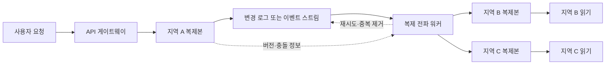
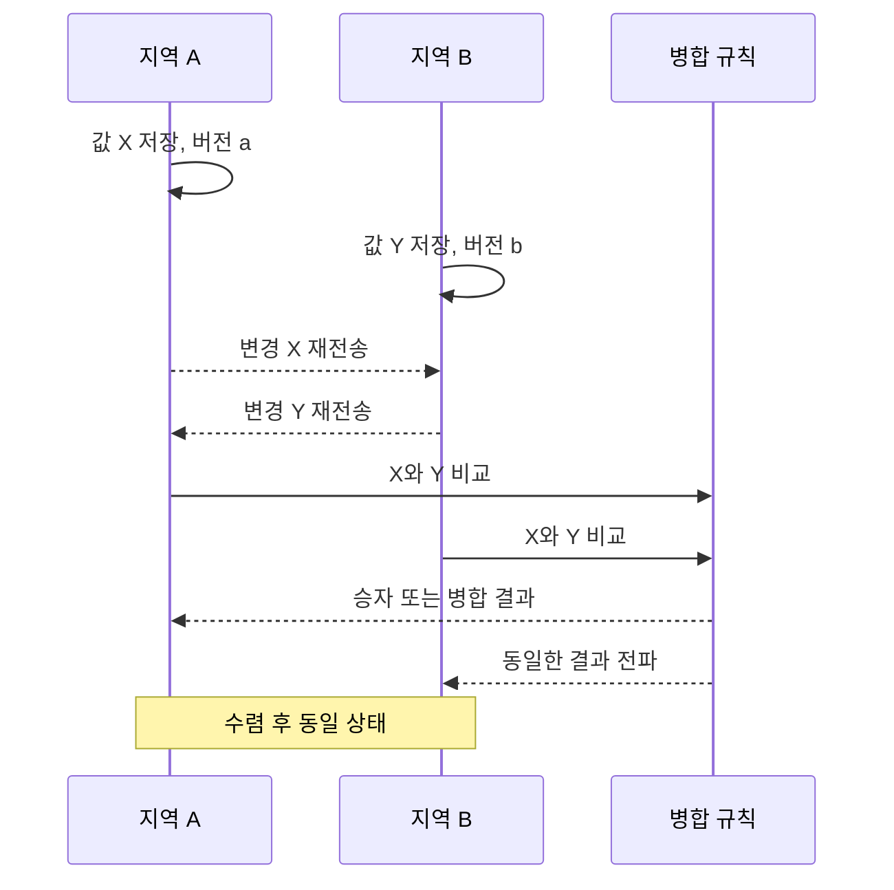

# 최종 일관성(Eventual Consistency)과 분산 시스템 일관성 모델

## 1. 개요

### 가. 정의

> **최종 일관성(Eventual Consistency)**이란 새로운 갱신이 더 이상 발생하지 않고 복제본 사이의 전파가 정상적으로 완료되면, 시간이 지나 모든 복제본이 동일한 값에 수렴한다는 분산 데이터 일관성 모델이다.

최종 일관성은 모든 읽기가 즉시 최신 값을 반환한다는 약속이 아니다. 한 시점에는 지역 복제본의 네트워크 지연, 비동기 복제, 재시도 순서 차이로 인해 서로 다른 값이 관찰될 수 있다.

대신 시스템은 가용성과 지연시간을 우선하면서, 장애가 해소되고 갱신 전파가 끝나면 결과가 하나로 수렴하도록 설계한다.

이 모델은 여러 지역에 데이터를 복제하는 키-값 저장소, DNS, CDN 캐시, 소셜 피드, 장바구니, 추천 결과와 같이 전 세계 사용자에게 빠르게 응답해야 하는 서비스에서 자주 사용된다.

### 나. 등장 배경과 필요성

단일 데이터베이스에서는 하나의 트랜잭션 로그와 잠금 체계로 최신 상태를 비교적 쉽게 정의할 수 있다.

그러나 다중 리전 서비스에서는 사용자가 가까운 리전의 복제본에 접속하고, 리전 사이의 통신이 지연되거나 일시적으로 끊길 수 있다.

모든 쓰기를 중앙 리더에게 보내고 모든 읽기가 그 결과를 기다리게 하면 강한 일관성을 얻을 수 있지만, 지역 장애와 긴 왕복시간이 곧 서비스 지연과 가용성 저하로 이어진다.

최종 일관성은 이 지점에서 “잠시 다른 값을 보여줄 수 있지만 서비스는 계속 응답한다”는 선택을 가능하게 한다.

예를 들어 사용자가 서울에서 프로필 이름을 바꾼 직후 도쿄 리전에서 자신의 프로필을 조회하면 잠시 이전 이름이 보일 수 있다.

이 현상이 허용되는 서비스라면 쓰기 성공 응답을 기다리는 범위를 줄여 사용자 경험과 지리적 확장성을 높일 수 있다.

반대로 송금 잔액, 재고 차감, 권한 회수처럼 오래된 값을 허용하면 직접적인 손실이나 보안 사고가 발생하는 영역에서는 최종 일관성만으로 충분하지 않다.

따라서 일관성 모델은 저장소의 속성이 아니라 업무 의미, 오류 비용, 사용자 기대를 반영한 설계 결정으로 이해해야 한다.

### 다. CAP 및 지연시간과의 관계

분산 시스템은 네트워크 분할이 발생할 수 있다는 전제에서 일관성(Consistency)과 가용성(Availability)의 선택을 요구한다.

CAP의 C는 모든 노드가 동일한 최신 값을 보는 강한 의미의 일관성에 가깝고, A는 일부 노드가 고립되어도 요청에 응답하는 성질이다.

최종 일관성 시스템은 네트워크 분할 중에도 각 복제본이 쓰기나 읽기에 응답하는 AP 성격을 취할 수 있지만, 그 결과를 항상 무조건 허용한다는 뜻은 아니다.

실제 제품은 키별 조건부 쓰기, 정족수 읽기, 세션 보장, 충돌 해결 정책을 조합하여 업무별 타협점을 만든다.

CAP은 장애 상황의 선택을 설명하는 이론적 틀이고, 평상시 지연시간·처리량·비용·운영 복잡도까지 자동으로 결정해 주지는 않는다.

## 2. 일관성의 의미와 계층

### 가. 강한 일관성과 약한 일관성

강한 일관성은 쓰기가 성공한 뒤 어떤 노드에서 읽더라도 최신 값 또는 그 이후의 값을 반환하도록 요구한다.

선형화 가능성(Linearizability)은 각 연산이 호출과 응답 사이의 한 순간에 원자적으로 발생한 것처럼 보이게 하며, 실시간 순서도 보존한다.

이 성질은 계좌 잔액이나 분산 잠금처럼 순서와 최신성이 핵심인 작업에 적합하지만, 여러 지역의 합의를 기다려야 하므로 지연시간과 장애 전파 비용이 커진다.

약한 일관성은 읽기 시점에 최신 값을 보장하지 않는다. 단, “언제까지 수렴해야 하는가”, “한 사용자의 연속 요청에서 어떤 순서를 보장하는가”에 따라 여러 하위 모델로 나뉜다.

최종 일관성은 약한 일관성 중에서도 수렴 조건을 명시한 모델이며, 무한히 오래 서로 다른 값을 제공해도 된다는 뜻은 아니다.

### 나. 주요 일관성 모델

| 모델 | 핵심 보장 | 대표 활용 | 주요 비용 |
|---|---|---|---|
| 선형화 가능성 | 모든 연산이 전역 단일 순서처럼 보임 | 잔액, 리더 선출, 잠금 | 합의 지연, 가용성 저하 |
| 순차적 일관성 | 프로세스별 순서를 보존한 단일 순서 | 공유 메모리 추상화 | 전역 순서 조정 |
| 인과적 일관성 | 원인-결과 관계를 모든 노드가 보존 | 댓글과 답글, 메시지 | 인과 메타데이터 관리 |
| 세션 일관성 | 한 세션에서 읽기·쓰기 순서 보장 | 사용자 프로필, 장바구니 | 세션 고정 또는 토큰 |
| 최종 일관성 | 갱신이 멈추면 복제본이 수렴 | DNS, 피드, 캐시 | 일시적 오래된 값, 충돌 |
| 읽기-자기-쓰기 | 자신이 쓴 값은 이후 읽기에서 보임 | 사용자 설정 변경 | 세션 라우팅·버전 전달 |
| 단조 읽기 | 같은 사용자의 읽기가 과거로 후퇴하지 않음 | 상태 조회 화면 | 복제본 선택 제어 |

이 표의 모델들은 서로 배타적인 제품 분류라기보다 시스템이 사용자에게 제공하는 관찰 가능성의 조합이다.

예를 들어 전체 시스템은 최종 일관성이지만, 사용자 세션에는 읽기-자기-쓰기와 단조 읽기를 적용할 수 있다.

이렇게 하면 모든 사용자가 전역 최신 값을 기다리지는 않으면서도, 자신의 직전 변경이 화면에서 사라지는 혼란을 줄일 수 있다.

### 다. 일관성과 내구성·정확성의 구분

일관성은 복제본 사이에서 값이 어떤 순서와 시점에 관찰되는지를 말한다.

내구성은 성공한 쓰기가 장애 후에도 잃어버리지 않는지에 관한 성질이고, 무결성은 값이 업무 규칙을 위반하지 않는지를 말한다.

최종 일관성을 선택했다고 해서 데이터를 유실해도 된다는 의미는 아니다.

예를 들어 주문 이벤트는 내구성 있게 저장하되, 검색 색인과 추천 결과는 비동기로 갱신하여 최종 일관성으로 제공할 수 있다.

이 구분을 하지 않으면 “비동기 복제이므로 데이터가 사라져도 된다”는 잘못된 설계가 발생한다.

## 3. 동작 원리와 구성요소

### 가. 비동기 복제 구조

지역 A에서 쓰기가 성공하면 데이터베이스는 로컬 저장과 로그 기록을 먼저 완료하고, 복제 워커가 지역 B와 C로 변경을 전송한다.

이때 클라이언트 응답과 원격 복제 완료를 분리하면 왕복 지연을 줄일 수 있지만, 원격 복제 전 장애 구간에는 지역별 값이 달라진다.

따라서 로그는 단순한 네트워크 메시지 버퍼가 아니라 재시작·재전송·순서 추적·감사에 필요한 내구성 있는 사실의 기록이어야 한다.

복제 워커는 타임아웃과 지수 백오프를 이용해 일시 장애를 견디고, 동일 이벤트가 여러 번 전달되어도 결과가 한 번만 적용되도록 멱등성을 보장해야 한다.

### 나. 버전과 순서 추적

가장 단순한 충돌 해결 방법은 최신 타임스탬프 우선(LWW)이다. 각 갱신에 논리 시각이나 물리 시각을 붙이고 더 큰 값을 남기는 방식이다.

하지만 서로 다른 노드의 시계가 어긋나면 실제로 더 최신인 변경이 폐기될 수 있고, 같은 시각의 동시 쓰기를 구분하기도 어렵다.

논리 시계(Logical Clock)는 물리 시계 대신 메시지의 인과 순서를 추적한다. Lamport 시계는 “A가 B보다 먼저 발생했다”는 순서를 표현하지만, 서로 독립적인 동시 사건까지 구분해 주지는 않는다.

벡터 시계(Vector Clock)는 각 노드별 카운터를 유지해 두 버전의 관계를 비교한다. 한 벡터가 다른 벡터보다 모든 항목이 작거나 같으면 선행 관계이고, 어느 쪽도 포함하지 않으면 동시 갱신으로 판정할 수 있다.

노드 수가 많을수록 벡터 메타데이터가 커지는 문제가 있으므로, 실무에서는 파티션 단위 버전, 하이브리드 논리 시계, 서버 생성 순번 등을 요구사항에 맞춰 선택한다.

### 다. 충돌 해결

충돌은 두 복제본이 같은 키를 서로 다른 값으로 갱신한 뒤 변경사항을 교환할 때 발생한다.

LWW는 구현이 쉽고 저장공간이 작지만, 패배한 값의 의미가 사라지므로 사용자에게 중요한 정보를 잃을 수 있다.

필드별 병합은 이름과 주소처럼 독립적으로 수정되는 필드를 보존할 수 있지만, 필드 간 업무 규칙을 깨뜨릴 수 있다.

다중값 레지스터는 충돌한 값을 모두 보존하고 애플리케이션이나 사용자가 후속 선택을 하도록 한다.

카운터·집합·맵처럼 연산 자체를 병합하는 CRDT는 교환·결합·멱등 성질을 이용해 메시지 순서가 달라도 동일한 결과로 수렴하도록 설계한다.

그러나 모든 도메인 상태를 CRDT로 표현할 수 있는 것은 아니다. 재고처럼 0 미만이 되면 안 되는 제약이나 “한 번만 당첨” 같은 전역 불변조건은 별도의 예약·합의·보상 절차가 필요하다.

### 라. 재시도와 멱등성

복제 메시지는 응답 유실 때문에 발신자가 같은 이벤트를 다시 보낼 수 있다.

수신자가 이벤트를 단순히 더하면 카운터가 두 번 증가하고, 같은 주문이 두 번 생성되는 문제가 생긴다.

이를 막기 위해 이벤트 ID, 소스 파티션과 오프셋, 비즈니스 키를 이용해 중복을 탐지하고 처리 결과를 기록한다.

멱등한 대입은 같은 값을 여러 번 적용해도 결과가 같지만, “잔액을 100만큼 증가”와 같은 증분 연산은 이벤트 ID를 기록하거나 한 번만 적용되는 원자 연산으로 감싸야 한다.

재시도 정책에는 최대 재시도 횟수와 보류 큐, 독성 메시지 격리, 운영자 재처리 절차를 포함해야 한다.

## 4. 일관성 수준 설계와 구현 절차

### 가. 요구사항 분석

첫 단계는 “최신 값”을 추상적으로 요구하는 것이 아니라 사용자와 업무가 감내할 수 있는 오래된 값의 범위를 정의하는 것이다.

상품 검색 결과가 수 초 늦게 반영되는 것은 허용되지만, 결제 직전 가격과 재고는 별도 검증이 필요할 수 있다.

정량 기준으로 수렴 지연시간의 목표 백분위수, 오래된 읽기의 최대 허용시간, 충돌률, 재처리율을 정의한다.

이 지표를 정의하지 않으면 복제가 동작하고 있다는 사실만 확인할 뿐, 사용자에게 언제까지 올바르게 보여야 하는지를 검증할 수 없다.

업무별로 읽기와 쓰기의 조합을 분리해 “전역 강한 일관성”, “리전 로컬 최종 일관성”, “세션 보장”을 혼합하는 것이 현실적이다.

### 나. 데이터 분류

| 데이터 유형 | 허용 모델 | 설계 예 |
|---|---|---|
| 계좌·결제 승인 | 강한 일관성 또는 단일 권위자 | 원장 서비스와 조건부 갱신 |
| 상품 검색 색인 | 최종 일관성 | 원본 DB와 비동기 색인 |
| 장바구니 | 세션·읽기-자기-쓰기 | 사용자별 파티션과 병합 |
| 좋아요·조회수 | 병합 가능한 최종 일관성 | CRDT 카운터 또는 이벤트 집계 |
| 권한·토큰 폐기 | 짧은 TTL 이상의 신속 전파 | 중앙 정책과 캐시 무효화 |
| 분석·추천 피처 | 지연 허용 최종 일관성 | 스트림 처리와 재계산 |

분류의 핵심은 데이터 자체보다 오용 시 피해를 평가하는 것이다.

예를 들어 상품 설명은 늦게 보아도 되지만 판매 가능 재고를 검색 색인만 믿고 결제하면 안 된다.

결제 서비스는 최종 일관성 검색 결과를 참고하더라도 최종 승인 시점에 권위 있는 재고·결제 시스템을 다시 조회하는 이중 검증을 둔다.

### 다. 복제 프로토콜 선택

동기 복제는 쓰기 확인을 여러 노드에서 받아 높은 일관성을 제공하지만, 멀리 있는 리전 장애가 쓰기 지연으로 전파될 수 있다.

비동기 복제는 빠른 로컬 응답을 제공하지만 복제 지연, 충돌, 복구 시점 손실 가능성을 운영해야 한다.

리더 기반 복제는 순서를 단순하게 만들지만 리더 장애 시 선출과 리더 지역으로의 트래픽 집중이 문제가 된다.

멀티리더 구조는 지역별 쓰기 지연을 줄이지만 동시 충돌과 병합 정책을 애플리케이션이 책임져야 한다.

읽기 정족수와 쓰기 정족수를 조절하는 구조에서는 전체 복제본 수를 N, 읽기 정족수를 R, 쓰기 정족수를 W로 두고 R+W>N 관계를 활용할 수 있다.

이 관계는 겹치는 복제본을 통해 최신 쓰기를 읽을 가능성을 높이지만, 장애·지연·동시 쓰기·버전 선택 정책까지 자동으로 해결하지 않는다.

### 라. 애플리케이션 보완

클라이언트가 쓰기 응답으로 버전 토큰을 받고 다음 읽기에 이를 전달하면 서버는 해당 버전 이상을 가진 복제본으로 라우팅할 수 있다.

이 방법은 세션 고정 없이도 읽기-자기-쓰기 성질을 만들 수 있지만, 토큰이 만료되거나 해당 리전에 버전이 아직 도착하지 않은 경우의 대기·대체 응답을 정의해야 한다.

사용자 화면에는 “처리 중”, “동기화 중”, “최신 상태 확인 필요”를 표시해 일시적 불일치를 숨기기보다 의미 있게 전달할 수 있다.

업무 명령은 상태 덮어쓰기보다 이벤트로 기록하고, 충돌 시 보상 트랜잭션이나 수동 검토 큐로 넘기면 원인 추적과 복구가 쉬워진다.

## 5. 강한 일관성과의 비교

### 가. 차이가 생기는 이유

강한 일관성은 읽기 결과에 대한 사용자의 추론을 단순하게 만든다. 쓰기가 성공하면 이후 어느 위치에서 읽어도 같은 결과라는 가정을 코드에 둘 수 있다.

그러나 이 보장은 복제본 사이의 통신과 조정이 완료될 때까지 요청을 지연시키며, 네트워크 분할 중에는 응답을 거부하는 선택으로 이어질 수 있다.

최종 일관성은 통신을 기다리지 않고 로컬에서 처리할 수 있어 지연시간과 지역 가용성에 유리하다.

대신 애플리케이션은 오래된 데이터, 중복 이벤트, 충돌, 순서 역전, 재처리를 명시적으로 다뤄야 한다.

| 비교 항목 | 강한 일관성 | 최종 일관성 |
|---|---|---|
| 읽기 의미 | 최신 전역 상태에 가까움 | 잠시 이전 상태 가능 |
| 쓰기 지연 | 조정 범위에 비례해 증가 | 로컬 응답으로 낮출 수 있음 |
| 장애 시 선택 | 오류·차단 가능성 증가 | 지역 서비스 지속 가능 |
| 충돌 처리 | 프로토콜이 줄여 줌 | 도메인 규칙 필요 |
| 운영 난이도 | 합의·리더 장애 관리 | 복제 지연·재처리 관리 |
| 적합 업무 | 원장·권한·재고 확정 | 피드·검색·분석·캐시 |

### 나. 혼합 모델의 실무적 의미

하나의 시스템을 전부 강한 일관성 또는 전부 최종 일관성으로 결정할 필요는 없다.

원장과 주문 상태는 강하게 유지하고, 주문 검색·알림·대시보드는 이벤트를 받아 늦게 갱신하는 CQRS 구조를 사용할 수 있다.

사용자가 주문 직후 대시보드를 조회했는데 아직 “처리 중”으로 보이는 것은 허용하되, 상세 화면은 원장 서비스에 직접 확인하는 식이다.

이렇게 권위 데이터와 파생 데이터를 분리하면 높은 일관성 비용을 반드시 필요한 경계에만 지불할 수 있다.

## 6. 산업 적용 사례

### 가. 글로벌 소셜 피드

게시물 작성은 작성자와 가까운 리전에 먼저 저장하고, 팔로워용 타임라인은 비동기 팬아웃으로 생성할 수 있다.

전파 지연 중 일부 팔로워가 새 게시물을 늦게 보는 것은 대체로 허용된다.

하지만 삭제 요청이나 차단 처리는 일반 게시물보다 빠른 전파와 캐시 무효화를 적용해야 하며, 이미 전파된 복사본이 남지 않도록 재수집 작업도 필요하다.

### 나. 전자상거래 재고

상품 상세·검색 색인은 최종 일관성으로 운영해 읽기 부하를 분산할 수 있다.

그러나 결제 단계에서는 검색 색인의 재고 수량을 확정값으로 사용하지 않고 재고 권위 서비스에 예약 명령을 보낸다.

예약 명령에는 주문 ID를 멱등 키로 포함하고, 예약 만료와 결제 실패 시 보상 반환을 둔다.

이 구조는 화면의 수량이 약간 늦게 보이는 문제를 감수하면서도 초과 판매를 중요한 경계에서 차단한다.

### 다. DNS와 CDN 캐시

DNS와 CDN은 전 세계 엣지에 값을 복제하여 빠르게 응답하고, TTL과 무효화 요청으로 변경을 전파한다.

TTL이 남아 있는 동안 일부 사용자가 이전 IP나 이전 콘텐츠를 받는 것은 최종 일관성의 전형적인 사례다.

보안 패치나 장애 전환에서는 TTL만 기다릴 수 없으므로 짧은 TTL, 적극적 무효화, 헬스 체크, 대체 원본을 함께 설계해야 한다.

## 7. 검증·관측·장애 대응

### 가. 핵심 관측 지표

복제 지연은 원본 이벤트의 시각과 대상 복제본 적용 시각의 차이로 측정하고, 평균보다 p95·p99를 함께 본다.

충돌률은 키 또는 업무 유형별로 집계해야 특정 고객군이나 특정 리전에서만 문제가 생기는 현상을 찾을 수 있다.

오래된 읽기 비율, 재시도율, 중복 제거율, 보류 큐 길이, 복구 후 재수렴 시간도 함께 기록한다.

지표에는 테넌트·리전·데이터 중요도 태그를 붙여 전체 평균이 위험한 구간을 가리지 않게 해야 한다.

### 나. 테스트 전략

네트워크 지연, 패킷 유실, 순서 역전, 중복 전달, 시계 편차, 리전 단절을 주입하는 장애 주입 테스트가 필요하다.

동시에 같은 키를 갱신하는 테스트에서는 예상 결과가 단순한 “마지막 값”인지, 필드 병합인지, 사용자 확인인지 명확히 검증한다.

복제 중단 후 재개했을 때 누락 이벤트를 찾고, 이벤트를 여러 번 재생해도 최종 상태가 동일한지 확인한다.

읽기-자기-쓰기와 단조 읽기 같은 세션 보장은 여러 리전으로 사용자를 이동시키며 테스트해야 한다.

### 다. 장애 대응

복제 지연이 임계치를 넘으면 중요도 낮은 파생 작업의 트래픽을 줄이고, 권위 시스템에 대한 읽기 경로를 일시적으로 늘릴 수 있다.

충돌이 급증하면 자동 병합을 중지하고 보류 큐에서 업무 담당자의 승인을 받도록 하는 안전 모드가 필요하다.

재동기화는 전체 복사보다 체크포인트와 변경 로그를 이용해 누락 구간을 좁히고, 재동기화 중에는 버전 검증으로 오래된 데이터가 최신 데이터를 덮지 못하게 한다.

## 8. 심화: CRDT와 이벤트 기반 아키텍처

CRDT(Conflict-free Replicated Data Type)는 분산 복제본에서 연산 순서와 도착 시점이 달라도 병합 결과가 수렴하도록 자료구조와 연산을 설계한다.

집합 추가·삭제, 카운터 증가, 레지스터와 맵을 조합할 수 있으며, 수학적 결합법칙과 멱등성 덕분에 네트워크 재전송을 단순화한다.

다만 삭제와 재추가의 의미, 메타데이터 증가, 가비지 컬렉션, 악의적 클라이언트의 조작을 별도로 다뤄야 한다.

이벤트 기반 아키텍처에서는 원본 이벤트를 보존하고 여러 소비자가 검색 색인·알림·분석 모델을 독립적으로 갱신한다.

이때 이벤트 스키마의 하위 호환성, 순서 보장 범위, 이벤트 재생, 소비자 지연 격리, 개인정보 삭제의 전파 정책이 일관성 설계에 포함된다.

이벤트가 최종적으로 도착한다고 해서 소비자 화면이 항상 최신이라는 뜻은 아니므로, 사용자에게 처리 상태와 기준 시각을 제공하는 것이 중요하다.

## 9. 고려사항 및 시사점

### 가. 업무 불변조건 우선

기술 유행이나 데이터베이스 기본값으로 일관성 모델을 정하지 말고, 위반 시 금전·법적·안전상 피해가 큰 불변조건을 먼저 식별해야 한다.

전역적으로 하나만 존재해야 하는 자원은 예약권·리더·합의 서비스 등 강한 경계를 두고, 나머지 조회 모델은 비동기로 확장한다.

### 나. 사용자 경험과 계약

오래된 값이 보일 수 있다면 화면·API 문서에 기준 시각, 처리 상태, 재조회 방법을 명시해야 한다.

API 소비자에게 “쓰기 성공”이 원본 저장 완료인지 모든 파생 시스템 반영 완료인지 구분해 계약해야 한다.

### 다. 보안·개인정보 전파

권한 회수와 개인정보 삭제는 일반 콘텐츠보다 더 엄격한 전파 목표를 가져야 한다.

캐시·검색 색인·백업·분석 저장소까지 삭제 요청이 전달되는지 추적하고, 남은 복사본을 확인할 수 있는 감사 로그를 운영한다.

### 라. 비용과 운영 복잡도

최종 일관성은 네트워크 비용과 사용자 지연을 줄일 수 있지만, 이벤트 저장·재처리·충돌 검토·관측 플랫폼의 비용을 새로 만든다.

따라서 수렴 지연 예산과 충돌 처리 인력, 보류 큐 운영 비용을 총소유비용에 포함해야 한다.

### 마. 기술사 관점의 로드맵

초기에는 데이터 분류와 수렴 지표를 정하고, 이후 버전 토큰과 멱등 이벤트로 세션 경험을 보완한다.

서비스 규모가 커지면 리전별 장애 훈련, 자동 재동기화, 충돌 감사, 데이터 계보를 플랫폼 기능으로 표준화한다.

궁극적으로 권위 데이터, 파생 데이터, 사용자 경험 보장, 복구 절차를 하나의 데이터 거버넌스 체계로 연결해야 한다.

## 참고자료

- Amazon Web Services, “Dynamo: Amazon’s Highly Available Key-value Store” — https://www.allthingsdistributed.com/files/amazon-dynamo-sosp2007.pdf
- Eric Brewer, “Towards Robust Distributed Systems” — https://www.cs.berkeley.edu/~brewer/cs262b-2004/PODC-keynote.pdf
- Martin Fowler, “Patterns of Distributed Systems: Eventual Consistency” — https://martinfowler.com/articles/patterns-of-distributed-systems/eventual-consistency.html

---

> **한 줄 요약**: 최종 일관성은 비동기 복제로 지연시간과 가용성을 높이는 대신 오래된 읽기·충돌·재처리를 감수하므로, 데이터 중요도별 보장 수준과 수렴·복구 운영을 함께 설계해야 한다.
