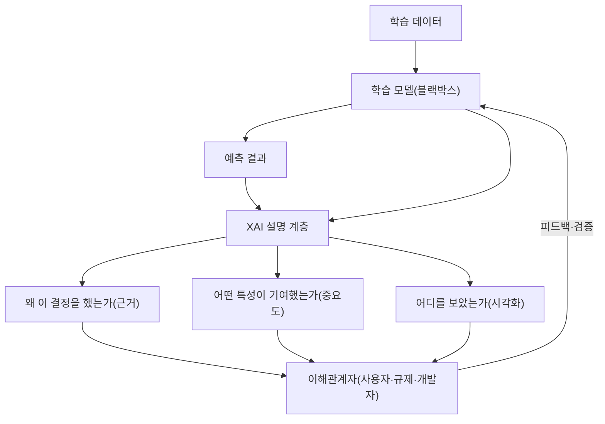
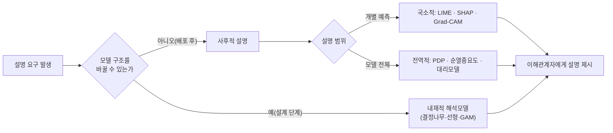

# 설명가능 인공지능(XAI, eXplainable AI)

## 1. 개요

> **정의**: 설명가능 인공지능(XAI)은 딥러닝처럼 내부 동작이 불투명한 **블랙박스(Black-box) 모델**의 예측 결과에 대해, 그 근거·기여 요인·의사결정 과정을 인간이 이해할 수 있는 형태로 제시하여 **모델의 투명성(Transparency)·신뢰성(Trust)·책무성(Accountability)**을 확보하는 기술과 방법론의 총칭이다.

XAI가 부상한 배경에는 딥러닝 성능 향상과 해석 가능성 사이의 **근본적 트레이드오프**가 있다. 선형회귀·의사결정나무처럼 구조가 단순한 모델은 사람이 그 규칙을 직접 읽을 수 있지만 표현력이 제한적이다. 반대로 수억~수천억 개의 파라미터를 가진 심층신경망은 높은 정확도를 내지만, 왜 그런 결론에 도달했는지를 내부 가중치만으로는 설명하기 어렵다. 성능이 높아질수록 해석 가능성이 낮아지는 이 역상관 관계가 XAI 연구를 촉발한 1차 동인이다.

두 번째 동인은 **규제와 제도**다. EU GDPR은 자동화된 의사결정에 대해 정보주체가 설명을 요구할 수 있는 권리(이른바 "설명을 요구할 권리")를 규정하고, 2024년 발효된 **EU AI Act**는 고위험(High-risk) AI 시스템에 대해 투명성·기록·인간 감독 의무를 부과한다. 국내에서도 금융·의료·채용 등 개인의 권익에 중대한 영향을 미치는 영역에서 알고리즘의 설명 책임이 강화되는 추세다. 즉 XAI는 기술적 편의가 아니라 **법적·윤리적 요구를 충족하기 위한 필수 요건**으로 자리 잡았다.

세 번째 동인은 **실무적 필요**다. 의료 진단에서 "암일 확률 92%"라는 숫자만으로는 의사가 그 판단을 채택하기 어렵고, 영상의 어느 병변 영역이 근거였는지가 함께 제시되어야 임상 채택이 가능하다. 대출 심사에서 거절 사유를 제시하지 못하면 소비자 분쟁과 차별 논란을 피할 수 없다. 따라서 XAI는 인간과 AI가 협업하는 **의사결정 지원(Human-in-the-loop)** 체계의 신뢰 기반이 된다. 답안에서는 XAI를 단순 시각화 도구가 아니라 **"AI 신뢰성(Trustworthy AI)을 구현하는 핵심 축"**으로 규정하는 것이 타당하다.

## 2. XAI의 전체 구조와 개념

XAI는 학습된 모델과 그 예측을 입력받아, 사용자·규제기관·개발자 등 이해관계자가 요구하는 형태의 설명을 산출하는 계층으로 이해할 수 있다. 아래 개념도는 데이터·모델·설명·이해관계자로 이어지는 전체 골격을 나타낸다.

XAI가 답하고자 하는 질문은 크게 세 가지다. 첫째는 **"왜 이 결정을 내렸는가"**로, 특정 예측의 근거를 제시하는 국소적(local) 설명이다. 둘째는 **"모델이 전반적으로 무엇을 학습했는가"**로, 모델 전체의 행동 양상을 요약하는 전역적(global) 설명이다. 셋째는 **"어떻게 하면 결과가 바뀌는가"**로, 입력을 어떻게 바꾸면 다른 결론이 나오는지를 제시하는 반사실적(counterfactual) 설명이다.

여기서 **해석 가능성(Interpretability)**과 **설명 가능성(Explainability)**을 구분할 필요가 있다. 전자는 모델 구조 자체가 투명하여 사람이 내부 인과를 직접 파악할 수 있는 성질(예: 결정나무)을 뜻하고, 후자는 블랙박스 모델의 출력에 대해 사후적으로 근거를 재구성해 제시하는 활동에 가깝다. 실무에서는 이미 배포된 고성능 모델을 그대로 두고 설명을 붙이는 사후적(post-hoc) 접근이 널리 쓰이며, 이 때문에 XAI는 "정확도를 희생하지 않고 신뢰를 확보"하려는 절충적 성격을 띤다.

## 3. XAI 기법의 유형과 동작 절차

XAI 기법은 적용 시점(내재적/사후적), 적용 범위(국소적/전역적), 모델 의존성(모델 특화/모델 불가지)에 따라 분류된다. 아래 다이어그램은 대표 기법이 이 축들에 따라 어떻게 배치되는지를 프로세스 관점에서 보여준다.

**LIME(Local Interpretable Model-agnostic Explanations)**은 설명하려는 데이터 포인트 주변을 미세하게 교란(perturbation)한 샘플들을 만들고, 블랙박스 모델의 응답을 관찰한 뒤 그 국소 영역을 선형모델로 근사한다. 이렇게 얻은 선형모델의 계수가 각 특성의 국소적 기여도가 된다. 원리상 모델 내부를 몰라도 되는 **모델 불가지(model-agnostic)** 방식이라 적용 범위가 넓지만, 교란 방식과 이웃 정의에 따라 설명이 흔들려 재현성이 낮다는 한계가 있다.

**SHAP(SHapley Additive exPlanations)**은 협조적 게임이론의 **섀플리 값(Shapley Value)**을 차용해, 각 특성을 "게임의 참가자"로 보고 예측값이라는 보상을 특성들이 공정하게 분배받도록 기여도를 계산한다. 모든 특성 부분집합에 대해 해당 특성이 있고 없음의 한계 기여를 평균하므로 이론적으로 일관성·국소 정확성을 만족한다. 다만 특성 수가 늘면 조합이 지수적으로 증가하여 계산량이 커지므로, 트리 모델 전용 고속 알고리즘(TreeSHAP) 등 근사가 함께 쓰인다.

**Grad-CAM(Gradient-weighted Class Activation Mapping)**은 이미지 분류 CNN에서 예측 클래스에 대한 마지막 합성곱 층의 그래디언트를 이용해, 입력 이미지의 어느 영역이 판단에 기여했는지를 히트맵으로 표시한다. "모델이 개를 개로 분류할 때 실제 개의 몸통을 보았는가, 아니면 배경의 잔디를 보았는가"를 눈으로 확인시켜, 데이터 편향이나 단서 오학습(shortcut learning)을 잡아내는 데 특히 유용하다.

전역적 설명으로는 특성값을 변화시키며 예측 평균의 변화를 그리는 **부분의존도(PDP)**, 특정 특성을 무작위로 뒤섞어 성능 저하 정도로 중요도를 측정하는 **순열 중요도(Permutation Importance)**, 복잡한 모델의 행동을 해석 가능한 단순 모델로 흉내 내는 **대리모델(Surrogate Model)** 등이 있다.

## 4. 기법 비교와 적용 사례

각 기법은 만능이 아니며, 설명 대상·데이터 형태·연산 예산·요구 신뢰수준에 따라 선택이 달라진다. 아래 비교는 대표 기법의 차이가 어디서 비롯되는지와 실무적 함의를 함께 정리한 것이다.

| 기법 | 범위 | 모델 의존성 | 핵심 원리 | 장점 | 한계 |
|------|------|-------------|-----------|------|------|
| LIME | 국소 | 불가지 | 국소 선형 근사 | 어떤 모델에도 적용 | 재현성·안정성 낮음 |
| SHAP | 국소+전역 | 불가지(전용 고속판 존재) | 섀플리 값 배분 | 이론적 일관성 | 계산비용 큼 |
| Grad-CAM | 국소 | CNN 특화 | 그래디언트 기반 활성 영역 | 시각적 직관성 | 이미지·CNN 한정 |
| 결정나무/GAM | 전역 | 내재적 | 투명한 구조 | 근본적으로 해석 가능 | 표현력·정확도 제한 |

비교의 핵심은 **"정확도-해석성-계산비용"의 삼각 트레이드오프**다. 내재적 해석모델은 설명이 완전하지만 고난도 문제에서 성능이 부족하고, SHAP은 이론적으로 우수하나 대규모 데이터에서 비용이 크며, LIME은 값싸고 범용적이지만 신뢰도가 떨어진다. 따라서 규제 대응처럼 설명의 일관성이 중요한 영역에는 SHAP을, 신속한 탐색적 진단에는 LIME을, 영상 판독에는 Grad-CAM을 배치하는 식의 **목적 기반 조합**이 현실적이다.

구체 사례로 **의료 영상 진단**을 들 수 있다. 흉부 X선에서 폐렴을 분류하는 CNN에 Grad-CAM을 적용했더니, 모델이 병변이 아니라 특정 병원의 촬영 장비가 남긴 이미지 워터마크를 단서로 학습한 사실이 드러난 연구 사례가 보고되었다. 정확도 지표만 보면 90%대로 우수했지만, XAI가 없었다면 이 **가짜 상관(spurious correlation)**을 발견하지 못한 채 배포되었을 것이다. 이는 XAI가 성능 지표가 가리는 위험을 드러내는 **모델 검증 도구**임을 보여준다. 금융 분야에서도 대출 거절 시 SHAP 기여도를 근거로 "소득 대비 부채비율과 최근 연체 이력이 결정에 가장 크게 작용"과 같은 사유를 제시하여 규제 준수와 소비자 설명을 동시에 충족하는 사례가 확산되고 있다.

## 5. 심화: LLM 시대의 XAI와 최신 동향

거대 언어모델(LLM)의 확산으로 XAI의 대상과 방법도 변화하고 있다. 기존의 특성 중요도 기법은 정형 데이터에 최적화되어 있어, 수천억 파라미터의 생성형 모델이 "왜 이 답을 생성했는가"를 설명하기에는 한계가 있다. 이에 따라 **어텐션 시각화(Attention Visualization)**로 토큰 간 참조 관계를 보거나, 사고 과정을 단계적으로 노출하는 **생각의 사슬(Chain-of-Thought)** 프롬프팅으로 추론 경로를 자연어로 드러내는 접근이 주목받는다. 다만 어텐션 가중치가 곧 설명의 인과라고 단정하기 어렵고, CoT가 실제 내부 연산을 충실히 반영한다는 보장이 없다는 비판(설명의 충실성, faithfulness 문제)이 활발히 논의된다.

또 하나의 흐름은 신경망 내부 표현을 회로 수준에서 해부하는 **기계론적 해석가능성(Mechanistic Interpretability)**이다. 이는 개별 뉴런·어텐션 헤드가 담당하는 기능을 규명하려는 연구로, 모델을 사후에 근사하는 기존 XAI보다 한 단계 근본적인 접근이다. 국제적으로는 미국 DARPA의 XAI 프로그램이 이 분야의 체계적 연구를 촉발했고, NIST의 AI 위험관리 프레임워크(AI RMF), ISO/IEC의 AI 투명성 표준화 논의가 XAI를 신뢰성 거버넌스의 요건으로 제도화하고 있다.

기술사 관점에서 주목할 예상 출제 방향은 ▲XAI 기법 비교(LIME vs SHAP)와 선택 기준 ▲AI 신뢰성·EU AI Act 등 규제와의 연계 ▲의료·금융 등 고위험 도메인 적용 시 고려사항 ▲설명의 충실성·안정성 등 XAI 자체의 한계다. 답안 구성 시에는 "기법 나열"에 그치지 말고 **트레이드오프와 검증 관점**을 함께 제시하는 것이 고득점 전략이다.

## 6. 고려사항 및 시사점

기술사 관점에서 XAI 도입 시 고려할 사항은 다음과 같다.

- **설명의 충실성 검증**: 그럴듯해 보이는 설명이 실제 모델의 내부 근거와 일치하는지를 별도로 검증해야 한다. 잘못된 설명은 오히려 사용자를 잘못된 확신으로 유도(설명의 착시)하므로, 설명 자체의 안정성·일관성을 정량 평가하는 절차를 병행한다.
- **대상 청중별 설명 차별화**: 규제기관·최종 사용자·모델 개발자가 요구하는 설명의 형태와 깊이는 다르다. 개발자에겐 특성 기여도와 회로 분석이, 사용자에겐 반사실적·자연어 설명이 적합하므로 **역할 기반 설명 설계**가 필요하다.
- **성능-해석성 트레이드오프의 전략적 관리**: 무조건 해석 가능한 모델을 강요하기보다, 위험 등급에 따라 고위험 영역은 내재적 모델이나 강한 사후 설명을, 저위험 영역은 경량 설명을 배치하는 **위험 기반 차등 적용**이 합리적이다.
- **거버넌스·규제와의 정합**: EU AI Act, NIST AI RMF, 국내 AI 기본법·신뢰성 인증 등과 연계하여 설명 산출물을 기록·감사 가능한 형태로 남겨 **책무성(Accountability)**을 확보한다.
- **파이프라인 통합과 운영 비용**: XAI는 일회성 산출이 아니라 MLOps 파이프라인에 통합되어 재학습·데이터 드리프트마다 갱신되어야 하며, SHAP 등 고비용 기법의 연산 부담을 고려한 샘플링·근사 전략을 병행한다.

XAI는 정확도라는 단일 목표에 가려졌던 신뢰·투명·책임의 가치를 AI 수명주기 전반에 되살리는 장치다. 향후에는 사후 설명을 넘어 **처음부터 설명 가능하도록 설계하는(interpretable-by-design)** 방향과, LLM의 내부를 회로 수준에서 규명하는 기계론적 해석가능성이 결합되어, 성능과 신뢰를 동시에 만족하는 차세대 AI로 발전할 전망이다.

---
> **한 줄 요약**: XAI는 블랙박스 모델의 예측 근거를 인간이 이해할 수 있게 제시(LIME·SHAP·Grad-CAM 등)하여 투명성·신뢰성·책무성을 확보하는 기술로, 정확도-해석성-비용의 트레이드오프를 목적·위험 기반으로 조율하며 AI 신뢰성과 규제 대응의 핵심 축을 이룬다.
