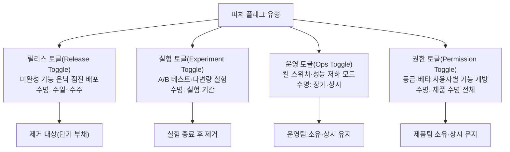
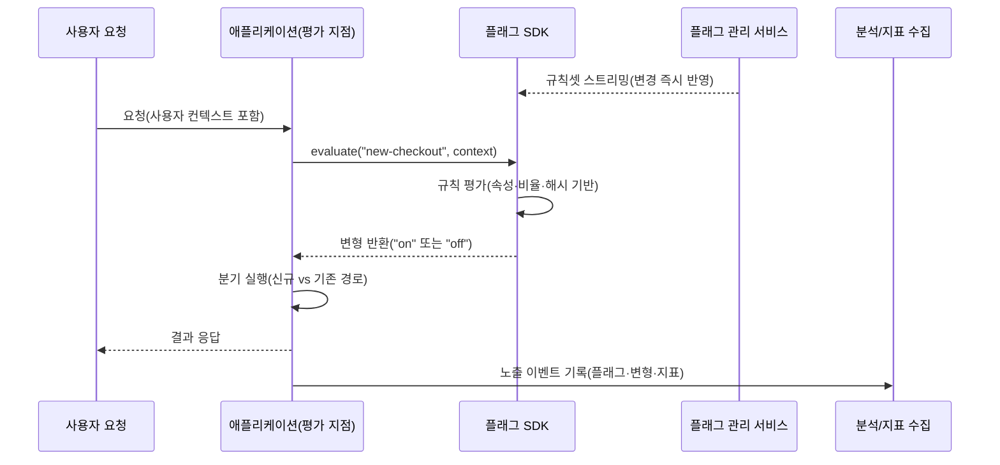

# 피처 플래그(Feature Flag)와 점진적 배포

## 1. 개요

### 가. 정의

> **피처 플래그(Feature Flag, 피처 토글)**는 코드를 다시 배포하지 않고도 실행 시점(runtime)에 특정 기능의 활성화 여부를 조건부로 결정할 수 있게 하는 소프트웨어 구성 기법이다.

피처 플래그의 핵심은 "배포(deploy)"와 "릴리스(release)"를 분리하는 데 있다.
전통적인 방식에서는 새 기능이 담긴 코드를 운영 서버에 배포하는 순간 곧바로 모든 사용자에게 그 기능이 노출된다.
즉 배포 시점과 기능 노출 시점이 물리적으로 동일하므로, 문제가 발견되면 코드를 되돌리는 롤백(rollback) 배포를 다시 수행해야 하며 그 사이 장애가 확산된다.
피처 플래그는 기능을 감싸는 조건 분기를 코드에 심어 두고, 그 분기의 참·거짓을 외부 설정으로 제어한다.
따라서 코드는 이미 운영 환경에 배포되어 있더라도 플래그가 꺼져 있으면 사용자에게는 보이지 않으며, 노출 여부는 배포와 무관하게 스위치 하나로 결정된다.

이 분리는 단순한 편의 기능이 아니라 릴리스 리스크를 통제하는 제어 장치다.
기능을 소수 사용자에게만 켜서 반응을 관찰하고(점진적 노출), 이상이 있으면 재배포 없이 즉시 끄며(킬 스위치), 사용자 집단을 나누어 A안·B안을 비교(A/B 테스트)할 수 있다.
결과적으로 피처 플래그는 배포 파이프라인의 속도를 높이면서도 사용자에게 노출되는 변화의 폭과 속도를 독립적으로 조절하는 수단이 된다.

### 나. 등장 배경과 필요성

피처 플래그가 널리 쓰이게 된 배경에는 개발 방식의 변화가 있다.
과거의 장수명 브랜치(feature branch) 전략에서는 기능을 별도 브랜치에서 몇 주간 개발한 뒤 한꺼번에 병합했는데, 병합 시점에 대규모 충돌과 통합 결함이 몰리는 "머지 지옥(merge hell)"이 반복되었다.
이를 피하기 위해 미완성 코드라도 자주 주 브랜치에 통합하는 트렁크 기반 개발(trunk-based development)이 확산되었고, 이때 아직 공개하면 안 되는 미완성 기능을 감추는 수단으로 피처 플래그가 필수가 되었다.
즉 "코드는 통합하되 기능은 감춘다"는 요구가 피처 플래그의 일차적 필요성이다.

두 번째 배경은 릴리스 리스크의 증가다.
마이크로서비스와 대규모 사용자 기반에서는 하나의 잘못된 릴리스가 수백만 명에게 즉시 전파된다.
전면 배포 후 문제가 드러나면 롤백 배포에만 수 분에서 수십 분이 걸리고, 그동안 매출·신뢰가 훼손된다.
예를 들어 결제 화면을 개편하면서 전 사용자에게 한 번에 노출했다가 특정 카드사 결제가 실패하면, 원인 파악과 롤백까지의 시간 동안 결제 이탈이 누적된다.
피처 플래그로 1% 사용자에게만 먼저 노출했다면 영향 범위는 1/100로 줄고, 이상 지표가 감지되는 즉시 재배포 없이 플래그를 꺼서 손실을 차단할 수 있다.

세 번째 배경은 실험 문화의 정착이다.
넷플릭스·부킹닷컴 등은 UI·추천·가격 정책을 상시 실험으로 검증하는데, 이 실험은 동일 코드에서 사용자 집단만 나누어 서로 다른 경험을 제공해야 한다.
피처 플래그는 사용자 속성(지역·등급·디바이스)에 따라 분기를 다르게 평가함으로써 이런 실험을 코드 변경 없이 가능하게 한다.

### 다. 적용 목표와 범위

피처 플래그의 적용 목표는 첫째 미완성 기능의 은닉을 통한 지속적 통합, 둘째 점진적 노출을 통한 릴리스 리스크 축소, 셋째 장애 시 즉시 차단(킬 스위치), 넷째 데이터 기반 의사결정을 위한 실험 기반 제공이다.
다만 모든 조건 분기를 플래그로 만들면 코드가 분기의 미로가 되고 검증해야 할 경로가 폭증하므로, "노출을 통제할 가치가 있는 변화"에만 선별적으로 적용하는 것이 원칙이다.

## 2. 유형과 생명주기

피처 플래그는 겉보기에 동일한 `if` 분기지만, 목적에 따라 수명·소유자·평가 방식이 전혀 다르다.
이 차이를 구분하지 못하면 실험용 임시 플래그가 영구 설정처럼 방치되거나, 상시 운영 플래그가 조기에 제거되어 제어권을 잃는다.
아래 구조도는 대표적인 네 가지 유형을 목적과 수명 축으로 배치한 것이다.

가장 흔한 **릴리스 토글**은 트렁크 기반 개발에서 미완성 기능을 감추고 배포와 릴리스를 분리하기 위해 쓴다.
릴리스 토글은 기능이 전면 공개되고 안정화되면 즉시 제거해야 하는 단기 자산이며, 방치하면 곧바로 기술 부채가 된다.
예컨대 신규 검색 UI를 2주간 점진 노출한 뒤 100%가 되면 플래그와 구(舊) 코드 경로를 함께 삭제하는 것이 정석이다.

**실험 토글**은 A/B 테스트를 위해 사용자 집단을 무작위로 나누고 각 집단에 다른 변형을 보여준다.
운영 토글과 달리 통계적 유의성 확보를 위해 노출 비율을 고정하고, 실험 기간이 끝나면 승리한 변형만 남기고 제거한다.

**운영 토글(킬 스위치)**은 성격이 다르다.
이는 특정 기능이나 부하가 큰 연산을 장애 상황에서 즉시 꺼서 시스템을 보호하기 위한 상시 스위치로, 제거하지 않고 운영팀이 장기 보유한다.
트래픽 급증 시 추천 위젯을 끄고 핵심 기능만 유지하는 성능 저하 모드(graceful degradation)가 대표 사례다.

**권한 토글**은 사용자 등급·베타 참여 여부에 따라 기능 접근을 개방하는 것으로, 제품이 존재하는 한 유지되는 장기 플래그다.
이처럼 유형별 수명과 소유자를 명확히 하고, 각 플래그에 생성일·만료 예정일·담당자를 메타데이터로 기록해 생명주기를 관리해야 한다.

| 구분 | 릴리스 토글 | 실험 토글 | 운영 토글(킬 스위치) | 권한 토글 |
|------|-----------|----------|--------------------|----------|
| 주 목적 | 배포/릴리스 분리 | A/B·다변량 실험 | 장애 격리·부하 제어 | 등급별 기능 개방 |
| 평가 기준 | 노출 비율·집단 | 무작위 배정 | 운영자 수동/자동 | 사용자 속성 |
| 수명 | 수일~수주(단기) | 실험 기간 | 상시(장기) | 제품 수명 |
| 변경 빈도 | 잦음(점진 확대) | 실험 종료 시 | 사고 시 즉시 | 드묾 |
| 소유자 | 개발팀 | 데이터/제품팀 | 운영/SRE팀 | 제품팀 |

## 3. 아키텍처와 평가 흐름

피처 플래그 시스템은 크게 플래그의 규칙을 저장·관리하는 **플래그 관리 서비스**, 규칙을 애플리케이션에 주입하는 **SDK/클라이언트**, 그리고 실제 분기를 평가하는 **평가 지점(evaluation point)**으로 구성된다.
아래 상세도는 하나의 요청이 들어왔을 때 플래그가 어떻게 평가되어 사용자에게 서로 다른 경험이 전달되는지를 나타낸다.

평가의 핵심은 **일관된 해싱(consistent hashing)**에 있다.
같은 사용자가 같은 플래그에 대해 요청할 때마다 다른 변형을 받으면 화면이 요청마다 바뀌어 사용자 경험이 깨지고 실험 데이터도 오염된다.
따라서 SDK는 `사용자ID + 플래그키`를 해시하여 0~99 버킷에 배정하고, "10% 노출"이면 버킷 0~9에 든 사용자에게만 켠다.
이렇게 하면 특정 사용자는 규칙이 바뀌지 않는 한 항상 같은 변형을 받으며(끈적한 배정, sticky bucketing), 노출 비율만 조정해 점진 확대가 가능하다.

성능 관점에서 중요한 원칙은 **평가가 로컬에서 이루어져야 한다**는 것이다.
매 요청마다 원격 관리 서비스에 물어보면 네트워크 지연과 단일 장애점이 생긴다.
따라서 관리 서비스는 규칙셋을 SDK에 스트리밍하거나 폴링으로 내려보내 로컬 캐시에 보관하고, SDK는 마이크로초 단위로 메모리에서 평가한다.
관리 서비스가 일시적으로 끊겨도 마지막 규칙과 코드에 지정한 기본값(default variation)으로 안전하게 동작하는 장애 격리(fail-safe) 설계가 필수다.

점진적 배포(progressive delivery)는 이 구조 위에서 이루어진다.
운영자는 새 기능을 배포한 뒤 노출 비율을 1% → 5% → 25% → 50% → 100%처럼 단계적으로 올린다.
각 단계에서 오류율·지연·전환율 같은 핵심 지표를 관측하고, 지표가 악화되면 즉시 이전 단계로 되돌리거나 0%로 끈다.
이는 카나리 배포를 인프라(서버 단위)가 아니라 사용자(트래픽 단위)에서 수행하는 것과 같으며, 서버 교체 없이 더 세밀한 통제가 가능하다는 장점이 있다.

## 4. 비교: 피처 플래그 vs 브랜치·환경 분리

피처 플래그가 해결하려는 문제는 다른 기법으로도 부분적으로 접근할 수 있으나, 각각 통제 시점과 되돌림 비용이 다르다.
장수명 브랜치는 코드를 물리적으로 분리해 미완성 기능을 감추지만, 병합 전까지 통합 검증이 미뤄져 결함이 늦게·한꺼번에 드러난다.
스테이징 환경 분리는 배포 전 검증에는 유효하나, 실제 운영 트래픽·데이터에서만 드러나는 문제를 잡지 못하고 운영 노출을 세밀히 조절할 수 없다.
반면 피처 플래그는 운영 환경에서 실사용자를 대상으로 노출 폭을 실시간 조절하므로 되돌림 비용이 가장 낮다.

| 기법 | 통제 시점 | 미완성 은닉 | 운영 중 점진 노출 | 되돌림 비용 | 주요 약점 |
|------|----------|-----------|-----------------|-----------|----------|
| 장수명 브랜치 | 병합 시점 | 가능 | 불가 | 높음(재배포) | 머지 지옥·늦은 통합 |
| 환경 분리(스테이징) | 배포 전 | 가능 | 불가 | 중간 | 운영 트래픽 미반영 |
| 블루/그린·카나리 배포 | 배포 시점 | 제한적 | 서버 단위 | 중간(트래픽 전환) | 사용자 단위 세분화 어려움 |
| 피처 플래그 | 실행 시점 | 가능 | 사용자 단위 | 낮음(스위치) | 플래그 부채·분기 복잡도 |

차이가 생기는 근본 이유는 "제어권을 언제 행사하는가"이다.
브랜치·환경은 코드가 사용자에게 도달하기 전에 한 번 결정을 내리지만, 피처 플래그는 코드가 이미 도달한 뒤 매 요청 시점에 결정을 내린다.
이 실무적 함의는 크다.
플래그는 배포 파이프라인을 멈추지 않고도 장애에 대응할 수 있어 평균 복구 시간(MTTR)을 크게 줄이지만, 그 대가로 "켜진 조합의 수만큼 검증 부담이 늘어난다"는 비용을 코드에 남긴다.
예를 들어 독립 플래그 10개가 있으면 이론상 2^10=1024가지 조합이 존재하므로, 실제로는 상호 의존 플래그를 그룹화하고 조합을 제한해 검증 가능한 범위로 관리해야 한다.

## 5. 심화: 실무 적용과 플래그 기술 부채 관리

피처 플래그의 최대 실무 리스크는 기능이 아니라 **제거하지 않은 플래그의 누적**이다.
릴리스 토글은 본래 수 주 내 제거해야 하지만, "혹시 몰라서" 남겨 두면 코드 곳곳에 죽은 분기가 쌓인다.
2017년 나이트 캐피털(Knight Capital) 사고는 재사용된 오래된 플래그가 폐기된 코드 경로를 되살려 45분 만에 약 4억 4천만 달러의 손실을 낸 사례로 인용되며, 방치된 플래그가 얼마나 치명적일 수 있는지를 보여준다.
따라서 성숙한 조직은 플래그마다 만료일을 부여하고, 만료된 플래그를 정적 분석·대시보드로 상시 추적하며, 정리 작업을 스프린트 정규 활동으로 편입한다.

거버넌스 관점에서는 플래그가 곧 운영 환경의 동작을 바꾸는 "설정 변경"이라는 점을 인식해야 한다.
누가 어떤 플래그를 언제 바꿨는지 감사 로그를 남기고, 킬 스위치처럼 영향이 큰 플래그는 변경 승인·역할 기반 접근통제(RBAC)를 적용한다.
플래그 변경은 코드 배포만큼 위험할 수 있으므로, 변경 이력·롤백 버튼·변경 알림을 갖춘 전용 관리 도구(LaunchDarkly, Unleash, Flagsmith, 또는 자체 구축)를 통해 통제하는 것이 바람직하다.

측정과의 결합도 심화 포인트다.
점진적 배포가 의미를 가지려면 각 노출 단계에서 자동으로 지표를 비교해 이상을 감지하고 자동 롤백까지 연결하는 관측성(observability) 연동이 필요하다.
플래그 노출 이벤트를 지표 수집 파이프라인에 흘려보내 "변형 A의 오류율이 B보다 통계적으로 유의하게 높음"을 자동 판정하면, 사람이 대시보드를 지켜보지 않아도 안전하게 확대·차단할 수 있다.
이것이 단순 토글을 넘어선 프로그레시브 딜리버리의 완성형이다.

## 6. 고려사항 및 시사점

기술사 관점에서 피처 플래그 도입은 단순 라이브러리 선택이 아니라 릴리스 거버넌스·조직 프로세스·기술 부채 관리를 아우르는 의사결정이다.

- **적용 전략(선별적 도입):** 모든 분기를 플래그로 만들지 말고, 노출을 통제할 가치가 있는 변화(외부 노출 기능, 위험한 마이그레이션, 실험 대상)에만 적용한다. 무분별한 플래그화는 조합 폭발과 검증 비용을 초래하므로, 도입 초기에 명명 규칙·유형 분류·소유자 지정 표준을 함께 수립해야 한다.
- **트레이드오프(속도 vs 복잡도):** 플래그는 배포와 릴리스를 분리해 릴리스 속도와 안전성을 높이지만, 코드에 조건 분기와 죽은 경로를 남겨 복잡도와 테스트 부담을 키운다. 이 트레이드오프는 "플래그 만료·제거를 얼마나 규율 있게 실행하는가"로 결정되므로, 생성만큼 제거를 강제하는 프로세스가 핵심 성공 요인이다.
- **장애 격리 설계:** 플래그 관리 서비스는 새로운 단일 장애점이 될 수 있으므로, 로컬 캐시 평가·기본값 지정·서비스 단절 시 마지막 규칙 유지(fail-safe)를 반드시 설계한다. 킬 스위치 자체가 장애로 동작 불능이 되면 재해 상황에서 최후의 방어선을 잃는다.
- **보안·거버넌스:** 플래그 변경은 운영 동작을 바꾸는 특권 행위이므로 RBAC·승인 절차·감사 로그를 적용하고, 민감 플래그(결제·인증 관련)는 이중 승인을 요구한다. 실험 토글은 개인정보 기반 타깃팅 시 프라이버시 규제 준수를 함께 검토해야 한다.
- **연계 기술과 전망:** 피처 플래그는 트렁크 기반 개발·CI/CD·카나리 배포·A/B 테스트·관측성과 결합할 때 가치가 극대화된다. 향후에는 지표 자동 판정과 자동 롤백을 결합한 프로그레시브 딜리버리, 그리고 규칙 자체를 정책 코드(policy as code)로 버전 관리하는 방향으로 발전할 전망이다.

## 참고자료
- Martin Fowler, "Feature Toggles (aka Feature Flags)", https://martinfowler.com/articles/feature-toggles.html
- Pete Hodgson, "Feature Flags Best Practices", https://featureflags.io/
- OpenFeature (CNCF) 공식 문서, https://openfeature.dev/
- Unleash Documentation, https://docs.getunleash.io/

---
> **한 줄 요약**: 피처 플래그는 배포와 릴리스를 분리해 실행 시점에 기능 노출을 제어하는 기법으로, 점진적 배포·킬 스위치·A/B 실험을 재배포 없이 가능하게 하되 플래그 부채의 규율 있는 제거가 성공의 관건이다.
