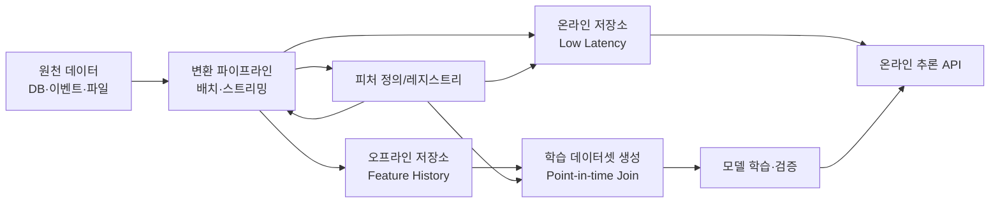
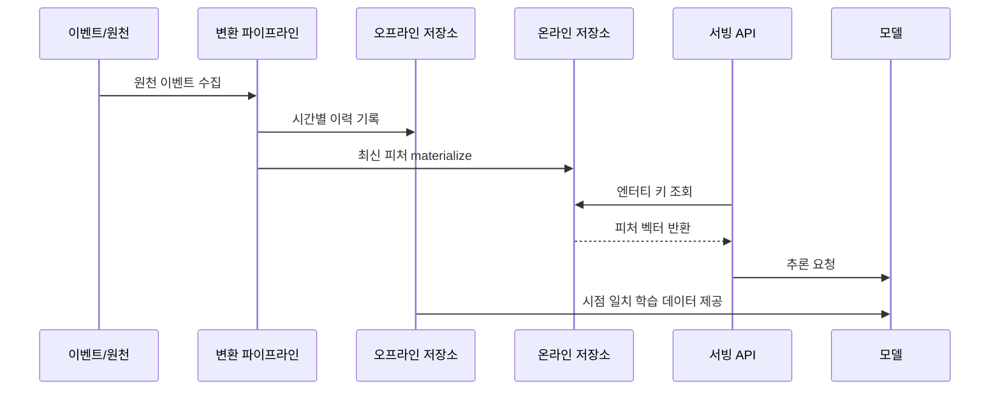

# 피처 스토어(Feature Store)와 머신러닝 데이터 운영

## 1. 개요

> **정의**: 피처 스토어(Feature Store)는 원천 데이터를 머신러닝 모델이 사용할 수 있는 피처로 생성·검증·저장·검색·배포하는 공통 플랫폼으로, 학습(오프라인)과 추론(온라인)에서 동일한 피처 정의와 품질을 재사용하게 하는 데이터 운영 체계이다.

머신러닝 프로젝트가 PoC를 넘어 서비스로 확장되면 모델 알고리즘보다 데이터 준비와 운영의 반복 비용이 더 커진다.
팀마다 SQL과 Python으로 같은 고객·상품·거래 지표를 다시 계산하면 정의가 달라지고, 학습 데이터와 운영 추론 데이터의 분포가 어긋난다.
배치 학습에서는 수 시간 걸리는 집계도 허용되지만, 실시간 사기 탐지나 개인화 추천은 수십 밀리초 안에 피처를 반환해야 한다.
따라서 피처를 단순한 컬럼이 아니라 재현 가능하고 관측 가능한 데이터 제품으로 관리해야 한다.

피처 스토어는 이 문제를 피처 정의의 중앙화, 오프라인·온라인 저장소의 분리, 시점 일치 학습, 온라인 저지연 조회, 계보와 품질 관리로 나눈다.
모델 개발자는 저장 방식의 세부 구현보다 어떤 엔터티에 어떤 기간의 데이터를 어떤 변환으로 적용할지에 집중할 수 있다.
플랫폼 운영자는 동일한 정의를 배치 파이프라인과 스트리밍 파이프라인에 연결하여 학습과 추론의 재현성을 높인다.

이 주제의 핵심은 제품 이름을 암기하는 것이 아니라 피처의 생명주기를 데이터 거버넌스와 MLOps 안에 배치하는 것이다.
원천 이벤트가 수집되고, 변환된 피처가 검증되며, 오프라인 학습과 온라인 추론으로 제공되는 전 과정을 하나의 논리 모델로 설명해야 한다.
특히 미래 정보가 학습에 섞이는 데이터 누수, 온라인·오프라인 값의 불일치, 피처 신선도 저하, 개인정보 과다 노출을 함께 통제해야 한다.

## 2. 등장 배경과 필요성

### 2.1 전통적 모델 개발의 병목

초기 모델은 노트북이나 분석용 SQL에서 피처를 직접 만든다.
이 방식은 가설을 빠르게 검증하는 데는 유리하지만, 같은 변환을 여러 모델과 팀이 복사하면서 코드와 정의가 분산된다.
개발자가 바뀌면 지표의 의미와 산식, 사용 가능한 시점, 결측치 처리 규칙을 다시 추적해야 한다.

예를 들어 ‘최근 30일 구매 횟수’라는 이름이 있어도 한 팀은 취소 주문을 제외하고, 다른 팀은 결제 승인 시각을 기준으로 집계할 수 있다.
두 모델이 서로 다른 피처를 사용하면서도 동일한 이름을 쓰면 실험 결과를 비교하기 어렵고 운영 장애의 원인을 찾기 힘들다.
피처 스토어는 이름뿐 아니라 정의, 엔터티 키, 시간 기준, 소유자, 품질 규칙을 함께 등록하도록 만든다.

운영 배포 단계에서는 또 다른 문제가 발생한다.
학습 때는 데이터 웨어하우스에서 피처를 조인하지만 서비스는 요청 시마다 데이터베이스를 여러 번 조회해야 하므로 지연과 부하가 증가한다.
온라인 저장소에 미리 계산한 값을 보관하면 조회 경로를 단순화할 수 있지만, 배치 계산이 늦거나 이벤트가 누락되면 오래된 값을 반환할 수 있다.
따라서 피처 스토어는 저장소를 하나로 통일하는 도구가 아니라 목적에 따라 경로를 분리하고 일관성을 관리하는 구조다.

### 2.2 도입 목적

첫째, 피처 재사용으로 개발 리드타임을 줄인다.
고객 활동량, 상품 인기도, 장치 위험도처럼 여러 모델이 공통으로 쓰는 피처를 한 번 정의하고 여러 모델에 제공한다.
재사용은 코드 중복을 줄이는 것뿐 아니라 검증된 산식을 조직의 표준 자산으로 전환한다는 의미가 있다.

둘째, 학습-서빙 편향을 완화한다.
훈련 데이터와 온라인 추론에서 동일한 변환 로직과 정의를 사용하면 개발 환경과 운영 환경의 의미 차이를 줄일 수 있다.
완전한 동일성을 보장하려면 처리 시간, 반올림, 결측치, 지연 이벤트에 대한 정책까지 명시해야 한다.

셋째, 모델 운영을 데이터 운영과 연결한다.
피처별 신선도, 결측률, 분포 변화, 조회 오류를 모니터링하면 모델 성능 저하의 원인을 데이터 관점에서 빠르게 분리할 수 있다.
이는 모델 정확도만 보는 방식에서 서비스 수준 목표와 데이터 품질 목표를 함께 보는 방식으로 전환하게 한다.

## 3. 핵심 개념과 구성요소

### 3.1 전체 구조

위 구조에서 레지스트리는 피처의 이름만 저장하는 목록이 아니다.
피처가 어느 엔터티를 키로 하는지, 어떤 시간 윈도우와 집계식을 쓰는지, 어느 팀이 소유하는지, 어느 저장소에 materialize되는지를 설명하는 메타데이터 계층이다.
정의와 데이터가 분리되어도 실행 시점에는 동일한 계약으로 연결되어야 한다.

원천 데이터는 거래 테이블, 애플리케이션 로그, 메시지 이벤트, 센서 스트림, 외부 데이터 등으로 구성된다.
원천의 스키마가 바뀌거나 이벤트가 지연되면 피처의 의미와 신선도에 영향을 주므로 스키마 계약과 변경 관리가 필요하다.
변환 파이프라인은 원천을 직접 모델에 전달하지 않고, 재사용 가능한 피처 집합으로 만든다.

### 3.2 주요 용어

엔터티(entity)는 피처가 귀속되는 업무 대상을 의미한다.
고객 ID, 상품 ID, 계정 ID, 차량 ID와 같은 엔터티 키가 있어야 여러 원천의 값을 같은 대상에 조인할 수 있다.
한 피처가 고객과 상품처럼 여러 키의 조합에 귀속되면 복합 엔터티와 키 생성 규칙을 명확히 해야 한다.

피처(feature)는 모델 입력으로 사용되는 수치·범주·벡터·시간 기반 속성이다.
‘최근 7일 로그인 횟수’, ‘상품의 1시간 평균 조회 수’, ‘고객의 평균 결제 금액’은 원천 속성이 아니라 변환을 거친 파생 피처다.
범주형 값을 인코딩한 결과나 임베딩 벡터도 제공 방식과 버전을 관리한다면 피처로 취급할 수 있다.

피처 뷰(feature view)는 하나 이상의 피처와 엔터티, 시간 기준, 변환 로직을 묶은 논리적 제공 단위다.
같은 고객 엔터티를 기준으로 최근 1일·7일·30일 활동량을 함께 제공하면 모델이 필요한 시간 창을 일관되게 사용할 수 있다.
피처 뷰의 변경은 모델 입력 계약의 변경이므로 하위 호환성, 버전, 폐기 일정을 함께 관리한다.

오프라인 저장소는 과거의 피처 값을 시간과 함께 보관한다.
모델 학습, 백테스트, 재현성 검증, 데이터 탐색에서는 특정 시점의 값을 복원해야 하므로 대용량 분석 저장소와 컬럼 지향 포맷이 적합하다.
온라인 저장소는 최신 또는 특정 유효 시점의 값을 낮은 지연으로 반환한다.
키-값 조회에 최적화하며, 저장 용량·TTL·복제·장애 조치 정책이 중요하다.

레지스트리는 피처 정의, 설명, 타입, 태그, 소유자, 승인 상태, 버전, 계보를 관리한다.
카탈로그가 없으면 사용되지 않는 피처가 계속 쌓이고, 개인정보가 포함된 피처가 목적 외로 재사용될 수 있다.
레지스트리는 검색성과 통제성을 제공하지만 실제 값의 품질을 대신 보장하지는 않으므로 파이프라인 검증과 함께 운영한다.

### 3.3 온라인·오프라인 저장 경로

배치 경로는 일정 주기로 과거 데이터를 재계산하고 오프라인 저장소에 적재한다.
대량 재처리와 과거 시점 복원에는 강하지만, 계산 주기만큼 값이 늦어진다.
스트리밍 경로는 이벤트가 도착할 때 상태를 갱신하므로 실시간성이 높지만, 순서 뒤바뀜·중복·누락·늦은 이벤트를 처리해야 한다.

온라인 materialization은 오프라인의 검증된 값을 온라인 저장소로 복사하는 방식과, 스트림 계산 결과를 곧바로 온라인에 기록하는 방식으로 나눌 수 있다.
전자는 학습과 추론의 정의를 맞추기 쉽지만 지연이 발생하고, 후자는 신선도가 좋지만 재처리와 일관성 설계가 어렵다.
업무의 허용 지연과 정확성 요구를 기준으로 피처별 경로를 결정해야 한다.

## 4. 피처 생명주기와 데이터 운영

### 4.1 정의와 계약

피처 정의에는 최소한 이름, 설명, 데이터 타입, 엔터티 키, 이벤트 시간, 집계 기간, 기본값, 결측치 규칙, 소유자, 보안 분류를 포함한다.
‘최근 24시간 거래 횟수’라면 현재 시각을 포함하는지, 취소 거래를 어떻게 처리하는지, 시간대는 무엇인지까지 계약으로 남겨야 한다.
계약이 모호하면 동일한 파이프라인이라도 재실행 시 값이 달라질 수 있다.

피처의 이름은 업무 의미를 드러내야 하며 팀 내부 약어만으로 짓지 않는다.
예를 들어 `cust_7d_txn_cnt`와 같은 기술 이름을 쓰더라도 사람이 읽는 설명과 단위를 함께 등록한다.
수치의 단위, 스케일, 허용 범위, 범주 값 집합을 명시하면 입력 검증과 이상치 탐지가 가능해진다.

피처 정의는 코드로 버전 관리하는 것이 바람직하다.
변환 코드, 스키마, 테스트, 레지스트리 메타데이터를 함께 리뷰하면 변경 이유를 추적할 수 있다.
단순히 화면에서 값을 수정하는 방식은 재현성과 승인 이력을 약화시키므로 운영 환경에서는 피해야 한다.

### 4.2 시점 일치와 데이터 누수

시점 일치(point-in-time correctness)는 예측 시각에 실제로 알 수 있었던 데이터만 학습에 포함하는 원칙이다.
예측 시각이 6월 30일 12시라면 7월 1일에 확정된 결제 결과나 사후 정정된 상태를 6월 30일 피처로 사용해서는 안 된다.
미래 정보가 섞이면 검증 정확도는 높아지지만 실제 서비스에서는 성능이 급락한다.

시간 컬럼은 이벤트가 발생한 시각과 시스템에 도착한 시각을 구분해야 한다.
센서나 메시지는 늦게 도착할 수 있으므로 지연 이벤트의 허용 범위와 보정 정책을 정한다.
학습 데이터 조인에서는 엔터티 키가 같고 피처 시각이 관측 시각보다 과거인 가장 최신 레코드를 선택해야 한다.

다음은 누수 위험을 줄이는 점검 질문이다.

| 점검 영역 | 확인 질문 | 대응 예시 |
|---|---|---|
| 시간 | 피처 값이 예측 시점 이후에 확정되지 않았는가? | 이벤트 시간 기준 조인, 미래 행 제외 |
| 레이블 | 레이블 생성에 사용한 정보가 피처에 재사용되지 않았는가? | 레이블·피처 원천 분리, 검토 승인 |
| 집계 | 윈도우의 오른쪽 경계가 예측 시각을 넘지 않는가? | 반열린 구간 `[t-window, t)` 적용 |
| 정정 | 사후 정정·취소가 과거 학습값을 덮어쓰지 않는가? | 이력 보존, 유효 시점과 처리 시점 분리 |
| 결측 | 미래에만 채워진 결측값이 학습에 들어가지 않는가? | 관측 시점 기준 결측 처리 |

시점 일치는 오프라인 데이터셋 생성기의 핵심 테스트 항목이다.
임의의 기준 시각을 만들고 그 이후에 생성된 이벤트가 학습 행에 반영되지 않았는지 자동으로 검사한다.
이 테스트가 없으면 모델 평가 수치만으로는 누수를 알아채기 어렵다.

### 4.3 품질·신선도·분포 관리

피처 품질은 정확성, 완전성, 유효성, 일관성, 적시성으로 나눠 측정한다.
정확성은 업무 원천과 값이 맞는지, 완전성은 결측과 누락이 허용 수준인지, 적시성은 정의된 SLA 안에 최신 값이 도착했는지를 뜻한다.
같은 피처라도 업무 위험에 따라 품질 임계값과 알림 우선순위가 달라진다.

신선도는 마지막 정상 갱신 시각과 현재 시각의 차이로 관리할 수 있다.
실시간 사기 점수의 허용 지연은 분 단위일 수 있지만, 월간 고객 등급은 하루 단위 지연도 허용할 수 있다.
피처마다 `freshness_sla`, `null_rate`, `range_violation`, `row_count` 같은 지표를 정하고 모델 서비스의 SLO와 연결한다.

분포 변화는 평균과 분산만으로 판단하기 어렵다.
범주 분포, 분위수, 결측 패턴, 엔터티별 편향을 함께 보고 학습 기준 분포와 추론 분포를 비교한다.
변화가 발견되면 원천 이벤트 변화인지, 파이프라인 오류인지, 실제 업무 환경 변화인지 구분한 뒤 재학습 여부를 판단한다.

### 4.4 변환 방식과 재사용

변환은 원천에서 파생값을 계산하는 사전 변환과 모델 실행 직전에 계산하는 요청 시 변환으로 나눌 수 있다.
사전 변환은 조회 지연과 추론 비용을 줄이지만 저장 비용과 갱신 관리가 필요하다.
요청 시 변환은 최신 원천을 반영하기 쉽지만 외부 의존성 지연과 온라인·오프라인 로직 불일치 위험이 커진다.

공통 변환은 플랫폼이 제공하고 모델 특화 변환은 모델 팀이 소유하는 경계를 정할 수 있다.
다만 소유권이 나뉘면 입력 스키마와 버전 계약이 필수다.
변환 함수가 비결정적이거나 현재 시각에 의존하면 같은 학습 데이터 재생성이 어려우므로 기준 시각을 명시적으로 전달한다.

## 5. 구현 절차와 운영 아키텍처

### 5.1 도입 절차

첫 단계는 모델 목록을 만드는 것이 아니라 업무 의사결정과 지연 요구를 분류하는 것이다.
사기 차단, 추천 순위, 이탈 예측, 설비 이상 탐지처럼 판단 시점과 허용 오류가 다른 사례를 구분한다.
각 사례에서 엔터티, 예측 시점, 피처 갱신 주기, 조회 지연, 보존 기간을 도출한다.

둘째, 원천 이벤트와 스키마를 조사한다.
데이터의 소유자, 의미, 변경 주기, 품질 이슈, 개인정보 분류를 확인하고 피처 후보와 계보를 연결한다.
원천이 이벤트 시간과 처리 시간을 함께 제공하지 않으면 시점 일치 학습을 위해 수집 설계를 먼저 보완해야 한다.

셋째, 오프라인 학습 경로를 먼저 검증한다.
과거 기준 시각으로 데이터셋을 재현하고 누수·중복·결측·분포를 테스트한 뒤 작은 모델로 효과를 확인한다.
온라인 저장소를 먼저 만들고 나중에 데이터 의미를 정리하면 운영 트래픽은 생기지만 피처 신뢰성은 확보되지 않는다.

넷째, 온라인 경로를 단계적으로 개방한다.
조회 API의 타임아웃, 캐시, 기본값, 장애 시 fallback, 피처 버전, 접근 제어를 정하고 shadow traffic으로 오프라인·온라인 값을 비교한다.
모델의 예측 결과뿐 아니라 피처 조회 성공률과 신선도를 함께 관찰해야 한다.

### 5.2 온라인 서빙 패턴

온라인 조회는 단일 엔터티의 여러 피처를 한 번에 가져오는 배치 조회가 일반적이다.
모델이 필요한 피처를 개별 API로 호출하면 네트워크 왕복이 늘고 일부 값만 최신인 혼합 스냅샷이 만들어질 수 있다.
가능하면 동일한 유효 시각과 버전의 피처 벡터를 원자적으로 제공한다.

캐시는 응답 지연과 저장소 부하를 줄이지만 TTL이 신선도 요구보다 길어지지 않게 해야 한다.
캐시 무효화 실패가 지속되면 모델은 정상 응답을 받더라도 오래된 값을 사용한다.
민감도가 높은 거래 위험 피처는 캐시 키와 보존 시간에 개인정보와 보안 위험이 없는지 검토한다.

저장소 장애 때 기본값으로 대체할 수 있지만, 모든 결측을 0으로 바꾸면 모델의 의미가 달라질 수 있다.
피처별 기본값과 ‘값 없음’ 상태를 구별하고, fallback 발생을 별도 메트릭과 로그로 남긴다.
업무적으로 안전한 차단 또는 보수적 판정이 필요한 경우 모델 호출 자체를 중단하는 정책도 고려한다.

### 5.3 배치·스트리밍 처리의 통합

배치 처리는 대규모 재계산과 과거 복원에 적합하다.
스트리밍 처리는 최근 이벤트를 빠르게 반영하지만 중복 제거, 순서 보장, 상태 저장, 워터마크, 재처리 전략이 필요하다.
두 경로가 같은 피처를 만든다면 산식과 경계 조건을 공유하여 결과 차이를 지속적으로 비교해야 한다.

대표적인 통합 방식은 배치가 기준 이력을 만들고 스트림이 최신 구간을 보정하는 람다형 구조다.
이 방식은 빠른 갱신과 재현성을 모두 얻을 수 있지만 두 계산 경로의 중복과 정합성 관리 비용이 발생한다.
단일 스트림 처리 구조는 로직을 단순화할 수 있으나 장기간 이력 재생성과 대규모 백필 비용을 별도로 설계해야 한다.

## 6. 비교와 사례

### 6.1 데이터 웨어하우스 직접 조회와 비교

데이터 웨어하우스 직접 조회는 이미 보유한 SQL과 저장소를 활용할 수 있어 초기 비용이 낮다.
하지만 모델 API 요청마다 복잡한 조인과 집계를 실행하면 지연과 동시성 문제가 발생하고, 모델 팀마다 쿼리 정의가 복제된다.
피처 스토어는 온라인 값을 미리 materialize하고 정의를 공유하여 반복 비용을 줄인다.

반면 피처 스토어는 별도 플랫폼과 운영 인력이 필요하다.
모든 피처를 온라인에 저장하면 저장 비용과 동기화 복잡성이 증가하므로, 지연 요구가 낮은 모델은 웨어하우스 배치 추론으로 남기는 것이 합리적일 수 있다.
선택 기준은 유행하는 제품이 아니라 추론 지연, 재사용률, 품질 통제, 개인정보 위험의 조합이어야 한다.

| 구분 | 웨어하우스 직접 조회 | 피처 스토어 |
|---|---|---|
| 주 목적 | 분석·배치 데이터 처리 | 학습·추론용 피처 제공 |
| 온라인 지연 | 조인과 부하에 따라 변동 | 사전 적재로 낮게 설계 가능 |
| 재사용 | 쿼리 복제 가능성 | 레지스트리 기반 공유 |
| 시점 일치 | 별도 구현 필요 | 학습 데이터 생성 기능으로 표준화 |
| 운영 부담 | 기존 플랫폼 활용 | 저장소·파이프라인·서빙 운영 추가 |
| 적합 사례 | 배치 점수, 탐색, 리포트 | 실시간 추천, 사기 탐지, 개인화 |

### 6.2 추천 서비스 사례

온라인 쇼핑몰의 추천 모델이 고객별 최근 조회 상품 수와 상품별 최근 구매 전환율을 사용한다고 가정한다.
조회 이벤트는 스트림으로 들어오고, 상품 전환율은 최근 1시간 창과 7일 창으로 각각 계산할 수 있다.
고객 키와 상품 키가 서로 다르므로 추천 요청 시 두 피처 집합을 조인하거나 모델 입력용 벡터로 조합한다.

피처 스토어는 조회 이벤트의 중복을 제거하고 최근 활동량을 온라인 저장소에 갱신한다.
7일 전환율은 배치 경로가 정밀하게 재계산하고, 최근 1시간 값은 스트림 경로가 갱신하도록 분리할 수 있다.
추천 응답에는 피처 버전과 갱신 시각을 기록하면 특정 결과가 어떤 데이터 상태에서 만들어졌는지 설명할 수 있다.

신상품은 구매 이력이 부족하므로 전환율이 결측이 된다.
이때 전역 평균으로 대체하면 신상품 노출이 줄어드는 콜드 스타트 문제가 생길 수 있으므로 카테고리 평균, 콘텐츠 피처, 탐색 정책을 함께 고려한다.
이 사례는 피처 스토어가 저장 기술만이 아니라 제품 정책과 모델 운영을 연결한다는 점을 보여준다.

### 6.3 사기 탐지 사례

결제 승인 시점에 계정의 최근 10분 거래 횟수, 최근 24시간 실패 횟수, 장치와 계정의 관계 수를 조회한다고 가정한다.
이 업무에서는 오래된 값이 사기 거래를 통과시키거나 정상 고객을 막을 수 있어 신선도와 가용성의 우선순위를 높게 둔다.
피처 조회가 타임아웃되면 보수적 차단, 추가 인증, 수동 검토 중 어떤 정책을 선택할지 업무와 합의해야 한다.

학습 데이터에는 승인 시점까지 관측된 값만 포함해야 한다.
사후 확정된 차지백 결과를 거래 직전 피처에 포함하면 검증 결과가 과대평가된다.
또한 계정·장치 관계 그래프는 개인정보와 결합될 수 있으므로 최소 수집, 접근 통제, 보존 기간, 목적 외 이용 제한을 적용한다.

## 7. 심화: MLOps·거버넌스와 확장 방향

### 7.1 피처를 데이터 제품으로 관리

피처의 사용자는 모델 개발자뿐 아니라 데이터 엔지니어, 위험관리자, 감사자다.
따라서 레지스트리에 기술 메타데이터만 저장하지 말고 업무 정의, 품질 지표, 승인자, 영향 모델, 폐기 계획을 함께 관리해야 한다.
피처가 여러 모델에서 사용될수록 변경 영향 분석과 소비자 통지가 중요해진다.

피처 계약 테스트는 공급자와 소비자 사이의 기대를 자동으로 확인한다.
공급자는 스키마와 범위를 보장하고, 소비자는 필요한 버전과 허용 결측률을 선언한다.
계약이 깨지면 배포를 중단하거나 해당 모델을 격리하여 장애가 서비스 전체로 전파되지 않게 한다.

### 7.2 모델 성능과 피처 드리프트의 연결

정확도 하락을 발견했을 때 모델을 즉시 재학습하는 것은 항상 정답이 아니다.
피처 분포가 바뀌었는지, 레이블 지연이 있는지, 원천 스키마가 바뀌었는지, 사용자 행동 자체가 변했는지를 먼저 분리해야 한다.
피처 계보와 모니터링을 연결하면 원천 이벤트부터 모델 지표까지 영향 경로를 추적할 수 있다.

드리프트 임계값은 모든 피처에 같은 값을 적용하지 않는다.
금액·위험 점수·규제 보고용 피처는 작은 변화도 중요할 수 있고, 계절성이 큰 방문 수 피처는 정상적인 주기 변동을 고려해야 한다.
기준선은 학습 기간, 최근 정상 기간, 업무 이벤트 기간으로 나누어 운영하는 것이 유리하다.

### 7.3 스트리밍·벡터·생성형 AI와의 연계

실시간 피처는 이벤트 스트림과 상태 저장 기술의 결합으로 확장된다.
모델이 최근 행동의 순서나 빈도를 사용하면 단순한 최신값보다 시간 창과 이벤트 순서를 보존하는 상태 관리가 중요해진다.
이때 재처리 시 같은 결과를 얻을 수 있도록 이벤트 키와 처리 보장 수준을 명시한다.

임베딩과 벡터 검색이 필요한 생성형 AI 애플리케이션에서도 문서의 최신성, 접근 권한, 평가 결과 같은 운영 피처가 필요하다.
다만 임베딩 벡터는 원문과 다른 형태의 민감정보를 포함할 수 있으므로 벡터 저장소를 피처 저장소와 무조건 통합하지 않는다.
검색 품질·보안·삭제 요구를 기준으로 메타데이터와 벡터의 생명주기를 분리하거나 연결한다.

## 8. 고려사항 및 시사점

### 8.1 정확성과 재현성

피처 값은 언제든 재생성할 수 있어야 한다.
기준 시각, 코드 버전, 원천 스냅샷, 파라미터, 시간대가 남아야 동일한 학습 데이터와 모델 평가를 재현할 수 있다.
재현성이 없는 피처는 감사와 장애 분석에서 설명 책임을 다하기 어렵다.

### 8.2 성능과 비용의 균형

모든 피처를 실시간으로 계산하면 최신성은 높아지지만 스트림 처리·저장·관측 비용이 증가한다.
업무가 허용하는 최대 지연과 정확성 손실을 수치화하고, 피처별로 배치·마이크로배치·스트림을 선택한다.
온라인 저장소의 복제와 고가용성 비용도 모델 호출량과 실패 비용을 함께 보고 결정한다.

### 8.3 보안과 개인정보 보호

피처는 원문이 아니어도 개인의 행동과 위험을 추론할 수 있는 파생정보다.
민감정보 분류, 최소 권한, 암호화, 행·열 수준 접근 제어, 조회 감사 로그, 목적별 태그를 적용한다.
삭제 요청이 발생하면 오프라인 이력, 온라인 캐시, 백업, 파생 모델에서 어떤 범위까지 처리할지 사전에 정해야 한다.

### 8.4 일관성과 장애 대응

온라인·오프라인 값이 다르면 모델 성능과 설명 결과가 흔들린다.
동일 입력을 두 경로에 흘려 값 차이를 비교하고, 허용 오차를 넘으면 배포를 차단하는 검증을 둔다.
저장소 장애와 지연 이벤트에 대해 기본값·캐시·재시도·서킷 브레이커·수동 판정의 우선순위를 설계한다.

### 8.5 조직과 책임

플랫폼 팀은 공통 인프라와 표준을 제공하고, 도메인 팀은 피처의 업무 의미와 품질을 책임지는 구조가 적절하다.
소유자가 없는 공용 피처는 변경도 폐기도 어려우므로 데이터 제품별 책임자와 소비자 협약을 지정한다.
모델 승인 절차에 피처 계보, 개인정보 분류, 누수 테스트, 온라인 성능을 포함해야 한다.

### 8.6 기술사 관점의 시사점

피처 스토어는 MLOps의 부속 저장소가 아니라 데이터 아키텍처·AI 거버넌스·서비스 운영을 연결하는 통합 계층이다.
도입 순서는 제품 설치보다 업무 우선순위, 데이터 계약, 시점 일치, 품질 SLO, 보안 통제를 먼저 확립하는 방식이어야 한다.

향후에는 피처 정의의 코드화, 자동 품질 검증, 실시간·배치 통합, 모델 설명과 계보 연결이 강화될 것이다.
기술사는 특정 플랫폼의 기능 목록보다 피처를 재현 가능한 데이터 제품으로 설계하고, 비용·성능·규제·조직 책임을 함께 최적화하는 아키텍처를 제시해야 한다.

## 참고자료

- Feast 공식 문서: https://docs.feast.dev/
- TensorFlow Transform 및 TFX Feature Engineering: https://www.tensorflow.org/tfx/guide/transform
- Google Cloud Vertex AI Feature Store 개요: https://cloud.google.com/vertex-ai/docs/featurestore/overview
- AWS SageMaker Feature Store 개발자 안내서: https://docs.aws.amazon.com/sagemaker/latest/dg/feature-store.html
- MLflow 공식 문서: https://mlflow.org/docs/latest/

---

> **한 줄 요약**: 피처 스토어는 피처 정의·시점 일치·오프라인 학습·온라인 저지연 서빙·품질·보안을 하나의 생명주기로 관리해 머신러닝의 재현성과 운영 신뢰성을 높이는 데이터 플랫폼이다.
