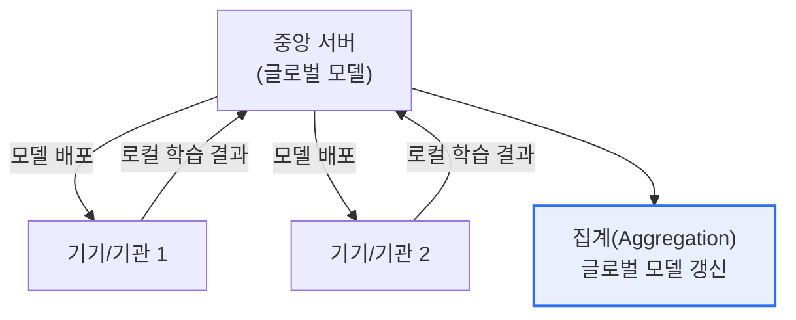

# 연합학습(Federated Learning)

## 1. 개요

### 가. 정의
> **연합학습**은 데이터를 한곳에 모으지 않고, **각 기기·기관에 데이터를 둔 채 로컬에서 학습한 모델(파라미터)만 중앙에 모아 통합**하는 분산 AI 학습 기법. 원본 데이터를 이동하지 않아 프라이버시를 보호한다.

연합학습의 핵심 발상은 '**데이터를 모델에게 보내지 말고, 모델을 데이터에게 보내라**'는 것이다. 전통적 AI 학습은 여러 곳의 데이터를 중앙 서버에 모아 학습한다. 그러나 의료·금융처럼 민감한 데이터는 법·프라이버시 문제로 밖으로 내보낼 수 없어, 데이터가 각 기관에 갇혀(사일로) AI 학습에 쓰이지 못했다. 연합학습은 이 딜레마를 뒤집어 해결한다. 데이터를 옮기는 대신, 학습할 모델을 각 기기·기관에 내려보내 **그 자리에서 로컬 데이터로 학습** 하게 하고, 학습 결과(가중치·그래디언트)만 중앙으로 모아 하나의 글로벌 모델로 통합한다. 원본 데이터는 절대 기관 밖으로 나가지 않으므로 프라이버시가 보호되면서도, 여러 기관의 데이터로 학습한 효과를 얻는다. 스마트폰 키보드 예측, 여러 병원의 의료 AI 공동 학습이 대표 사례다.

### 나. 필요성
데이터 3법·GDPR 등 프라이버시 규제와 데이터 사일로로, 민감 데이터를 활용한 AI 학습이 어려워졌다. 연합학습은 데이터를 이동하지 않고 활용하는 해법이다.

## 2. 동작 원리

동작은 반복된다. ①중앙 서버가 글로벌 모델을 각 참여자에게 배포 → ②각 참여자가 자신의 로컬 데이터로 모델 학습 → ③학습 결과(파라미터)만 중앙에 전송 → ④중앙이 이를 집계(평균)해 글로벌 모델 갱신 → 다시 배포. 원본 데이터는 전송되지 않고 파라미터만 오간다.

## 3. 주요 알고리즘

| 알고리즘 | 내용 |
|---|---|
| **FedAvg** | 각 로컬 모델 파라미터를 데이터량 가중 평균(대표 알고리즘) |
| **FedProx** | 참여자 간 데이터 이질성(non-IID) 보완 |
| **FedSGD** | 그래디언트 단위 집계 |

## 4. 보안 및 프라이버시 보장 기술

연합학습은 원본을 이동하지 않지만, 전송되는 파라미터에서 정보가 유추(전도 공격)될 수 있어 추가 보호 기술을 결합한다.

| 기술 | 내용 |
|---|---|
| **차분 프라이버시(DP)** | 파라미터에 잡음 추가로 개인 기여 은폐 |
| **동형암호(HE)** | 암호화 상태로 파라미터 집계 |
| **안전한 다자간 연산(MPC)** | 파라미터 노출 없이 공동 집계 |
| **보안 집계** | 개별 파라미터를 서버가 못 보게 집계 |

## 5. 고려사항 및 시사점

1. **파라미터에서도 정보 유출 가능**하다. 원본은 안전해도 전송된 그래디언트에서 학습 데이터가 역추론될 수 있으므로, 차분 프라이버시·동형암호·MPC 등 PET를 반드시 결합해야 한다.
2. **데이터 이질성(non-IID)이 난제**다. 참여자마다 데이터 분포가 달라 글로벌 모델의 수렴·성능이 저하될 수 있어, FedProx 등으로 이를 보완한다.
3. **프라이버시 보호 AI의 핵심**이다. 의료·금융처럼 데이터를 모을 수 없는 분야에서 여러 기관이 협력해 AI를 학습하는 유력한 방법으로, 데이터 활용과 프라이버시 보호를 동시에 달성한다.

---

> **한 줄 요약**: 연합학습은 *데이터를 모으지 않고 각 기기·기관에서 로컬 학습한 모델 파라미터만 집계* 하는 분산 AI 학습으로, FedAvg 등으로 통합하고 차분 프라이버시·동형암호·MPC를 결합해 데이터 활용과 프라이버시 보호를 함께 실현한다.
