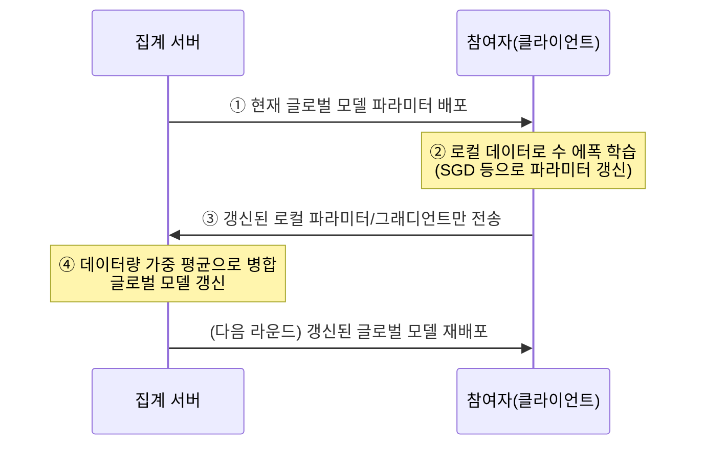

# 연합학습(Federated Learning)

## 1. 개요

### 가. 정의
> **연합학습(Federated Learning)** 은 학습 데이터를 한곳에 모으지 않고, **각 기기·기관에 원본 데이터를 그대로 둔 채 로컬에서 학습한 모델(파라미터·그래디언트)만 중앙에 모아 하나의 글로벌 모델로 통합** 하는 분산 AI 학습 기법이다. 원본 데이터가 물리적으로 이동하지 않으므로 프라이버시를 보호하면서도, 여러 주체의 데이터로 학습한 것과 유사한 성능을 얻는다.

연합학습의 핵심 발상은 '**데이터를 모델에게 보내지 말고, 모델을 데이터에게 보내라(bring the model to the data)**'로 요약된다. 전통적 중앙집중식 AI 학습은 여러 곳에 흩어진 데이터를 중앙 서버로 복사·수집한 뒤 학습한다. 이 방식은 데이터가 한곳에 모이는 순간 대규모 유출·오남용의 위험을 안게 되고, 의료 기록·금융 거래·개인 대화처럼 민감한 데이터는 애초에 법·프라이버시 문제로 기관 밖으로 반출할 수 없다. 그 결과 데이터는 각 기관에 갇혀(데이터 사일로, silo) 정작 AI 학습에는 활용되지 못하는 딜레마가 발생했다.

연합학습은 이 구도를 정반대로 뒤집어 해결한다. 데이터를 옮기는 대신 **학습할 모델 자체를 각 기기·기관으로 내려보내 그 자리에서 로컬 데이터로 학습** 시키고, 학습 결과인 가중치·그래디언트만 중앙으로 회수해 하나의 글로벌 모델로 병합한다. 원본 데이터는 절대 참여자의 경계를 벗어나지 않으므로 규제를 준수하면서도 다기관 협력 학습의 효과를 누린다. 2017년 구글이 스마트폰 키보드(Gboard)의 다음 단어 예측 모델을 사용자 기기에서 학습시키며 개념을 대중화했고, 이후 여러 병원이 환자 데이터를 공유하지 않고도 공동으로 진단 AI를 학습하는 의료 분야로 빠르게 확산되었다.

### 나. 등장 배경과 필요성
연합학습이 부상한 배경에는 세 가지 흐름이 맞물려 있다. 첫째는 **규제 강화** 다. EU의 GDPR, 국내 개인정보 보호법(데이터 3법), 의료법·금융 관련 법령은 개인식별 데이터의 국외·기관 외 이전을 엄격히 제한한다. 데이터를 이동하지 않는 연합학습은 이러한 규제 환경에서 '데이터를 활용하되 반출하지 않는' 현실적 절충안을 제공한다.

둘째는 **엣지·모바일 컴퓨팅의 확산** 이다. 스마트폰·IoT·웨어러블 기기의 연산 능력이 향상되면서, 데이터가 생성되는 단말에서 직접 학습을 수행할 인프라가 갖춰졌다. 데이터를 클라우드로 올리는 통신 비용과 지연을 줄이면서 개인화 모델을 만들 수 있게 된 것이다.

셋째는 **데이터 사일로의 경제적 비효율** 이다. 한 병원, 한 은행이 보유한 데이터만으로는 희귀 질환·이상거래처럼 사례가 적은 문제를 충분히 학습하기 어렵다. 여러 기관이 데이터를 물리적으로 합치지 않고도 '지식'을 합칠 수 있다면, 각자의 데이터 부족 문제를 협력으로 해소할 수 있다. 연합학습은 바로 이 지점에서 프라이버시 보호와 데이터 활용이라는 상충하는 두 목표를 동시에 만족시키는 기술로 주목받는다.

## 2. 전체 구조와 동작 원리

연합학습은 중앙의 **집계 서버(aggregator)** 와 다수의 **참여자(client)** 로 구성되며, 라운드(round)라 불리는 학습 주기를 반복하며 글로벌 모델을 점진적으로 개선한다. 아래 구조도는 데이터가 이동하지 않고 파라미터만 오가는 전체 관계를 보여준다.

```mermaid
flowchart TB
  S["중앙 집계 서버<br/>(글로벌 모델 보관·병합)"] -->|① 글로벌 모델 배포| C1["기기/기관 1<br/>(로컬 데이터 D1)"]
  S -->|① 글로벌 모델 배포| C2["기기/기관 2<br/>(로컬 데이터 D2)"]
  S -->|① 글로벌 모델 배포| C3["기기/기관 N<br/>(로컬 데이터 DN)"]
  C1 -->|③ 로컬 학습 결과(파라미터)| S
  C2 -->|③ 로컬 학습 결과(파라미터)| S
  C3 -->|③ 로컬 학습 결과(파라미터)| S
  S --> A["④ 집계(Aggregation)<br/>가중 평균으로 글로벌 모델 갱신"]
  A -.->|반복| S
  style A fill:#e8f0fe,stroke:#2f6fed,stroke-width:2px
```

이 구조에서 가장 중요한 원칙은 **원본 데이터(D1, D2 … DN)는 결코 서버로 전송되지 않는다** 는 점이다. 서버와 참여자 사이를 오가는 것은 오직 모델 파라미터뿐이며, 데이터는 각 참여자의 로컬 저장소 안에서만 사용된다. 이 덕분에 서버 운영자조차 참여자의 원본 데이터를 볼 수 없다.

한 라운드의 세부 절차는 아래 시퀀스처럼 진행된다. 이 반복 과정이 수렴할 때까지 이어지면서 글로벌 모델은 마치 모든 데이터를 한곳에서 본 것처럼 성능이 향상된다.

```mermaid
sequenceDiagram
  participant S as 집계 서버
  participant C as 참여자(클라이언트)
  S->>C: ① 현재 글로벌 모델 파라미터 배포
  Note over C: ② 로컬 데이터로 수 에폭 학습<br/>(SGD 등으로 파라미터 갱신)
  C->>S: ③ 갱신된 로컬 파라미터/그래디언트만 전송
  Note over S: ④ 데이터량 가중 평균으로 병합<br/>글로벌 모델 갱신
  S->>C: (다음 라운드) 갱신된 글로벌 모델 재배포
```

**①배포 단계** 에서 서버는 현재 글로벌 모델을 이번 라운드에 참여할 클라이언트들에게 내려보낸다. 모바일 환경에서는 수백만 대 중 일부(예: 충전 중이고 Wi-Fi에 연결된 기기)만 표본으로 선택된다. **②로컬 학습 단계** 에서 각 클라이언트는 자신의 데이터로 모델을 여러 에폭 학습해 파라미터를 갱신한다. 이 단계가 프라이버시의 핵심으로, 데이터는 기기를 떠나지 않는다. **③전송 단계** 에서는 원본이 아니라 학습으로 바뀐 파라미터(또는 그 변화량)만 서버로 보낸다. **④집계 단계** 에서 서버는 여러 클라이언트의 결과를 병합해 새 글로벌 모델을 만든다. 이렇게 완성된 모델이 다시 ①로 배포되어 라운드가 반복된다.

## 3. 유형과 주요 알고리즘

### 가. 데이터 분할 방식에 따른 유형
연합학습은 참여자 간 데이터가 어떻게 나뉘어 있는가에 따라 크게 세 유형으로 나뉜다. 이 구분은 단순 분류가 아니라 '어떤 협력이 가능한가'를 결정하기 때문에 실무 설계의 출발점이 된다.

**수평 연합학습(Horizontal FL)** 은 참여자들이 **같은 특성(feature)을 가지되 서로 다른 샘플** 을 보유한 경우다. 예컨대 여러 지역 병원이 동일한 검사 항목(혈압·혈당 등)을 다른 환자군에 대해 갖고 있는 상황이다. 스마트폰 키보드 예측이 대표 사례로, 모든 사용자가 '입력 이력'이라는 같은 형태의 데이터를 각자 다른 내용으로 보유한다.

**수직 연합학습(Vertical FL)** 은 참여자들이 **같은 샘플(고객)에 대해 서로 다른 특성** 을 보유한 경우다. 은행은 고객의 금융 거래 정보를, 통신사는 같은 고객의 통신 이용 패턴을 가진 상황에서, 두 기관이 데이터를 합치지 않고 같은 고객에 대한 더 풍부한 모델을 만드는 것이다. 이때는 어느 고객이 공통인지 개인정보 노출 없이 찾아내는 프라이버시 보존 교집합(PSI) 기술이 함께 쓰인다.

**연합 전이학습(Federated Transfer Learning)** 은 샘플도 특성도 겹침이 적을 때, 전이학습을 결합해 지식을 이전하는 방식이다.

### 나. 집계 알고리즘
집계 알고리즘은 흩어진 로컬 학습 결과를 하나로 합치는 '병합 규칙'이다. 아래 표는 대표 알고리즘을 정리한 것인데, 각 알고리즘은 통신량 절감과 데이터 이질성 대응이라는 상충하는 목표 사이에서 서로 다른 균형점을 택한다.

| 알고리즘 | 핵심 아이디어 | 장점 | 한계 |
|---|---|---|---|
| **FedSGD** | 매 스텝 그래디언트를 서버가 집계 | 이론적으로 단순·정확 | 통신 라운드가 매우 잦아 비용 큼 |
| **FedAvg** | 각 클라이언트가 여러 에폭 학습 후 파라미터를 데이터량 가중 평균 | 통신 라운드 대폭 절감(대표 알고리즘) | non-IID 데이터에서 수렴 불안정 |
| **FedProx** | FedAvg에 근접항(proximal term)을 더해 로컬 모델이 글로벌에서 과도히 벗어나지 않게 제약 | 데이터 이질성·시스템 이질성 보완 | 하이퍼파라미터 조정 필요 |
| **FedOpt(FedAdam 등)** | 서버 측 집계에 적응적 최적화(모멘텀·Adam) 적용 | 수렴 속도·안정성 개선 | 서버 상태 관리 복잡 |

가장 널리 쓰이는 **FedAvg** 는 각 클라이언트가 한 번에 여러 에폭을 학습하게 하여, 서버와 주고받는 통신 횟수를 FedSGD 대비 획기적으로 줄인 것이 핵심이다. 다만 참여자마다 데이터 분포가 크게 다르면(non-IID) 로컬 모델들이 서로 다른 방향으로 치우쳐 평균이 흔들린다. **FedProx** 는 로컬 학습이 글로벌 모델에서 너무 멀어지지 않도록 벌점을 부과해 이 문제를 완화하며, 참여자별 연산 능력 차이(느린 기기가 학습을 덜 하는 상황)도 함께 다룬다.

## 4. 보안·프라이버시 강화 기술

연합학습이 원본 데이터를 이동하지 않는다는 사실만으로 프라이버시가 완전히 보장되는 것은 아니다. 전송되는 파라미터·그래디언트에는 학습 데이터의 흔적이 남아 있어, 악의적 서버나 참여자가 이를 역이용하면 원본을 복원하거나 특정 개인의 참여 여부를 추론할 수 있다. 이를 **그래디언트 역전(gradient inversion) 공격**, **멤버십 추론(membership inference) 공격** 이라 부른다. 따라서 실전 연합학습은 아래의 프라이버시 강화 기술(PET)을 반드시 결합한다.

| 기술 | 동작 방식 | 보호하는 위협 | 비용/트레이드오프 |
|---|---|---|---|
| **차분 프라이버시(DP)** | 파라미터·그래디언트에 통계적 잡음 추가로 개별 기여 은폐 | 멤버십·속성 추론 | 잡음이 클수록 정확도 하락 |
| **동형암호(HE)** | 암호화된 상태 그대로 파라미터를 덧셈·병합 | 서버의 파라미터 열람 | 연산량·통신량 급증 |
| **보안 다자간 연산(MPC)** | 여러 서버·참여자가 분산 비밀로 공동 집계 | 단일 주체의 파라미터 독점 열람 | 통신·프로토콜 복잡도 |
| **보안 집계(Secure Aggregation)** | 개별 파라미터는 상쇄되고 합계만 서버가 복원 | 서버의 개별 파라미터 열람 | 참여자 이탈 시 재조정 필요 |

**차분 프라이버시** 는 개별 데이터 한 건의 참여 여부가 결과에 미치는 영향을 수학적으로 제한된 수준 이하로 낮춰, 특정인의 데이터가 학습에 쓰였는지조차 알기 어렵게 만든다. 잡음이 커질수록 프라이버시는 강해지지만 모델 정확도가 떨어지므로, 프라이버시 예산(ε)을 통해 균형점을 조정한다. **동형암호** 와 **보안 집계** 는 서버가 개별 파라미터를 들여다보지 못하게 하는 데 초점을 둔다. 특히 보안 집계는 참여자들이 서로 상쇄되는 마스크를 씌워 파라미터를 전송함으로써, 서버는 전체 합만 복원할 수 있고 개별 값은 알 수 없게 하는 실용적 기법이다. 실무에서는 이들을 조합해 '방어 심층화'를 구성한다.

## 5. 심화 — 산업 적용 사례와 표준·동향

연합학습은 이미 여러 산업에서 상용 단계에 진입했다. **모바일** 분야에서 구글 Gboard는 사용자의 실제 타이핑 데이터를 서버로 보내지 않고도 다음 단어·이모지 예측 모델을 지속적으로 개선한 대표 사례로 꼽힌다. 애플도 음성비서·QuickType 등에서 기기 내 학습과 프라이버시 보호 집계를 결합한 접근을 취해 왔다고 알려져 있다.

**의료** 분야의 대표 사례로는 여러 병원·연구기관이 참여해 뇌종양 등 영상 진단 모델을 공동 학습한 대규모 협력 프로젝트들이 보고되어 왔다. 각 병원은 환자 영상을 외부로 반출하지 않고 로컬에서만 학습하고 모델만 공유함으로써, 단일 기관 데이터로는 얻기 힘든 일반화 성능을 확보했다. **금융** 분야에서는 여러 은행·카드사가 데이터를 합치지 않고 이상거래 탐지(FDS)·신용평가 모델을 협력 학습하려는 시도가 이어지고 있는데, 이는 사기 패턴처럼 한 기관의 데이터만으로는 사례가 부족한 문제에 특히 효과적이다.

**제조·통신** 분야에서도 활용이 확산되고 있다. 여러 공장이 설비 센서 데이터를 외부로 반출하지 않고 예지보전(고장 예측) 모델을 공동 학습하거나, 통신 사업자가 기지국·단말의 트래픽 패턴을 로컬에서 학습해 네트워크 최적화 모델을 개선하는 방식이다. 이들 사례의 공통점은 데이터가 민감하거나 양이 방대해 중앙 수집이 비현실적이라는 점이며, 연합학습은 '데이터는 현장에, 지식은 공유'라는 원칙으로 이 제약을 우회한다.

기술·표준 측면에서는 오픈소스 프레임워크(TensorFlow Federated, PySyft, Flower, NVIDIA FLARE 등)가 실험·배포를 뒷받침하고 있으며, ITU-T·ISO/IEC 등에서 연합학습의 상호운용성과 보안 요건을 다루는 표준화 논의가 진행되어 왔다. 다만 세부 표준 버전·채택 현황은 계속 변동하므로 구체 수치는 최신 문서를 확인해야 한다. 최근에는 대규모 언어모델(LLM)을 프라이버시 침해 없이 미세조정하려는 요구와 맞물려, 연합학습을 파라미터 효율적 미세조정(PEFT)·차분 프라이버시와 결합하는 연구가 활발해지는 흐름이 관찰된다.

## 6. 고려사항 및 시사점

1. **파라미터 자체가 공격면(attack surface)이라는 인식이 전제되어야 한다.** 원본을 옮기지 않는다는 사실만으로 안심할 수 없으며, 그래디언트 역전·멤버십 추론에 대비해 차분 프라이버시·보안 집계·동형암호 등 PET를 반드시 결합해 '데이터 미이동'과 '정보 미유출'을 함께 달성해야 한다.

2. **데이터 이질성(non-IID)과 시스템 이질성은 성능의 결정적 변수다.** 참여자마다 데이터 분포·양·기기 성능이 제각각이어서 글로벌 모델의 수렴과 공정성이 흔들릴 수 있다. FedProx·개인화 연합학습 등으로 이질성을 흡수하고, 소외되는 참여자가 없도록 공정성 지표를 함께 관리하는 설계가 요구된다.

3. **통신 비용과 정확도·프라이버시 사이의 트레이드오프를 정량적으로 설계해야 한다.** 라운드 수를 줄이면 통신은 절약되나 수렴이 늦고, 잡음을 키우면 프라이버시는 강해지나 정확도가 하락한다. 프라이버시 예산(ε), 참여자 표본 비율, 로컬 에폭 수 등을 서비스 요구수준에 맞춰 균형 있게 조율하는 것이 기술사 관점의 핵심 의사결정이다.

4. **거버넌스·인센티브·법제도와의 연계가 지속성을 좌우한다.** 다기관 협력은 데이터 미이동만으로 성립하지 않으며, 참여 기관의 기여를 어떻게 보상할지(인센티브), 모델 소유권·책임을 어떻게 배분할지, 규제(개인정보 보호법·GDPR)와 어떻게 정합할지를 사전에 합의해야 협력이 유지된다. 연합학습은 순수 기술이 아니라 프라이버시 보호 AI 생태계의 거버넌스 문제이기도 하다.

5. **모델 무결성·독성(poisoning) 공격에 대한 방어가 필수다.** 서버가 원본을 못 보는 구조는 역으로 악의적 참여자가 조작된 파라미터를 주입해 글로벌 모델을 오염시키기 쉬운 환경이기도 하다. 비정상 업데이트를 걸러내는 견고 집계(robust aggregation)·이상탐지와 참여자 신뢰 관리가 프라이버시 보호와 함께 설계되어야 한다.

6. **차세대 프라이버시 보호 AI의 기반 기술로 자리매김하고 있다.** 데이터를 모을 수 없는 의료·금융·공공 분야에서 다기관 협력을 가능케 하는 핵심 수단이며, 엣지 AI·온디바이스 학습·대규모 언어모델의 프라이버시 보존 미세조정과 결합하며 활용 범위가 계속 확대될 전망이다.

## 참고자료
- Google AI Blog, "Federated Learning: Collaborative Machine Learning without Centralized Training Data" — https://ai.googleblog.com/2017/04/federated-learning-collaborative.html
- McMahan et al., "Communication-Efficient Learning of Deep Networks from Decentralized Data (FedAvg)" — https://arxiv.org/abs/1602.05629
- Li et al., "Federated Optimization in Heterogeneous Networks (FedProx)" — https://arxiv.org/abs/1812.06127
- Flower: A Friendly Federated Learning Framework — https://flower.ai/

---

> **한 줄 요약**: 연합학습은 *데이터를 모으지 않고 각 기기·기관에서 로컬 학습한 모델 파라미터만 집계* 하는 분산 AI 학습으로, FedAvg·FedProx로 이질적 데이터를 통합하고 차분 프라이버시·보안 집계·동형암호를 결합해 프라이버시 보호와 데이터 활용을 동시에 실현한다.
