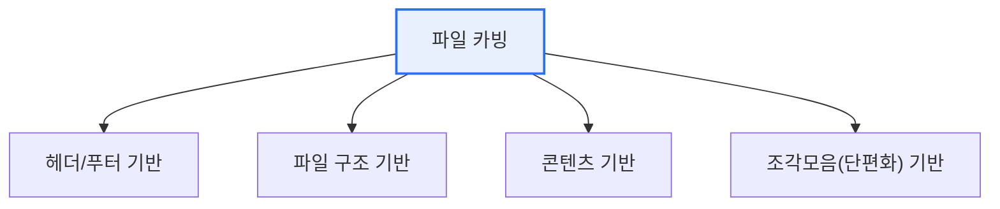

# 파일 카빙(File Carving)

## 1. 개요

### 가. 개념
> **파일 카빙**은 파일 시스템의 메타데이터(파일 위치·크기 정보)에 의존하지 않고, **저장매체의 원시 데이터(raw data)에서 파일 고유의 특징(시그니처·구조)을 근거로 파일을 복원**하는 디지털 포렌식 증거수집 기술이다.

파일 카빙이 포렌식에서 강력한 이유는 '**파일 시스템이 지워져도 데이터 조각으로 파일을 되살린다**'는 데 있다. 보통 파일을 열려면 파일 시스템이 "이 파일은 어디에 얼마만큼 저장돼 있다"고 알려주는 메타데이터가 필요하다. 그런데 파일을 삭제하거나 포맷하면 대개 이 메타데이터만 지워지고, 실제 데이터는 디스크에 그대로 남는다. 파일 시스템 관점에서는 '없는 파일'이지만, 데이터 자체는 존재하는 것이다. 파일 카빙은 바로 이 상황에서 빛을 발한다. 메타데이터가 없어도, 파일마다 고유하게 가지는 **시작 표식(헤더)과 끝 표식(푸터)**, 내부 구조를 단서로 삼아 원시 데이터에서 파일을 직접 찾아 복원한다. 예를 들어 JPEG는 `FF D8`로 시작해 `FF D9`로 끝나므로, 디스크를 훑어 이 패턴 사이를 잘라내면(carve) 삭제된 사진을 복구할 수 있다. 그래서 파일 카빙은 삭제·손상·포맷된 매체에서 증거를 찾는 핵심 수단이 된다. [[digital-forensics]]

### 나. 특징
파일 시스템 독립적이며, 삭제·포맷·손상된 매체에서도 복원이 가능하다. 다만 조각화(fragmentation)된 파일 복원은 어렵다.

## 2. 파일 카빙의 4종류 기법

| 기법 | 특징 |
|---|---|
| **헤더/푸터 기반** | 파일 시작(헤더)·끝(푸터) 시그니처로 경계 식별해 추출(예: JPEG FF D8~FF D9) |
| **파일 구조 기반** | 파일 내부 포맷·구조 정보를 이용해 복원(구조 검증으로 정확도↑) |
| **콘텐츠 기반** | 파일 내용의 통계·특성(엔트로피·문자 패턴)으로 유형 판별·복원 |
| **조각모음(단편화) 기반** | 여러 조각으로 흩어진 파일을 재조립(fragmentation 복원) |

가장 기본은 **헤더/푸터 기반**으로, 파일 유형별 고유 시그니처(매직 넘버)를 데이터베이스로 두고 매체를 스캔한다. 그러나 파일이 연속 저장되지 않고 조각나 흩어진 경우엔 헤더/푸터만으론 부족하므로, **파일 구조 기반**으로 포맷 유효성을 검증하거나 **조각모음 기반**으로 흩어진 조각을 이어 붙인다.

## 3. 활용과 한계

| 구분 | 내용 |
|---|---|
| **활용** | 삭제 파일 복구, 슬랙·비할당 영역 증거 확보, 손상 매체 복원 |
| **도구** | Scalpel, Foremost, PhotoRec 등 |
| **한계** | 심한 단편화·덮어쓰기·암호화 시 복원 곤란, 오탐(false positive) |

## 4. 고려사항 및 시사점

1. **단편화가 최대 난제**다. 파일이 여러 조각으로 흩어져 저장되면 헤더/푸터 기반만으론 정확히 복원하기 어려우므로, 구조 검증·조각 재조립 기법을 병행해야 한다.
2. **무결성 확보가 전제**다. 카빙으로 복원한 증거가 법적 효력을 가지려면, 원본 이미지 획득·해시 검증 등 무결성과 연계보관성(chain of custody) 절차를 지켜야 한다.
3. **안티포렌식·암호화에 대응**해야 한다. 완전 삭제(와이핑)·암호화·데이터 은닉 등 안티포렌식 기법에 맞서, 카빙 기술과 다른 분석 기법(메모리·네트워크 포렌식)을 결합해 증거력을 확보한다. [[file-slack]] [[anti-forensic]]

---

> **한 줄 요약**: 파일 카빙은 *파일 시스템 메타데이터 없이 원시 데이터의 시그니처·구조로 파일을 복원* 하는 포렌식 기술로, 헤더/푸터·파일구조·콘텐츠·조각모음의 4기법이 있으며, 삭제·포맷 매체 복구에 쓰이되 단편화와 무결성 확보가 관건이다.
